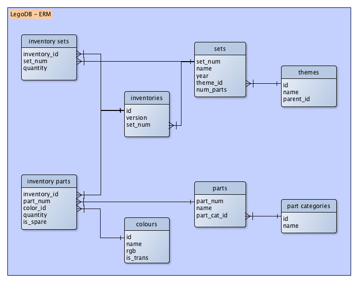
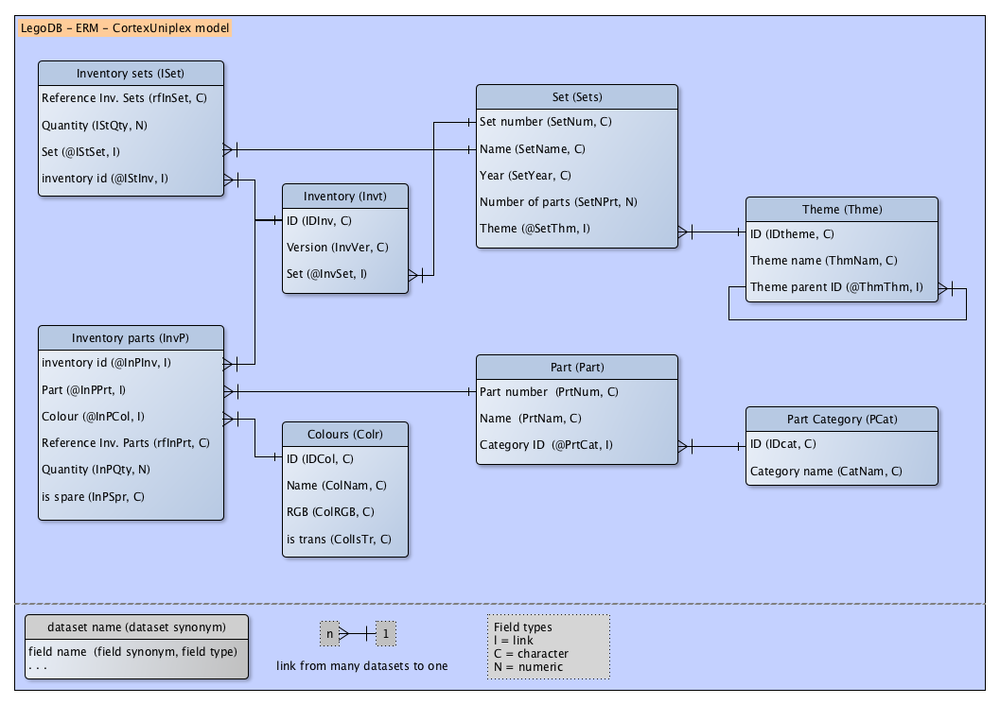

LegoDB import configuration and import data
===========================================

The idea behind this project is to show the functions of the Cortex-Platform with an easy example. We think, that LEGO is the perfect toy to build something complex with easy parts. Therefore the files in this project are for the import of the LEGO sets and parts description into a CortexDB.

After the import you have a complete datamodel with data, predefined selections, lists, pivots and a simple dashboard. Of course you can update the data to import new or other information (maybe the LDRaw images for each part). And you can use the API to use the CortexDB-data in your own app.


**You need only to copy this project into the subdirectory `www` of the binary data from the CortexDB.**

Database schema
---------------

This schema shows the data model of the Lego source files.



To compare the source with the CortexDB the following schema shows the objects in the database and the model behind the fields and dataset types in the CortexUniPlex.



To import this model you need the database configuration files with several UniPlex configurations.

database configuration files (CortexDB with UniPlex-Client)
-----------------------------------------------------------

You'll find the import-function in the system configuration of the UniPlex at the bottom left ("import" button). Import the following file (you'll find it in the subdirectory client-configuration`):

	client-configuration/UniPlex-config-export-LegoDB-v.1.0-20171222.tar.gz

Please note that some fields can not be imported or changed. These are systems fields without any rights for users. The import log will show you a corresponding note.

	#Usr - access denied
	#Vus - access denied
	#Dsh - access denied
	#Fil - access denied
	#Rec - access denied
	#Txt - access denied
	#Vfd - access denied
	#Grp - access denied
	#Cpy - access denied
	#Lst - access denied
	#Obj - access denied
	#OFE - access denied
	#Vue - access denied
	#Prt - access denied
	#Txa - access denied
	#Sel - access denied
	#Stu - access denied
	#Src - access denied
	#Ter - access denied
	#Clp - access denied

fields
------
**In the case you can't import the database fields, you need to configure the fields manually. You can also import the fields (json-file) with the tool `remadm`**

| internal field (synonym) | name                 | comment                                                         | type | length | 
| ------------------------ | -------------------- | --------------------------------------------------------------- | ---- | ------ | 
| CatNam                   | Category name        | category name                                                   | C    | 220    |
| ColIsTr                  | is trans             |                                                                 | C    | 220    |
| ColNam                   | Name                 | colour name                                                     | C    | 220    |
| ColRGB                   | RGB                  | rgb code for colour                                             | C    | 220    |
| IDcat                    | ID                   | ID for category                                                 | C    | 220    |
| IDCol                    | ID                   | ID for colour                                                   | C    | 220    |
| IDInv                    | ID                   | ID for inventory                                                | C    | 220    |
| IDtheme                  | ID                   | ID for theme                                                    | C    | 220    |
| InPQty                   | Quantity             | quantity of parts in inventory                                  | N    | 0      |
| InPSpr                   | is spare             | is a spare part                                                 | C    | 220    |
| InvVer                   | Version              | version of inventory                                            | C    | 220    |
| IStQty                   | Quantity             | quantity in inventory set                                       | N    | 0      |
| @InPCol                  | Colour               | link field for inventory parts to colour                        | I    | 220    |
| @InPInv                  | inventory id         | link field for inventory parts to inventory                     | I    | 220    |
| @InPPrt                  | Part                 | link field for inventory parts to part                          | I    | 220    |
| @InvSet                  | Set                  | link field for inventory to set                                 | I    | 220    |
| @IStInv                  | inventory id         | link field for inventory set to inventory                       | I    | 220    |
| @IStSet                  | Set                  | link field for inventory set to set                             | I    | 220    |
| @PrtCat                  | Category ID          | link field for part-to-category links                           | I    | 220    |
| @SetThm                  | Theme                | link field for set-to-theme links                               | I    | 220    |
| @ThmThm                  | Theme parent ID      | link field for theme-to-theme links                             | I    | 220    |
| PrtNam                   | Name                 | part name                                                       | C    | 220    |
| PrtNum                   | Part number          | Part number                                                     | C    | 220    |
| rfInPrt                  | Reference Inv. Parts | reference field to save and find unique inventory part datasets | C    | 220    |
| rfInSet                  | Reference Inv. Sets  | reference field to save and find unique inventory set datasets  | C    | 220    |
| SetName                  | Name                 | set name                                                        | C    | 220    |
| SetNPrt                  | Number of parts      | number of parts                                                 | N    | 0      |
| SetNum                   | Set number           | set number                                                      | C    | 220    |
| SetYear                  | Year                 | year                                                            | C    | 220    |
| ThmNam                   | Theme name           | theme name                                                      | C    | 220    |


To import the fields manually use the tool `remadm` and import the json-file from the subdirectory `client-configuration`

	RemAdm-Fields-LegoDB-v.1.0-20171222.json
	
### Link fields

If you need to select linked datasets with parent links, the link fields has to be the parameter "backward index" (will be renamed with the next version). That means you can "jump" between the dataset links forwards and backwards.


dashboard
---------

If you installed the plugin for the dashboard admin tool, you can also import a simple dashboard configuration.

	client-configuration/UniPlex-Dashboard-LegoDB-Analysis-v.1.0-20171222.tar.gz

The templates configuration includes the following UniPlex configuration:

```text
	user template (for an admin user)
	field templates
	configuration for fields
	configuration for dataset types
	configuration for portals (predefined selections)
	configuration for search functions
	list definitions
```

Data import
-----------

These files are from [Rebrickable](https://rebrickable.com/downloads/). Changes can be imported with the import configuration files (xml-configuration).

```text
    colors.csv
    inventories.csv
    inventory_parts.csv
    inventory_sets.csv
    part_categories.csv
    parts.csv
    sets.csv
    themes.csv
```

To import the csv files with the lego data, you need the Java Runtime "JRE" (version 8) and our import tool "ImPlex".

**Please check the port of your database and the user for import and administration in the import configuration files.**

```xml
<Global>
	<LoginIP>localhost</LoginIP>				<!-- IP or server name -->
	<LoginPort>29000</LoginPort>				<!-- database port; also via parameter for implex available -->
	<LoginUser>admin</LoginUser>				<!-- user -->
	<LoginPW>admin</LoginPW>					<!-- password -->
	<ImportModus>nu</ImportModus>				<!-- import mode; n, u, nu/un for new and/or update-->
</Global>
```

From the main directory with the CortexDB bin files start the import. Here, for example, the import call for the colours:

	java -jar Implex.jar -i ./www/import-config/import-colors.xml

Do this for each xml-import-configuration in the sub directory `./import-config`

```text
    import-colors.xml
    import-inventories.xml
    import-inventory_parts.xml
    import-inventory_sets.xml
    import-part_categories.xml
    import-parts.xml
    import-sets.xml
    import-themes.xml
```

**You'll get one error in one of these files, because one of the csv-files has an invalid character in one line. This line will be ignored.**

After the import start the linker. This configuration creates the links between the datasets. 

	java -jar Implex.jar -l ./www/import-config/Linker.xml

Scripts for import and linker
-----------------------------

With a Mac OS or Unix system you can use the script for the import. It calls all import configuration files and the linker configuration

	start-import.sh

If you like to delete all datasets, you can use the delete script
	
	start-delete.sh

