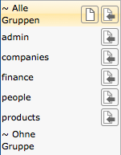
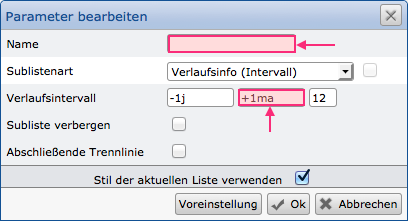
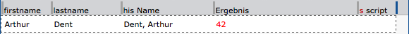

Praxistipps
===========

Aus der Projekterfahrung heraus und durch Fragen unserer Partner und
Kunden stellten wir fest, dass Themen und Funktionen existieren, die
über verschiedene Branchen und Fachbereiche ähnlich oder gleich sind.
Daher sammeln wir an dieser Stelle Tipps und Hinweise aus der Praxis,
die Sie gerne für Ihre Zwecke übernehmen und anpassen können. Sehr gerne
können Sie uns auch Ihre eigenen Tipps zukommen lassen; diese pflegen
wir dann auch an dieser Stelle ein.

Feldsynonyme
------------

Durch die schemalose Speicherung der Datensätze beinhaltet jeder
Datensatz auch die Feldsynonyme jedes genutzen Feldes. Insbesondere bei
umfangreichen Datenbanken kann daher durch die Verwendung möglichst
kurzer Synonyme die Datenbank-Größe reduziert werden.
 

Allgemein
---------

Nutzen Sie in der Listenverwaltung (aber auch in anderen Bereichen) die
Gruppierung von Konfigurationen. Hierüber werden gleichartige
Konfigurationen zusammengefasst und können dem Anwender vereinfacht
dargestellt werden.

Für die Zuweisung zu einer Gruppe werden einzelne Konfigurationen (z.B.
Listen) einfach angeklickt und über den "Zuweisen"-Button der Gruppe
zugewiesen.




Verschieben von Spalten
-----------------------

Wenn Sie mit dem Mauszeiger einen Spaltentrenner (grauer, senkrechter
Strich vor einem Feld) verschieben, können Sie die Felder neu ordnen.

Bei mehrzeiligen Listen und Sublisten kann es erwünscht sein, dass
Felder immer genau untereinander stehen. Damit nicht alle Felder
nacheinander verschoben werden müssen, können Sie einen Spaltentrenner
mit gedrückter `shift`-Taste verschieben. Alle
darunter/darüber-liegenden Spalten werden dann gleichzeitig verschoben.

Als Ergänzung dazu können Sie auch die `ctrl`-Taste nutzen. Diese
sorgt dafür, dass die Breite aller Felder in der Zeile gleichzeitig
verändert wird (im prozentualen Verhältnis zu der angeklickten Spalte).
Wenn Sie dazu gleichzeitig die `shift`-Taste nutzen, werden die
Änderungen auf alle Felder der Liste angewendet.

Sublisten
---------

**Setzen Sie einen Titel**

Setzen Sie immer einen Namen, wenn Sie eine Subliste anlegen. Dieser
Name ist immens hilfreich, wenn Sie mit Pivot-Tabellen und dem Dashboard
arbeiten. Weiterhin geben bestimmte Hinweise auch diesen Namen mit aus.
Etwaige Fehler finden Sie somit schneller.


**Setzen Sie das richtige Intervall für Verlaufsinformationen**

Wenn Sie mit Hilfe einer Subliste Verlaufsinformationen ausgeben, die
Option "Verlaufsintervall" wählen und Werte zum Monatsende ausgeben
wollen, nutzen Sie für den Modifikator (mittleres Feld) immer die
ergänzende Angabe "a" oder "e" nach der Dimension. Ansonsten
erhalten Sie nur den 30., 29. oder 28. eines Monats, je nachdem welche
Monate zuvor durchlaufen wurden.



Beispiel (ausgehend vom 30.05.2014):
```
    -1j  +1m  5         -1j  +1me  5

     30.01.2013          31.01.2013
     28.02.2013          28.02.2013
     28.03.2013          31.03.2013
     28.04.2013          30.04.2013
     28.05.2013          31.05.2013

``` 

JavaScript in Listen
--------------------

**Nutzen Sie eine separate Spalte für Scripte**

Wenn Sie eine separate Spalte für die Scripte nutzen, haben Sie nur eine
Stelle je Liste / Subliste an der Sie die Scripte prüfen müssen. Die
Spalten, in denen Scripte vorliegen, erhalten zudem ein vorangestelltes
"s". Nutzen Sie mehrere Spalten, in denen Scripte vorliegen, dauert
die Fehlersuche und Anpassung länger.



Nutzen Sie zudem Scripte, die vor und nach der Sortierung ablaufen,
könnten Sie beispielsweise die Spalten als "Script before" und
"Script behind" bezeichnen.

**Ändern von Feldinhalten**

Mit den Funktionen "*getListField*" und "*setListField*" können
Feldinhalte gelesen und geändet werden. Beispielsweise ist damit der
Übertrag von Feldinhalten einer Subliste in die Hauptliste
("Rootliste") möglich. Handelt es sich um mehrere Sublisten oder viele
Felder, kann das Setzen mit "*setListField*" die Verarbeitung der
Liste erheblich verzögern. Durch die Nutzung der globalen Variable
"*ctx*" ist eine schnelle Bearbeitung möglich. Um dieses zu erreichen,
werden die gelesenen Feldinhalte aus den Sublisten in die Objektvariable
"*ctx*" geschrieben und erst über ein Script in der Root-Liste, das
nach der Sortierung ausgeführt wird, in die Zielfelder geschrieben.

!!! example "Beispiel"
	Aus den Sublisten werden die Felder Name, Rechnungssumme und Ort gelesen und sollen in die Root-Liste übertragen werden. Hierfür wird das Variablenobjekt "*ctx*" entsprechend strukturiert:
``` 
ctx['Name'] = getlistfield('sublistName');
ctx['ReSum'] = getlistfield('sublistSum');
ctx['City'] = getlistfield('sublistCity');
```

Auf Ebene der Rootliste wird bei dem Script das Kennzeichen "nach der Sortierung" gesetzt. Dort erfolgt dann das Schreiben der Zielfelder:

``` 
setlistfield('Name',ctx['Name']);
setlistfield('Summe',ctx['ReSum']);
setlistfield('City',ctx['City']);
```
