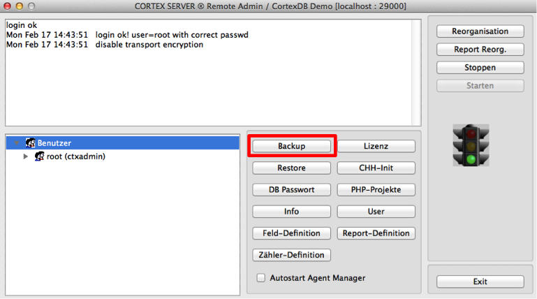
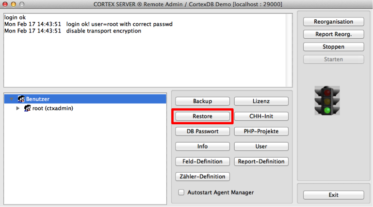

Datensicherung 
==============

Die Datensicherung dient zu sicheren Archivierung eines Datenbestandes.
Dieses geschieht üblicherweise vollautomatisch durch installierte und
aktivierte Sicherungsverfahren. Diese kopieren auf ein Sicherungsmedium
den kompletten Datenbestand (Vollsicherung), nur die geänderten Daten
seit der letzten Vollsicherung (differenzielle Sicherung) oder die
geänderten Daten seit der letzten Sicherung (inkrementelle Sicherung).

Für die Nutzung im Datenbank-Umfeld stellen verschiedene Hersteller
Erweiterungen zur Verfügung, um unterschiedliche Datenbanken zu sichern.
Diese greifen auf die Datenbank im Rahmen eines Benutzerkontext zu, um
ein Abbild der Datenbank zu erzeugen. Bei Nutzung einer CortexDB ist
dieses nicht notwendig. Eine separate Lizenzierung und Nutzung eines
Backup-Kontos entfallen somit.

Integriertes CortexDB Backup-Verfahren
--------------------------------------

Eine Backup-Funktion ist bereits in der CortexDB integriert und kann
über die entsprechenden Parameter in der Konfigurationsdatei des Server
("ctxserver.ini") konfiguriert werden.

Die Sicherungsmechanismen sollten daher nur das Backup-Verzeichnis der
CortexDB sichern. Alle weiteren Verzeichnisse sind aus der Sicherung
auszuschließen. Bei einem etwaige Ausfall ist es ausreichend, wenn die
entsprechende Backup-Datei in einer neuen Umgebung wiederhergestellt
wird.

Die Backup-Funktion der CortexDB sichert zu den festgelegten Zeitpunkten
einen kompletten Stand der Datenbank. Während der Datensicherung können
die Datenbank und alle darauf laufenden Anwendungen weiterhin genutzt
werden.

Innerhalb des Backup-Verzeichnisses befindet sich die festgelegte Anzahl
beibehaltener Backup-Dateien. Anhand des Dateinamens ist das Datum und
die Uhrzeit der Erstellung ersichtlich.

Beispiel:

    131201020100.cbz
    131202020100.cbz
    131203020100.cbz

Über die dazugehörige Konfiguration wurde festgelegt, dass nur drei
Dateien gespeichert bleiben ("MaxBackupCount")

    [BACKUP]
    backuppath=.\backup
    MaxBackupCount=3

und dass jeden Tag das Backup um zwei Uhr Nachts durchgeführt wird (0 =
Sonntag; 1 = Montag; \[. . .\] ; 6 = Samstag).

    0=02:00
    1=02:00
    2=02:00
    3=02:00
    4=02:00
    5=02:00
    6=02:00

!!! note "Hinweis"
	Soll das gesamte Datenbank-Verzeichnis gesichert werden, so ist die Datenbank während dessen zu stoppen. Erfolgt bei laufender Datenbank und ggf. aktiven Benutzerzugriffen eine Datensicherung des Gesamtverzeichnisses über Produkte anderer Hersteller, kann eine fehlerfreie Wiederherstellung nicht garantiert werden.

Ist eine ständige Datensicherung während des laufenden Betriebes
erforderlich, wird der Einsatz des CortexDB Online-Backup-Servers
empfohlen.

### Durchführen eines manuellen Backup

Neben der automatisch ablaufenden Datensicherung besteht ergänzend die
Möglichkeit, ein manuelles Backup zu erstellen. Die entsprechende
Sicherungsdatei wird ebenso wie alle automatisch erstellten Backups in
dem konfigurierten Verzeichnis abgelegt.

Hierbei ist zu beachten, dass die maximale Anzahl der gespeicherten
Backup-Dateien berücksichtigt wird. Durch ein manuelles Backup kann also
ggf. eine ältere Backup-Datei gelöscht werden.

Zum Starten des manuellen Backups ist die Nutzung des Remote-Admin
notwendig. Hierüber steht die Funktion "Backup" zur Verfügung.

Bevor die Datensicherung durchgeführt wird, erfolgt eine Abfrage zum Typ
der Datensicherung. Hier besteht die Möglichkeit, ein lizenzfreies
Backup zu erstellen, das mit jeder anderen Lizenz eingelesen werden
kann. Üblicherweise sollte hier ein reguläres Backup durchgeführt
werden, dass ausschließlich mit derselben Lizenz genutzt wird.

CortexDB Online-Backup-Server
-----------------------------

Als optionale Erweiterung steht die Möglichkeit eines (oder mehrerer)
Online-Backup-Server zur Verfügung. Eine solche Instanz kann in steter
Synchronisation mit dem Produktiv-Server betrieben werden und entspricht
daher im Wesentlichen einer gespiegelten CortexDB-Datenbank. Diese wird
über TCP/IP-Verbindungen synchronisiert und kann somit an geographisch
anderen Orten platziert werden (bspw. in anderen Brandabschnitten).

Im Störungsfall kann der Online-Backup-Server den Produktivbetrieb
übernehmen und damit zum Primärsystem hochgestuft werden. Bei diesem
Prozess handelt es sich um eine manuelle Durchführung, um über ein
bewusstes Eingreifen etwaige Automatismen an verfrühten Systemänderungen
zu steuern (z.B. bei kurzzeitigem Leitungsausfall, unplanmäßigen und
irregulären Änderungen an beteiligten, anderen Systemen u.ä.).

Bei der Synchronisation zwischen dem Produktiv- und dem Backup-Server
handelt es sich um eine Ein-Wege-Synchronisation. Änderungen am
Datenbestand sind daher nur am Produktivsystem, aber nicht am
Backup-Server zulässig. Im Rahmen der Ausfallsicherheit und/oder
verteilter Anwendungen kann hierfür der sog. Abgleich-Server zur
Verfügung gestellt werde.

CortexDB Abgleich-Server
------------------------

Für verteilte Datenbank-Operationen steht die sog.
"Abgleich-Server"-Funktionalität zur Verfügung. Mit deren Hilfe kann
eine Vielzahl synchronisierter Server betrieben werden. Optional ist die
Aktivierung eines Rechtesystems möglich, so dass nur selektierte
Datenbestände an dedizierte Datenbanken übertragen werden. Der zentrale
Datenbank-Server behält somit die Kontrolle und den gesamten
Datenbestand; die synchronisierten Server erhalten nur ausgesuchte
Informationen.

Ein Abgleich-Server kann selbständig und ohne ständige Verbindung zum
Haupt-Server ("Master") betrieben werden. Erst nach der Herstellung
einer Online-Verbindung werden neue Informationen übertragen und
zwischen beiden Servern synchronisiert.

Wiederherstellung einer Datenbank (Recovery)
--------------------------------------------

Der Cortex-Datenbank-Server verfügt über mehrere automatische
Sicherungsverfahren, um die Stabilität zu gewährleisten. Dennoch können
durch irreguläre Zustände des Betriebssystems oder der Hardware Fehler
auftreten, die eine Datenbank in Mitleidenschaft ziehen. Durch die
unterschiedlichen Funktionen besteht daher die Möglichkeit, Korrekturen
vorzunehmen und erst im kritischen Bedarfsfall eine komplette
Datensicherung wiederherzustellen.

Änderungshistorie
-----------------

Neben der definierten Backup-Konfiguration speichert der Datenban-Server
intern alle Datensätze in zusammenhängenden Blöcken auf dem
Speichermedium. Änderungen der Datensätze werden in einer sog.
"chd"-Datei gespeichert, wobei alle Änderungen eines einzelnen Tages in
je einer Datei kodiert vorhanden sind ("Transaction-Log"). Diese
Dateien befinden sich im Unterverzeichnis "ctxchh" ("cortexdb change
history") des konfigurierten Datenverzeichnisses vom Server (siehe im
Konfigurationsblock \[EINSTELLUNG\] den Parameter "basepath").

Diese Änderungsinformationen sind so aufbereitet, dass zu jedem
geänderten Feldinhalt der vorherige und der neue Inhalt gespeichert sind
und jede Datensatzänderung einen eigenen Prüfwert ("Hash") erhält.
Damit besteht die Möglichkeit, diese Dateien ergänzend zu der
Wiederherstellung eines Backups einzulesen, um den Zustand der Datenbank
zu einem beliebigen Zeitpunktes (Datenbestand vor dem Systemausfall)
wiederherzustellen (Differentialsicherung).

Reorganisation
--------------

Bei Hardware-Ausfällen oder anderen Störungen können innerhalb einer
Datenbank inkonsistente Zustände auftreten. Für diesen Fall wurde
innerhalb der CortexDB die Funktion der "Reorganisation" integriert.

Bei einer Reorganisation werden alle Verwaltungsinformationen aus den
gespeicherten Datensätzen neu generiert. Solange die Datensätze selbst
konsistent sind, ist die Wiederherstellung gewährleistet. Sollten
Teilbereiche zerstört sein, lassen sich dennoch alle restlichen
Datensätze, in denen keine Fehler gefunden wurde, korrekt
wiederherstellen.

Manuelle Wiederherstellung ("Restore") einer Datenbank
------------------------------------------------------

Die Wiederherstellung einer Backup-Datei erfolgt mit Hilfe des
Remote-Admin. Dieser bietet über die Funktion "Restore" die
Möglichkeit, eine Backup-Datei vollständig einzulesen. Alle darin
enthaltenen Einstellungen, Benutzer und Erweiterungen ("php-Projekte")
werden wiederhergestellt.

Diese Backup-Datei muss sich im konfigurierten Backup-Verzeichnis des
Servers befinden (siehe Konfigurationsblock \[BACKUP\] den Parameter
"backuppath").

!!! note "HINWEIS"
	Bei der Wiederherstellung werden alle Informationen, Konfigurationen, Lizenzen, Benutzereinstellungen und weitere Einstellungen überschrieben. Bei lizenzfreien Backup-Dateien ist das erneute Einlesen der Lizenz (lic-Datei) notwendig.
