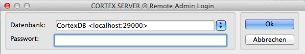
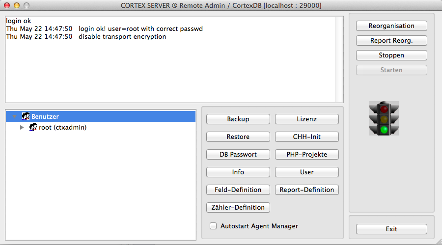
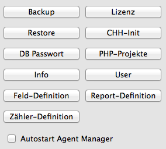
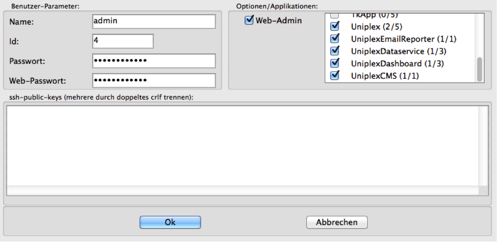

Remote-Admin
============

Einführung
----------

Die Verwaltung einer CortexDB-Instanz erfolgt über den sog.
*Remote-Admin*. Dieser ermöglicht die Administration grundlegender
Datenbank-Einstellungen und bietet dafür entsprechende Funktionen. Mit
diesem Werkzeug ist es unter anderem möglich, von entfernten
Arbeitsplätzen (oder auch direkt am Serverplatz selbst), die
Konfiguration anzulegen, Benutzer einzurichten, Updates auszuführen oder
ein manuelles Backup und/oder eine Wiederherstellung durchzuführen.

Nach dem Starten des Remote-Admin erfolgt die Anmeldung an der zur
verwaltenden Datenbank. Hierfür ist der Servername (oder die IP-Adresse)
gefolgt vom Datenbank-Port einzugeben.

**Beispielsweise:**

```
    demoserver:29000
```

*oder:*

```
    127.0.0.1:29001
```

Die Anmeldung wird dann mit der Eingabe des entsprechenden
Server-Passwortes ergänzt und mit "*OK*" (oder der Enter-Taste)
bestätigt.



Nach dem Login stehen Funktionen für die weitere Administration zur
Verfügung. Diese werden über die jeweiligen Buttons aufgerufen:


Allgemeine Ansicht
------------------

Das Fenster des Remote-Admin gliedert sich in mehrere Bereiche:

Im oberen weißen Bereich erfolgt die Ausgabe aktueller Log-Einträge.
Diese werden auch in der Datei *ctxserver.log* mitgeschrieben.
Üblicherweise ist aus den hier aufgeführten Meldungen deren Bedeutung
sehr einfach abzulesen.



Das zweite Textfenster zeigt die angemeldeten Instanzen an diesem
Server. Üblicherweise sind hier ausschließlich die Zugriffe über den
Remote-Admin und die php-Zugriffe aufgeführt. Wurde eine Replikation von
einem anderen Server gestartet, ist auch dieser Zugriff zu sehen.

Die grafische Ausgabe in Ampel-Form zeigt den Laufzeit-Status des
Datenbank-Servers an. Im Regelfall sollte diese Ampel auf *grün* stehen
- die Datenbank läuft. Im Falle von Wartungsaufgaben oder Fehlern wird
die Ampel auf gelb oder rot springen. Etwaige Fehler sind daher in der
Log-Datei (bzw. im Log-Fenster) abzulesen.


Funktionen des Remote-Admin
---------------------------

Die Verwaltung einer CortexDB-Instanz erfolgt über Funktionen, die über
einzelne Buttons erreichbar sind. Besitzt ein Administrator die
Zugangsdaten zu einem Server, kann von Ferne (*remote*) die
Administration durchgeführt werden.

Im Einzelnen werden die hier dargestellten Funktionen nachfolgend
erläutert:



### Backup/Restore

Über die Funktionen Backup und Restore werden eine manuelle
Datensicherung durchgeführt oder eine Backup-Datei wiederhergestellt.

Beim Durchführen des Backups erfolgt die Abfrage, ob die Datensicherung
mit oder ohne Seriennummer erstellt werden soll. Eine Backup-Datei mit
Seriennummer ist nur mit der entsprechenden Lizenz nutzbar und kann auf
keinem anderen Server mit einer anderen Lizenz gelesen werden. Ein
Backup ohne Lizenz ist allgemein lesbar und kann daher auch auf anderen
Servern wiederhergestellt werden.

Erst nach Bestätigung der Abfrage wird die entsprechende Backup-Datei in
dem konfigurierten Backup-Verzeichnis erstellt (siehe Konfiguration der
ini-Datei). Je nach Umfang der Datenbank und den protokollierten
Änderungen wird das Erstellen einige Minuten in Anspruch nehmen.

Während ein Backup erstellt wird, ist ein Weiterarbeiten mit der
Datenbank möglich. Das Backup beinhaltet nur die Datenbankinformationen,
die bis zu dem Augenblick des Backup-Starts verfügbar waren. Werden
während der Backup-Erstellung weitere Daten in der Datenbank erfasst,
stehen diese erst mit dem nächsten Backup zur Verfügung.

Für die Wiederherstellung einer Datenbank ist es notwendig, dass die
entsprechende Backup-Datei in dem konfigurierten Backup-Verzeichnis
bereitliegt. Beim Aufruf der Funktion "*Restore*" erfolgt die Auswahl der
jeweiligen Datei, die dann sofort eingelesen wird.

Bei der Wiederherstellung werden alle Datenbankinhalte und
Änderungsinformationen (soweit vorliegend) wiederhergestellt. Wird eine
Backup-Datei ohne Lizenz eingelesen, ist es erforderlich, dass nach der
Wiederherstellung die zweite Lizenz-Datei (die sog. "*lic-Datei*") über
den Button "*Lizenz*" eingebunden wird.

Im Regelfall weisen die Backup-Dateien vollständige Konfigurationen und
Lizenzeinträge auf, so dass die Datenbank nach der Wiederherstellung
sofort nutzbar ist.

### DB-Passwort

Für eine erhöhte Absicherung der Datenbankinhalte können diese mit einem
Passwort vollständig verschlüsselt werden. Sowohl die Datenbank-Dateien
innerhalb der Verzeichnisstruktur, wie auch die Backupdateien können
dann nur noch ausschließlich über den Datenbank-Server ausgelesen
werden.

**HINWEIS**:

Ohne Passwort ist eine Wiederherstellung der Daten nicht möglich und eine Datenbank mit einem
vergessenen Passwort kann nicht rekonstruiert werden!

### Info

Diese Funktion zeigt die Versions-Informationen und in einem
Detailbereich auch die Lizenz-Informationen an. Im Regelfall sind diese
Informationen aber auch über die Serverdateien (ggf. auch über
Anwenderprogramme) direkt einzusehen.

### Feld-Definition

Über die Feld-Definition können für die Nutzung der Anwendung "*CortexUniplex*"
Felder konfiguriert, importiert oder exportiert werden. Da diese
Funktion mittlerweile im CortexUniplex implementiert wurde, sollte an dieser
Stelle auf die Feld-Pflege verzichtet werden.

### Zähler-Definition

Während der Nutzung des CortexUniplex durch Anwender kann auf sog.
"*Zählerfelder*" zurückgegriffen werden. Diese bieten die Möglichkeit
eindeutige Zählerstände zu nutzen, um beispielsweise bestimmte,
eindeutige Werte zu erzeugen (z.B. Ticket-Nummern, Rechnungsnummern,
\...). Innerhalb der CortexUniplex-Konfiguration werden diese Felder daher
gesondert angesteuert. Ein Ansprechen der Zähler über die API oder
während des automatischen Imports ist nicht möglich.

Für diese Felder stehen Variablen zur Verfügung, um nach einer
bestimmten Zeit die Zähler zurückzusetzen oder durch weitere Angaben
ergänzen zu können.

    %j    Jahr zweistellig, z.B. für '96'
    %J    Jahr vierstellig, z.B. für '1996'
    %m    Monat einstellig von 1-9,
          sowie A,B,C für Oktober, November, Dezember
    %M    Monat zweistellig, z.B. '06' für 'Juni'
    %z    Fortlaufende Nummer ohne autom. Rücksetzung
    %Z    Fortlaufende Nummer mit autom. Rücksetzung
          nach Ablauf eines Monats bzw. Jahres

Für führende Nullen bei den fortlaufenden Nummern kann die Anzahl der
Stellen dahinter angegeben werden. So ist es beispielsweise möglich,
folgenden Zähler zu konfigurieren:

     %j%M%Z3 -> 1401001, 1401002, 1401003, ... , 1402001, ... 

Die Nutzung dieser Zählerfelder ist ausschließlich in einer interaktiven
Benutzerumgebung möglich. Ein Zugriff und Setzen der Zähler per API oder
anderer Mechanismen ist nicht möglich.

### Lizenz

Für die Aktivierung einer neuen Datenbank oder zur Erweiterung von
Funktionen ist es notwendig, dass der zweite Teil der Datenbank-Lizenz
(die sog. "*lic-Datei*") eingebunden wird. Dieses ist über die Funktion
"*Lizenz*" des Remote-Admin möglich. Nach der Auswahl der passenden
Lizenzdatei, wird die Einbindung entsprechend quittiert. Sollte die
lic-Datei nicht zu der hinterlegten par-Datei im Serververzeichnis
passen, wird eine dementsprechende Fehlermeldung ausgegeben und in der
Log-Datei des Server protokolliert (Fehlercode -1010,
DSV\_LICENSE\_ERROR).

### CHH-Init

Der Datenbank-Server protokolliert alle Änderungen in der sog. "*change
history*" (chh). Diese "*change history*" wird auch in den Backup-Dateien
vorgehalten und steht auch nach einer Wiederherstellung zur Verfügung.
Sind die Änderungsinformationen irrelevant und soll die Backup-Datei
verkleinert werden, kann diese Historie mit einem chh-init vollständig
geleert werden.


### PHP-Projekte

Bei diesen Projekten handelt es sich um funktionale Erweiterungen, die
innerhalb des Servers abgelegt werden. So ist beispielsweise die
Anwendung CortexUniplex ein Plugin innerhalb des Servers. Andere Funktionen
(auch Erweiterungen für den CortexUniplex) können hier genauso eingebunden
werden. So ist es auch möglich, eigene Erweiterungen zu erstellen, um
individuelle Programme oder Programmfunktionen nutzen zu können.

Im Regelfall ist für jede Erweiterung der Eintrag einer
Applikationskennung innerhalb der Lizenz (lic-Datei) notwendig. So kann
jede Erweiterung individuell und sicher freigeschaltet und separat
lizenziert werden. Bei den Benutzerkonten sind dann die entsprechenden
Rechte zu setzen.

Bei dem Dateiformat handelt es sich um sog. "*xjz-Dateien*". Diese
können beispielsweise html-, php-, JavaScript-, Bild-Dateien und weitere
Formate behinhalten.

### User

Die Benutzerverwaltung erlaubt die Festlegung von Applikationsrechten
für ausgewählte Benutzer und die Kennwortvergabe.

!!! note "HINWEIS"
    Um das Standardpasswort für den administrativen Benutzer des Remote-Admin zu ändern, ist das Passwort für den Benutzer "*root*" (Id: 1) anzupassen.

Beachten Sie, dass für jeden Benutzer die Felder "*Passwort*" und
"*Web-Passwort*" gesetzt werden können. Das Web-Passwort bezieht sich
hierbei auf alle Anwendungen, die mit Hilfe eines Browsers ausgeführt
werden (im Regelfall alle Erweiterungen, die IP-Port 80 nutzen). Das
Passwort dient für alle "*nativen*" Anwendungen und sollte dennoch auf
einen Standardwert je Benutzer gesetzt werden, um mögliche
Sicherheitslücken so gering wie möglich zu halten.



Die Berechtigung "*Web-Admin*" definiert ein Benutzerkonto als
Administrator innerhalb der Anwendung "*CortexUniplex*". Damit ist der Zugang
zum administrativen Bereich möglich.

Soll ein Anwender Nutzungsrechte für eine Anwendung erhalten und ist
diese Anwendung lizenziert, steht die entsprechende Auswahlmöglichkeit
im Bereich "*Optionen/Applikationen*" zur Verfügung. Die
unterschiedlichen Applikationsnamen mit der Angabe der genutzten und zur
Verfügung stehenden Lizenzen werden dort aufgeführt und können
aktiviert/deaktiviert werden.

### Report-Definition

Der Reporter ist eine Datenbank-Funktion, mit der es möglich ist, über
direkte Verweise bestimmte Kennzahlen zu einem Datensatz zu ermitteln.
Beispielsweise könnte die Summe aller Rechnungspositionen zu einem
Rechnungsdatensatz zusammengetragen werden. Anhand von definierbaren
Filtern können die Operationen Summe, Minimum, Maximum, Durchschnitt und
Anzahl ermittelt und in einen Datensatz geschrieben werden.

Beachten Sie, dass es sich bei den Zielfeldern um eine gesonderte
Feld-Art handelt (sog. "*Reporter-Felder*"), die separat definiert
werden müssen (über die Feldverwaltung). Diese Felder stehen wie alle
anderen Felder auch für weitere Auswertungen und Selektionen zur
Verfügung.

### Reorganisation

Der Datenbank-Server transformiert jeden eingelesenen und geänderten
Datensatz in seine Einzelbestandteile (Felder und Inhalte) und schreibt
diese in den Datenbank-Index. Jeder Inhalt steht daher für eine schnelle
Selektion zur Verfügung. Für die laufenden Änderungen während des
Betriebes pflegt der Server einen temporären, dynamischen Arbeitsindex,
der im Gegensatz zum fixen Datenbank-Index laufend organisiert wird.

Bei vielen Änderungen über einen größeren Zeitraum kann es daher zu
erheblichen Geschwindigkeitsvorteilen kommen, wenn mit Hilfe der
Reorganisation der dynamische Index in den fixen Index übertragen und so
verkleinert wird. Ebenso ist eine Reorganistion einmalig notwendig, wenn
ein Datenimport initial per Import-Modus durchgeführt wurde und der
Datenbank-Index erstmalig aufgebaut werden muss.

### Report-Reorg.

Da die Reporter-Felder separat verwaltet werden, sind diese im
Datenbank-Index zu berücksichtigen. Bei Änderung an den Reporter-Regeln
ist daher eine Reorganisation des Reporters durchzuführen. Nur dann
werden die Regeln korrekt ausgeführt.

### Starten, Stoppen, Exit

Der Datenbank-Server kann über "*Starten*" und "*Stoppen*" gestartet und
gestoppt werden. Die angezeigte Ampel springt dann auf die entsprechende
Farbe.

Über Exit verlassen Sie den Remote-Admin.
