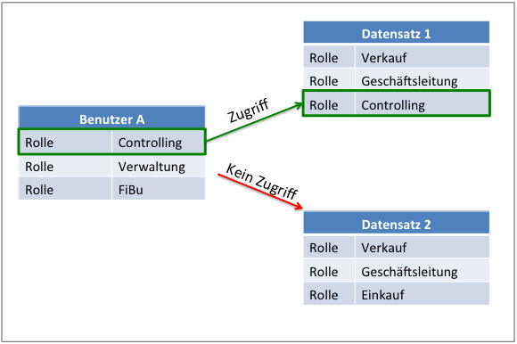

Datensicherheit 
===============

Einführung
----------

Bei der Datensicherheit handelt es sich wie bei den Themen
Datensicherung und Ausfallsicherheit um ein äußerst wichtiges Thema im
Rahmen des IT-Betriebes. Unterschiedliche Verfahren sollen hierbei
gewollten und ungewollten Angriffsszenarien entgegenwirken. Solche
Szenarien bestehen beispielsweise aus dem Ziel des Systemmissbrauchs,
Sabotage, Spionage oder Betrug und Diebstahl sensibler Informationen.

Als Werkzeuge zum Erreichen der vorgenannten Ziele dienen hierbei
beispielsweise Programme wie Computerviren, Trojaner und Würmer (i.A.
"*Malware*"); aktive Tätigkeiten wie Spoofing, Phishing, Pharming,
Vishing oder sog. Denial-of-Service Attacken (DoS) oder auch
Man-in-the-middle-Angriffe und social engineering.

Neben den o.g. bewusst durchzuführenden Angriffsverfahren können
Anwender zudem auch einen ungewollten Einblick in geschützte und
vertrauliche Informationen erhalten, wenn der entsprechende Zugang
besteht und nicht durch administrative Maßnahmen abgesichert wurde.

Im Rahmen der Datenbanknutzung und des Zugriffs durch Endbenutzer stehen
für die Datensicherheit unterschiedliche Funktionen und Verfahren zur
Verfügung. Je nach Umfang und Sensibilität der Informationen ist der
Einsatz dieser Funktionen und Verfahren entsprechend zu konfigurieren.
Im Bedarfsfall ist daher die Umsetzung einzelner Verfahren
möglicherweise durch spezialisierte Mitarbeiter sinnvoll.

Im Rahmen dieser Dokumentation wird nur auf die integrierten Verfahren
und Funktionen des Datenbank-Servers und der Anwendung eingegangen. Auf
eine Auswahl weitergehender Verfahren wird entsprechend verwiesen; diese
können allerdings nicht in dem notwendigen Maße erläutert werden.
Entsprechende Dritt-Literatur ist über unterschiedliche Quellen
erhältlich und sollte von versierten Sicherheitsexperten Anwendung
finden.

Insbesondere sind zu diesem Bereich die [IT-Grundschutzkataloge des
BSI](https://www.bsi.bund.de/DE/Themen/ITGrundschutz/ITGrundschutzKataloge/Inhalt/_content/kataloge.html)
(Bundesamt für Sicherheit in der Informationstechnik) zu
berücksichtigen.

Die Verwaltung des Cortex-Datenbank-Servers teilt sich in drei
grundlegende, administrative Bereiche. Zum Einen in die
Server-Installation und -Wartung auf Betriebssystemebene, zum Anderen in
die Serveradministration unter zu Hilfenahme des Remote-Admin und des
Weiteren in die Konfiguration der Datenbankanwendung über die
administrativen Funktionen innerhalb der Anwendung CortexUniplex.

Jeder dieser drei Ebenen sind unterschiedliche Administrationsaufgaben
zugeordnet. Im Rahmen der Datensicherheit bauen diese Ebenen aufeinander
auf, so dass beispielsweise ein Administrator mit Berechtigungen in der
Ebene II sich auch Zugriff auf Ebene III geben kann; ihm Änderungen in
der Ebene I aber verwehrt bleiben.

Verwaltung des Cortex-Datenbankservers (CortexDB)
-------------------------------------------------

| **Ebene I Betriebssystem-Ebene Installation und Wartung** | **Ebene II** **Remote-Admin Server-Administration** |  **Ebene III** **Administrative Funktionen für die Anwendungen** |
| -------------------------------------------------------------------- |  -------------------------------------------------------------------- | -------------------------------------------------------------------- |
| Verzeichnisse Backup Datenbank-Server HTTP-Server Datenbank-Rohdaten Dateisystem 1. Teil d. Lizenzierung | 2. Teil d. Lizenzierung PHP-Projekte Benutzer Zugriffsrechte Zählerfelder Manuelles Backup Restore Reporter Reorganisation | Datensatz-Rechte Feld-Rechte Funktionsrechte Plugin-Nutzung Weitere Anwendungs-Einstellungen |

 
Verbindungssicherheit durch verschlüsselte Datenübertragung
-----------------------------------------------------------

Die Nutzung der Inhalte einer Cortex-Datenbank erfolgt im Rahmen von
interaktiven Zugriffen zumeist mit Hilfe von Browser-basierten
Anwendungen (sog. "Web-Anwendungen"). Hierbei und bei der Nutzung von
Schnittstellen wird auf Technologien des Internets und des World Wide
Web ("WWW") zurückgegriffen. Um solche Verbindungen abzusichern, können
diese über das Verfahren "TLS" (alte Benennung: "SSL") verschlüsselt
werden.

Während der Nutzung über einen Browser ist eine abgesicherte Verbindung
an der Adresszeile zu erkennen. Wurde der Adresse ein "https"
vorangestellt, handelt es sich über eine verschlüsselte Verbindung.
Hierfür wird für die abzusichernden Webseiten und Anwendungen ein
Zertifikat ausgestellt, dass über eine Zertifizierungsstelle
(kostenpflichtig) gegengeprüft und signiert wird. Innerhalb der gängigen
Browser sind die Zertifizierungsstellen gespeichert, so dass signierte
Zertifikate erkannt und verarbeitet werden können. Wird eine Webseite
mit einem unsignierten oder fehlerhaften Zertifikat aufgerufen, erfolgt
ein entsprechender Warnhinweis.

Die Nutzung der CortexDB-Anwendung CortexUniplex kann über die oben
beschriebenen Verbindungen erfolgen. Hierfür ist die Einbindung eines
Server-Zertifikates im HTTP-Server erforderlich. Über den
Konfigurationsblock `HTTPSRV` Parameter "*SslCertPem*" ist der
Name der Zertifikatsdatei einzubinden (üblicherweise eine sog.
"*pem*"-Datei).

**[HINWEIS]**:

Die grundsätzliche Technologie der signierten Zertifikate erlaubt die
Einbindung eigener Zertifizierungsstellen in den Browsern. Gerade für
größere Umgebungen mit zentraler Verwaltung der Browser-Einstellungen
für jeden Arbeitsplatz kann es sinnvoll sein, eine solche
Zertifizierungsstelle für das eigene Unternehmen zu erstellen und intern
zu nutzen.

Benutzer-Zugriffsrechte (Ebene II) 
----------------------------------

Über den Remote-Admin werden die grundlegenden Berechtigungen für
Benutzerkonten festgelegt. Hierüber wird konfiguriert, welche Anwendung
ein Benutzer nutzen darf. Fehlt die Berechtigung für eine der
aufgelisteten Anwendungen, ist kein Login mit dem Benutzerkonto möglich.
Ein Versuch wird innerhalb den Server-Protokolls mit einem
entsprechenden Eintrag protokolliert (Fehlercode -922,
*DSV_LOGIN_APPNOPERM*).

Soll ein Benutzer für eine oder eine Auswahl bestimmter Anwendungen
gesperrt werden, ist die Deaktivierung der entsprechenden Anwendung(-en)
ausreichend. Ebenso kann über die Änderung des Kennwortes und/oder des
Benutzernamen der weitere Zugriff verweigert werden.

!!! note "HINWEIS"
    Die Benutzer-ID wird bei bearbeiteten Datensätzen dauerhaft gespeichert. Dadurch ist ersichtlich, welche Änderungen ein Anwender durchgeführt hat. Wird ein Anwenderkonto entfernt und ein neues Konto mit derselben Benutzer-ID erstellt, erscheint es so, als ob der neue Benutzer die Änderungen durchgeführt hätte. Um dieses zu vermeiden, sollten Benutzerkonten nur deaktiviert und umbenannt werden, anstatt diese zu löschen.

Rechte innerhalb der Anwendung (Ebene III)
------------------------------------------

Die Anwendung CortexUniplex und alle darauf aufbauenden Funktionen, wie z.B.
ein Dashboard, erlauben die interaktive Nutzung der Datenbankinhalte für
Auswertungen oder manuelle Änderungen. Durch diese Möglichkeiten sind
Benutzer-Berechtigungen für die einzelnen Teilbereiche notwendig. Diese
unterteilen sich in Funktions-, Datensatz- und Feld-Berechtigungen.
Ergänzend dazu können Nutzungsrechte für Erweiterungen ("*Plugins*")
erteilt oder entzogen werden.

Die Vergabe der verschiedenen Berechtigungen erfolgt über sog.
"*Vorlagen*". Ein Benutzerkonto nutzt die ihm zugewiesenen Vorlagen, um
zu prüfen, welche Rechte ein Anwender besitzt. Wird eine Vorlage
geändert, hat dieses sofortige Auswirkungen auf alle beteiligten
Benutzerkonten.

### Funktionsrechte

Die Vergabe der grundlegenden Funktionsrechte erfolgt über
Benutzervorlagen. Hier werden für nachfolgend aufgeführte Funktionen die
entsprechenden Berechtigungen gesetzt.

| Funktion                    | Option                                                                                                       | Bedeutung                                                                                          |
|---------------------------- | ------------------------------------------------------------------------------------------------------------ | -------------------------------------------------------------------------------------------------- |
| Löschen von Datensätzen     | keine Löschberechtigung; für eigene Datensätze; generelles Löschrecht                                        | Definiert, welche Datensätze von einem Benutzer mit dieser Vorlage gelöscht werden können.         |
| Archivieren von Datensätzen | keine Archivierungsrechte; für eigene Datensätze; generelles Archivierungsrecht                              | Definiert, welche Datensätze von einem Benutzer mit dieser Vorlage archiviert werden können.       |
| Selektionen                 | kein Zugriff; Leseberechtigungen; eigene Selektionen bearbeiten; alle Selektionen bearbeiten                 | Bei Selektionen handelt es sich um eine gespeicherte Auswahl bestimmter Datensätze. Inwieweit diese gelesen/bearbeitet werden können, legt dieses Recht fest.                 |
| Dokumentvorlagen            | laden von Vorlagen; eigene Vorlagen bearbeiten; alle Vorlagen bearbeiten                                     | Bei Vorlagen handelt es sich um Word- oder PDF-Dokumentvorlagen, die aus der Anwendung heraus gefüllt werden können.               |
| Selektieren                 | aktiv / inaktiv                                                                                              | Diese Funktion ermöglicht die übergreifende Selektion von Datenbankinhalten über konfigurierte Listen und miteinander verknüpfter Datensätze.           |
| Mehrfachzuordnung           | aktiv / inaktiv                                                                                              | Bei der manuellen Dateneingabe können Datensätze miteinander verknüpft werden. Dieses kann in einem Schritt mehrfach durchgeführt werden, wenn dieses Recht gesetzt wurde. |
| Bearbeiten von Listen       | Keine Zugriffsrechte; nur Nutzung von voreingestellten Listen; Laden beliebiger Listen zur Anzeige von Daten; Bearbeiten eigener Listen; Bearbeiten aller Listen | Listen dienen zur Anzeige von Datensätzen. Hier wird auf einzelne Feldinhalte zugegriffen. Erhält ein Anwender das Recht beliebige Listen zu laden, können dieselben Datensätze mit mehr Informationen ausgegeben werden. |
| Aktionen in Listen          | Listendefinition exportieren/importieren; Daten drucken; Daten exportieren                                   | Listendefinitionen können an andere Datenbanken übergeben oder aus anderen importiert werden. Weiterhin ist ein Export der Daten in eine externe Datei möglich (csv/xml); ergänzend dazu ein Ausdruck einer kompletten Liste als pdf-Datei. |
| Suchmöglichkeiten           | Universalsuche (mit und ohne Wildcards); Vordefinierte Suchen                                                | Über die universellen Suchmöglichkeiten erfolgen Suchen in allen Feldern aller Datensätze der gesamten Datenbank. Dieses sollte üblicherweise für einen Anwender deaktiviert sein. Über vordefinierte Suchen kann genau festgelegt werden, in welchen Feldern und Datensätzen ein Anwender suchen darf. Jede Suche erhält einen Namen und kann somit einer Vorlage zugewiesen werden. |
| Portale                     | Alle; keine; eine Auswahl vorkonfigurierter Portale                                                          | Portale sind vordefinierte Suchen anhand von bestimmten Suchkriterien. Diese können einem Anwender bereitgestellt werden, so dass dieser immer ein aktuelles Ergebnis erhält. |
| Objektviewer                | Alle; keine; eine Auswahl | Bei Objektviewern handelt es sich um eine übergreifende Selektion über alle Verknüpfungen, ausgehend von einem dargestellten Datensatz. |
| Anlegen von Datensätzen     | Alle; keine; eine Auswahl von Datensatzarten                                                                 | Datensätze können von Anwendern manuell angelegt werden. Über diese Rechtevergabe ist diese Möglichkeit einzuschränken |
| Bearbeiten von Datensätzen  | Alle; keine; eine Auswahl von Datensatzarten                                                                 | Das generelle Bearbeitungsrecht von Datensätzen der gleichen Art kann hierüber eingeschränkt werden. |

Datensatz-Rechte
----------------

Das Berechtigungssystem für die Datensätze innerhalb einer Datenbank
basiert auf den Inhalten eines Datensatz-Feldes (Rolle; intern als
"*#R*" bezeichnet) und auf der Festlegung in einem Benutzerkonto.
Stimmen ein oder mehrere Feldinhalte mit der Festlegung bei dem Benutzer
überein, kann der Datensatz selektiert und angezeigt werden.

Das abgebildete Beispiel zeigt den Zugriff (bzw. verhinderten Zugriff)
eines Benutzers auf zwei Datensätze mit unterschiedlichen
Rollenfestlegungen. Nur bei dem Datensatz, dessen Rolle mit einer oder
mehrerer des Benutzers übereinstimmt, ist der Zugriff erlaubt.

!!! note "HINWEIS"
    Wurde das Berechtigungssystem aktiviert, greift dieses nur bei Datensätzen, denen eine (oder mehrere) Rollen zugewiesen wurden. Datensätze ohne Rolle sind weder selektierbar noch anzuzeigen oder zu bearbeiten.

Datenfeld-Rechte
----------------

Innerhalb der Feld-Vorlagen besteht die Möglichkeit, für einzelne Felder
dediziert festzulegen, ob ein Feld sichtbar ist und bearbeitet werden
kann. Ergänzend zu den Datensatz-Rechten kann einem Anwender somit das
Recht entzogen werden, einzelne Felder zu sehen oder zu bearbeiten,
obwohl ein Datensatz-Bearbeitungsrecht existiert.

Damit ist es möglich, dieselben Datensätze durch unterschiedliche
Anwender bearbeiten zu lassen, ohne dass sich die Änderungen auf die
Inhalte anderer Anwender auswirken.

Plugins (Erweiterungen)
-----------------------

Innerhalb der CortexDB-Anwendung können Plugins für eine
Funktionserweiterung integriert werden. Die Plugin-Vorlagen definieren
daher, welche Erweiterungen ein Anwender mit dieser Vorlage nutzen darf.
