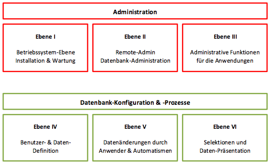

CortexDB
========

Die CortexDB ist für verschiedene Betriebssysteme in unterschiedlichen Lizenzmodellen verfügbar. Im Gegensatz zu der lizenzierten Version (kostenpflichtig für den kommerziellen Einsatz) unterliegt die freie Version einigen, wenigen Beschränkungen. 

CortexDB (freie Version)
------------------------

Die freie Version der CortexPlatform (und damit auch der CortexDB) entspricht funktional der lizenzierten Version. Folgende Tabelle zeigt die Unterschiede der verschiedenen Versionen:

| Funktion                 | freie Version                            | lizenzierte Version  | public Cloud Version                   |
| ------------------------ |:----------------------------------------:|:--------------------:|:--------------------------------------:|
| Anzahl Benutzer          | 2                                        | lizenzabhängig       | lizenzabhängig                         |
| Benutzereigenschaften    | nicht änderbar                           | änderbar             | änderbar                               |
| Benutzerpasswörter       | nicht änderbar                           | änderbar             | änderbar                               |
| Nutzungsdauer            | muss jedes Jahr aktualisiert werden | lizenzabhängig       | lizenzabhängig                         |
| Betriebssysteme          | Mac OS, Windows (geplant Debian Linux) | diverse              | wird in einer Linux-Umgebung betrieben |

### Schnellstart

Für die Inbetriebnahme der CortexDBfree ist ein Programmpaket aller
zusammengehörenden (und in gleicher Version vorliegenden) Programmdateien und Bibliotheken notwendig. Diese liegen derzeitig für Windows-Systeme und Mac OS zum Download bereit.

1. Laden Sie die für Sie relevanten Pakete herunter (z.B. eine leere Datenbank und/oder eine Beispieldatenbank)
2. Entpacken Sie die Pakete in den Verzeichnissen, wo Sie den Datenbankserver laufen lassen möchten
3. Starten Sie das Programm `ctxdbfree` (unter Windows als exe-Datei; unter Mac OS als app-Datei)
4. Starten Sie einen Browser (Firefox, Safari, Chrome o.ä. in möglichst aktueller Version)
5. Rufen Sie die URL [http://localhost:8080](http://localhost:8080) auf
6. Tragen Sie in der Anmeldung den Benutzernamen `admin`oder `user` ein. Das Passwort lautet ebenso `admin`oder `user`

Nach Durchführung der o.g. Schritte sollten Sie sich in der Hauptmaske der Anwendung CortexUniplex befinden.

!!! danger "Hinweis für Mac OS"
	Durch verschiedene Sicherheitseinstellungen unter Mac OS werden aus dem Internet heruntergeladene Dateien standardmäßig mit dem Attribut `Quarantäne`versehen. Dieses verhindert eine sofortige Ausführung der Anwendung und dass diese Anwendung andere Anwendungen starten kann (die ctxdbfree.app kann somit nicht die ctxserver64 und die ctxhttpd64 starten). In diesem Fall müssen Sie die ctxdbfree.app aus der Quarantäne entfernen.
    
    Wechseln Sie in das Verzeichnis mit der Anwendung ctxdbfree.app und führen Sie folgenden Befehl aus:

    xattr -d com.apple.quarantine ctxdbfree.app/

CortexDB (lizenzierte Version)
------------------------------

Die generelle Administration und Konfiguration gliedert sich in mehrere unterschiedliche Ebenen, die auf die Berechtigungen und Kenntnisse von Administratoren und Anwender ausgelegt sind. Insbesondere in den Themenbereichen Datensicherheit und Konfiguration wird hierauf im Detail eingegangen. Die nachfolgende schematische Abbildung zeigt in den unterschiedlichen Ebenen die jeweiligen Möglichkeiten der Konfiguration.

In jeder Ebene können Sie die Berechtigungen für die entsprechenden Personen und Automatismen festlegen. Die Berechtigungen bauen hierbei so aufeinander auf, dass über die Rechte einer niedrigen Ebene die nachfolgenden Ebenen administriert werden können. Ein Anwender mit dem Recht für den Remote-Admin kann daher Zugriff von Ebene II bis VI erlangen, aber nicht für Ebene I (Betriebssystem).

### Schnellstart

Für die Inbetriebnahme einer CortexDB ist ein Programmpaket aller zusammengehörenden -- und in gleicher Version vorliegenden -- Programmdateien und Bibliotheken notwendig. Diese liegen für unterschiedliche Systeme (z.T. zu den versch. Systemversionen) vor.

1.  Start des Datenbankservers oder Anlegen einer neuen Datenbank
2.  Login per Remote-Admin
3.  Import der Lizenzdatei
4.  Anlegen des System-Benutzers "php" (mit dem Recht "ctxphp")
5.  Anlegen weiterer Benutzer
6.  Import der php-Plugins(z.B. CortexUniplex, CortexUniplexAPI, \...)

### Windows

Die Serverdateien für eine CortexDB sind innerhalb einer eigenen
Verzeichnisstruktur lauffähig und benötigen keine
Programmverweisstrukturen im Betriebssystem (wie z.B.
Registry-Einträge). Dadurch kann eine Installation unter Windows durch
Kopieren (oder ein Verlagern der Serverinstanz per Verschieben) der
Programmdateien durchgeführt werden.

Unter Windows kann der Server entweder im Benutzer-Kontext eines
angemeldeten Benutzers oder durch ein Dienst-Startprogramm im
Systemkontext laufen (zu installieren/entfernen durch die
"ctxservice32" oder "ctxservice64"). Dabei wird der Server ebenfalls
als Dienst automatisch beim Systemstart gestartet und bei dessen
Beendigung gestoppt. Wird das System in den Standby oder Suspend-Modus
geschaltet, beendet sich der Server vorher automatisch. Der automatische
Dienst-Start kann allerdings nur beim Systemstart gewährleistet werden.

Für die Windows-Installation wird üblicherweise eine komprimierte Datei
verwendet, die im gewünschten Verzeichnis-Pfad entpackt wird. In dem
erstellten Server-Verzeichnis ist es zwingend notwendig, dass der erste
Teil der Lizenz (die sog. "par-Datei") hinterlegt wird. Diese ist als
"ctxserver.par" zu bezeichnen.

Innerhalb der "ctxserver.par" ist das initiale Administrationspasswort
verschlüsselt gespeichert. Daher sollte diese Datei separat verwaltet
und nur ausgesuchten Personen zugänglich gemacht werden. Sollte das
Passwort verloren gegangen sein, kann die originale par-Datei wieder
eingespielt werden (Neustart des Servers erforderlich) und eine neue
Passwortvergabe mit dem Programm "Remote-Admin" erfolgen.

#### Notwendige Dateien einer CortexDB-Windows-Installation

Die nachfolgende Auflistung zeigt die notwendigen Dateien einer
Windows-Umgebung.

    ctxserver64.exe 
    ctxserver.ini
    ctxadmin64.exe
    php.exe
    php.ini
    ctxcljni64.dll
    ctxlib64.dll
    ctxv8.dll
    php5cortex.dll
    php5fileinfo.dll
    php5gd2.dll
    php5loader.dll
    php5sapi.dll
    php5templates.dll
    php5ts.dll
    vcomp100.dll
    Implex.jar

Neben diesen Dateien können ergänzende Log-Dateien in diesem Verzeichnis aufgelistet werden, wenn es sich um eine laufende Datenbank-Umgebung handelt. Optional sind die beiden folgenden Dateien ebenso in diesem Verzeichnis aufgeführt:

    ctxwizard.exe 
    ctxservice32.exe

Bei dem "Wizard" handelt es sich um eine Client-Anwendung, mit Hilfe
derer eine Benutzeranmeldung per public-/private-key-Verfahren möglich
ist. Das Ausführen der "ctxservice" führt zu der (De-) Installation des
System-Dienstes für die CortexDB, die in dem jeweiligen Verzeichnis
konfiguriert wurde. Zum Entfernen des Dienstes, ist diese Datei erneut
auszuführen.

### Linux 

Unter Linux kann der Datenbank-Server ausschließlich als Dienst
eingerichtet werden. Dieser startet beim Systemstart vollautomatisch und
beendet sich vor dem Herunterfahren des Linux-Servers selbständig (sog.
Linux "init-Scripte").

Die Instanz des Datenbank-Servers benötigt einen eigenen Benutzer und
eine Gruppe. Diese werden als "ctxserver" benannt und automatisch
angelegt.

Je nach Linux-Version ist die Einrichtung automatisch möglich (t.B. Debian Linux) oder muss manuell angepasst werden (z.B. Red Hat).

!!! hint "Repository für Linux Pakete"
    Die Repositories für Linux sind nur verfügbar für eine lizenzierte CortexDB.

Aktualisierung (Update)
-----------------------

Software im Allgemeinen unterliegt einer ständigen Weiterentwicklung und
Fehlerbehebung. Dadurch ist es notwendig, dass installierte Software
aktualisiert wird, um mögliche Fehler und Angriffspunkte zu reduzieren.
Dafür stehen mehrere, gängige Verfahren zur Verfügung, die sich je nach
Betriebssystem unterscheiden.

### Windows

Für Windows-Umgebungen werden komprimierte Download-Pakete angeboten,
die jeweils die aktualisierten Dateien enthalten. Zur Installation eines
solchen Updates ist es notwendig, dass der Datenbank-Server beendet und
danach das Server-Verzeichnis komplett gesichert wird.

Nach der Sicherung können die aktualisierten Dateien in das
Server-Verzeichnis kopiert werden (alte Dateien werden überschrieben).
Der Datenbank-Server kann dann erneut gestartet werden.

### Linux (Debian)

Unter Linux erfolgt das Update mit Hilfe des Kommandos "apt-get".
Hierüber wird der aktuelle Stand der angebotenen Programmdateien
heruntergeladen und installiert. Zuvor sind sinnvollerweise Backups zu
erstellen und die Datenbank(-en) zu beenden.

1.  Backup erstellen 
2.  Server-Dienst beenden
3.	neue Versionen installieren
4.  Server-Dienst starten
5.  ggf. aktualisierte php-Projekte über Remote-Admin importieren
