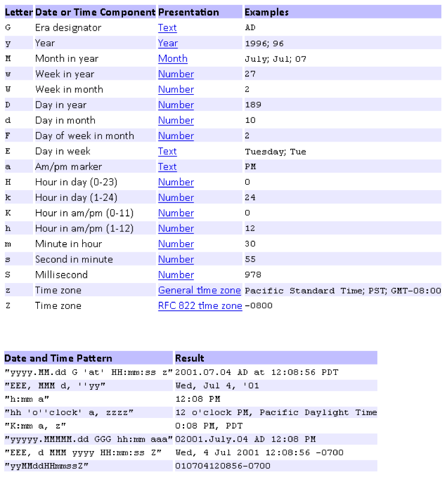

Datenimport (ImPlex)
====================

Der Datenimport von externen Dateien oder Datenbanken erfolgt über die zusätzliche Import-Funktion, den sog. "ImPlex". Hierbei handelt es sich um eine konsolenbasierte Java-Anwendung, die über ein Konfigurations-Plugin innerhalb der Anwendung "CortexUniplex" genutzt werden kann. Manuelle Importe können mit Hilfe des Plugins durchgeführt werden; automatische Importe werden über zeitgesteuerte Verfahren innerhalb der Konsole durchgeführt.

Der ImPlex erlaubt standardmäßig den Import von kommagetrennten Daten (csv-Dateien), von xml-Dateien und den Import aus einer anderen (oder auch derselben) CortexDB (Cortex-zu-Cortex-Import). Dadurch können über verschiedene Formate Daten integriert und verarbeitet werden. Der Cortex-zu-Cortex-Import erlaubt zudem die flexible Anpassung von Informationen innerhalb der Datenbank und auch der Datenbankstruktur an sich.

Voraussetzung für den Betrieb des ImPlex ist eine aktuelle Java-Version auf dem System, das die Datenimporte durchführen soll. Eine Java-Installation auf dem Datenbank-Server ist daher nicht zwingend notwendig, wenn ein anderer Server den Import durchführt.

Einführung
----------

Der ImPlex dient in seiner Grundfunktionalität für den Import von Daten über eine Importdatei. Über eine Oberfläche können Sie die einfache Zuordnung der zu importierenden Datensätze und Felder zu der CortexDB-Struktur vornehmen. In einem weiteren Schritt bilden Sie innerhalb der Datenbank die Verknüpfungen (Relationen) zwischen den Datensätzen.

Für wiederkehrende Importe (z.B. für sog. "Delta-Updates") speichern Sie die definierte Konfiguration und lassen den Importvorgang vom Server zeitgesteuert ausführen. Dadurch minimieren Sie die Zugriffe über die Entwicklerschnittstelle und optimieren den Datenfluss über den zeitlichen Faktor (bspw. für einen nächtlichen Datenaustausch über Internetleitungen).

Der Import von Datensätzen erfolgt grundsätzlich über Dateien in den Formaten csv und xml. Da es sich bei dem ImPlex um eine erweiterbare Java-Entwicklung handelt, können Sie zudem eine eigene Java-Klasse zum Lesen anderer Formate oder Schnittstellen implementieren. Der Zugriff auf andere Datenbanken (z.B. SQL- oder NoSQL-Datenbanken) ist somit genauso möglich, wie das Lesen systemspezifischer Dateiformate.

Ergänzend zu den bereits genannten Funktionen bietet Ihnen der ImPlex auch die Möglichkeit, dass Sie als Datenquelle eine CortexDB angeben. Neben dem Import aus einer anderen Datenbank ist es somit auch möglich, dass Sie als Quell- und Zieldatenbank dieselbe Datenbank nutzen. Damit besitzen Sie die Möglichkeit, Inhalte in Ihrer Datenbank automatisiert zu suchen, überprüfen und ggf. zu ersetzen, ergänzen oder zu löschen.

Bei dem ImPlex handelt es sich also um ein universelles Daten-Werkzeug, mit dem Sie in der Lage sind, umfangreiche Änderungen an Ihren Datensätzen, aber auch an Ihrer kompletten Datenbankstruktur vorzunehmen.

**Hinweis**:

Der Datenimport über den ImPlex schreibt nur die Felder, die explizit konfiguriert wurden. Systemfelder, wie Erstellungs- und Bearbeitunszeitpunkt, werden nicht automatisch gefüllt.

Vorgehensweise 
--------------

Üblicherweise erhalten Sie Daten aus anderen Quellen, die Sie in eine CortexDB importieren. Bei den Quellen, die der ImPlex grundsätzlich verarbeitet, kann es sich beispielsweise um einfache csv-Dateien (kommagetrennte Werte), xml-Dateien oder eine andere CortexDB handeln.

Liegen andere Quellen vor (z.B. SQL-Datenbanken), so ist eine individuelle Erweiterung des ImPlex möglich. Hierzu wird eine abstrakte Java-Klasse für Software-Entwickler bereitgestellt, mit deren Hilfe der Import der Daten aus anderen Datenquellen erfolgt.

Der generelle Ablauf zum Import aus anderen Quellen gliedert sich nach folgendem Muster:

1.  Bereitstellung der Daten
2.  Sichtung der Daten und Analyse des Datenformates
3.  Konfiguration notwendiger Felder und Satzarten in der CortexDB
4.  Aufbau des Datenmodells innerhalb der CortexDB
5.  Erstellung der Import-Konfiguration
6.  Ggf. Export der Import-Konfiguration für etwaige Automatismen
7.  Durchführung des Importes (manuell oder automatisiert)
8.  Auflösung nicht gesetzter Verweisstrukturen (Ausführen des Linker)
9.  Prüfung der importierten Inhalte

Diese Dokumentation beschreibt ausschließlich die Erstellung und Nutzung der Import-Konfiguration und die eigentliche Durchführung des Datenimportes. Im Folgenden wird daher davon ausgegangen, dass die zu importierenden Datenformate bekannt sind und die notwendigen Felder und Datensatzarten angelegt wurden. Anhand der grundlegenden Dokumentationen über die CortexDB können Sie die erforderlichen Informationen nochmals nachlesen.

**Hinweis**:

Beachten Sie, dass der ImPlex über die Lizenzverwaltung gesteuert wird. Standardmäßig ist die Lizenz auf ein Benutzerkonto beschränkt, so dass der eigentliche Importvorgang somit nur von einem Anwenderkonto aus ausführbar ist.

Konvertierung von Inhalten
--------------------------

In einigen Fällen müssen die gelieferten Quelldaten in andere Formate konvertiert werden. Dieses betrifft zum Beispiel Zahlenwerte (ganzzahlige oder Dezimalwerte) und Datumsfelder. Hierfür stehen entsprechende Importfunktionen bereit.  olgendes Beispiel erläutert die grundsätzliche Vorgehensweise. 

### Datumsfelder

Dadurch, dass unterschiedliche Quellsysteme verschiedene Datumsformate liefern, ist es erforderlich, dass Datumsfelder in dem Format importiert werden, wie sie der Server speichert. Mit Hilfe der entsprechenden Funktion ist es somit möglich, dass beliebige Datums- und Zeit-Formate importiert werden können. Folglich muss das Quellformat zuvor bekannt sein.

Beispiele von Datumsangaben aus versch. Quellen:

    111012 
    12-10-11
    11-10-12
    2012-10-11
    2012-10

In den gezeigten Beispielen ist in den ersten drei Fällen nicht ersichtlich, bei welcher Zahl es sich um den Tag, den Monat oder um das Jahr handelt. Daher müssen Datumsangaben zwingend immer konvertiert werden. 

Im ersten Fall wurden die zweistelligen Angaben für Jahr, Monat und Tag hintereinander ausgegeben. Um diese Angaben in das interne Format zu konvertieren und zu importieren ist daher folgende Angabe zu nutzen:

    date('yyMMdd',getChar('Quelldatum')); 

Die Angabe des Musters 'yyMMdd' definiert das Format der Quelle. Die nachfolgende Tabelle zeigt die möglichen Muster auf, die Sie aus einer Quelle konvertieren können:

Anhand der Beispiele ist zu erkennen, dass auch umfangreiche Datumsangaben in das interne Format übertragen werden können.

Sehr hilfreich ist auch der Online-Test (externer link):

[http://www.fileformat.info/tip/java/simpledateformat.htm](http://www.fileformat.info/tip/java/simpledateformat.htm)
