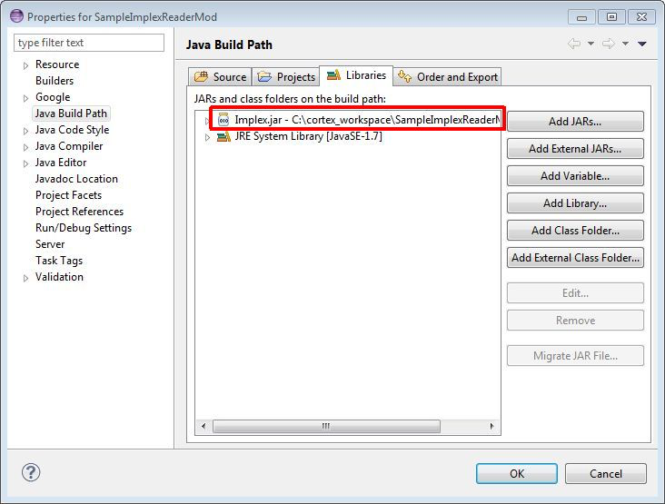
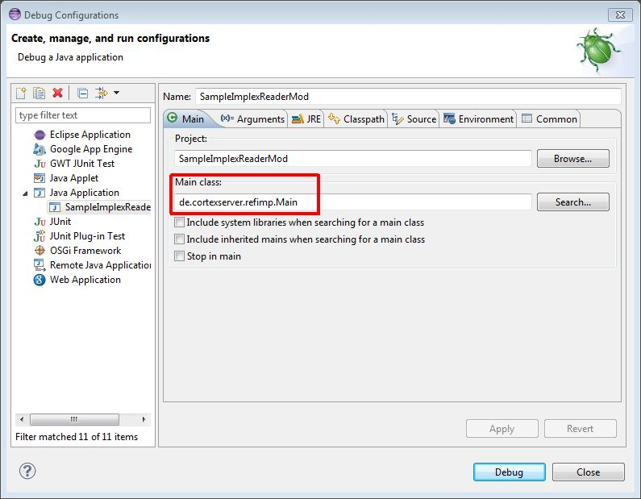
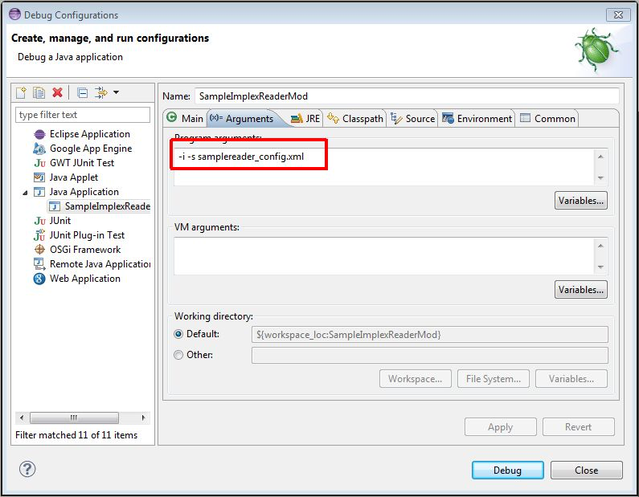

Java-Erweiterung des Implex 
===========================

Neben den Standardformaten csv und xml, sowie dem Import von CortexDB zu
CortexDB, ist auch der Import über weitere Datenquellen möglich. Dazu
bietet das Import-Werkzeug ImPlex die Möglichkeit, eigene Quellen in
Form einer sog. "Reader-Klasse" zu definieren. Diese wird im Bereich
"ReaderModul" der Import-Konfiguration eingebunden.

``` 
<ReaderModul typ="user" class="com.example.MyReaderModuleClass">
    <myQuery>...<myQuery>
</ReaderModul>
```
Zur Einbdung dieser Reader-Klasse stellt der Implex eine abstrakte JAVA Klasse bereit, die implentiert werden muss. 

Diese abstrakte JAVA-Klasse bietet im Rahmen der Datenintegration den
erheblichen Vorteil, dass keinerlei API-Kenntnisse der CortexDB
notwendig sind. Dadurch sind JAVA-Kenntnisse ausreichend, um die formale
Import-Syntax und die abstrakten Klassen anwenden zu können.
Softwareentwickler können so eine "Standard-Konfiguration" erstellen
und proprietäre Schnittstellen, wie auch SQL-Quellen anbinden.

Die Klasse besitzt den folgenden, grundlegenden Aufbau:

```java
package de.cortexserver.refimp.reader;

[...]

public abstract class ReaderModul
{
 [...]

 abstract public void SetInternValue(String sType, String sValue) throws HREModuleException;
 abstract public void Init() throws HREModuleException;
 abstract public boolean first() throws HREModuleException;
 abstract public boolean next() throws HREModuleException;

 // Spezial
 abstract public boolean jump(int iPos) throws HREModuleException;
 abstract public void handleUnwrittenSet() throws HREModuleException;
 abstract public String getRawLine();
 abstract public long getInputDate();
 abstract public int getProgress();
 
 [...]
}
```

Die oben angegebene abstrakten Methoden müssen implentiert werden;
allerdings sind nur die ersten vier von essenzieller Bedeutung. Die
letzten fünf dienen hauptsächlich für Debugzwecke und werden zum reinen
Datenimport nicht benötigt.

Hier eine kurze Beschreibung der Arbeitsweise der erforderlichen
Methoden:

	void SetInternValue(String sType, String sValue)

Über diese Methode übergibt der Implex die Steuerparameter aus dem "ReaderModul" Block der XML-Konfigurationsdatei. So können Sie ihrem Modul evtl. nötige Arbeitsparameter wie z.B. IP Adresse und Port einer Datenbank oder Dateinamen einer Quelldatei übergeben.

Dabei wird als Typ (String sType) der Bezeichner des XML Knotens und als Wert (String sValue) der Textinhalt des Knotens übergeben.

	void Init()

Nachdem der Implex, alle Parameter aus der "ReaderModul" Konfiguration an die Methode SetInternValue übergeben hat, wird einmalig diese Init Methode aufgerufen. Hier besteht die möglichkeit einmalig notwendige Initialisierungen vorzunehmen, z.B. einen Datenbank Login herstellen oder eine Quelldatei öffnen

	boolean first()]

Nachdem die Initialisierung durchgeführt wurde, fordert der Implex ein
einziges Mal über diese Methode einen Datensatz an. Häufig reicht es
aus, wenn diese Methode nur die Methode next() aufruft, da selten eine
Unterscheidung zwischen dem ersten Datensatz und den darauf folgenden
Quelldatensätzen erforderlich
ist.

Deshalb finden sie die Details zur übergabe eines Quelldatensatzes
unter der Methode next().

	boolean next()

Jeder weitere Datensatz, wird vom Reader über diese Methode
angefordert. So lange diese Methode "true" als Wert zurückgibt, gibt
es noch weitere Datensätze die eingelesen werden sollen. Wenn keine
Datensätze mehr geladen werden können, muss hier "false" zurück
gegeben werden.

Um einen Quelldatensatz für den Implex aufzubereiten, müssen die Daten
in ein Objekt vom Typ Dataset geladen werden. Die erforderliche Instanz
die befüllt werden muss, steht bereits][ unter
dem Bezeichner "DATASET" in der abstrakten Klasse zur
Verfügung.

In diesem Objekt kann eine XML ähnliche verschachtelte Struktur
abgebildet werden. In dieser kann ein "Knoten" wie im XML Attribute
und Subknoten haben.

Details zur Befüllung diese Objektes finden Sie in dem folgenden
Beispiel oder in der Beschreibung der "Beispiel Modul"
Implentierung.

Um die Befüllung des DATASET Objektes zu veranschaulichen, dient unten
aufgezeigtes Beispiel. In das Objekt wird ein Personendatensatz geladen
werden, der aus dem Namen, Vornamen und  Adressdaten besteht. Dazu wird
folgendes in der next() Methode implentiert.

```java
@Override
public boolean next() throws HREModuleException
{
  // erst den Namen eifügen
  // -> in der Importdefinition ansprechbar über: getChar('NAME')
  DatasetNode node = DATASET.addSubElement();
  node.setName("NAME");
  node.setValue("Mustermann", false);

  // wir ergänzen den Knoten noch um ein Attribut
  // -> in der Importdefinition ansprechbar über: getChar('NAME#id')
  node.addAttribute("Id", "0815");
 
  // Nun noch ein Knoten für den Vornamen
  node = DATASET.addSubElement();
  node.setName("Vorname");
  node.setValue("Max", false);

  // Die Adresse wollen wir hier zusammengefasst unter einem 
  // extra Knoten aufnhemen
  // -> in der Importdefinition ansprechbar z.B.: getChar('Addresse.Ort')
  node = DATASET.addSubElement();
  node.setName("Adresse");
  DatasetNode subNode = node.addSubElement();
  subNode.setName("Strasse");
  subNode.setValue("Tischlerstr.", false);
  subNode = node.addSubElement();
  subNode.setName("Plz");
  subNode.setValue("30916", false);
  subNode = node.addSubElement();
  subNode.setName("Hausnummer");
  subNode.setValue("1a", false);

  return true;
}
```

Natürlich ist es nicht sinnvoll, immer wieder das Datensatz-Objekt mit
dem gleichen festen Inhalt zu befüllen. An dieser Stelle ist von der
Datenquelle abhängig, die geladenen Werte dynamisch in dieses Objekt zu
laden.
 
Reader-Entwicklung mit Eclipse
------------------------------

In diesem Artikel setzen wir Kenntnisse in JAVA und der Verwendung der
IDE [Eclipse](http://www.eclipse.org) vorraus. Zudem stellt der
folgende Download nur die DLLs für das Entwickeln unter Windows bereit.

Um den Start in die Entwicklung zu vereinfachen, stellen wir Ihnen hier
einen vollständigen Eclipse Workspace zum Download bereit:

[Download: Eclipse
Workspace](dl.php?i=206e2d492a20202020212023&s=File&ea=cd118d75d3976223558460dc774ba2564acfa50d)

Dieser Workspace beinhaltet nur ein JAVA Projekt
(SampleImplexReaderMod). 

Wenn Sie die ZIP Datei unter Windows direkt in Ihr Laufwerk C:/
entpacken und sie bereits ein Eclipse installiert haben, wird Eclipse
den Workspace korrekt öffnen. Wird die Datei an einem anderen Ort 
entpackt oder ein anderes Betriebssystem verwendet, sind Anpassung im
"Build Path" des Projektes erforderlich. Bei anderen Betriebssystemen
benötigen Sie außerdem die entsprechenden Bibiliotheken, die nicht im
Lieferumfang des Downloads enthalten sind.



Wichtig für die Ausführung und das Debugging des Projektes sind zum
einen die richtige Main Class und zum anderen die Verwendung einer
geeigneten Implex-Konfigurationsdatei.

Im Auslieferungszustand befindet sich direkt im Projektverzeichnis eine
Beispiel-Konfiguration für das Reader-Modul (samplereader\_config.xml).
Als Main Class muss die Main Class des eingebungdenen Implex verwendet
werden:



Zum Debuggen sind zusätzliche Aufruf-Parametern erforderlich:



Die Umgebung ist nun startklar zum Testen der Beispiel-Implementierung.\
Hierbei handelt es sich um ein kleines Beispiel anhand eines einzelnen,
statischen Datensatzen. Dieses ist ausreichend, um die
Grundfunktionalität zu erläutern und bietet so einen einfachen und
schnellen Einstieg.


Verwendung im "Live" Betrieb
------------------------------

Wenn Sie Ihr ReaderModul Implementiert und getestet haben, müssen Sie
aus dem Programmcode ein JAR-Archiv erstellen und diesem zwingend den
festen Namen `usermodule.jar` vergeben. Damit die Implex.jar daruf
zugreifen kann, wird diese Datei in den Ordner der Implex-jar kopiert.
Innerhalb einer Import-Konfiguration kann dieser Reader als Parameter
angegeben werden.

 
