Import per Plugin
=================

Das Plugin dient zur einfachen Erstellung einer Import-Konfiguration und zur manuellen Durchführung. Für weiterreichende Anpassungen und die Einrichtung eines Automatismus ist ein Export der Konfiguration und deren Weiterbearbeitung notwendig. Um grundlegende Fehler zu vermeiden sollten Sie daher die allgemeine Konfiguration mit Hilfe des Plugins vornehmen und ggf. erst in einem weiteren Schritt die exportierte Konfigurationsdatei bearbeiten.

Der eigentliche Datenimport kann manuell mit Hilfe des Plugins, durch einen manuellen Start über die Kommandozeile oder über einen zeitgesteuerten Systemdienst ausgeführt werden. Generell wird hierbei zwischen dem Datenimport und dem Ausführen des sog. "Linkers" unterschieden.

Nachdem ein Import durchgeführt wurde, ist der Linker für die korrekte Herstellung von Verweisstrukturen zuständig ("Link-Auslösung"). Die Verweisstrukturen können daher unabhängig vom Datenimport zu jeder Zeit beliebig ausgeführt werden und setzen auch Verweise (Links), die ggf. über manuelle Dateneingaben erfolgten.

**Hinweis:**

Beachten Sie, dass zu einem Zeitpunkt grundsätzlich nur ein Import/Linker durchgeführt werden kann. Wurde ein Automatismus konfiguriert und der manuelle Import wird während dieser Laufzeit gestartet, erhalten Sie eine Fehlermeldung. Dementsprechend können Sie durch eine manuelle Durchführung ggf. einen automatischen Start blockieren.

Über das Plugin des ImPlex sind sowohl Datenimport als auch Link-Auflösung möglich und werden über separate Buttons angeboten.

Plugin-Installation
-------------------

Wurde die Datei "Implex.jar" in das Serververzeichnis kopiert (CortexDB und Web-Server), können Sie das dazugehörige Plugin integrieren. Hierzu importieren Sie die Datei "Uniplex-plugin-implex\..." mit Hilfe des Verwaltungsprogramms "Remote-Admin".

Melden Sie sich danach als Administrator (oder als eine andere, berechtigte Person) innerhalb des CortexUniplex an. Innerhalb des Administrationsbereiches können Sie dann einer Benutzervorlage das Plugin zuweisen.

Um Datensätze nach einem erfolgreichen Import miteinander zu verknüpfen, ist der sog. "Linker" erforderlich. Auch für diesen können Sie das entsprechende CortexUniplex-Plugin in eine Vorlage aufnehmen und innerhalb des CortexUniplex ausführen.

Nachdem Sie das Plugin integriert und in einer Benutzervorlage aktiviert haben, stehen Ihnen die beiden Schnellstarttasten "Import" und "Linker" zur Verfügung. Beide Funktionen sind unabhängig voneinander nutzbar. Sinnvollerweise sollten allerdings die Verweise (Relationen) zwischen den Datensätzen erst dann mit dem "Linker" hergestellt werden, wenn die Datenstruktur weitgehend vorhanden ist.

Über die Import-Taste gelangen Sie in die Konfiguration und Ausführung eines Importes. Hierbei wird zwischen dem csv- und Cortex-Modul unterschieden. Für den Import von xml-Dateien ist nur eine manuelle Konfiguration des Importes möglich.

Für die Anpassung einer Konfiguration an andere Schnittstellen (odbc u.ä.) ist die manuelle Anpassung bzw. programmatische Erweiterung des Import-Moduls notwendig. Hierbei handelt es sich um eine abstrakte Java-Klasse, die Sie dem eigenen Bedarf anpassen können.

Import von csv-Dateien
----------------------

Bei csv-Dateien ("comma separated values") handelt es sich um unformatierte Text-Dateien, in denen je Zeile ein Datensatz abgebildet wird. Der Spaltenaufbau jeder Zeile ist identische und die Inhalte sind durch Trennzeichen voneinander getrennt. Optional werden die Inhalte in Begrenzungszeichen eingefasst (z.B. Anführungszeichen).

    Name;Vorname;Ort
    Meier;Max;Hamburg
    Müller;Peter;Berlin

Das Plugin des Import-Werkzeugs "ImPlex" erlaubt die einfache Zuweisung von Quellfeldern zu Zielfeldern innerhalb der Datenbank. Mit Hilfe des Plugins kann dann ein manueller Import gestartet oder die Konfiguration für einen regelmäßig ablaufenden Import exportiert werden.

### Durchführung der Konfiguration

Nach dem Aufruf des Plugins und der Auswahl "csv-Modul" kann eine vorhandene csv-Datei ausgewählt oder hochgeladen werden. Hierbei ist zu beachten, dass die maximale Größe der csv-Datei durch den Webserver administrativ begrenzt ist. Jede Datei kann daher auch manuell in das entsprechende Unterverzeichnis abgelegt werden. Ausgehend vom Hauptverzeichnis der Cortex-Datenbank unter "*www/Implex*". Beachten Sie hier ggf. die Verzeichnis-/Datei-Rechte des Betriebssystems, da das Plugin die Quelldatei ansonsten nicht lesen kann.

Die dort abgelegten, bzw. manuell hochgeladenen Dateien stehen dann in der Auswahlliste "csv-Datei" zur Verfügung.

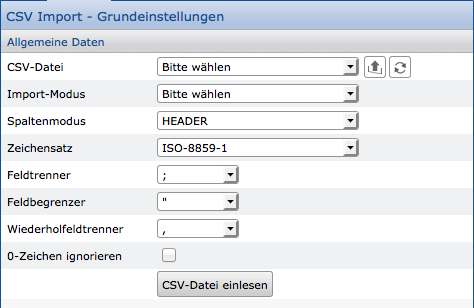

### Import-Modus

Der Import-Modus des ImPlex unterscheidet zwischen drei grundlegenden Import-Verfahren. Sie können wählen\...

-   ob die zu importierenden Daten neu angelegt
-   nur vorhandene Daten aktualisiert ("Update")
-   oder ob neue Daten angelegt werden sollen, wenn keine passenden Daten zum Aktualisieren gefunden wurden.

Beachten Sie hierbei, dass beim Aktualisieren und ggf. beim Anlegen sogenannte "Referenzwerte" notwendig sind. Referenzwerte sind eindeutige Datenbank-Inhalte, nach denen gesucht wird. Findet der ImPlex einen einzelnen Datensatz anhand der Referenzwerte, kann dieser Datensatz aktualisiert werden. Findet der ImPlex mehrere Datensätze, ist keine Aktualisierung möglich. Kann anhand der Referenzwerte kein Datensatz gefunden werden, legt der ImPlex ggf. einen neuen Datensatz an.

Die Felder mit den Referenzwerten wählen Sie erst in der nachfolgenden Maske, wenn alle Import-Parameter festgelegt wurden.

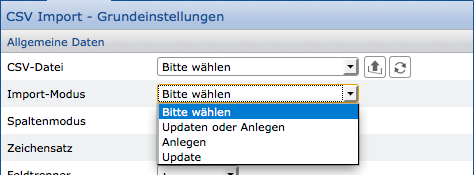

### Spaltenmodus

Üblicherweise beinhalten csv-Dateien in der ersten Zeile die sog. "Header-Informationen". In dem zuvor gezeigten Beispiel der Name, Vorname und Ort. Diese Informationen sind für den Import notwendig, weil darüber eine Zuweisung der Importdaten zu Zielfeldern möglich ist. Da nicht in jeder csv-Datei solche Header-Informationen vorliegen, kann für den Import ein eigener, "virtueller" Header genutzt werden. Anstatt einer Feldbezeichnung ist hier die Auswahl numerischer Werte (1,2,3,\...) oder von Buchstaben (A,B,C,D,\...) möglich.

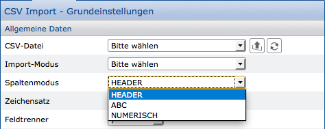

### Zeichensatz

Jede erzeugte Datei besteht aus einzelnen Zeichen. Je nach Sprache kann eine Datei Sonderzeichen (z.B. Umlaute) enthalten. Um Sonderzeichen korrekt darzustellen, muss ein System feststellen, welcher Zeichensatz (die sog. "Kodierung") genutzt wurde. Damit die Zeichen einer Quelldatei korrekt importiert werden können, muss dieser Zeichensatz daher bekannt sein und für den Import festgelegt werden.

Üblicherweise werden Dateien mit dem Zeichensatz UTF-8 ausgetauscht, weil hier alle Sonderzeichen aller Sprachen verwaltet werden können. Dennoch exportieren verschiedene Anwendungen Dateien auch in anderen Zeichensätzen. Daher stehen auch ISO-8859-1 und windows-1252 zur Verfügung.

Um den Zeichensatz einer Datei zu prüfen, benötigen Sie ein Programm, dass Ihnen diese Information liefert und ggf. den Zeichensatz konvertieren kann (z.B. "Notepad++").

!!! note "Hinweis"
    Die Standard-Windows-Programme "Editor" (Notepad), "Wordpad", "Word" oder "Excel" sind dafür nicht geeignet.

### Feldtrenner und Feldbegrenzer

Damit innerhalb von csv-Dateien die Inhalte eindeutig voneinander getrennt werden können, sind sog. "Feldtrenner" und "Feldbegrenzer" notwendig. Ein Trennzeichen trennt also zwei Werte voneinander und ein Begrenzungszeichen wird direkt vor und hinter einem Wert gesetzt, um den Wert zu begrenzen.

Beide Zeichen können Sie aus der Quelldatei ersehen oder sollten bereits zuvor bekannt sein. In den untenstehenden Beispielen wird dieses verdeutlicht.

Beispiel ohne Feldbegrenzer mit dem Feldtrenner Semikolon:

    Name;Vorname;Ort 
    Meier;Max;Hamburg 
    Müller;Silvia;Berlin

Beispiel mit dem Feldbegrenzer Anführungszeichen und dem Feldtrenner Semikolon:

    "Name";"Vorname";"Ort" 
    "Meier";"Max";"Hamburg" 
    "Müller";"Silvia";"Berlin" 

### Wiederholfeldtrenner

Die von Ihnen definierten Felder innerhalb einer CortexDB können mehrfach (also wiederholend) in einem Datensatz verwendet werden. Innerhalb der Quelldaten können dann mehrere Werte zu einem Feld, getrennt durch ein weiteres Trennzeichen ausgegeben werden. Bei diesem Trennzeichen handelt es sich um den sog. "Wiederholfeldtrenner". Jeder einzelne Wert zwischen den Feldbegrenzern wird also als eigenständiger Wert eines Feldes in den neuen Datensatz importiert.

    "Name";"Vorname";"Ort";"Hobbies" 
    "Meier";"Max";"Hamburg";"Fußball,Hockey" 

### "0"-Zeichen ignorieren

Wenn Sie numerische Werte importieren möchten, kann es sein, dass die Zahl Null einen "echten" Wert darstellt und ggf. ausgewertet werden soll. Möglicherweise handelt es sich aber auch nur um eine Angabe ohne weiteren Nutzen. In diesem Fall können Sie die Null ignorieren, wenn Sie die Option anhaken.

Cortex zu Cortex 
----------------

Das Cortex-Modul des ImPlex bietet Ihnen die Möglichkeit, dass Sie innerhalb Ihrer Datenbank (oder auch zwischen zwei Cortex-Datenbanken) beliebige Änderungen durchführen können. Dadurch können Sie bestimmte Inhalte korrigieren oder ergänzen und auch das komplette Datenmodell ändern.

Wichtig ist hierbei die vollständige Beachtung der Datensatzberechtigungen. Es ist daher zwingend notwendig, dass für das Benutzerkonto mit den Import-Rechten ein sog. "Default-Datensatz" vorhanden ist. Dieser wird nach dem ersten Login im CortexUniplex oder durch das Kopieren eines vorhandenen Benutzerkontos angelegt. Erst durch diesen "Default-Datensatz" eines Benutzerkontos kann der ImPlex die Zugriffsberechtigungen feststellen und die Änderung von Datensätzen zulassen.

Generell setzt sich die Quelle aus einer Listendefinitionen und den Datensätzen einer Selektion oder eines Datensatztyps zusammen. Wie im CortexUniplex basiert die Aufbereitung der Datensätze auf der Konfiguration einer Liste. Dadurch können Sie auch berechnete Listeninhalte für die Änderung der Datensätze nutzen.

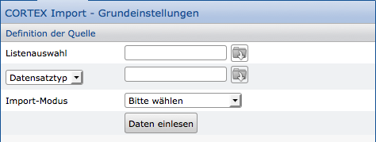

Die Listenauswahl in Kombination mit den Quelldatensätzen (Datensatztypen oder eine Selektion von Datensätzen) ergeben die Quelle, wie sie auch für den Import von csv-Dateien genutzt wird. Daher werden keinerlei Angaben über Zeichensatz, Feldtrenner u.ä. benötigt.

Nach dem Aufruf des ImPlex-Plugins und der Auswahl des Cortex-Moduls wählen Sie die entsprechende Liste, Datensatztyp oder Selektion und den Importmodus. Danach klicken Sie auf "Daten einlesen", um die Login-Daten einzugeben und gelangen so in die Maske der Feldzuweisung.

Quell-/Ziel-Zuweisung
---------------------

Nachdem der erste Dialog zur Auswahl der Quelle verlassen wurde, ist die Auswahl eines Ziel-Datensatztyps notwendig. Im Weiteren werden den Feldern dieses Typs die Quellfelder zugewiesen.

Um die Daten aus der Quelldatei ihrem Ziel zuweisen zu können, besteht das Zuweisungsfenster aus zwei Bereichen. Der linke Bereich zeigt die Spaltenüberschriften der Quelle an (oder numerisch/alphabetisch, wenn diese Option im csv-Modul aktiviert wurde). Der rechte Bereich zeigt die Zielfelder des Datensatztyps an, der bei dem Aufruf ausgewählt wurde.

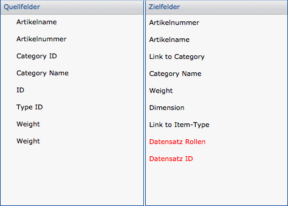

Um nun eine Zuweisung vorznehmen, klicken Sie im linken Bereich ein Quellfeld an und wählen im rechten Bereich das passende Zielfeld. Direkt nach dem Klick wird die Zuweisung in der Liste unterhalb der beiden Spalten angezeigt.

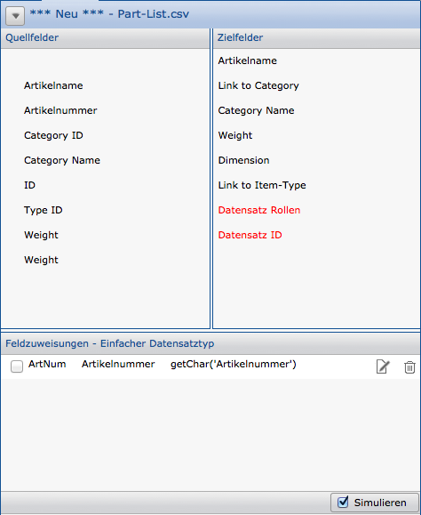

Der untere Bereich zeigt das Synonym und den Namen des Datenbankfeldes, das zugewiesene Quellfeld und je einen Button zur Bearbeitung der Zuweisung und zum Löschen.

Üblicherweise wird jedes zugewiesene Quellfeld mit der Funktion "getChar" umschlossen. Dieses ist notwendig, da es auch andere Quelltypen geben kann; Beispielsweise Datumsfelder. Diese und andere können mit Hilfe von Import-Funktionen in das entsprechende Zielformat konvertiert werden. Über den Bearbeiten-Button kann daher die Funktionen angepasst und geändert werden.

Genauso ist das Zusammenfügen zweiter Felder zu einem Zielfeld möglich.

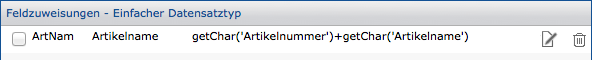

Die weiteren Möglichkeiten zur Anpassung und Konvertierung der Quellen entnehmen Sie bitte den Import-Funktionen.

### Referenzfelder

In der Feldzuweisung befindet sich an erster Stelle eine Checkbox zum Festlegen der Referenz.

Anhand der Referenzfelder werden eindeutige Datenbank-Inhalte gesucht. Findet der ImPlex genau einen einzelnen Datensatz anhand der Referenzfelder, kann dieser Datensatz aktualisiert werden. Findet der ImPlex mehrere Datensätze, ist keine Aktualisierung möglich. Wird anhand der Referenzfelder kein Datensatz gefunden, legt der ImPlex ggf. einen neuen Datensatz an (je nach Importmodus).

Über die Checkbox an der linken Seite markieren Sie Felder als "Referenz". Es besteht so die Möglichkeit, dass Sie mehrere Felder als gemeinsame Referenz nutzen. Dadurch, dass die Kombination der markierten Referenzfelder innerhalb der Datenbank gesucht werden muss, führt die Auswahl zu einem langsameren Import-Vorgang.

### Setzten der Rolle für die zu importierenden Datensätze

Innerhalb der Datenbank können Benutzerkonten und Datensätze Rollen erhalten. Stimmen mindestens eine Rolle des Benutzers und Datensatzes überein, kann der Benutzer den Datensatz sehen und ggf. bearbeiten.

In der Liste der Zielfelder befindet sich der Eintrag "Datensatz-Rollen". Üblicherweise exisitiert dazu kein entsprechendes Quellfeld. Daher ist eine manuelle Bearbeitung notwendig, die im einfachsten Fall jedem importierten Datensatz die gleiche(-n) Rolle(-n) zuweist. Dazu ist die Auswahl des Feldes und ein Klick auf den Bearbeiten-Button notwendig. Die Rolle wird dann einfach als Text eingetragen, z.B.: 'admin'

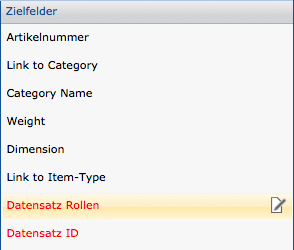

**Hinweis**:

Sollen den Datensätzen mehrere Rollen zugewiesen werden, ist ein mehrfaches Hinzufügen des Feldes notwendig, da es sich hierbei um ein Wiederholfeld handelt.

Durchführung des Imports
------------------------

Für den Import ist in der Benutzerverwaltung des Remote-Admin das entsprechende Recht zu setzen. Es empfiehlt sich daher, ein gesondertes Benutzerkonto einzurichten, mit dem Datenimporte durchgeführt werden können. Der Benutzername und das Passwort dieses Kontos werden in den exportierten Konfigurationsdateien und auch bei der Nutzung des Plugins benötigt.

Nachdem die Feldzuweisung ("Mapping") durchgeführt wurde, kann der Import oder eine Simulation durchgeführt werden. Die Simulation prüft nur syntaktisch, ob während des Importes Fehler auftreten können. Eine logische Prüfung der Daten kann nicht erfolgen.

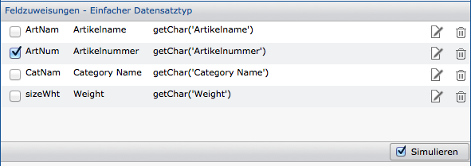

Standardmäßig ist am unteren, rechten Rand der Button auf den Modus
"Simulation" gesetzt. Nach einem Klick wird die Simulation gestartet,
indem alle zu importierenden Datensätze gelesen und durchlaufen werden.
Danach erfolgt eine Ausgabe zum Status der Simulation.

Durch das Entfernen des Hakens kann der Button auf "Import" gesetzt werden. Dieses Umschalten bewirkt den richtigen Import der Daten, so dass das Durchlaufen länger dauert, weil die Datensätze nunmehr in die Datenbank geschrieben werden. Aus einer Simulation ist daher die vollständige Zeit für den Import keinesfalls abzuleiten.

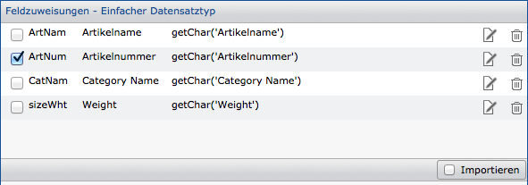

Während des Importes und auch während der Simulation erfolgt die Anzeige eines Fortschrittsbalkens ("Progress-Bar").

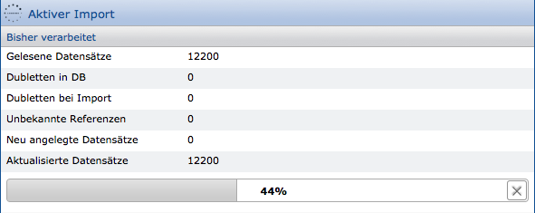

Die Fortschrittsanzeige erfolgt über einen Satzzähler, der permanent angezeigt wird. Nach Ende der Simulation / des Importes erhalten Sie eine Statusanzeige der Ergebnisse. In dieser Ansicht können Sie die Zeilen „Erstellte DS" und „Datensatz Updates" anklicken und gelangen in die Listenansicht der betroffenen Datensätze (nur nach Import).

Beachten Sie, dass aus der Datenquelle mehrere Datensatzarten erstellt werden können. Die Summe der erstellten Datensätze kann daher ggf. von der Anzahl der Quelle abweichen.

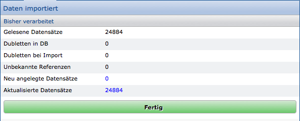

Verweise mit dem Linker setzen
------------------------------

Innerhalb der Datenbank ist es möglich, dass über sog. "Verweisfelder" zwischen Datensätzen Relationen hergestellt werden. Beispielsweise könnte eine Person auf einen Arbeitgeber verweisen. Diese Verweise werden üblicherweise während der Arbeit mit dem CortexUniplex per Hand gesetzt und in den Datensätzen gespeichert. Dieser Vorgang kann auch automatisch vom ImPlex und der Linker-Funktion durchgeführt werden.

Der Linker ist ein Bestandteil des ImPlex und dient ausschließlich dazu, unbekannte (also nicht gesetzte) Verweise eindeutig aufzulösen und den Verweis in den entsprechenden Datensätzen zu schreiben. Hierzu bedient er sich der Suchkonfiguration, die in dem Datensatzeditor innerhalb des Verweisfeldes festgelegt wurden.

Über die Import-Funktion des ImPlex (oder auch manuell durch Anwender-Eingaben) werden zuvor Inhalte in das Verweisfeld geschrieben, die als ungültige Verweise markiert werden. Der Linker nutzt diesen ungültigen Inhalt, um dann den Verweis zu erstellen. Er arbeitet also unabhängig der importierten oder erfassten Daten und kann daher auch als Korrekturwerkzeug genutzt werden, das automatisch alle ungültigen Verweise korrigiert.

Sie können den Linker sowohl manuell ausführen, als auch eine Konfigurationsdatei erstellen, die automatisch ausgeführt wird.

Auch für den Linker ist der Name und das Passwort eines Benutzerkontos erforderlich, dem das Import-Recht über den Remote-Admin zugewiesen wurde.

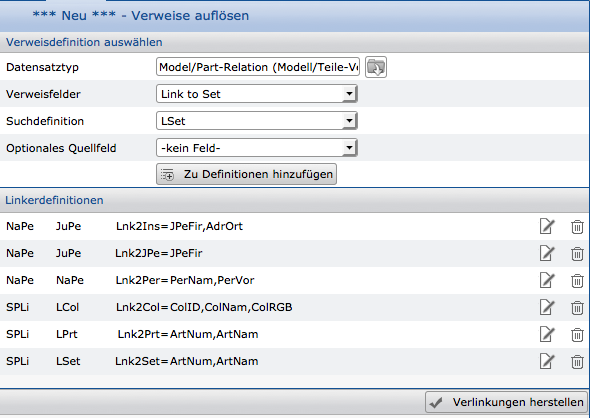

Im oberen Bereich des Plugins werden der Datensatztyp, das darin enthaltene Verweisfeld und diesem zugewiesene Suchdefinition ausgewählt. Soll ein Verweis aus dem Inhalt eines anderen Feldes generiert werden, kann dieses als optionales Quellfeld angegeben werden.

Jede Linker-Konfiguration wird der Gesamt-Definition hinzugefügt, so dass auch mehrere Verweise aus unterschiedlichen Datensatztypen in einem Lauf abgearbeitet werden können.

Mit dem Klick auf "Verlinkungen herstellen" wird der Linker gestartet und es erfolgt eine Fortschrittsanzeige.
