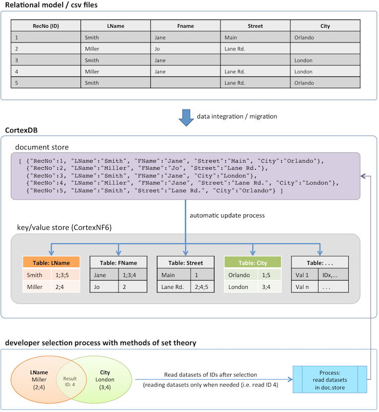
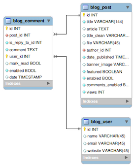
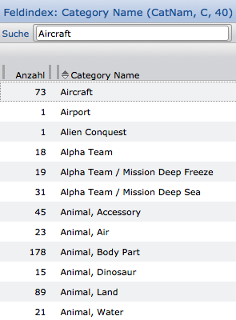
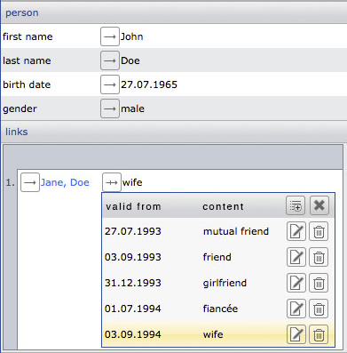
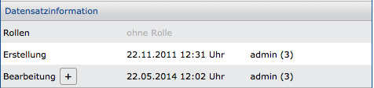
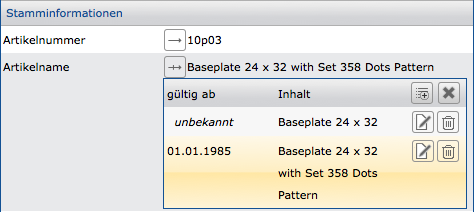

Die CortexPlattform
===================

Die CortexPlattform besteht aus einer Multi-Model NoSQL-Datenbank (CortexDB), einer universellen Anwendung ([CortexUniplex](../CortexUniplex/CortexUniplex-Basics/)), Datenimport-Werkzeugen ([CortexImplex](../CortexImplex/CortexImplex-Basics/) und CortexJSAutoimport) und einer Sammlung von Werkzeugen - z.B. [CortexUniplexWebAPI](../CortexUniplexWebAPI/CortexUniplexWebAPI/) (JSON HTTP API). Entwickler und Anwender setzen damit sehr einfach und schnell neue Anwendungen, Datenanalysen und andere Anforderungen um. Das gilt sowohl für den Fachbereich, wie auch für Entwickler, die einen schnellen und einfachen Datenbankzugriff benötigen, ohne sich mit der eigentlichen Datenbanktechnik auseinanderzusetzen.


Das Gesamtkonzept beinhaltet neben dem Datenbankserver auch darauf basierende Werkzeuge für den sofortigen Einsatz, um

-   Datenmodelle für beliebige Anwendungen einfach zu konfigurieren
-   Datenimporte aus anderen Systemen sicherzustellen
-   und per Entwicklerschnittstelle ([CortexUniplexWebAPI](../CortexUniplexWebAPI/CortexUniplexWebAPI/)) einen möglichst einfachen Datenbankzugriff zu gewähren.

Dabei ist es für die Realisierungsphase unerheblich, ob Sie eine individuelle Anwendung für wenige tausend Datensätze erstellen wollen oder ob Sie eine Datenbank für umfangreiche und/oder komplexe Strukturen benötigen (z.B. *big data*).

Allgemeine Informationen erhalten Sie über unsere Webseite: <http://www.cortex-ag.com>

Die Möglichkeit eines selbständigen Tests mit einer leeren und einer Demo-Datenbank erhalten Sie über unsere Cloud-Lösung unter: <http://cloud.cortex-ag.com>

Die Datenbank *CortexDB*
------------------------

Die CortexDB ist das Kernstück der CortexPlattform. Hierbei handelt es sich um eine multi-model Datenbank, die für die Ablage von Datensätzen das Konzept eines document store nutzt, alle Felder und Feldinhalte redundanzfrei in einen mehrdimensionalen key/value-store überträgt (6. Normalform / 6NF), sowie Transaktionszeitpunkt und Gültigkeitszeitpunkt von Informationen bitemporal speichern kann. Darüber hinaus ist die ein-eindeutige Verbindung zwischen Datensätzen als Verweisstruktur möglich ("GraphDB").

Durch die Kombination der verschiedenen Datenbankkonzepter werden in der CortexDB Datensätze als Container gespeichert (document store) und gleichzeitig in die 6. Normalform (key/value-store) überführt. Dieser repräsentiert die gesamte Datenbank und die Originaldatensätze bleiben somit erhalten. Selektionen werden ausschließlich in der redundanzfreien 6. Normalform durchgeführt und erst das Ergebnis wird aus den Containern des document store gelesen, wenn die Benutzerrechte dieses zulassen. Dadurch liegt hier ergänzend zu Lese- und Schreibrechten auf Datensätzen auch noch ein Selektionsrecht vor.

Im Gegensatz zu NoSQL- und SQL-Datenbanken kombiniert die CortexDB somit als einzige Datenbank die Nutzung einer schemalosen Datenablage bei gleichzeitiger und vollständiger Normalisierung aller Inhalte in die höchste Normalform.

Die folgende Darstellung verdeutlicht den Gesamtprozess von der Integration aus einem relationalen Modell (oder auch csv-Dateien) über die Speicherung in der CortexDB als document store und dessen gleichzeitige Speicherung im key/value-store, bis zur Selektion und das endgültige Lesen der Ergebnisse.

##### Schema zur 6. Normalform (Übertragung und Abfrage)



### 6. Normalform (Index)

Die 6. Normalform (d.h. die Index-Struktur) der CortexDB unterscheidet sich erheblich von den Strukturen und Möglichkeiten aller bisher verfügbaren Datenbanken.
Dadurch sind nicht nur eine höhere Geschwindigkeit und einfachere
Abfragen gegeben, sondern auch ganz neue Ansätze für die Lösung von
Aufgabenstellungen.

Hierbei ist zu beachten, dass die Indexpflege vollautomatisch von der
Datenbank übernommen wird und keinerlei Anpassungen erforderlich sind.

### Allgemeine Datenbankstrukturen und Index

Datenbanken unterscheiden sich primär durch ihr
Datenbankschema. Relationale Datenbanken organisieren Daten in Tabellen
und Spalten, wobei gleiche Spalteninhalte verwendet werden, um Tabellen
miteinander zu verknüpfen (über sog. *Fremdschlüssel*). Dieses wird
häufig in Form von *entity relationship* Diagrammen (*ERD*)
dokumentiert.



Allgemein unterscheiden sich alle derzeit verbreiteten Datenbanken (SQL
und auch NoSQL) durch dieses Datenbankschema, egal ob Key/Value-,
Document Store, GraphDB und andere. Erst die Anwendungen organisieren
Daten, basierend auf dem zugrundeliegenden Datenbankschema. Der
[Datenbank-Index](http://de.wikipedia.org/wiki/Datenbankindex) ist eine
von den Daten getrennte Struktur zur Beschleunigung und Suche von
Datenbankinhalten.

Alle Datenbanken verwenden dabei flache Indexstrukturen mit Verweisen
auf Datensätze, um Datenzugriffe in sortierter Reihenfolge zu
ermöglichen. Unterschiede bilden spezielle Indexe in denen sich die
Datenbanken unterscheiden, wobei es sich in allen Fällen um flache
Indexe handelt (z.B. bitmap index).

### CortexDB-Index im Speziellen

Bei der CortexDB handelt es sich um eine schemalose Datenbank
(vergleichbar mit *Document Stores*), die mit einer inhaltsbasierenden
mehrstufigen Indexstruktur arbeitet. Das bedeutet, dass jeder Inhalt
*weiß*, in welchen Datensätzen und Feldern er vorkommt und jedes
Feld *weiß*, welche verschiedenen Inhalte existieren.

!!! success ""
    Die CortexDB ist daher die erste und bisher einzige Datenbank, die mit der 6. Normalform (6NF) einen einheitlichen Index über alle enthaltenen Informationen in beliebigen Datenbankschema bietet.

Diese Indexstruktur bildet daher über alle Felder und deren Inhalte die gesamte Datenbank ab, so dass alle Abfragen in der Indexstruktur behandelt und die schemalos gespeicherten Daten nur zur Ausgabe verwendet werden. Die geringe Größe ermöglicht sehr schnelle Abfragen in beliebiger Abfragekombinationen. Administratoren und Entwickler können daher sofort mit diesem Index arbeiten und brauchen daher (auch bei Änderungen am Datenmodell) keinerlei Anpassungen oder Optimierungen vornehmen.

### Feldindex in der Anwendung

Innerhalb der Anwendung CortexUniplex kann über den sog. *Feldindex* der
Index zu jedem Feld angezeigt werden. Dieser zeigt die verwendeten
Inhalte des Feldes (über alle Datensatztypen) und die Häufigkeit
(Anzahl) der Inhalte in der Datenbank. Hinter jeder Anzahl verbirgt sich
daher die o.g. Inhaltsliste (ID-Liste).



Zu jedem Eintrag in diesem Feldindex kann das Ergebnis in einer
separaten Liste angezeigt werden. Dieses ermöglicht so den direkten
Zugriff auf Datensätze mit den entsprechenden Inhalten. Für
weitergehende Selektionen zur Kombination der verschiedenen Inhalte über
den Feldindex stehen ergänzende Funktionen in der Anwendung zur
Verfügung.

Durch die Mengen-Kombination verschiedener Feldindexe erfolgen so die
Abfragen innerhalb der Datenbank. Über die Schnittmenge, Differenzmenge,
symetrische Differenzmenge und Vereinigungsmenge werden nur die
Vorkommen miteinander kombiniert und erst bei der Ausgabe erfolgt das
Lesen der Datensätze.

 

!!! note "Hinweis"
	Der Feldindex zu einem Feld besteht aus einer Liste von Datensatz-ID's. Jede ID wird intern mit 12 Byte verwaltet. Wird in einem Index also ein Inhalt mit der Anzahl *1* angezeigt, so ist die ID-Liste 12 Byte lang. Bei einer Anzahl von *10* also 120 Byte usw. Ein Faktor für den Speicherbedarf des Index ergibt sich also aus der Anzahl verschiedener Inhalte je Feld und die Anzahl verschiedener Felder.

!!! warning "Speicherbedarf bei Selektionen"
    Bei einer Kombination mehrerer Indexe zum Auffinden von Inhalten über die Schnittmenge, Vereinigungsmenge, Differenzmenge oder symmetrische Differenzmenge  werden die ID-Listen (also n * 12 Byte) miteinander kombiniert. Hierfür muss die entsprechende Menge an Arbeitsspeicher zur Verfügung stehen.

### Abfragen

Dadurch, dass die CortexDB jeden Inhalt und jedes Feld in einer
Indexliste führt, erfolgen Abfragen über einfache Mengenkombinationen.

Beispiel für die Kombination von Namen und Orten:

```
    Meyer: ID1; ID2; ID3; ID5; ID8; ID13

    Hamburg: ID2; ID4; ID6; ID8; ID10

    Schnittmenge = [Meyer] ∩ [Hamburg] = ID2; ID8
```

Die Schnittmenge aus den ID's der Felder Name für *Meyer* und Ort für
*Hamburg* ergibt eine neue ID-Liste mit zwei Inhalten. Erst nachdem
diese Kombination durchgeführt wurde, erfolgt die Anzeige oder
Weiterverarbeitung der Inhalte betroffener Datensätze. Vor diesem
Zeitpunkt ist kein Lesen der Datensätze notwendig, sondern nur das Lesen
der ID-Listen (also des Indexes).

Die Konfiguration solcher und weiterführender Selektionen erfolgt in der
Standard-Anwendung  und kann über die dazugehörende API
(CortexUniplexWebAPI) genutzt werden.

Multi Model 
-----------

Die CortexDB bietet die Möglichkeit, unterschiedliche
Datenbank-Funktionen im Rahmen der schemalosen Struktur zu verwenden.

So ist es beispielsweise möglich, dass über Verweisfelder
Strukturen aufgebaut werden, wie sie bei Graph-Datenbanken zu finden
sind. Weiterhin können einzelne Felder (optional) beliebig häufig in
einem Datensatz verwendet werden (z.B. für Bankverbindungen oder eMail-Adressen); genauso können vergangene, aktuelle und künftige Werte je Feld eines Datensatzes
gespeichert werden (bitemporale Datenbank). Zudem wird intern die
6. Normalform ähnlich in Anlehnung an Key/Value-Stores gespeichert (mehrdimensionaler Key/Value-Store).

Das Beispiel zeigt den Datensatz einer Person mit dem Verweis auf eine andere
Person und dessen Beschreibung im zeitlichen Verlauf.



Jede dieser Möglichkeiten kann mit den anderen auch kombiniert werden
(z.B. für die zeitliche Veränderung von mehreren Verweisen).

### Bitemporal

Zu einem Datensatz speichert die CortexDB die
[Transaktionszeit](http://en.wikipedia.org/wiki/Transaction_time) von
Änderungen. Ergänzend dazu kann jeder Inhalt aller Felder einzeln
innerhalb eines Datensatzes mit einem Gültigkeitszeitpunkt versehen
werden
([Attribut-Zeitstempelung](http://en.wikipedia.org/wiki/Valid_time/)).
Daher ist zu jedem Datensatz nicht nur der Zustand eines Datensatzes bei
der letzten Transaktion ersichtlich, sondern auch der komplette
"Lebenszyklus" (Historisierung). In diesem Fall spricht man von
[bitemporaler
Datenbank](http://en.wikipedia.org/wiki/Temporal_database).

Dabei gilt, dass die Transaktionszeit  automatisch (implizit) vom Server
gepflegt wird und die Gültigkeit eines Wertes vom Anwender (explizit)
bzw. von Automatismen wie dem Datenimport oder Schnittstellen. Wurde
keine Gültigkeit gepflegt, gilt "unbekannt" für diesen Wert so lange,
bis dieser mit einem neuen Wert überschrieben (eine Transaktion
überschreibt diesen Wert) oder ein weiterer Wert mit einer Gültigkeit
hinzugefügt wird.

!!! example "Beispiel"
	Informationen über Transaktionen können innerhalb eines Datensatzes angezeigt werden.
	
	 
	
	Im Gegensatz dazu zeigen die Verlaufsinformationen (oder auch *Verlaufsbearbeitung*) die Gültigkeiten eines Wertes in einem Feld. Diese können zu jedem Feld eingeblendet und explizit gepflegt werden. Ist für einen Wert die Gültigkeit unbekannt, gilt der Wert dauerhaft so lange, bis dieser von einem neuen Wert überschrieben wird. Die Standardansicht eines Datensatzes zeigt dabei immer nur den aktuell gültigen Wert an.
	
	

Speicherbedarf
--------------

Um die richtige Hardware einzusetzen, wird vor dem Einsatz einer neuen
Datenbank häufig eine Einschätzung des zu erwartenden Speicherbedarfs
gefordert. Neben dem Speicher sind zudem auch andere Ressourcen
relevant, um die Laufzeit einer Datenbank sicherzustellen. Die
Rahmenparameter für Festplatten (HDD oder SSD), Prozessoren (CPU) und
Arbeitsspeicher (RAM) sind daher insgesamt festzulegen.

!!! note "Nutzung von Festplatten (HDD oder SSD)"
    Im Idealfall sollten Sie auf SSD-Festplatten zurückgreifen, um den Index während der Datenbank-Laufzeit darüber zu nutzen. Bei der Nutzung einer HDD kann der Index nur im Arbeitsspeicher sinnvoll genutzt werden, so dass dann dieser entsprechend auszulegen ist.

Hierbei hängt der Speicherbedarf erheblich von mehreren Parametern ab,
die nur teilweise oder überhaupt nicht aus den vorhandenen
Datenbeständen abgelesen werden können. Beispielhaft zählen dazu unter
anderem:

-   Anzahl der Datensätze
-   Länge der Feldinhalte
-   Länge der verwendeten Feld-Synonyme in der CortexDB
-   Anzahl unterschiedlicher Inhalte je Feld
-   Anzahl und Größe von Binärdaten
-   Anzahl der Felder je Datensatztyp
-   Häufigkeit von Wiederholfeldern je Datensatz
-   . . .

!!! note "Hinweis"
	Zu beachten ist hierbei, dass der Speicherbedarf nicht mit relationalen Systemen verglichen werden kann, weil die CortexDB alle Inhalte indiziert und somit nahezu jede beliebige Abfrage universell sicherstellt. In relationalen Systeme legt die Administration ausgesuchte Indexe fest, die nur wenige Spalten betreffen. Eine beliebige, kombinierbare ad-hoc Abfrage durch den Endanwender ist dort nur sequentiell ohne Index möglich.
