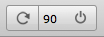
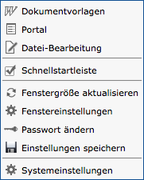
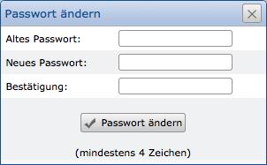
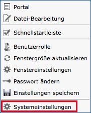
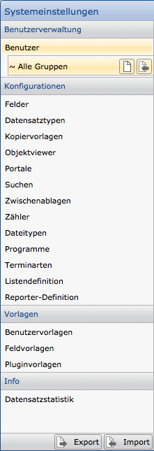

CortexUniplex
=======

Für die interaktive Nutzung durch Anwender, wie auch für die Grundlage
der Softwareentwicklung steht die Anwendung CortexUniplex bereit. Durch
einfache Konfigurationen des Datenmodells (Felder, Datensatztypen,\...)
bis zu den Berechtigungen einzelner Funktionen kann eine Anwendung
konfiguriert werden. Diese ist sowohl für Abfragen, Selektionen und
grafische Auswertungen, wie auch für die interaktive Nutzung durch
Anwender und Entwickler nutzbar. Einzelne Arbeitsprozesse in
Fachbereichen können diese Anwendung genauso nutzen, wie
Softwareentwickler für eigene, individuelle Anwendungen.

Innerhalb des CortexUniplex stehen mehrere, allgemeine Funktionen zur
Verfügung, für die ein Anwender über die Zuweisung der Benutzervorlagen
Berechtigung erhalten kann. Hierbei wird insbesondere die Listenfunktion
vor allen anderen Funktionen als Anzeige von Ergebnissen genutzt.

CortexUniplex Grundlagen
------------------

Die Anwendung CortexUniplex gliedert sich in mehrere Bereiche, die durch einen
Anwender genutzt werden können. Je nach Berechtigungen werden die
Buttons für bestimmte Funktionen angezeigt bzw. nicht angezeigt.

Grundsätzlich besteht die Anwendung aus einer Hauptleiste, die immer am
oberen Rand angezeigt wird. Diese beinhaltet entsprechende
Zugriffsmöglichkeiten auf die nutzbaren Funktionen. Darunter werden die
Inhalte der Anwendung angezeigt, die für jeden Anwendungsbereich
unterschiedlich sein können. Die Nutzung der Portale, die
Datensatzbearbeitung, Listen und weiteren Funktionen werden daher in den
entsprechenden Bereichen dieser Dokumentation erläutert.

 

### Aktualisieren und Logout

Nach dem Login befinden sich oben rechts die Buttons für die
Aktualiserung des Fensters und das Abmelden des Benutzers.

 

### Systeminformationen und weitere Funktionen

Oben links befinden sich mindestes zwei Buttons für die Anzeige von
Informationen über die Anwendung und zum Aufruf des Hauptmenüs. Ggf.
werden dort weitere Buttons angezeigt (je nach Berechtigung des
Anwenders). In der hier gezeigten Abbildung beispielsweise die Funktion
zum Anlegen eines neuen Datensatzes. Ebenso können hier Funktionen zum
Selektieren oder für den Dokumenten-Eingang angezeigt werden.

### Hauptmenü

Über den Info-Button sind die grundlegenden Informationen zu der
Anwendung, zum Server und zu den Benutzerrechten verfügbar. Ein
Administrator kann hierüber eine erste Diagnose durchführen, wenn
Anwender Fragen zu den zur Verfügung gestellten Funktionen haben
sollten.

Über den Button mit dem Dreieck gelangen Sie in das Hauptmenü für
weitere Funktionen. Hier stehen unter anderem der Aufruf des
Haupt-Portals zur Verfügung, das Einblenden der Schnellstart-Tasten,
sowie die Fensteranpassungen. Des Weiteren kann das Passwort geändert
werden. Administratoren erhalten zudem den Zugriff auf die
Systemeinstellungen.

### Passwort ändern

Über den Eintrag "Passwort ändern" im Hauptmenü kann ein Anwender
selbständig das Passwort anpassen. Aus Sicherheitsgründen ist das alte
Passwort erneut einzugeben.

 

CortexUniplex Konfiguration
---------------------

Die Konfiguration der Anwendung CortexUniplex erlaubt die komplette Festlegung
des Datenmodells, der Benutzer-Rollen und -Rechte, sowie weiterer
Funktionen. Über den Bereich *Systemeinstellungen* sind alle
Möglichkeiten der Konfiguration für den sog. *Web-Admin* erreichbar.
Das Recht für diesen Bereich muss daher zuvor über den *Remote-Admin*
einem Benutzerkonto zugewiesen werden (siehe Benutzerrechte).

Erfolgt der Login in den CortexUniplex mit einem Benutzerkonto und dem entsprechenden
Funktionsrecht, ist über die globale Symbolleiste innerhalb des
Systemmenüs (Dreieck oben links) der Menüpunkt *Systemeinstellungen*
erreichbar.

Anderen Anwendern stehen üblicherweise nur die weiteren Menüpunkte für
die eigenen Einstellungen zur Verfügung (Fenstereinstellungen,
Passwortänderung u.ä.). Genauso können hierüber die Schnellstartleiste
und das Portal wieder eingeblendet werden, wenn diese vom Anwender
ausgeblendet wurden.

Die Konfigurationen der Felder, Datensatztypen, Listen und Pivots,sowie
der Portale und Rollenberechtigungen stehen jedem Anwender nach einem
erneuten Login (oder der Aktualisierung der Anwendung) zur Verfügung.
Darüberhinaus gelten die genannten Konfigurationen auch durch die
Benutzung der CortexUniplexWebAPI, da diese den Benutzerkontext
berücksichtigt. Die von Ihnen definierten Konfigurtionen haben daher
weitreichende Auswirkungen.

### Genereller Konfigurationsablauf

Die Konfiguration der Anwendung erfolgt über mehrere Schritte, von dem
jeder unabhängig von den anderen Schritten ausgeführt werden kann. Um
eine möglichst zügige und korrekte Konfiguration zu erstellen, empfiehlt
es sich zu Beginn einen Standardablauf einzuhalten. Nach der
grundlegenden Konfiguration können dann für Änderungen beliebig
durchgeführt werden.

1.  Definition und Festlegung der Benutzervorlagen
2.  Definition von Feldern
3.  Definition der Datensatztypen (Link-Felder erst ab Schritt 11)
4.  optional: je Datensatztyp ein oder mehrere Wiederholfeldgruppen
    konfigurieren
5.  Suchkonfiguration für Datensatztypen festlegen
6.  Den Datensatztypen die Suchkonfigurationen zuweisen
7.  Re-Login oder Aktualisierung der Anwendung
8.  Testen der Suchen (es werden leere Listen angezeigt)
9.  Je ausgeführter Suche eine Liste konfigurieren und speichern
10. In den Systemeinstellungen je Suchkonfiguration eine Liste zuweisen
11. weiterhin je Datensatztyp eine Liste als Standardliste setzen
12. Linkfelder den Datensatztypen hinzufügen (Datensatztypen müssen
    vorher definiert worden sein).

Wurden alle genannten Schritte korrekt durchgeführt, haben Sie das
vollständige Datenmodell konfiguriert und die Grundlage für einen
Datenimport, die manuelle Benutzung, Auswertungen und den Zugriff durch
die HTTP API geschaffen.

Im Detail stehen nachfolgende Funktionen zur Verfügung:

### Listen

- einfache Listen
- Sublisten
- Pivot-Listen
- JavaScript in Listen

### Suchen

 - Universalsuche & Wildcard-Universalsuche
 - kombinatorische Suche
 - Wildcard-Suchen

### Selektieren mit Hilfe von Listen

Über konfigurierte Listen können Selektionen in der Datenbank
durchgeführt werden. Hierfür steht die Funktion Selektion über
Listen zur Verfügung, deren
Konfiguration über die Suchkonfigurationen der Systemeinstellungen
erfolgt. Dadurch ist eine beliebige Kombination aller Felder einer Liste
als Suchfelder möglich, um Datensätze zu finden.

### Portale

Bei Portalen handelt es sich um vordefinierte Selektionen, bei denen der
Anwender keinerlei Kriterien an der Suche ändern kann. Erst die Ausgabe
der Ergebnisliste ermöglicht wiederum eine Reduktion mit Hilfe der
Listenfunktionen. Diese Funktion wird daher für wiederkehrende
Selektionen genutzt, um bspw. auch einfache Arbeitsprozesse abzubilden
(Wiedervorlagen, Hotline-Meldungen, Nachbearbeitungen, \...).

### Objektviewer (Objektansicht)

Um Informationen aus verschiedenen, miteinander verknüpften Datensätzen
zusammenzutragen und innerhalb eines Fensters darstellen zu können, ist
der sog. *Objektviewer* notwendig. Ausgehend von einem Datensatz
werden alle Verweise (direkte und Eltern-Verweise) verfolgt und
bestimmte Informationen aus anderen Datensätzen dargestellt. Über ein
oder mehrere Listen ist so eine benutzerfreundliche Übersicht relevanter
Informationen möglich.

Beispielsweise erfolgt so die Darstellung einfacher Kunden-Stammblätter,
Produktinformationen, Historien und vieler anderer Möglichkeiten.

Systemeinstellungen
-------------------

Werden die Systemeinstellungen aufgerufen, erfolgt die Anzeige des
Konfigurationsbereiches für den CortexUniplex. Über alle aufgeführten
Menüpunkte können somit verschiedenste Systemeinstellungen und
Benutzerrechte verwaltet werden. Ein Anwender mit dem Recht die
Systemeinstellungen aufzurufen ist daher in der Lage, die komplette
Datenbank und alle Benutzer zu konfigurieren und vollständig zu ändern.

Grundsätzlich gliedert sich die initiale Konfiguration in mehrere
notwendige Grundeinstellungen, bevor Daten in die Datenbank integriert
werden können. Nachfolgende Konfigurationen sind daher zuerst
durchzuführen:

-   Benutzervorlagen
-   Feldvorlagen
-   Pluginvorlagen

Auch wenn bei der Ersteinrichtung keinerlei Felder und Plugins
existieren, ist es für die spätere Administration hilfreich, wenn
mindestens eine Vorlage eingerichtet wird (z.B. mit dem Namen
"admin").

Danach kann mit der Einrichtung der Benutzer begonnen werden. Hierzu
wählen Sie im Bereich "Benutzer" ein beliebiges Benutzerkonto aus und
weisen diesem die entsprechenden Vorlagen zu. Erst dann konfigurieren
Sie weitere Einstellungen in folgender Reihenfolge:

1.  Felder
2.  Datensatztypen
3.  Portale und/oder Suchen

Alle weiteren Einstellungen werden vorgenommen, sobald Daten innerhalb
der Datenbank vorliegen.

Beachten Sie, dass die komplette Konfiguration (oder auch Auszüge davon)
exportiert und in einer anderen Datenbank importiert werden können.
Damit ist es möglich, ein Datenbankmodell mit allen Einstellungen
vollständig in einer Entwickler- oder Test-Umgebung einzurichten, um es
dann in eine Produktivumgebung zu überführen.

 

