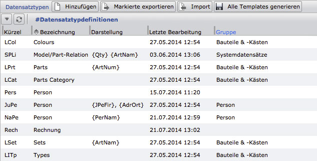
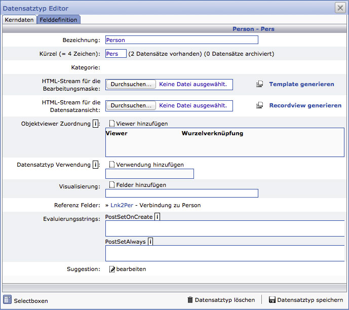
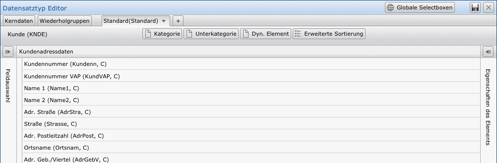
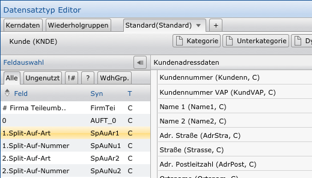
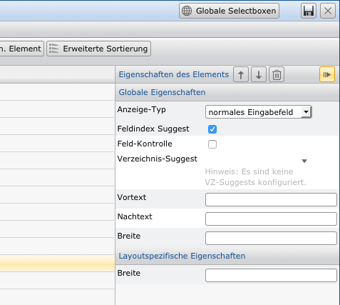

Datenbank-Schema: Felder und Datensatztypen
===========================================

Grundsätzlich arbeitet die CortexDB schemalos. Zur Ergänzung von
Datensätzen mit neuen Inhalten ist die Anlage neuer Felder daher nicht
zwingend erforderlich.

Dennoch ist dieses notwendig, wenn mit der Anwendung CortexUniplex und dem Import-Werkzeug `CortexImplex` gearbeitet wird. Denn mit diesen beiden Werkzeugen erfolgt die Bildung einer grundlegenden Struktur für spezifische Anwendungsfälle. Weiterhin erfolgt die Nutzung dieser Strukturen mit Hilfe der Standardfunktionen und der CortexUniplexAPI, so dass für Softwareentwickler die Entwicklung vereinfacht und beschleunigt wird (z.B. Konzept für Datensatzrechte).

Vorgehensweise bei Feldern
--------------------------

Die Datensätze innerhalb der Datenbank beinhalten Felder. Die Verwendung
dieser Felder erfolgt in sog. "Datensatztypen", in denen
jedes beliebige Feld verwendet werden kann. Die zur Auswahl stehenden Felder
sind im Vorfeld für die Cortex-Anwendung zu definieren. Hierzu gehören
das Anlegen der Felder und die Festlegung des Feldtyps. Dabei können Sie
zwischen unterschiedlichen Feld-Typen wählen (z.B. Text, Datum, ... ).
Dadurch unterscheidet die Cortex-Anwendung die Art der Anzeige und
Bearbeitung einzelner Felder.

Nach der Felddefinition erfolgt die Zuweisung der Felder in ein oder
mehrere Datensatztypen. Es kann sinnvoll sein, dass Sie diese im Vorfeld
skizzieren und sich so für die Verwendung der Felder entscheiden. Unter
anderem können Sie so auch die Verweise zwischen den Datensätzen
festlegen.

Beachten Sie, dass Sie ein Feld in verschiedenen Datensatztypen
verwenden können. Hierbei handelt es sich um das selbe Feld. Wird in der
Anwendung beispielsweise innerhalb dieses Feldes gesucht oder ein Index
aufgerufen, erfolgt die Anzeige aller beteiligten Datensatztypen. Bei
einigen Feldern kann dieses sinnvoll erscheinen (z.B. Postleitzahl,
Kontoverbindung u.ä. für Privatpersonen und Unternehmen); bei anderen
Feldern ist es sinnvoller separate Felder für die unterschiedlichen
Datensatztypen zu erstellen. Insbesondere beim Datenimport ist die
mehrfache Verwendung der Felder zu beachten.

Felder anlegen
--------------

Innerhalb des Menüs für die Systemeinstellungen steht der Punkt "Felder" zur Verfügung. Hierüber erreichen Sie die Liste aller bisher angelegten Datenbank-Felder. Ein Doppelklick auf einen Eintrag führt zur Bearbeitung des Feldes (auch zum Löschen). Über den Button "Hinzufügen" erfolgt die Neuanlage.

Hierbei ist zu beachten, dass die Feldkonfigurationen zuerst in die
Liste der ausstehenden Änderungen eingetragen und erst über den
Speichern-Button (oben rechts) alle Änderungen in die Datenbank
übertragen werden. Somit können Sie mehrere Felder konfigurieren und
anpassen, ohne dass laufend Änderungen in der Datenbank stattfinden.

### Feldnamen und Feldsynonyme

Der Feldname dient zur Anzeige für den Anwender und sollte möglichst
aussagekräftig gewählt werden. Bei dem Feldsynonym handelt es sich um
die interne Bezeichnung des Feldes, mit dem der Server arbeitet. Dieses
Synonym ist u.a. für den Import neuer Informationen notwendig. Wird ein
Inhalt importiert, zu dem bisher kein Feld existiert, müssen zwingend
immer Synonyme verwendet werden.

!!! Note "Hinweis"
	Da innerhalb der Datenbank die Anwendung CortexUniplex, wie auch andere Anwendungen, als sog. "php-Plugins" integriert werden, ist für diese ein Bereich von Synonymen reserviert. Daher ist es notwendig, dass eigene Feldsynonyme aus min. 3 Zeichen (max. 7 Zeichen) bestehen und nicht mit Zahlen oder Sonderzeichen beginnen.

### Feldtyp und Feldlänge

Durch den Feldtyp erfolgt die grundlegende Festlegung der Verwendung des
Feldes. Bestimmte Inhalte erfordern daher beim Import ggf. eine
Konvertierung der Inhalte. Insbesondere die Inhalte für Datumsfelder
sind zwingend beim Datenimport anzupassen. (siehe: [Import von
Datumsfeldern](/de/CortexImplex/CortexImplex-Grundlagen/#datumsfelder)).

| Feldtyp                        | Beschreibung                                   | Länge                  |
|------------------------------- | ---------------------------------------------- | ---------------------- |
| Zeichen                        | einzeiliges Textfeld; automatisch indiziert    | max. 220 Byte          |
| mehrzeiliges Textfeld          | Plain-Text ohne Index z.B. für json-Strings, einfache Texte, HTML, u.a. | max. 4 GB |
| Datum                          | für Datumsangaben (zu beachten für den Import) | 8 Byte (jjjMMtt)       |
| Zeitpunkt                      | für Zeitangaben mit Datum und Stunde:Minute    | 12 Byte (jjjjMMtthhmm) |
| positive Ganzzahl              | Zahlen ohne Nachkommastellen                   | Integer                |
| numerisch mit Nachkommastellen | Zahlen mit Nachkommastellen; die Feldlänge für als Definition der Nachkommastellen genutzt | Float |
| interne Referenz               | Über diese Felder werden die Verweise (Relationen) zwischen zwei Datensätzen hergestellt. Das Feld speichert intern entweder einen gültigen Verweis oder einen ungültigen Verweis in Form der Daten, die eingegeben (bzw. importiert)  wurden. | | 
| Datei                          | Binärfeld für Dateien jeglicher Art. Die Verwendung muss im Detail innerhalb des CortexUniplex konfiguriert werden (z.B. max. Größe, Dateiart) | |

### Subtyp

Der Subtyp wird zur Anzeige (und ggf. Prüfung) der Inhalte genutzt.
Beispielsweise können so eMail- und Web-Adresse als Link ausgegeben
werden.

### Index für Verlaufsinformationen

Eine Besonderheit der Cortex-Datenbank ist die Möglichkeit der
datumsabhängigen Speicherung von Feldinhalten, den sogenannten
„Verlaufsinformationen" eines Feldes.

Sie können vergangene, aktuelle oder künftige Werte ändern, ansehen oder
erfassen. Der aktuell gültige Wert steht grundsätzlich im Index und kann
über Portale oder die vielfältigen Suchfunktionen gefunden werden.
Vergangene und zukünftige Werte können nicht über die Suchmechanismen
gefunden werden. Sollen diese Werte gefunden werden, können diese über
die Option "Index für Verlaufsinformation" indiziert werden.

!!! note "Hinweis"
	Die Indizierung der Verlaufsinformationen hat zur Folge, dass der Speicherbedarf erheblich steigt und dass dem Endanwender möglicherweise Suchergebnisse angezeigt werden, die augenscheinlich nicht zur Suche passen, weil nur die aktuellen Werte ausgegeben werden

### Wiederholfeld

Grundsätzlich kann jedes Feld innerhalb eines Datensatzes nur einmal
genutzt werden, um eindeutige Werte abzulegen. Die Option
"Wiederholfeld" jedoch ermöglicht die mehrfache Verwendung des selben
Feldes in einem Datensatz. Beispielsweise für Telefonnummern,
Bankverbindungen, Hobbies, \....

Ergänzend dazu ermöglicht der CortexUniplex innerhalb der Datensatztypen die
Gruppierung mehrerer Wiederholfelder zu einer gemeinsamen Gruppe, den
sog. "Wiederholfeld-Gruppen". Dadurch werden mehrere Felder immer in
einer Gruppe zusammengefasst. Bspw. für Bankverbindungen, die aus dem
Banknamen, der Kontonummer, BLZ, IBAN,\... bestehen.

!!! note "Hinweis"
	Diese Felder sind beim Daten-Import entsprechend zu berücksichtigen.

### Feldbeschreibung

Mit Hilfe der Feldbeschreibung kann die Definition des Feldes genauer
erläutert werden. Gerade bei umfangreichen Datenbanken mit mehreren
hundert Feldern, die von verschiedenen Personen gepflegt werden, ist es
sehr hilfreich, wenn der Sinn des Feldes nachgelesen werden kann.

### Rückwärtsindex

Ein gültiges Verweisfeld beinhaltet immer nur die ID eines Zieldatensatzes (mit vorangestelltem @). Noch nicht aufgelöste Verweise bestehen aus dem ursprünglichen Text mit vorangestelltem Ausrufezeichen. Diese Inhalte sind daher auch in dem "Index" (der 6. Normalform) ersichtlich.

Wenn über die Verweisstruktur ("Graphen") Selektionen durchgeführt werden sollen, ist es möglich, die direkten Verweise von einem Start zu einem Ziel (S -> Z) zu verfolgen. Hierbei selektiert die Datenbank die ID des Zieldatensatzes. Um herauszufinden, welche Datensätze auf einen Datensatz verweisen (Elternverweis), muss im Index nach der eigenen ID gesucht werden. Diese ist allerdings nur vorhanden, wenn das Feld zuvor mit dem Attribut "Rückwärtsindex" versehen wurde. 

!!! info "Information"
    Grundsätzlich ist zu empfehlen, alle Verweisfelder mit dem Attribut "Rückwärtsindex" zu versehen. Erst bei der Nutzung umfangreicher Datenmengen ("big data" mit milliarden von Datensätzen) sollte seletiv bei der Vergabe dieses Attributs vorgegangen werden.

### Nachträgliche Bearbeitung eines Feldes

Wurde eine Felddefinition in die Liste der ausstehenden Änderungen
eingetragen, kann dieses auch im Nachhinein geändert werden (solange die
endgültige Speicherung nicht erfolgte). Mit einem Doppelklick auf die
entsprechende Zeile können die Parameter erneut angepasst werden.

Datensatztypen 
--------------

Die Datensätze innerhalb der Datenbank beinhalten Felder. Die Verwendung
dieser Felder wird durch sog. "Datensatztypen" definiert, von denen
jeder Typ beliebige Felder verwenden kann und sich somit von anderen
Satzarten unterscheidet. Ein Datensatztyp beschreibt daher, wie
Datensätze des gleiches Typs aufgebaut sind. Benutzer des CortexUniplex haben
daher nur die Möglichkeit, maximal die Felder zu sehen und/oder zu
ändern, die in einem solchen Datensatztyp definiert wurden. Beachten Sie
hierbei, dass die Berechtigungen aus den Feldvorlagen berücksichtigt werden.

!!! note "Hinweis"
	Mit den Datensatztypen erfolgt eine Vorstrukturierung der ansonsten schemalosen Speicherung von Datensätzen. Über die Datenintegration per ImPlex ist dennoch der Import von bisher nicht konfigurierten Feldern möglich.

Die zur Auswahl stehenden Felder sind im Vorfeld für den CortexUniplex zu
definieren. Hierzu gehören das Anlegen der Felder und die Festlegung des
Feldtyps. Dabei können Sie zwischen unterschiedlichen Feld-Typen wählen.
Diese sind für die Anzeige und Bearbeitung innerhalb des CortexUniplex
notwendig, um die unterschiedlichen Inhalte entsprechend darzustellen
(Datum, Zahlen, Text, \...).

Nach der Felddefinition erfolgt die Zuweisung der Felder in eine oder
mehrere Datensatztypen. Es kann sinnvoll sein, dass Sie diese im Vorfeld
skizzieren und sich so für die Verwendung der Felder entscheiden. Unter
anderem können Sie so auch die Verweise zwischen den Datensätzen
festlegen.

Beispiele für die vorher zu skizzierenden Datensatztypen und Felder
wären: *"Personen*", die *"Firmen*" zugeordnet werden und *"Banken*",
die in beiden Datensatztypen vorkommen können. Ebenso sind
*"Anschriften*" zu bewerten, bzw. zuzuordnen. Da die Möglichkeiten der
Verweise zwischen Datensätzen, auch "Interne Referenzen" genannt, fast
unbegrenzt sind, sollten Sie ein Datenmodell vor der Erfassung
entwerfen, um die optimale Verweisstruktur zu erkennen und dadurch
Fehler und Redundanzen bei der Erfassung zu minimieren.

Die Liste der bereits konfigurierten Datensatztypen zeigt das Kürzel für
die interne Verwaltung, die Bezeichnung, mit welchen Synonymen die
Satzart an bestimmten Stellen dargestellt wird, die letzte Bearbeitung
und ggf. die Gruppe, zu der die Satzart zugewiesen wurde.

### Genereller Konfigurationsablauf

Um einen Datensatztyp zu definieren, sind einige grundlegende
Konfigurationen notwendig. Hierbei treffen Sie auf ein
"Henne-Ei-Problem" in der Konfiguration, weil viele Einstellungen für
die Datensatztypen erst möglich sind, wenn Datensatztypen konfiguriert
wurden. Ein mehrfacher Aufruf der Datensatztyp-Konfiguration ist also
notwendig.

Innerhalb des Reiters "Kerndaten" legen Sie die Basisinformationen zu
dem Datensatztyp fest. Unter anderem die Bezeichnung, wie der
Datensatztyp einem Benutzer angezeigt wird und ein internes Kürzel
(genau 4 Zeichen). Alle weiteren Informationen können erst nach der
Speicherung des Datensatztyps und der vorherigen Konfiguration von
Suchen, Listen und Objectviewern festgelegt werden.

Mit der Standard-Suchdefinition wird festgelegt, wie im Allgemeinen
Datensätze dieses Typs gefunden werden können. Die Suche erfolgt dabei
immer anhand von Feldinhalten. Diese Festlegung der
Standard-Suchkonfiguration kann also erst festgelegt werden, nachdem
diesem Datensatztyp Felder zugewiesen  und nachdem die Suchkonfiguration
unter "Suchen" definiert wurden. Allerdings ist hierbei anzumerken, dass diese Suchdefinition insbesondere für Verweisfelder herangezogen wird. Ohne eine Standard-Suchdefinition kann kein gültiger Verweis auf einen Datensatz erfolgen.

Bei der Visualisierung verhält es sich ähnlich. Erst nachdem diesem
Datensatztyp Felder zugewiesen wurden, kann festgelegt werden, durch
welche Felder ein Datensatz dieses Typs grundsätzlich dargestellt werden
soll (z.B. bei Elternverweisen).

Genauso verhält es sich bei den Objectviewern. Auch diese können erst
zugewiesen werden, nachdem sie konfiguriert wurden.

### Basiseinrichtung

Jede Datensatzbeschreibung besteht aus den *"Kerndaten*" und
*"Felddefinitionen*". Durch die Kerndaten wird die Beschreibung eines
Datensatztyps zunächst definiert und später komplettiert. Die Kerndaten
einer Datensatzbeschreibung werden daher zu unterschiedlichen
Zeitpunkten bearbeitet und ergeben zusammen mit den zugewiesenen Feldern
die Eingabemaske und Datensatzdarstellung.

Das sog. "Template" wird generiert und ergibt die Datensatzansicht
(sog. "Recordview"). Die Generierung muss nach jeder Änderung an der
Felddefinition erfolgen und kann innerhalb des Datensatztyps oder über
alle Datensatztypen (in der Anzeige der Gesamtliste) erfolgen.

!!! note "Hinweis"
	Nach dem Import von Datensatztypen aus anderen Datenbanken oder einer Datensicherung muss zwingend das Template generiert werden. Erst danach stehen die Anpassungen in der Anwendung zur Verfügung (nach einem erneuten Login oder einer Aktualisierung).

### grundsätzlicher Ablauf

Mit den Basiswerten (Bezeichnung, Kürzel) wird im ersten Schritt der
Datensatztyp eindeutig im System definiert. Anschließend sind im Reiter
*"Felddefinition*" die zugehörigen Felder auszuwählen und zu
spezifizieren. Das heißt, die Felder werden beispielsweise einem
Anzeige-Typ zugordnet, gruppiert oder in eine sinnvolle Reihenfolge
gebracht.

Im dritten Schritt werden die weiteren Felder der Kerndaten
komplettiert. Hierzu gehören die Zuordnung von sogenannten
"Object-Viewer" (wenn vorhanden), die Spezifikation der
Datensatztyp-Verwendung und die Visualisierung von Feldern für die
Anzeige von *"Eltern-Verknüpfungen*". Für die Feldprüfung können auch
PHP-Funktionen hinterlegt werden.

### Kerndaten

Beim Hinzufügen eines neuen Datensatztyps öffnet sich der
*"Datensatztyp Editor"* mit dem Reiter *"Kerndaten"*, in dem Sie eine
Bezeichnung (frei wählbar, möglichst sinnvoll) eintragen. Diese finden
Sie nach dem Speichern in der Liste der Datensatztypen wieder. Im Feld
Kürzel geben Sie ein 4-stelliges, eindeutiges Kürzel ein. Dieses Kürzel
wird vom System zur Identifizierung der Satzart benötigt.

Anschließend speichern Sie diese Daten mit dem entsprechenden Button; es
wird ein grundlegendes Template generiert und Sie erhalten Zugriff auf
alle weiteren Kerndaten, die Sie nach der Bearbeitung in der
Felddefinition erneut bearbeiten.

### Felddefinition

Innerhalb der Felddefinition konfigurieren Sie den grundsätzlichen
Aufbau des Datensatztyps, so wie ein Datensatz dieses Typs dem Anwender
angezeigt werden soll. Diese Definition gliedert sich in Kategorien und
Felder und ggf. in Wiederholgruppen. Hierbei ist zu beachten, dass nur
Felder, die in Kategorien zugeordnet wurden, umgeordnet werden können.
Felder die der "Default Kategorie" zugeordnet wurden, sind nicht
umzuordnen.

Das hier abgebildete Beispiel zeigt einen bereits definierten
Datensatztyp mit Feldern in Kategorien und mehreren Wiederholfeldern,
die zum Teil auch gruppiert wurden.

Um ein Feld oder eine Kategorie diesem Datensatztyp hinzuzufügen,
klicken Sie in der oberen Symbolleiste auf den Punkt "Element
hinzufügen". Sie erhalten dann eine Auswahl, aus der Sie "*Feld*"
oder "*Kat.*" wählen können. Wenn Sie Felder einer bereits bestehenden
Kategorie zuordnen möchten, klicken Sie einfach auf das Symbol links
neben der Kategorie (leeres Blatt).

Aus der Feldauswahl können Sie einzelne Felder mit einem Doppelklick
übernehmen oder mehrere Felder bei gedrückter `STRG`-Taste
hintereinander auswählen und danach übernehmen. Beachten Sie hierbei,
dass die Felder in genau der Reihenfolge zu der Kategorie zugeordnet
werden, wie Sie diese angeklickt haben. Das zuerst angeklickte Feld
steht daher immer oben; das zuletzt angeklickte immer unten.

Für die nachträgliche Umsortierung können Sie je Feld die beiden Pfeile
(hoch/runter) nutzen oder die kleine "Checkbox". Wenn Sie die Checkbox
nutzen, wird auch hier die Klick-Reihenfolge genutzt, um die spätere
Sortierung festzulegen. Nachdem Sie über die Checkbox mehrere Felder
ausgewählt haben, klicken Sie das Feld an unter oder über dem Sie die
anderen Felder einsortieren möchten.

### Weitere Parameter je Feld

Anhand des Dreiecks vor jedem Feld können Sie weitere
Konfigurationseinstellungen je Feld anzeigen lassen und ändern (wenn
gewünscht). Dieses ist insbesondere notwendig, wenn Verweisfelder
genutzt werden.

Ergänzend dazu können Sie festlegen, ob es sich um ein Textfeld handelt,
in dem der Anwender beliebigen Text manuell erfassen kann, ob es sich um
eine Checkbox handelt (0 oder 1 wird dann gespeichert) oder ob es sich
um eine Selectbox handelt, aus die der Anwender nur vordefinierte
Inhalte auswählen kann. Im Falle einer Selectbox sind die möglichen
Inhalte an dieser Stelle zu definieren.

Bei Verweisfeldern ist zu definieren, wie das Ziel in der Datenbank
gefunden werden kann und welche Informationen für die Anzeige
zurückgeliefert werden. Hierfür fügen Sie einfach eine sog.
"Zielreferenz" hinzu.

Wählen Sie in dem Datensatzeditor das entsprechende Feld aus und klicken Sie dann in den Eigenschaften (rechter Bereich) das Feld für das Zielfeld an, um den Ziel-Daensatztyp zu wählen. WEnn Sie bei dem Zieldatensatztyp definiert haben, wie ein Datensatz zu finden ist (Standard-Suchdefinition), wird diese Sucheinstellung automatisch auch für das Setzen eines neuen Verweises herangezogen. Wurde keine Standard-Suchdefinition festgelegt oder wollen Sie eine andere Suchdefinition verwenden, können Sie diese in den erweiterten Eisntellungen zu diesem Verweisfeld festlegen.

Beachten Sie, dass die Zielreferenz auch für das Datenimport-Werkzeug
Corteximplex herangezogen wird, um eingelesene Informationen in gültige
Verweise umzuwandeln. Wenn über den Implex beispielsweise "Meier,
Hamburg" eingelesen wurde, muss die Suchdefinition also aus "Name, Ort" bestehen.

!!! note "Hinweis"
	Solange der Inhalt eines Verweisfeldes nicht "aufgelöst" wurde, beinhaltet das Feld den eingegebenen (oder importierten) Feldinhalt mit vorangestelltem Ausrufezeichen (z.B: "*!Meier, Hamburg*"). Wurde der Linker ausgeführt, beinhaltet das Feld den Verweis auf einen anderen Datensatz in Form eines @-Zeichens mit dahintergestellter ID des Zieldatensatzes. Erst durch die Datensatzanzeige werden die Informationen aus dem Zieldatensatz angezeigt, die wie oben beschrieben konfiguriert wurden.

Layout je Datensatztyp
----------------------

Je Datensatztyp können Sie dann ein oder mehrere Layouts definieren.
Jedes Layout besteht dabei aus einzelnen Abschnitten mit Feldern. Die
folgende Abbildung zeigt eine vorhande Konfiguration mit zugeordenten
Feldern. Links neben den Feldern ist die Leiste für die "Feldauswahl"
angeordnet, an der rechten Seite die "Eigenschaften eines Elements".
Beide Leisten können Sie über den darüber angezeigten Pfeil öffnen und
schließen.

Wenn die Feldauswahl geöffnet ist, stehen ihnen alle Felder, ale
ungenutzten Felder, Systemfelder, Reporterfelder und
Wiederholfeldgruppen in den jeweiligen Reitern zur Verfügung. Durch ein
einfaches Anklicken eines Feldes in der Feldauswahl, wird das
angeklickte Feld in das Layout übenommen. Dabei wird es unter dem
derzeitig markierten Feld eingeordnet.

Jedem eingeordneten Feld können Sie über die rechte Seitenleiste
("Eigenschaften des Elements") optionale Parameter zuweisen.
Beispielsweise sind hier Vor- und Nachtext oder eine deifinierte Breite
möglich.

Wenn Sie alle Einstellungen vorgenommen haben, speichern Sie das Layout
über das entsprechende Symbol oben rechts.

!!! note "Hinweis"
	Über den Button "Erweiterte Sortierung" können Sie sehr schnell und einfach die Felder umsortieren. Nach der Aktivierung der erweiterten Sortierung erhält jedes Feld vor der Bezeichnung eine Auswahl, die Sie anklicken können. In der Klick-Reihenfolge (wird im jeweiligen Kasten durch 1,2,\... dargestellt) können Sie die Felder neu anordenen. Wählen Sie einfach die entsprechenden Felder in der richtigen Reihenfiolge aus und klicken Sie dann auf das Feld unter dem (oder über dem) Sie die gewählten Felder einordnen möchten.
