CortexUniplex-Dashboard 
=================

Bei dem CortexUniplex-Dashboard handelt es sich um ein zusätzliches Plugin,
dass für die grafische Darstellung von Pivot-Inhalten genutzt werden
kann. Der Aufruf kann über eine separate URL erfolgen, so dass nur das
Dashboard ohne den CortexUniplex genutzt wird. Genauso können einzelne
Dashboard-Konfigurationen auch innerhalb des CortexUniplex mit Hilfe der
Funktion "Start-Tab" den Anwendern zur Verfügung gestellt werden.

Generell besteht jedes Dashboard aus einer Konfiguration von Tabs,
Datenquellen (eine Kombination aus Portalen, Listen und Pivots) und
Labels (eine Grafik oder ein Filter). In jedem Tab können mehrere
Grafiken (z.T. auch aus unterschiedlichen Quellen) eingebunden werden.
Werden Dashboards innerhalb des CortexUniplex genutzt, können über die sog.
"Starttab-Vorlagen" einzelne Tabs einem Aufruf zugewiesen werden.

Für die grafische Darstellung stehen bei dieser Funktion folgende
Diagrammtypen zur Auswahl: Linien-, Kreis-/Ring-, Säulen-Diagramme und
Tachos. Die Aufbereitung der Grafiken basiert auf der Bibliothek
["D3js"](https://github.com/mbostock/d3/wiki/Gallery) und ist daher
für künftige Entwicklungen ausbaubar. Über die CortexUniplexWebAPI
kann zudem ein bereits optimiertes Format für die Nutzung von D3js
ausgegeben werden, so dass auch andere Entwickler diese Bibliothek für
eigene Anwendungen verwenden können.

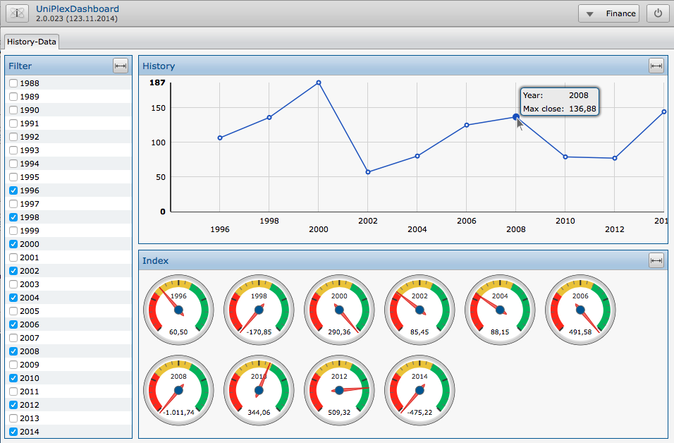

### Voraussetzungen

- konfiguriertes Portal mit Gruppen und Zeilen
- Listen, die aus den o.g. Portalen aufgerufen werden
- Pivot-Konfiguration(-en) in Listen

### Vorgehensweise

- Aufruf des Dashboard-Admin über Plugin-Button und Erstellung/Bearbeitung einer Konfiguration
- Quelle festlegen: Portal, -Bereich und -Zeile auswählen
- Pivot auswählen
- Filterfelder auswählen (Listenfelder)
- Bereiche definieren
- Labels definieren

### Hinweise

Ein Dashboard kann aus mehreren Listen/Pivots stammen; die Filter
beziehen sich immer nur auf eine Liste. Sollten Grafiken aus mehreren
Listen genutzt werden, müssten ggf. auch mehrere versch. Filter
definiert werden

### Gliederung eines Dashboards

Wie einführend bereits beschrieben, besteht eine Dashboard-Konfiguration
aus der Bezeichnung für die Konfiguration ("Name Konfiguration" im
Screenshot oben rechts), ein oder mehreren Tabs ("Tab1 Name", \...)
und mehreren Labels (Label1 bis 3 im Screenshot), von denen jedes einen
Filter oder eine Grafik beinhalten kann.

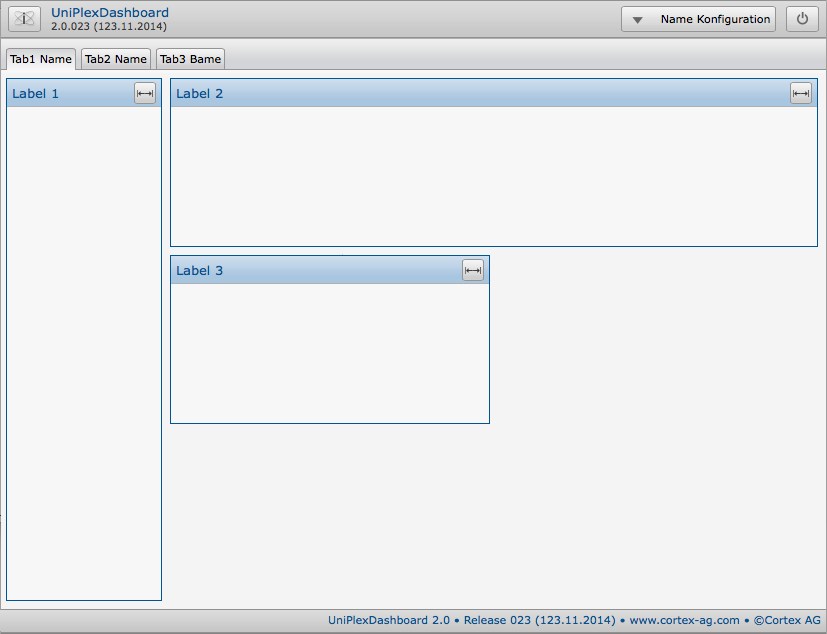

Um die verschiedenen Labels anzuordnen wird der Gesamtbereich eines Tab
in ein (virtuelles) Raster unterteilt, das aus Zeilen und Spalten
besteht (frei zu definieren). Die Zeilen werden durchnumeriert, die
Spalten werden (analog zu Tabellenkalkulationen oder dem Spiel "Schiffe
versenken") mit Buchstaben versehen. Zu jedem Label ist dann bei der
Konfiguration die Dimension manuell festzulegen. Beispielsweise kann der
Gesamtbereich in 5 Spalten zu je 3 Zeilen eingeteilt werden, in dem
"Label 1" von A1 zu A3; "Label 2" von B1 zu E1 und "Label 3" von
B2 zu C2 festgelegt werden.

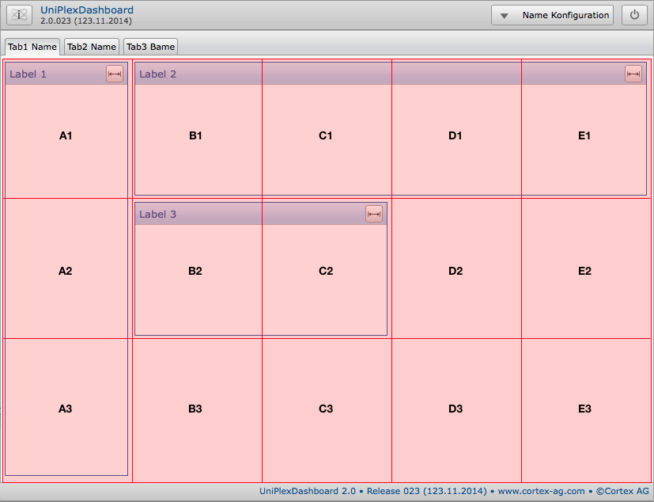

### Konfigurationsablauf

Die Konfiguration von Dashboards erfolgt über das Plugin
"Dashboard-Administrator". Wird dieses in einer Plugin-Vorlage
aktiviert und einem Benutzerkonto zugewiesen, steht der entsprechende
Button in der Schnellstart-Leiste am linken Rand zur Verfügung.

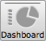

Beim ersten Aufruf besteht nur die Möglichkeit eine neue Konfiguration
zu erstellen oder zu importieren. Wird eine neue Konfiguration erstellt,
ist ein Name für das Dashboard festzulegen. Über diesen Namen erfolgt
auch die Zuweisung zu Benutzervorlagen, so dass nur bestimmte Dashboards
an ausgewählte Benutzer freigegeben werden. 

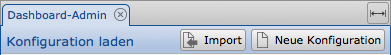

Nachdem der Name festgelegt wurde, können neue Tabs angelegt werden
(Button "Tab neu"):

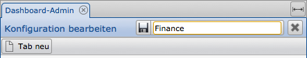

Jeder Tab erhält ebenso einen Namen, der bspw. den Inhalt beschreibt.
Ergänzend dazu wird unter "Portal wählen\..." das Portal ausgewählt,
aus dem die Selektionsergebnisse für das Dashboard stammen sollen.

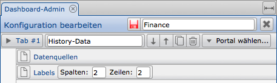

Aus dem gewählten Portal können dann ein oder mehrere Einträge als
Datenquelle ausgewählt werden. Beachten Sie hierbei, dass eine
Datenquelle auch einen Filter beinhaltet kann. Mehrere Datenquellen in
einer Konfiguration können somit nicht den selben Filter nutzen.

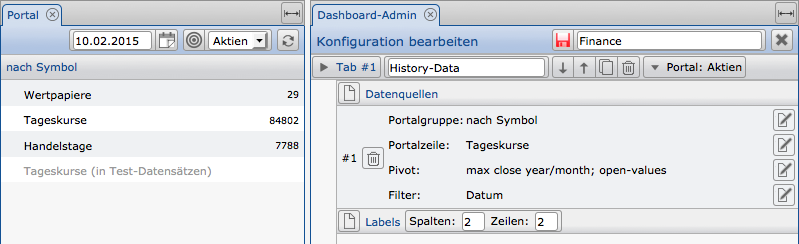

In nachfolgendem Screenshot ist ersichtlich, worauf sich die einzelnen
Festlegungen innerhalb eines Portals beziehen. Sie können jeweils aus
einem Portal eine Gruppe und eine Zeile wählen, sowie ein oder mehrere
Pivot zu der gewählten Zeile. (Der Filter kann mehrere Felder aus der
Liste beinhaltet.)

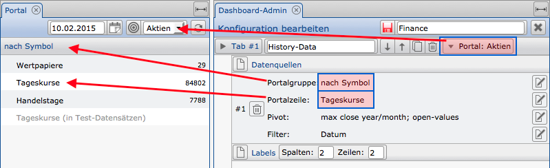

Nachdem die Datenquelle(-n) festgelegt wurden, wird der Bereich für die
einzelnen Labels (Grafiken oder Filter) konfiguriert. Hierbei legen Sie
zuerst das (virtuelle) Raster fest (Spalten, Zeilen), auf dem die
einzelnen Labels verteilt werden.

Jedes Label erhält hierbei einen Namen, die Position im Raster
(von/bis), einen Anzeigetyp (Grafik oder Filter), den Bezug auf die
Datenquelle und weitere Angaben zu der Anzeige ("Anzeigeoptionen").

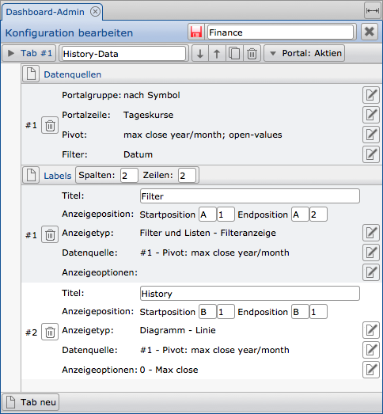

Nachfolgende Anzeigetypen stehen zur Verfügung:

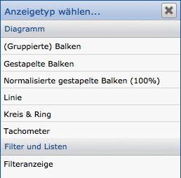

Nachfolgender Screenshot zeigt eine beispielhafte Konfiguration eines
Dashboards:

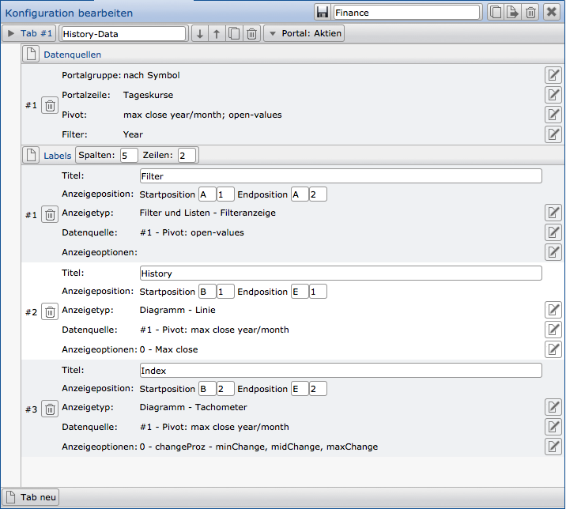 

Auf Basis des oben gezeigten Screenshots wird nachfolgendes Dashboard
erzeugt:

Anzeigeoptionen
---------------

Grundsätzlich sind die Anzeigeoptionen abhängig von dem gewählten Anzeigetyp (Art der Grafik). Einige Parameter können für alle Anzeigetypen verwendet werden. Je nach verwendetem Typ stehen daher nur die Optionen zur Verfügung, die sinnvoll eingesetzt werden können. Einige Anzeigetypen (z.B: Säulen und Linien) erlauben zudem die Anzeige von zwei Wertebereichen, so dass eine zweite Größenachse genutzt werden kann.

Genrell gilt, dass es sich bei der Rubrikenachse um die horizontale Grundlinie handelt (x-Achse, oder auch Abzissenachse). Daher stehen an dieser Stelle - neben anderen Optionen - die Labelrotation und -staffelung zur Verfügung (nur einzelen und nicht in Kombination nutzbar).

Bei den Größenachsen handelt es sich um die vertikalen Größen, die bei Linien- und Säulendiagrammen links (und/oder ggf. rechts) angezeigt werden (y-Achse oder auch Ordinatenachse).

Mit der Größenangabe bei beiden Achsen dafinieren Sie den Abstand der Achse zum Rand des Labels; mit den Gitternetzlinien die Einblendung von vertikalen oder horizontalen Hilfslinien; durch die Aktivierung der Min-/Maxwerte bestimmen Sie, ob diese Werte auf der jeweiligen Achse ausgeprägt angezeigt werden sollen.

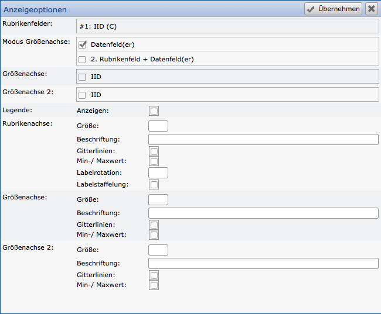

Gegenüber von Linien- oder Säulendiagrammen besitzen Kreis-/Ringdiagramme und Tachos erheblich weniger Optionen, da hier keinerlei Achsen definiert werden.

Bei den Kreis-/Ringdiagrammen ist nur die Aktivierung des Feldes notwendig, dass für die "Größenachse" herangezogen werden soll, ggf. die Aktivierung der Legende und ggf. die Angabe einer prozentualen Größe, wenn anstatt eines Kreises ein Ring gewünscht ist.

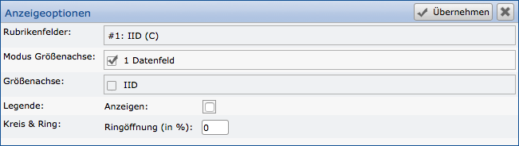

Bei einem Tacho handelt es sich um die Darstellung eines Wertes (Indikator) gegenüber einer Skala (von Minimum bis Maximum). Die Skala kann zudem in mehrere (ggf. farblich gegliederte) Abschnitte unterteilt werden. Die einzelnen Abschnitte eines Tachos müssen genauso wie der eigentliche Wert innerhalb der Pivotliste als Spalten zur Verfügung stehen, um sie in dieser Konfiguration aktivieren zu können. Sollen die einzelnen Abschnitte farblich untergliedert werden, ist die Konfiguration der Textfarbe einer Spalte in der Pivotliste notwendig. Die dort festgelegten Farben werden für die Skale herangezogen.

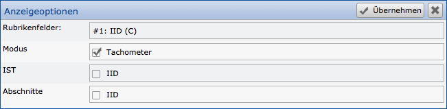
