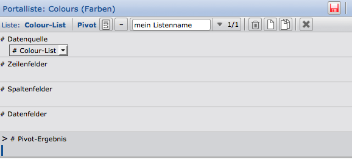

Listen
======

Innerhalb der Anwendung CortexUniplex sind Listen eine der Hauptfunktionen für
die Anwendung. Jede Ausgabe von Ergebnissen und Inhalten bedient sich
der Standard-Listenfunktion. Daher handelt es sich häufig nicht nur um
die Darstellung einfacher Listen mit Zeilen und Spalten als
Ergebnisliste für Suchen und Portale, sondern auch um unterstrukturierte
Ausgaben (Sublisten) mit
berechneten Inhalten (JavaScript in Listen), die ggf. zusätzlich als Pivot-Ausgabe ausgewertet werden.

Ergänzend dazu handelt es sich bei Listenergebnissen um die Grundlage
für die Darstellung der Daten in einem Dashboard und um die Basis für
die CortexUniplexWebAPI, damit die Informationen auch für andere Anwendungen bereitgestellt werden können.

Bei den Listen handelt es sich daher um eine der wichtigsten Funktionen,
weil von deren Konfiguration nicht nur einfache Darstellungen, sondern
auch weiterführende Funktionen abhängen.


Darüber hinaus können einfache, flache Listen (mit direkten
Verweisfeldern) als Basis für die Funktion des "Listen-Select"
herangezogen werden. Hierüber ist es möglich, innerhalb der Datenbank zu
suchen, indem die Felder in der Liste als Suchfelder genutzt werden.
Dabei werden auch Verweisfelder genutzt, um verknpüfte Inhalte zu
selektieren. Eine nähere beschreibung erhalten Sie unter dem Artikel Selektion mit Listen.

### Spalten-Funktionen in Listen 

Beachten Sie, dass innerhalb der Listen ähnliche Funktionen möglich
sind, wie sie auch in Excel verfügbar sind. So können Sie neben der
Sortierung auch eine Zusammenfassung (bei Textfeldern) oder Summierung
(bei numerischen Feldern) anzeigen lassen. Ebenso sind
Filtermöglichkeiten je Spalte möglich (analog zu Excel).

einfache Listen
---------------

Bei Listen handelt es sich um die Anzeige von Suchergebnissen,
Portalselektionen oder die Anzeige über andere Funktionsaufrufe. In der
einfachsten Form bestehen Listen aus je einer Zeile pro Datensatz, deren
Informationen spaltenorientiert angezeigt werden. Mit einem Klick auf
eine Zeile, wird der entsprechende Datensatz in der anderen
Bildschirmhälfte in die Anzeige gebracht.

Wurden in einem neuen System noch keinerlei Listen definiert, können die
selektierten Ergebnisse einfach in einer neuen, leere Liste angezeigt
werden.


Wie in der blauen Kopfzeile der Liste zu sehen ist, erfolgte die Anzeige
der leeren Liste durch den Aufruf einer Portalzeile. Beim Aufruf über
andere Funktionen wird der entsprechende Text im Reiter und der blauen
Zeile dargestellt.

Je nach Berechtigung des Benutzerkontos (festzulegen über die
Benutzervorlagen) erhält ein Anwender Zugriff auf verschiedene
Funktionen. Die Funktionsleiste einer Liste zeigt daher am rechten Rand
die Buttons zur Anzeige der Listenkonfiguration (mit den Strichen), zum
Speichern (Diskette), zum Laden (Ordner) und zum Neuladen (rotierende
Pfeile) an.

Weiterhin stehen ergänzende Funktionen über das Dreieck an der linken
Seite zur Verfügung. Insbesondere hierüber erhält ein Anwender
weitergehende Funktionen, die über die Benutzervorlagen eingeschränkt
werden können. So ist es möglich, neue Listen zu erstellen, vorhandene
zu überschreiben, Datensätze zu exportieren (csv und xml), Selektionen
zu speichern und zu laden, sowie die Liste als pdf-Datei auszugeben
(drucken).

### Konfiguration einer Liste

Handelt es sich, wie bei dem oben abgebildeten Beispiel, um eine neue,
leere Liste, können neue Felder sehr einfach hinzugefügt werden. Dafür
ist ein Datensatz anzuklicken, um diesen in die Datensatz-Anzeige zu
bekommen. Mit einem Doppelklick auf den Namen des anzuzeigenden Feldes,
wird dieses Feld in die Liste übernommen. Jedes weitere Feld, das in der
Liste angezeigt werden soll, wird ebenfalls doppelt angeklickt.


Wurden die benötigten Felder hinzugefügt, kann die Datensatzansicht
wieder geschlossen werden (über das kleine Kreuz im Reiter). Die Liste
kann dann über die Diskette in der Symbolleiste gespeichert werden.
Diese erscheint rot, sobald eine nicht-gespeicherte Änderung in der
Liste durchgeführt wurde. Wird die Liste erstmalig gespeichert erfolgt
die Abfrage eines Namens, der für die neue Liste vergeben werden muss.
Bei jedem weiteren Speichervorgang wird die Liste ohne Nachfrage
überschrieben.

Nach Fertigstellung der Listenkonfiguration werden die Datensätze in der
einfachen Liste wie im nachfolgenden Beispiel angezeigt:


### Felder manuell hinzufügen

Einzelne Felder können auch manuell innerhalb des Listenkopfes
hinzugefügt werden. Hierfür kann über einen Doppelklick in den
Kopfbereich der Liste (rot markiert) die Spaltenbearbeitung aufgerufen
werden.


Damit gelangen Sie in die Parameter-Einstellung für die Bearbeitung
einer einzelnen Spalte und können ein einzelnes Feld hinzufügen. Dafür
klicken Sie auf den Button für die Feldauswahl (rot markiert) und wählen
sich das benötigte Feld aus.


Der Spalten-Bezeichner wird hierbei aus dem Feldnamen übernommen und
kann bei Bedarf nachträglich geändert werden.

### Verlaufsinformationen 

Handelt es sich um ein Feld, das Verlaufsinformationen beinhaltet, kann
über den Parameter "Verlaufsinformation" ein festes oder relatives
Datum gesetzt werden. Relative Datumsangaben beziehen sich dabei immer
auf das Tagesdatum; in der Selectbox kann daher auch der Eintrag
"Verlaufsinformation (relatives Datum)" gewählt werden. Damit wird dem
Anwender im Listenkopf ein Datumsfeld für die Eingabe eines eigenen
Bezugsdatums angeboten.

Relative Datumsangaben können über einfache Abkürzungen eingegeben
werden. Dabei gilt für das erste Zeichen + oder -, danach folgt die
Angabe eines Wertes und dann die Dimension in Form von Tagen (t), Wochen
(w), Monaten (m), Quartalen (q) oder Jahren (j).

Beispiele:

``` 
+1t  morgen
-1t  gestern
-2w  vor zwei Wochen
-3q  vor drei Quartalen
+9t  in neun Tagen

03.05.  dritte Mai des Jahres zum angegeben Datum
        (des heutigen Datums; bzw. des Bezugsdatums)
```

Diese relativen Angaben sind in jedem Datumsfeld möglich. Sowohl in den
Listen, wie auch für die Konfiguration von Portalen oder andere
Funktionen.

!!! note "HINWEIS"
    Beachten Sie, dass die Kombination relativer Angaben mit festen Datumsangaben nicht möglich ist (z.B. dritter Mai vom letzten Jahr).

Ergänzend dazu ist es möglich, den Beginn oder das Ende einer Zeitspanne
zu definieren (z.B. Monatsende, Quartalsbeginn,..). Dieses erfolgt
einfach mit dem Anhängen von "a" (Anfang) oder "e" (Ende) hinter der
Dimension:

``` 
-2wa  Wochenanfang von vor zwei Wochen
-3qe  Quartalsende von vor drei Quartalen
-1ja  Jahresanfang des letzten Jahres
```

### Spaltenposition, Vor- und Nachtext, Verbergen 

Die Spaltenposition erlaubt die genaue Positionierung des linken
Spaltenrandes in Pixel. Gerade bei mehrzeiligen Listen können Spalten
exakt untereinander angeordnet werden.

Vor- und Nachtexte werden in jeder Zeile, in der ein Wert in der Spalte
angezeigt wird, vor oder nach dem eigentlichen Inhalt angezeigt. Damit
können beispielsweise bei reinen numerischen Werten die entsprechenden
Dimensionen ausgegeben werden (z.B. cm, °C, €, \...).

Über die Option "Verbergen" kann eine Zeile ausgeblendet werden.
Gerade wenn die Inhalte nicht angezeigt aber für die weitere
Verarbeitung über Pivot oder JavaScript herangezogen werden sollen, ist
diese Funktion hilfreich.

### Feldtyp 

Über die Festlegung des Feldtyps kann optional ein abweichender Typ des
anzuzeigenden Feldes festgelegt werden. Wurden beispielsweise
ausschließlich Zahlen in einem Textfeld gespeichert, kann nicht mit
diesen Angaben gerechnet werden und die Sortierung erfolgt alphabetisch,
anstatt numerisch. Wird der Feldtyp in der Liste entsprechend angepasst,
kann dieser Umstand umgangen werden.

Weiterhin ist die Festlegung eines Feldtyps erforderlich, wenn es sich
um eine Spalte handelt, deren Inhalte per Script berechnet werden.

### Verweisfelder

Wird ein Verweisfeld der Liste hinzugefügt, ist die Auswahl eines Feldes
aus dem Zieldatensatztyp notwendig. Der Feldinhalt des Zieldatensatzes
wird dann für die Anzeige in dieser Liste herangezogen.


Sie können wiederum auch aus dem Zieldatensatztyp ein Verweisfeld
wählen, über das erneut auf einen anderen Datensatz verwiesen wird. Auch
in diesem Fall ist wieder ein Feld aus dem Zieldatensatz zu wählen,
dessen Inhalt übernommen werden soll. Somit können Sie auch mehrstufige
Verweisketten in einer Liste nutzen und die Ketten bis zum Ende
verfolgen und Inhalte anzeigen.

### Script 

Über den Button "bearbeiten" erfolgt die Pflege eines Scriptes
(JavaScriptes) für diese Liste. Hierbei ist es unerheblich, in welcher
Spalte das Script hinterlegt wird. Ergebnisse können über den
Spaltenbezeichner direkt in anderen Spalten ausgegeben werden. Eine
detaillierte Erläuterung finden Sie in dem Abschnitt "JavaScript in Listen".

Sublisten 
---------

Für die untergliederte Darstellung weiterer Informationen, die aus einem
Datensatz oder aus verknüpften Datensätzen stammen, können Sublisten
genutzt werden. Hierbei wird die Zeile eines Datensatzes um weitere
Zeilen ergänzt, deren Inhalte aus demselben Datensatz oder aus anderen
Datensätzen stammen können. Dadurch ist die einfache Darstellung
vernetzter Strukturen möglich, so wie sie auch in anderen Systemen
ausgegeben werden.


Jede Subliste kann wiederum andere Sublisten enthalten. Bei
der Nutzung können Sie sowohl auf die einfache Verknüpfung (wohin
verweist dieser Datensatz), als auch auf die sog. Elternverknüpfung
(welcher andere verweist auf diesen Datensatz) zurückgreifen. In dem
nebenstehenden Beispiel werden mit dieser Funktion einzelne Bauteile zu
einem Baukasten angezeigt. Würden die Bauteile wiederum auf eine
Unterstruktur verweisen, könnte diese über eine weitere Subliste
eingeblendet werden.

### Konfiguration von Sublisten

Um Sublisten zu konfigurieren, öffnen Sie die Zeilenübersicht mit dem
entsprechenden Button in der Kopfzeile der Liste. Damit erhalten Sie
Zugriff auf die weiteren Funktionen je Zeile.

Beachten Sie, dass der Button zum Öffnen der Zeilenübersicht
unterschiedlich dargestellt wird und daher vom Bearbeitungsmodus der
Liste abhängt.


Ein Strich wird angezeigt, wenn die Zeilenübersicht
geschlossen ist, mehrere Striche, wenn die Spaltenüberschriften
angezeigt werden und die "halbierten Striche", wenn die komplette
Zeilenkonfiguration angezeigt wird. Sie können daher zwischen der
kompletten Anzeige, den Spaltenüberschriften und der Anzeige ohne
Spaltenüberschriften hin und her schalten.

!!! note "Hinweis"
	Der jeweilige Modus der Liste wird beim Speichern der Liste mitgespeichert.


Wenn Sie die Zeilenübersicht geöffnet haben, stehen Ihnen je Liste und
Subliste verschiedene Funktionen zur Verfügung. Sie können eine neue
Zeile je Datensatz hinzufügen oder entfernen ("1" und "2") und neue
Sublisten hinzufügen ("3") und deren Parameter einstellen ("4").
Jede Subliste mit den jeweiligen darunterliegenden Sublisten können Sie
über den Löschen-Button am rechten Rand ("Papierkorb") wieder löschen.

### Sublisten-Parameter


Über die Parameter einer Subliste vergeben Sie den Namen
("Titel") und wählen dann die Verknüpfungsart aus. Hierbei können Sie
zwischen Eltern- und einfacher Verknüpfung wählen, Sie können aber auch
eine Subliste auf Basis von Wiederholfeldgruppen erstellen. Ergänzend
dazu können auch Datensätze in Sublisten angezeigt werden, in denen ein
bestimmter Feldinhalt mit dem Inhalt des gleichen Feldes aus dem
aktuellen Datensatz übereinstimmt (sog. "Feldinhalt-Verknüpfung.").

Zu den beiden letzten Optionen (Wieder­holfelder und Feldinhalt) werden
Ihnen ggf. weitere Punkte für die Konfiguration angezeigt.

Um nur bestimmte Datensätze innerhalb der Subliste anzuzeigen, können
Sie zudem einen Filter setzen. Hierüber ist eine beliebige
Feldkombinationen selektierbar.

Selbstverständlich ist auch hier das Format (der "Stil") der
angezeigten Inhalte konfigurierbar.

### Darstellung rekursiver Strukturen

Innerhalb einer Datenbank verweisen Datensätze untereinander auf andere
Datensätze. Beispielsweise können Bauteile auf einen Baukasten
verweisen. Werden solche Verweise zwischen den gleichen Satzarten
gesetzt (z.B. Person auf Person auf Person \....) spricht man von
„Rekursion".


Um Rekursionen innerhalb von Sublisten darzustellen wird
daher eine Option benötigt, da sonst für jeden Verweis eine Subliste
erstellt werden müsste. Hierfür steht Ihnen neben dem Auswahlfeld zur
Sublistenart das entsprechende Feld zum Anhaken zur Verfügung. Durch
diese Aktivierung wird dieser Schritt minimiert und automatisch
durchgeführt.

!!! note "Hinweis"
	Damit Sie mit einem Doppelklick aus einer Datensatzansicht Felder in einer Subliste oder andere Zeile hinzufügen können, müssen Sie die jeweilige Zeile als "aktive Zeile" auswählen. Dieses geschieht mit dem Klick auf das Kreis-Symbol vor der Zeile. Nach dem Klick ist dieser gefüllt.

Pivot-Tabellen 
--------------

Bei Pivot-Tabellen handelt es sich um eine Darstellung zur Auswertung
von Informationen auf Basis einer Liste. Jede Liste kann zudem mehrere
Pivot-Tabellen besitzen, zwischen denen Sie umschalten können. Wird eine
Liste gespeichert, werden auch die dazugehärenden Pivot-Darstellungen
gepsiechert.

Für die Pivot-Darstellung wird auf eine sogenannte Kreuz-Tabelle
zurückgegriffen, die über Zeilen und Spalten die Informationen gruppiert
und im Kreuzungspunkt (dem Ergebnisfeld) Berechnungen durchführen kann
(z.B. Anzahl, Summe, Durchschnitt,
...).


Die hier abgebildete Tabelle zeigt die Anzahl der Verkäufe nach Produkt
und Geschlecht gruppiert. Die Felder werden somit unterteilt nach
Zeilen-, Spalten und Ergebnisfeldern. In den Ergebnisfeldern wird dann
die Anzahl ermittelt.

Eine solche (und auch detailliertere) Auswertung ist mit Hilfe der
Pivot-Tabellen innerhalb des CortexUniplex möglich. Dadurch kann direkt auf
die aktuellen Daten innerhalb der Datenbank zurückgegriffen werden und
der Export an andere Systeme wird minimiert.

Als Grundlage für eine solche Pivot-Auswertung wird auf eine einfache,
einzeilige Liste zurückgegriffen. Alle Informationen, die Sie in der
Pivot-Tabelle nutzen möchten, müssen daher in einer Zeile der Liste
angeordnet sein. Hierbei können Sie sowohl Informationen aus den
Datensätzen nutzen, wie auch berechnete Felder.

### Vorgehensweise

Über das Listen-Menü (Dreieck-Button oben links in der Listenansicht)
gelangen Sie mit dem Eintrag „Pivot-Ansicht öffnen" in die Pivot-Liste
(bzw. Bearbeitung). Grundsätzlich wird die Tabelle leer geöffnet, so
dass Sie die Berechnung immer manuell starten müssen. Wenn Sie die
Pivot-Ansicht zum ersten Mal aus einer Liste öffnen, sind zudem die
Spalten-, Zeilen- und Ergebnisfelder zu konfigurieren.


P1: Aufgerufene Funktion (darunter Listenname)

P2: Einstellungen anzeigen

P3: neue Liste erstellen

P4: Pivot schließen und zurück zur Ausgangsliste

Beim Öffnen der Pivot-Ansicht wird Ihnen grundsätzlich die gespeicherte
Ansicht angezeigt. Wenn zu der Listendarstellung keine Pivot-Ansicht
konfiguriert wurde, sind die Pivot-Überschriften leer. Davon ausgehend
können Sie mit den abgebildeten Funktionen eine neue Konfiguration
erstellen.

Klicken Sie den Button "P2", um die Überschriften einzublenden und dann
"P3", um eine neue Konfiguration zu erstellen. Hier werden Ihnen dann
drei Zeilen angezeigt, zu denen Sie die gewünschten Felder zuweisen
können. Wie bereits bei den einfachen Listen und Sublisten können Sie
mit einem Doppelklick neue Felder zu einer Zeile hinzufügen. Sie wählen
hier die Quellspalte und vergeben ggf. einen neuen Titel.



Wenn Sie die gewünschten Felder und Funktionen definiert haben, werden
diese in den Überschriften angezeigt. Mit einem Klick auf das Symbol des
Taschenrechners in der Symbolleiste werden die Ergebnisse berechnet und
angezeigt. Beachten Sie, dass für die Datenfelder unterschiedliche
Funktionen für die Ergebnisermittlung bereitstehen. Darüber können Sie
die Anzahl und Anzahl verschiedener Inhalte, die Summe, das Minimum und
Maximum, sowie den Mittelwert errechnen.

Die nachfolgende Abbildung zeigt mit farbigen Markierungen, an welcher
Stelle die Informationen aus den Überschriften (Konfiguration) angezeigt
werden:


Über das Symbol mit dem Strich (links neben dem Pivot-Namen "mein
Listenname") können Sie die Konfiguration ausblenden, so dass nur noch
die eigentlich Pivot-Tabelle angezeigt wird.

Wie bei der Ausgangsliste kann auch hier über den Speichern-Button die
komplette Liste mit den konfigurierten Pivot-Tabellen gespeichert
werden.

!!! note "Hinweis"
	Sie können zu jeder Liste mehrere Pivot-Tabellen konfigurieren. Daher sollte jeweils ein sinnvoller Name verwendet werden.

**Speichern der Pivot:**

Um die Pivot-Konfigurationen zu speichern, verlassen Sie die
Pivotansicht über das Kreuz in der Symbolleiste, um zurück in die
Listenansicht zu gelangen. Dort speichern Sie die Liste erneut über das
Speichern-Symbol in der Symbolleiste oder den "Liste
speichern"-Eintrag im Menü. Damit sind dann auch die dazugehörenden
Pivot-Konfigurationen gespeichert.

### Feldbearbeitung

Beim Neuanlegen oder mit einem Doppelklick auf einen vorhandenen
Feldnamen (Zeilenfelder, Spaltenfelder und Datenfelder) gelangen Sie in
die Feldbearbeitung. Hierüber ist es möglich, wie bei Listenfeldern, die
Eigenschaften des Feldinhaltes anzupassen. Wenn Sie das Häkchen bei
"Stil der aktuellen Liste verwenden" entfernen, können Sie die
verschiedenen Optionen verändern.


### Tabellarische Ansicht

Wenn Sie für die Konfiguration die Zeilenübersicht eingeblendet haben
(der obere, graue Bereich), können Sie zwischen den Ansichten
"Tabelle" und "Gliederung" umschalten. Die tabellarische Ansicht
zeigt dabei die Zeilenfelder je Zeile nebeneinander an. Danach folgen
die Datenfelder je Spalte.


!!! note "Hinweis"
	Nur auf Basis der tabellarischen Ansicht können Dashboards konfiguriert werden.

### gegliederte Ansicht

Über die Ansicht "Gliederung" erfolgt eine Gruppierung der Werte je
Zeilenfeld. Zu jeder Gruppe werden dann die Gesamtergebnisse ausgegeben.
Sie können so auch mehrfache Untergliederungen konfigurieren.


### gegliederte Ansicht mit Spaltenfeldern

Auch in der gegliederten Ansicht ist es möglich, dass Sie Spaltenfelder
angeben. Die Ausgabe zeigt dann die untergeliederten Ergebnisse in den
jeweiligen Spalten und gibt zudem die Gesamtergebnisse je Zeile und
(ganz unten) auch je Spalte aus (in dem gezeigten Bild nicht
ersichtlich).


Die verschiedenen Ansichten werden gespeichert und können somit auch
direkt aufgerufen werden (z.B. über einen Portalaufruf).

JavaScript in Listen
--------------------

Mit Hilfe der Anwendung CortexUniplex auf Basis der CortexDB sind Sie in der Lage, beliebige Selektionen innerhalb Ihres Datenbestandes durchzuführen und in Form von Listen auszugeben. Die Listenfunktionen bieten Ihnen zudem die Möglichkeit, sog. Sublisten darzustellen, so dass auch rekursive Strukturen abgebildet werden können. Ergänzend dazu sind weitergehende Pivot-Auswertungen und damit verbundene, grafische Darstellungen möglich.

Als Ergänzung und für dynamische Berechnungen zur Laufzeit dienen berechnete Inhalte einer Liste. Das Ergebnis wird hierbei beim Anzeigen der Liste erzeugt und steht nur dort zur Verfügung. Es werden daher keinerlei Datensätze geändert und die berechneten Ergebnisse können somit auch nicht über eine Suche oder eine andere Selektionsart gefunden werden. Die weiterführenden Listen-Funktionen, wie die Pivot-Darstellung und die grafische Auswertung, sind dennoch mit diesen berechneten Feldern möglich. Dadurch können dynamische Berechnungen auf Basis von Listeninhalten durchgeführt und über verschiedene Methoden dargestellt werden.

Mit Hilfe des Import-Werkzeugs ImPlex ist es zudem möglich, dass (bestimmte) berechnete Inhalte in die Datenbank geschrieben werden. Vorhandene Informationen werden somit ergänzt oder geändert und können dann über die Standardmechanismen selektiert und ausgewertet werden.

!!! note "Hinweis"
	Die JavaScript-Funktionalität zur Ermittlung von Listeninhalten wird serverseitig ausgeführt, so dass nur das Ergebnis zurückgegeben wird. Dafür wurde die Bibliothek "V8" von Google in der HTTP-Schnittstelle implementiert. Diese muss daher als Datei im Serververzeichnis (und ggf. im HTTP-Server-Verzeichnis) zur Verfügung stehen. Unter Windows ist die Datei "ctxv8.dll" und unter Linux-Systemen "ctxv8.so" notwendig.

### Voraussetzungen

Neben der o.g. Bibliothek "V8" ist zu prüfen, ob die Listen automatisch die hinterlegten Scripte ausführen. Dieses ist in der `ctxserver.ini` in einem separaten Block zu aktivieren:

    [UNIPLEX]
    EnableApiList=1

Wurde der Server mit diesem Parameter gestartet und die V8-Bibliothek im Server-Verzeichnis hinterlegt, ist innerhalb der Anwendung CortexUniplex in jeder Liste zu erkennen, ob JavaScripte serverseitig ausgeführt werden. An der rechten Seite in der Fußzeile einer Liste wird die serverseitige Ausführung von JavaScript aktiviert/deaktiviert. Ist der o.g. Eintrag in der ini-Datei enthalten, ist der Haken immer gesetzt.

 

### Vorgehensweise

Die generelle Vorgehensweise für die erste und grundlegende Einrichtung einer berechneten Liste gliedert sich in drei Schritte:

1.  Listendefinition
2.  Konfiguration der berechneten Felder
3.  Speichern und bereitstellen der Liste

Beachten Sie, dass ein Anwender innerhalb der Liste nur die Spaltenüberschriften sieht und möglicherweise keinerlei Kenntnisse über die berechneten Inhalte besitzt. Daher sollten Sie zum Einen die Funktionen, die Sie zur Berechnung heranziehen, separat in einer Textdatei als Backup speichern. Zum Anderen sollten die Anwender mit Berechtigungen für die Listenbearbeitung darüber informiert werden, dass bei einer Listenänderung ggf. Funktionen für die Berechnung von Inhalten beeinflusst werden können.

Generell gilt, dass innerhalb der Listendarstellung nicht ersichtlich ist, bei welchem Feld es sich um Datensatzfelder oder um berechnete Felder handelt. Über die Formatierung der Spalten können Sie daher ein anderes Textformat für die Anzeige der Ergebnisse wählen (z.B. eine andere Farbe). Dadurch wird den Anwendern die Interpretation der Anzeige vereinfacht.

### JavaScript editieren


Je Spalte einer Liste kann über die Spalten-Konfiguration ein JavaScript hinterlegt werden. Dafür steht der Button "bearbeiten" in der Zeile "Script" zur Verfügung.

Hierüber wird das Bearbeitungs-Fenster für JavaScript geöffnet, in dem ein Script hinterlegt werden kann. Beispielhaft zeigt nachfolgende Abbildung die Bearbeitung:


Über die Option "Script ausführen" kann festgelegt werden, zu welchem Zeitpunkt das enthaltene Script ausgeführt werden soll. Zur Auswahl stehen hier "vor der Sortierung" und "nach der Sortierung". Je nach Aufgabenstellung ist der Ausführungszeitpunkt somit relevant.

JavaScript-Einführung 
---------------------

Über ergänzende Literatur, sowie weitere Webseiten ist das Erlernen von
JavaScript sehr einfach. Dennoch werden hier zur Hilfestellung einige
Hinweise gegeben. Für einen schnellen Einstieg eignet sich auch die
Online-Hilfe von [Selfhtml](http://de.selfhtml.org/javascript/sprache/index.htm).


### Kommentare in JavaScript

Innerhalb eines Scriptes können Sie Kommentare erstellen, um Ihr Script
lesbar und verständlich zu beschreiben

``` 
// zwei Schrägstriche kommentieren die komplette Zeile

/*
  Ein Schrägstrich und ein Stern leiten einen Kommentar über mehrere Zeilen ein.
  Um den Kommentar wieder aufzuheben,
  ist ein Stern und Schrägstrich notwendig.
*/
```

### Zahlen in JavaScript

Wird mit Zahlen gearbeitet, so sind diese mit einem Punkt als
Dezimaltrenner zu nutzen.

``` 
var pi = 3.1415;
```

Beachten Sie, dass bei Divisionen sog float-Werte (Fließkommazahlen)
entstehen können und das Ergebnis des Dezimal-Bruchs sehr klein sein
kann. Eine Prüfung, ob eine bestimmte Rechnung Null ergibt, ist daher
ggf. erst dann sinnvoll möglich, wenn das Ergebnis zuvor gerundet wurde.


### Variablen

Werte können in sog. "Variablen" zwischengespeichert werden, um sie
für die weitergehende Verarbeitung zu nutzen. Gerade bei errechneten
Ergebnissen können diese wiederverwendet werden, ohne die Berechnung
erneut zu durchlaufen. Um eine Variable zu verwenden ist ein sinnvoller
Name zu vergeben und diesem ein Wert zuzuweisen. Variablen werden zudem
mit dem vorangestellten Begriff "var", "let" oder "const" deklariert (nähere Beschreibungen dazu entnehmen Sie bitte der gängigen JavaScript-Literatur).

!!! example "Beispiel"
```
	let iNumber = 42;  
	let iSqrRoot = Zahl * Zahl;
```

### Vergleichsoperatoren

Um Werte miteinander vergleichen zu können, stehen nachfolgende
Operatoren zur Verfügung.

    a == b    a ist gleich b
    a != b    a ist nicht gleich b
    a >= b    a ist größer oder gleich b
    a > b     a ist größer als b
    a < b     a ist kleiner als b
    a <= b    a ist kleiner oder gleich b

    (a > 0) || (b < 0)    a ist größer als 0 ODER b kleiner als 0
    (a > 0) && (b < 0)    a ist größer als 0 UND b kleiner als 0

### Berechnungsoperatoren

Um Werte miteinander zu verrechnen, stehen die üblichen, mathematischen
Verfahren zur Verfügung (die Regel "Punkt vor Strich" ist auch hier zu
beachten).

    a + b    a plus b (Addition)
    a - b    a minus b (Subtraktion)
    a * b    a mal b (Multiplikation)
    a / b    a geteilt durch b (Division)
    a % b    a modulo b (Restwert-Berechnung;
                        z.B. 2012 % 4 = 0 -> 2012 war ein Schaltjahr)

!!! note "Hinweis"
	Wenn Sie mehrere Texte mit + "addieren", werden die Texte einfach hintereinander gehängt. Insbesondere wenn innerhalb der Anwendung CortexUniplex in Listen bestimmte Spalten gelesen werden, die als Text und nicht als Zahl formatiert wurden, erhalten Sie entsprechende Ergebnisse.

!!! example "Beispiel"
```
	let sLastName = 'Dent';  
	let sFirstname = 'Arthur';  
	let sName = sFirstname + sLastName; // => ArthurDent
```

### bedingte Anweisungen

In Abhängigkeit von bestimmten Werten können Ergebnisse unterschiedlich
bestimmt oder das Script anders ausgeführt werden. Hierfür eigenen sich
die sog. "wenn-dann"-Bedingungen oder die Fallunterscheidungen mit
"switch".

 

!!! example "Beispiel 1"
```
	let sUserStatus = 'poor';  
	if (iBalance > 1000) {  
	    sUserStatus = 'wealthy;  
	}
```

!!! example "Beispiel 2 - if-else-Bedingung"
```
	let sUserStatus = 'poor';
	if (iBalance > 1000) {
	    userStatus = "wealthy";  
	} else {  
	    userStatus = "still poor";  
	}
```

!!! example "Beispiel 3 - switch-Fallunterscheidung"
```
	let iGrade = 3;
	switch (iGrade) {
		case "1":
			status = "A";
			break;
		case "2":
			status = "B";
			break;
		case "3":
			status = "C";
			break;
		case "4":
			status = "D";
			break;
		case "5":
			status = "E";
			break;
		case "6":
			status = "F";
			break;
		default:
			status = "unkown";
			break;
	}
```

### Schleifen

Mit Hilfe von Schleifen können Anweisungen so lange wiederholt werden,
bis eine bestimmte Bedingung zutrifft.

!!! note "Hinweis":
	Tritt eine Bedingung niemals ein, so spricht man von einer Endlos-Schleife. Dieses muss vermieden werden. Daher werden häufig ergänzende Abbruchbedingungen eingebaut, damit so etwas nicht auftritt (z.B. mit Hilfe von "if-else" und der Anweisung "break", die die Ausführung unterbricht).

#### Schleifen mit "while"

Die while-Schleife wiederholt so lange die eingeschlossenen Anweisungen, bis die zuvor bestimmte Abbruch-Bedingung eintritt. Wurde die Bedinung bereits zuvor erfüllt, wird die Schleife nicht durchlaufen.

!!! example "Beispiel - while-Schleifen"
``` 
status = "poor";
let myMoney = 0;
while(myMoney < 1000000) {
	myMoney += 1;  // add 1 to myMoney
}
status = "Your are millionaire";
``` 

#### Schleifen mit "do-while"

Als eine andere Form der while-Schleife gilt die "do-while"-Schleife.
Diese Schleife wird mindestens einmal durchlaufen, weil erst am Ende die
Bedingung geprüft wird.

!!! example "Beispiel - do-Schleifen"
``` 
status = "poor";
let myMoney = 0;
do {
	myMoney += 1;
} while (myMoney < 1000000);
status = "Your are millionaire";
```

#### Schleifen mit "for"

Mit for-Schleifen werden Zähler bis zu einem definierten Stand
durchlaufen. Das nachfolgende Beispiel zählt eine Variable so lange um
eins hoch, bis ein bestimmter Stand erreicht wurde:

!!! example "Beispiel - for-Schleifen"
``` 
for (var myMoney = 0; myMoney < 1000000; myMoney++) {
  status = "poor";
}
status = "Your are millionaire";
```
