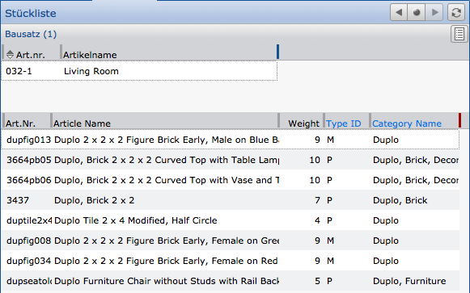
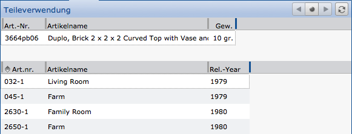
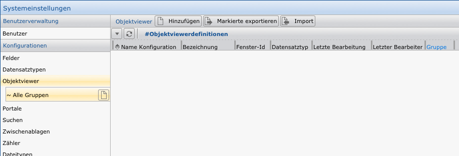
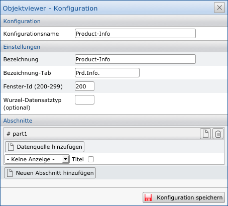
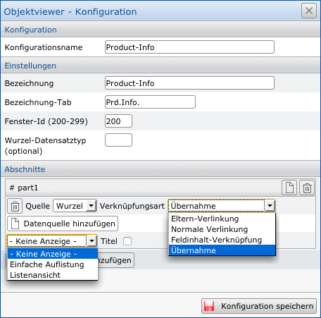
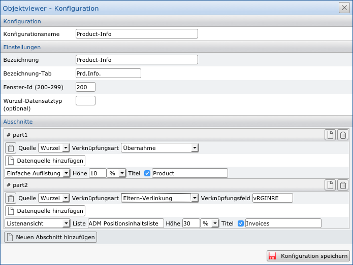

Objektansicht (objectviewer)
============================

Eine unterschätzte, aber auch sehr einfache und mächtige Funktion der
Anwendung CortexUniplex ist die sog. "Objektansicht". Ausgehend von einem
Datensatz ermöglicht diese Funktion die kompakte Anzeige vernetzter
Informationen zu dem gewählten Datensatz. Art, Umfang und
Selektionstiefe werden über die Konfiguration der Objektansicht und den
genutzten Listen definiert. Hierbei gelten alle gesetzten
Benutzerberechtigungen und die Funktionsberechtigungen, so dass nicht
jeder Benutzer alle Datenfelder und/oder alle Objektansichten sehen und
nutzen kann.

### Beispiele:

Mit Hilfe dieser Funktionen ist es beispielsweise möglich, dass
ausgehend von einer Baugruppe, einem Bausatz oder einem kompletten
Fertigartikel alle genutzten Einzelteile aufgelistet werden. Es wird
daher eine Stückliste erzeugt.

Die Nutzung dieser Objektansicht als neue "Navigation" zum Aufrufen
der angezeigten Datensätze (z.B. Bausatz oder Einzelteil) ist zudem
möglich.

Wird ein Einzelteil ausgewählt, ist dort wiederum der
Aufruf der dazugehörenden Objektansicht möglich. In diesem Fall handelt
es sich dann beispielsweise um die sog. Teileverwendung. Ausgehend von
einem Einzelteil ist also ersichtlich, wo dieses Teil genutzt wird.

Weitere Anwendungsfälle wären beispielsweise Kundeninformationen
(Kundenstammblatt) oder die Darstellung sozialer Netzwerke.

Überall dort, wo vernetzte Strukturen dargestellt werden können, ist
möglicherweise der Einsatz einer Objektansicht sinnvoll.

Der Aufruf dieser Funktion erfolgt innerhalb eines
Datensatzes über den entsprechenden Button (siehe nebenstehenden
Screenshot). Wurden mehrere Objektansichten für einen Datensatztyp
definiert, werden diese untereinander angezeigt. Beachten Sie hierbei,
dass die Berechtigungen in den Benutzervorlagen entsprechend für die
konfigurierten Objektansichten gesetzt werden müssen.

Objektansicht - Konfiguration
-----------------------------

Wie alle anderen Konfigurationen lassen sich auch Objektansichten (objectviewer) in den Systemeinstellungen konfigurieren. Klicken Sie dazu einfach in dem Menü auf "*Objectviewer*", um in die Auswahl der vorhandenen Konfigurationen zu gelangen oder um auch neue anzulegen. In dieser Auflistung können Sie neue Konfigurationen hinzufügen, exportieren oder importieren.

Um einen neuen Objectviewer anzulegen, klicken Sie auf `Hinzufügen`.  Es öffnet sich dann der Dialog zur Durchführung der Konfiguration.

Hier vergeben Sie einen Namen für die Konfiguration, der in der oben gezeigten Auflistung aller Objectviewer verwendet wird.

Weiterhin ist eine Bezeichnung notwendig und eine Bezeichnung für den Tab, wenn der Objectviewer angezeigt wird.

Anhand der Fenster-ID vergeben Sie eine Art "Priorität" für den Tab des Objectviewers. Tabs mit gleicher ID ersetzen sich gegenseitig, unterschiedliche Tab-IDs können parallel geöffnet werden.

Objectviewer können auch von anderen Datensatztypen ausgehen, als der aktuell ausgewählt.

Beispiel:

Folgendes Datenmodell liegt vor: Personen <- Projekte <- Tätigkeiten (Tätigkeiten können auf Projekte verweisen, die wiederum auf Personen verweisen können). Wird ein Objectviewer nun ausgehend von einer Tätigkeit aufgerufen, kann als Wurzel das übergeordnete Projekt herangezogen werden. Daher kann es (in seltenen Fällen) sinnvoll sein, einen optionalen Wurzel-Datensatztyp festzulegen. Dieser wird über das entsprechende Feld ausgewählt.

Wurden die grundlegenden Einstellungen festgelegt, folgt die Konfiguration einzelner Abschnitte. Jeder Abschnitt kann dabei eine Liste beinhalten (eine einfache Systemliste oder zuvor definierte Liste), um Informationen der selektierten Datensätze anzuzeigen.

Um zu einem Ergebnis zu gelangen, ist zuvor die Auswahl der sog. "Datenquelle" notwendig. In der hier gezeigten Abbildung greift der erste Abschnitt auf die Wurzel zurück (in diesem Fall immer der ausgewählte Datensatz).

Über die Verknüpfungsart wird definiert, wie die Information selektiert wird. Mit "Übernahme" werden Informationen aus dem selektierten Datensatz gewählt. "Eltern-Verknüpfung" selektiert die Datensätze, die auf die Quelle verweisen; über die "Normale Verlinkung" zeigt die Quelle auf andere Datensätze; die "Feldinhalt-Verknüpfung" ist ein impliziter Verweis anhand gleicher Feldinhalte in unterschiedlichen (selten auch gleichen) Feldern.

Sie können dann wählen, ob die Ergebnisse angezeigt werden sollen (über eine einfache Auflistung oder Liostenansicht) oder ob keine Anzeige erfolgt. In diesem Fall dienen die selektierten Datensätze dann nur als weitere Quelle für einen darauffolgenden Abschnitt.

Optional können Sie dann jedem Abschnitt noch einen Titel und eine Größe zuweisen. Die Größenangabe dient hierbei nur als Richtwert in Prozent. Der Objectviewer nutzt Ihre Angabe als Schlüssel zur Verteilung des Platzes. Wenn Sie also beispielsweise zwei Abschnitt definieren und einem 10% zuweisen und dem anderen 5%, dann wird der verfügbare Platz im Verhältnis 2:1 aufgeteilt.

Beispielhaft kann ein Objectviewer wie nachfolgend abgebildet konfiguriert werden. Beachten Sie, dass jeder Abschnitt auf jede beliebige Quelle zurückgreifen kann. Das können andere Abschnitte, wie auch die ursprüngliche Wurzel sein.

!!! note "Hinweis"
	Je nach komplexität des Datenmodells und der zuvor konfigurierten Listen können auch Objectviewer eine umfangreiche Komplexität erreichen. Beachten Sie daher den zur Verfügung stehenden Platz und beschränken Sie sich auf die notwendigen Angaben und Listenkonfigurationen.

Nachdem Sie einen Objectviewer konfiguriert haben. Wählen Sie in den Systemeinstellungen den Datensatztyp aus, dem Sie den Objectviewer zuweisen wollen. In den Hauptinformationen zu dem Datensatztyp können Sie dann einen oder mehrere Objectviewer zuweisen.
