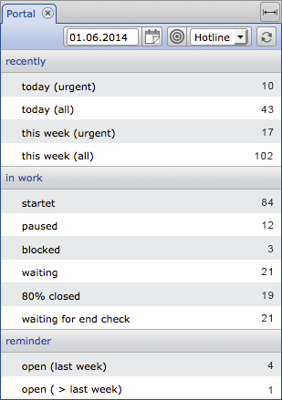
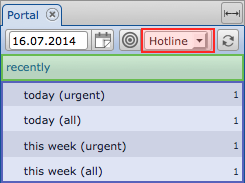
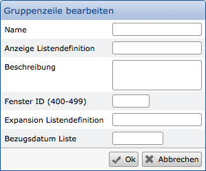
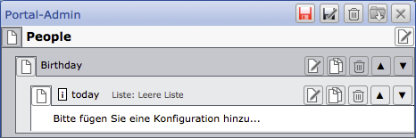
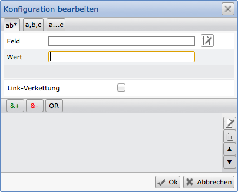
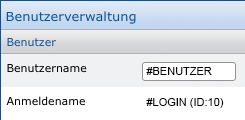

Portale
=======

In einer CortexDB stehen beliebige Informationen für verschiedene
Arbeitsprozesse zur Verfügung. Für Selektionen und Auswertungen sind
diese über unterschiedliche Methoden zugänglich. Eine dieser
Möglichkeiten ist das sog. "Portal". Damit werden Anwendern
vordefinierte Selektionen zur Verfügung gestellt, die sich in Gruppen
und Untergruppen untergliedern.



Diese Funktion dient u.a. für regelmäßig wiederkehrende
Selektionen, kann aber auch für die Abbildung von Arbeitsprozessen
("workflows") genutzt werden. Da sich Datensätze im Laufe der Zeit
ändern und unterschiedliche Zustände annehmen können, durchlaufen diese
auch in einem Portal die verschiedenen Selektionen. Beispielsweise
werden so Aufgaben verwaltet und den verschiedenen Mitarbeitern
zugeteilt.

Das hier abgebildete Beispiel zeigt die einfache Selektion für die
Bearbeitung in einer Hotline. Aufgelaufene Meldungen werden entsprechend
selektiert und mit einem Klick auf die Zeile in einer Liste dargestellt.
Wird eine Meldung bearbeitet und erhält dadurch einen neuen Status,
ändern sich die hier im Portal angezeigten Werte.

Anhand des Berechtigungssystems sind zudem nur die erlaubten Portale
zugänglich. In der Praxis wirkt sich das beispielsweise in einer
Vertriebs-Hierarchie aus: Dem Geschäftsführer sind alle Portale
freigeschaltet, während die Vertriebsleiter die Auswertungen in ihrem
Bereich sehen. Die einzelnen Vertriebsmitarbeiter sehen ihre
Zahlen/Kunden, aber nicht die ihrer Kollegen.

Portalkonfiguration 
-------------------

Portale können Sie konfigurieren, indem Sie Selektionen vordefinieren
und diesen eine Ausgabe-Liste zuordnen. Zu Beginn kann ein Portal mit
einer "leeren Liste" versehen werden. Beim ersten Aufruf kann dann eine
Liste konfiguriert und später dem Portal zugewiesen werden.

Der Listeninhalt ist nicht nur auf Daten des selektierten Datensatzes
beschränkt, sondern kann auch zugehörige Informationen aus anderen (sog.
"verknüpfte") Datensätzen integrieren. Wenn bereits Listen vorhanden
sind, können Sie diese nutzen, verändern und unter einem neuen Namen
speichern.

Sie können beliebig viele Portale konfigurieren. Daher sollten Sie
sinnvolle, beispielsweise an den betrieblichen Prozessen angepasste
Aufteilungen und Namen der Portale anstreben.

Um Portale definieren zu können, benötigen Sie entsprechende
Berechtigungen für die Systemeinstellungen oder das Plugin für die
Portal-Konfiguration. Damit ist es Ihnen möglich unterschiedliche
Portale zu konfigurieren und zu pflegen.


### Portalgliederung



Grundsätzlich ist ein Portal in drei Ebenen gegliedert. Die
nebenstehende Abbildung zeigt diese anhand der farbigen Markierungen.
Auf der obersten Ebene steht das Portal, das mit einem Namen beschrieben
wird (rot markiert), danach folgt eine Gruppe (grün), in der wiederum
einzelne Zeilen hinzugefügt werden (blau).

**Portalname**

Beim Neuanlegen eines Portals legen Sie zuerst einen Namen fest und
definieren, ob das Portal nach einer bestimmten Zeit (Minuten)
automatisch neu geladen werden soll. Mit der Festlegung  "0" erfolgt
keine automatische Aktualisierung. Mit "ok" wird die Eingabe bestätigt
und Sie können Gruppen und Zeilen definieren.

**Gruppe**

Gruppen bilden eine Zusammenfassung zusammengehörender Zeilen des
gleichen Themas. Diese Gruppen erhalten nur einen Namen, weitere
Einstellungen sind nicht notwendig.

**Zeile**



Zu einer Gruppe können mehrere Selektionen gehören. Diese
erhalten einen Namen, die Zuweisung einer Liste für die Ausgabe der
Ergebnismenge, ggf. eine Beschreibung als Hilfe für die Anwender, eine
Fenster-ID (Fenster mit gleicher ID ersetzen sich gegenseitig), ggf.
eine weitere Liste für eine "Expansion" und möglicherweise ein
Bezugsdatum, dass direkt nach dem Aufruf der Ausgabeliste gesetzt wird.

Im einfachsten Fall setzen Sie einen Namen und wählen eine Ausgabeliste
(wenn vorhanden). Alle anderen Felder lassen Sie leer.

**Fenster-ID:**

Wenn Sie die Ergebnisse unterschiedlicher Portal(-Zeilen) parallel
nutzen möchten, sind unterschiedliche Fenster-ID festzulegen.
Grundsätzlich nutzen die Portalergebnisse immer den selben Platz (also
den gleichen Tab) und ersetzen sich somit gegenseitig.

**Expansionsliste:**

Bestimmte Selektionen können ggf. den selben Datensatz mehrfach in der
Ergebnisliste anzeigen. Um dieses zu vermeiden, kann eine
Expansionsliste die Ergebnisse auf eindeutige Werte reduzieren.
Beispielsweise könnten in einer Datenbank alle Kunden selektiert werden,
die im letzten Jahr eine Rechnung erhalten haben. Da ein Kunde auch mehr
als eine Rechnung erhalten haben kann, würde dieser mehrfach ausgegeben
werden. Die Expansionsliste reduziert dann anhand der Datensatz-ID des
Kunden die Ergebnisliste auf eindeutige Werte.

!!! example "Beispiel"
	Das Beispiel zeigt die Konfiguration mit den grundlegenden Einstellungen. Als Portal-Name wurde "People" vergeben; danach folgt eine Gruppe für "Birthday" und innerhalb der Gruppe eine Zeile mit der Bezeichnung "today".
	

Bis zu dieser Stelle wurde nur der Grundaufbau festgelegt und keine Selektion konfiguriert. Dieses erfolgt mit Hilfe der Selektionsparameter.

Selektionsparameter
-------------------

Innerhalb einer Zeile werden die Parameter für die Selektion festgelegt.

Hierbei können Sie auf jedes beliebige Feld innerhalb der Datenbank zugreifen und in Kombination mit anderen Feldern die Selektion durchführen lassen. Dafür stehen Ihnen drei grundsätzliche Selektionsmöglichkeiten zur Verfügung:

- Einfache Selektion (feste Werte oder variable Suche mit sog. "Jokerzeichen")
- Ausgewählte Begriffe (z.B. "Meier", "Müller", \...; ggf. mit sog. "Jokerzeichen")
- Auswahlbereiche mit von/bis-Angaben 

### Feldauswahl

Nach Eintragen der Gruppenzeile ist eine Konfiguration notwendig. Darin
wird das Datenfeld (die Datenfelder) ausgewählt, das die Grundlage für
die Auswertung bildet. Jedes in der Datenbank vorhandene Feld kann
hierfür herangezogen werden, also sowohl die von Ihnen definierten, als
auch bestehende Systemfelder. Der Inhalt des Feldes kann dann mit
vorgegebenen Werten verglichen werden, wobei die Gültigkeit des
Feldinhalts festgestellt wird. Außerdem können Sie einen Link zu einem
Feld vom Typ "Interne Referenz" herstellen. Sie wählen die Felder aus
und können dabei auch bestimmte Datensatztypen zur Begrenzung
heranziehen.



### Reiter "ab*"

Suche nach festen Werten und mit Jokerzeichen

Nachdem Sie ein Feld ausgewählt haben, geben Sie ein Selektionskriterium
ein. Beispielsweise den Wert "1". Damit wird die Selektion auf alle
Datensätze eingeschränkt, die in diesem Feld eine "1" enthalten.

[**Hinweis:** ]In der Feldauswahl steht auch
die Möglichkeit zur Verfügung, Systemfelder zu nutzen. Beachten Sie an
dieser Stelle, dass die Nutzung des Feldes "Datensatztyp" (Synonym:
"\#T") nur bei geringen Datenmengen geeignet ist, eine Selektion
durchzuführen. Idealerweise sollten Sie auf die Nutzung dieses Feldes
verzichten.

 

### Reiter "a, b, c"

Suche anhand von Aufzählungen

Der zweite Reiter erlaubt die Selektion von mehreren Werten. Es handelt
sich daher um eine "oder"-Verknüpfung, bei der die Datensätze
selektiert werden, die in dem ausgewählten Feld einen von den Werten
beinhalten.

 

### Reiter "a ... c"

Suche über Wertebereiche

Über den dritten Reiter "a\...c" ist die Selektion über
von/bis-Bereiche möglich. Beispielsweise bei Datumswerten mit Start- und
Ende-Datum.

Bachten Sie hier, dass Dezimalwerte (Fließkommazahlen) in Datenbanken
gesondert behandelt werden. Diese können daher nur über von/bis-Bereiche
und nicht über eine einfache Selektion gefunden werden.

!!! note "Hinweis"
	Bei der Selektion von Datumswerten können Sie variable Angaben nutzen, die ausgehend vom aktuellen oder angegebenen Datum gelten. Beispielsweise wäre so eine Selektion über "*-2wa*" für den Wochenanfang von vor zwei Wochen möglich. Die nachfolgende Aufstellung zeigt die zur Verfügung stehenden Variablen für Datumswerte:

    j     Jahr
    m     Monat
    ma    Monatsanfang
    me    Monatsende
    w     Woche
    wa    Wochenanfang
    we    Wochenende
    t     Tag
    q     Quartal
    qa    Quartalsanfang
    qe    Quartalsende
    ja    Jahresanfang
    je    Jahresende


### Vergleichsoperatoren

Sie können mehrere Felder mit ihren Wertebereichen kombinieren. Das
erfolgt mit den Vergleichsoperatoren "&+", "&-", "OR". Mit "&+"
hinzugefügte Werte werden kombiniert. Mit dem Operator "&-" erfasste
Kriterien werden ausgeschlossen. Beide Möglichkeiten können mit einer
"OR"-Bedingung (also "oder") durchgeführt werden.

!!! note "Hinweis"
	Beachten Sie, dass auch ein einziges Kriterium mit "&+" hinzugefügt werden muss und dass es nicht möglich ist, nur ein Ausschlusskriterium zu verwenden. Wollen Sie Datensätze ausschließen, muss min. ein &-Kriterium vorliegen.

### Link-Verkettung

Eine Link-Verkettung muss dann gewählt werden, wenn über verknüpfte
Datensätze Selektionskriterien in anderen Datensätzen vorhanden sind.

Beispiel: Es sollen alle Personen eines Postleitzahlengebietes
selektiert werden, die in Unternehmen eines anderen, bestimmten Gebietes
arbeiten.

Über die dann angezeigten Optionen wählen Sie dann das Verknüpfungsfeld
und den Inhalt des "Zieldatensatzes".

### Benutzervariablen

Innerhalb von Portalselektionen ist es häufig notwendig und sinnvoll,
bestimmte Felder eines Benutzers zu verwenden. Hierfür stehen drei
Variablen bereit, die es ermöglichen, benutzerindividuelle Abfragen zu
gestalten. Über die Link-Verkettung können somit genau die Datensätze
selektiert werden, die einen Benutzer betreffen (in Abhängigkeit der
eigenen Benutzerangaben). Dabei greifen die Variablen auf angegebenen System-Felder des
Benutzerdatensatzes zurück.

!!! example "Benutzervariablen"
``` 
#LOGINIID -> ist die IId des Benutzerdatensatzes

#LOGIN -> #Unam

#BENUTZER -> #UsrNam
``` 


Innerhalb der Benutzerverwaltung der Systemeinstellung können die
Benutzerangaben entnommen werden (bis auf die \#LOGINIID).



!!! note Hinweis
	Der Benutzername kann beliebig und jederzeit angepasst werden. Basieren bspw. Portal-Konfigurationen auf dieser Variablen und werden diese in versch. Datensätzen hinterlegt (z.B. für eine Mitarbeiterverwaltung), ist darauf zu achten, diese entsprechend anzupassen.

