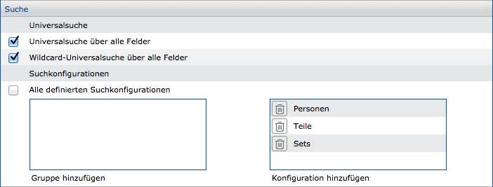
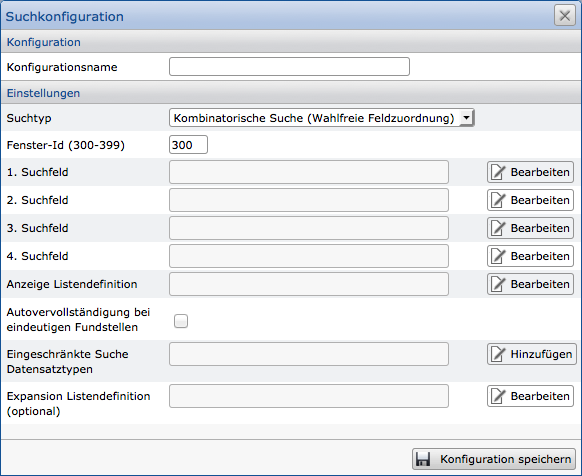
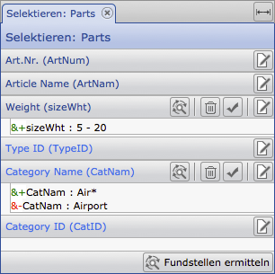
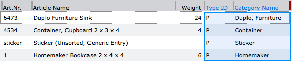
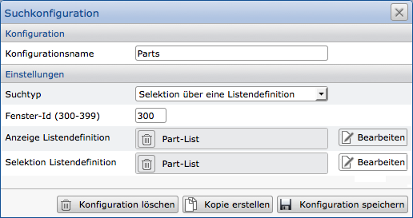
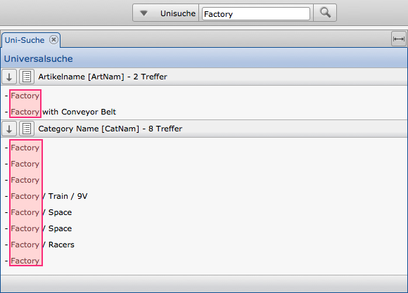
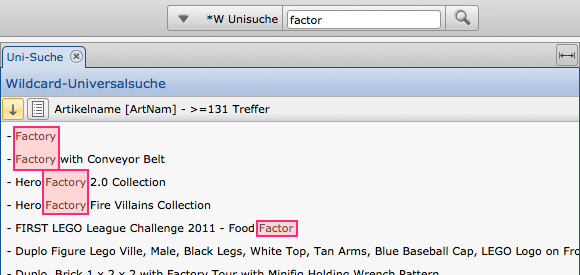

Suchmöglichkeiten
=================

Innerhalb der Anwendung CortexUniplex können bestimmte Suchmöglichkeiten für
Anwender konfiguriert werden. Dadurch ist es möglich, den Anwender
bereits in seinen Suchmöglichkeiten einzugrenzen, so dass nur erlaubte
Inhalte gefunden werden können.

Der richtige Einsatz einer Suche hängt dabei maßgeblich von den Werten
ab, die durchsucht werden dürfen. Der CortexUniplex unterscheidet hier
zwischen einer Wildcard-Suche, einer kombinatorischen Suche und den
Universal-Suchen. Letztere sind
häufig den Administratoren vorbehalten, da diese beiden
Suchmöglichkeiten alle Felder aller Datensätze durchsuchen.

Die Zuweisung konfigurierter Suchmöglichkeiten erfolgt über die
Systemeinstellungen für jede Benutzervorlage. Hier können einzelne oder
gruppierte Konfigurationen festgelegt werden.



Die Konfiguration der Suchmöglichkeiten erfolgt über die
Suchkonfiguration (Menüpunkt "Suche" in den Systemeinstellungen). Eine
solche Konfiguration erhält einen Namen, den Sie bei o.g. Zuweisung
nutzen. Weiterhin wählen Sie den entsprechenden Suchtyp (kombinatorische
oder wildcard Suche), die erlaubten Felder und die Liste für die
Ergebnisausgabe. Nachdem Sie diese Konfiguration gespeichert haben,
können Sie die Zuweisung in der Benutzervorlage vornehmen.



Selektion mit Hilfe von Listen 
------------------------------

Ergänzend zu den konfigurierbaren Suchen und Portalen kann einem
Anwender die Funktion "Selektieren über Listen" bereitgestellt werden.
Diese Funktion erlaubt die Kombination von Suchparametern in den
Feldern, die über eine Liste festgelegt wurden. Hierbei werden neben den
Datensatz-Feldern auch die Felder genutzt, die über direkte Verweise aus
anderen Datensatztypen verwendet werden. Dadurch sind Abfragen vernetzer
Strukturen möglich (analog zu "*Join*" in SQL-Datenbanken).

!!! note "Hinweis"
	Bei der Abfrage über Verweise sind nur dann Elterverweise möglich, wenn die Verweisfelder mit dem Attribut "Rückwärtsindex" konfiguriert wurden.

### Nutzung



Wurden einem Anwender ein oder mehrere
Selektionsmöglichkeiten über Listen zugeteilt, wird die Funktion als
Button in der Symbolleiste eingeblendet. Darüber wird der gewünschte
Eintrag ausgewählt und das Selektionsfenster zeigt die Felder der
zugrundeliegenden Liste untereinander an.

In jedem Feld kann der Anwender dann Suchkriterien definieren, die per
UND (&) oder NICHT (-) je Feld festgelegt werden. Die Kriterien der
unterschiedlichen Felder werden bei der Durchführung miteinander
kombiniert.

Das nebenstehende Beispiel zeigt die Kriterien für zwei Felder, wobei
das zweite Feld mit UND und NICHT spezifiziert wurde.

In der zugrundeliegenden Liste ist erkennbar, dass Felder über eine
Verweisstruktur eingebunden wurden (blau markiert). Die Selektion
enthält daher alle Datensätze, die in dem ersten Kriterium einen
bestimmten Inhalt aufweisen und zusätzlich über direkte Verweise mit
Datensätzen verbunden sind, die dem zweiten Suchkriterium entsprechen.



Die Ergebnisse der Selektion werden nach dem Klick auf den Button
"Fundstellen ermitteln" in der Liste angezeigt, die über die
Konfiguration für die Ausgabe definiert wurde.

### Konfiguration

Die Konfiguration erfolgt über die Systemeinstellungen in dem Bereich
"Suche". Hier wird ein Name für die Suchkonfiguration festgelegt und
als Suchtyp der Eintrag "Selektion über eine Listendefinition"
ausgewählt.

Die Fenster-ID legt die ID des Reiters fest, in dem diese Funktion
aufgerufen wird. Funktionen mit gleicher ID nutzen den selben Reiter und
überschreiben sich daher; Funktionen mit unterschiedlichen ID's nutzen
unterschiedliche Reiter.

Danach sind nur noch die Listen zu wählen, die für die Suche und Ausgabe
genutzt werden sollen.



!!! note "Hinweis"
	Jede Änderung an der Listenkonfiguration hat sofortige Auswirkungen auf die Selektionsmöglichkeiten. Neu hinzugefügte Felder können daher sofort genutzt werden. Idealerweise sind Listen für die Suche daher entsprechend zu bezeichnen und nur dafür zu nutzen.

Universal- und Wildcard-Universal-Suche
---------------------------------------

Diese Suchfunktionen werden innerhalb der Benutzervorlagen aktiviert und sollten nur für administrative Benutzer freigeschaltet werden.

Wird über die Universal-Suchen eine Abfrage gestellt, erfolgt die Rückgabe in Form einer Systemliste, die im ersten Schritt die Vorkommen und erst mit einem zweiten, manuellen Schritt die Ergebnisse in einer Liste darstellt.

Hierbei gilt, dass über die Universal-Suche genau die Begriffe gefunden werden, wie sie eingegeben wurden. Die Wildcard-Universalsuche gibt auch Ergebnisse zurück, die den eingegebenen Begriff an irgendeiner Stelle beinhalten.

Der Begriff "Wildcard" wird an dieser Stelle verwendet, weil es sich bei dem Suchbegriff um einen Teilwert handeln kann; die Eingabe von \* oder ? ist nicht notwendig.

!!! note "Hinweis"
	Die Rückgabe zeigt auf, in welchen Feldern und wie häufig der Suchbegriff gefunden wurde. Um die Ergebnisse in Form einer Liste auszugeben, muss eine entsprechende Liste manuell über den Button "Listenansicht" (neben der Trefferanzeige) geladen werden.

!!! example "Universal-Suche"


!!! example "Beispiel Wildcard-Universal-Suche"


Wildcardsuche
-------------

Eine Wildcard-Suche erlaubt die Teilsuche von Begriffen. Im Gegensatz zu
der kombinatorischen Suche ist die Feldreihenfolge einzuhalten.

Eine Wildcard (sog. "Jokerzeichen") ersetzt ein oder mehrere Zeichen
innerhalb eines Begriffs. Hierfür stehen die Zeichen \* und ? zur
Verfügung. Das Fragezeichen (?) steht hierbei für genau ein Zeichen; das
Sternchen (\*) für mehrere Zeichen.

!!! example "Beispiele für Wildcardsuchen"
```
    *qu*n*  liefert die Queen, genau wie Steve Mcqueen und Quentin Tarantino
    *qu?n*  liefert Quentin Tarantino
    *qu??n* liefert die Queen und Steve Mcqueen
```

kombinatorische Suche
---------------------

Die kombinatorische Suche ermöglicht die Suche von Inhalten über eine
beliebige Kombination der Suchfelder. Hierbei ist zu beachten, dass die
korrekte Schreibweise der Suchbegriffe zu nutzen ist (z.B. auch
Groß-/Kleinschreibung).

!!! example "Beispiel"

	Für die Suche wurden drei Felder definiert: Name, Vorname, Ort

	Innerhalb dieser Felder erfolgt die Suche innerhalb der Datenbank. Der
	Anwender kann in beliebiger Kombination Suchbegriffe eingeben. Daraus
	folgt, dass die eingegebenen Suchbegriffe in jeder Kombination in allen
	drei Felder abgefragt werden.

	Erfolgt daher die Eingabe von: "Windsor, London, Elisabeth", werden
	all diese Werte in den Feldern Name, Vorname und Ort gesucht.

	Das Ergebnis könnte daher aus folgenden Personen bestehen: "Elisabeth
	Windsor aus London" oder "Elisabeth London aus Windsor"

Gerade bei Suchfeldern, die verschiedene Objekte über gleiche Begriffe
suchen, werden mehrdeutige Ausgaben zurückgegeben (z.B. bei dem Begriff
"Kiwi". Vogel oder Frucht?). Daher kann es sinnvoll sein, bei der
Suchkonfiguration eine Einschränkung auf eine bestimmte Satzart
vorzunehmen.

 
