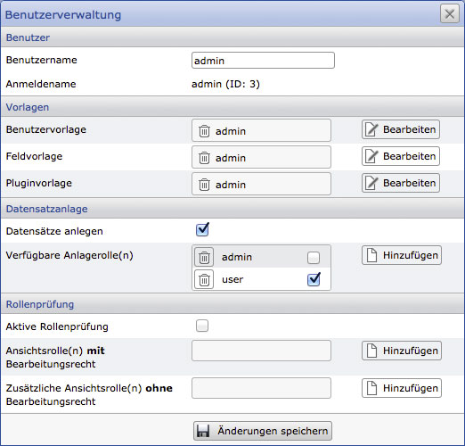
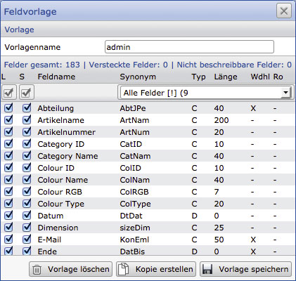
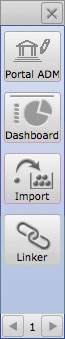
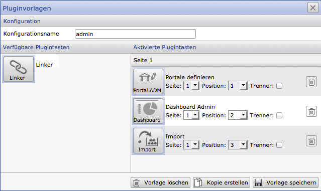
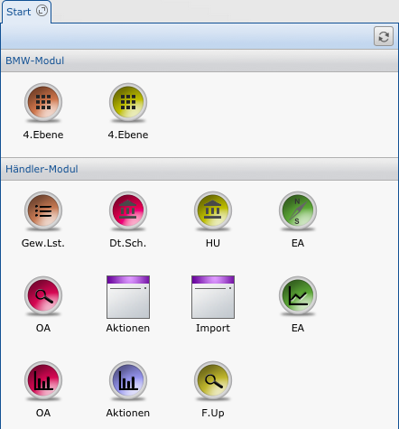
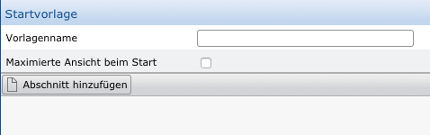
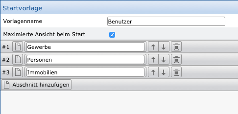
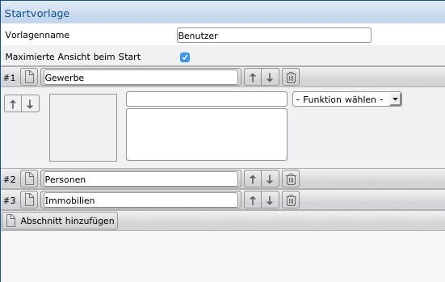
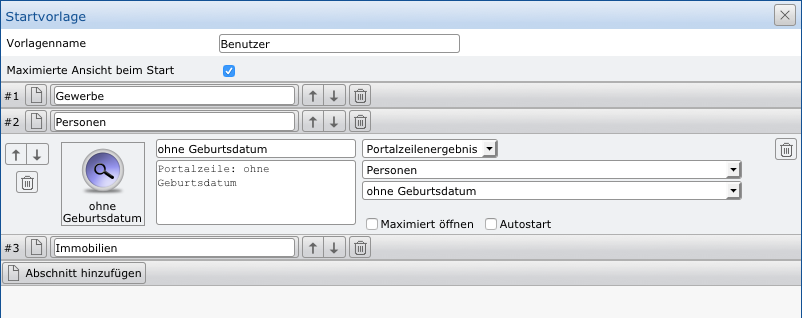
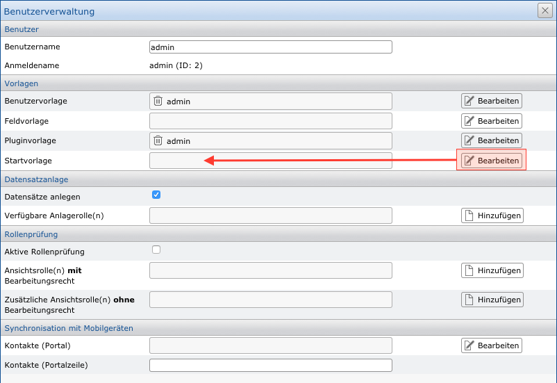

Vorlagen
========

Über Vorlagen sind die grundsätzlichen Einstellungen von Funktionen und Berechtigungen für Benutzerkonten möglich, denen diese Vorlagen zugewiesen wurden. Wurde eine Vorlage mehreren Benutzern zugewiesen, gelten alle Anpassungen an dieser Vorlage automatisch für alle beteiligten Benutzer.

Benutzerverwaltung
------------------

Über die Benutzerverwaltung innerhalb der Systemeinstellungen des CortexUniplex ist die Verwaltung der Benutzerkonten möglich, die über den Remote-Admin definiert wurden.

Das hier abgebildete Fenster gliedert sich in die vier Bereiche Benutzer, Vorlagen, Datensatzanlage und Rollenprüfung.

Im Bereich "Benutzer" ist nur die Angabe eines "echten" Namens möglich.

Der Bereich "Vorlagen" dient zur Zuweisung der zuvor konfigurierten Benutzer-, Feld- und Pluginsvorlagen.

Die "Datensatzanlage" definiert, ob ein Benutzer generell Datensätze anlegen darf und mit welchen Rollen die neuen Datensätze versehen werden können. Die angehakte Rolle wird automatisch bei der Neuanlage eines Datensatzes gesetzt und kann vom Anwender optional geändert werden.

Im Bereich "Rollenprüfung" ist zu definieren, ob das Rollensystem für diesen Benutzer aktiv ist (wenn nicht, hat er Zugriff auf alle Datensätze) und mit welchen Rollen auf die Datensätze zum Bearbeiten und Lesen zugegriffen wird.

Benutzer-Vorlagen
-----------------

Die Benutzervorlagen definieren die Funktionsberechtigungen, die ein
Anwender innerhalb des CortexUniplex erhält. Hierzu gehören u.a. die
Möglichkeiten zum Erstellen und Ändern von Listen, dem Datenexport,
bestimmte Selektionen und anderes mehr (siehe Benutzervorlagen).

Innerhalb der Anwendung CortexUniplex können einem Anwender bestimmte
Funktionen zur Verfügung gestellt oder verwehrt werden. Hierbei besteht
je Funktion detailliert die Möglichkeit, die komplette Verfügbarkeit
einzuschränken oder diese auf Teilfunktionen zu beschränken. Jede
Vorlage kann durch mehrere Benutzerkonten genutzt werden. Eine Änderung
an einer Vorlage hat somit direkte Auswirkungen auf alle beteiligten
Benutzerkonten.

Die Benutzervorlagen unterteilten sich in mehrere Untergruppen und darin
enthaltene Funktionen

-   Funktionsrechte
-   Listen
-   Suche
-   Portale
-   Objektviewer
-   Anlage von Datensätzen
-   Bearbeiten von Datensätzen
-   Inbox-Liste
-   Liste für offene Dateibearbeitung
-   Templatebasierte Darstellung
-   Zusätzliche Optionen

Sollen bestimmte Funktionen nicht genutzt werden, sind diese zu
deaktiveren. Beispielsweise werden häufig bestehende Kalender-Programme
genutzt, so dass diese Funktion deaktiviert werden kann.

Funktionsrechte
---------------

### Löschen von Datensätzen

Beim Löschen handelt es sich um das unwiderufliche Entfernen von
Datensätzen aus dem Datenbestand. Dieses ist daher nur möglich, wenn der
zu löschende Datensatz nicht mehr als Ziel eines Verweises ("Links")
genutzt wird. Als Recht wird hier zwischen den Optionen "Generelle
Löschberechtigung", "Löschberechtigung für eigene Datensätze" und
"keine Löschberechtigung" unterschieden.

### Archivieren von Datensätzen

Analog zum Löschen handelt es sich beim Archivieren von Datensätzen um
ein eigentliches "Verstecken" von Datensätzen. Diese werden beim
Suchen oder bei Selektionen nicht mehr mit einbezogen, die verknüpfte
Struktur über Verweise bleibt allerdings erhalten, so dass auf die
Datensätze zugegriffen werden kann; eine Bearbeitung ist nicht möglich.
Genau wie beim Löschen wird hier zwischen den drei genannten Optionen
unterschieden.

### Selektionen

Bei Selektionen handelt es sich um gespeicherte Ergebnisse von zuvor
angezeigten Datensätzen einer Liste. Diese können für die spätere
Weiterbearbeitung gespeichert werden. Auch hier gilt, dass alle, eigene
oder keine Selektionen erstellt/bearbeitet/geladen werden können.

### Dokumentvorlagen

Innerhalb des CortexUniplex bsteht die Möglichkeit, auf Basis von Datensätzen
Dokumente zu erstellen (z.B. Berichte oder Serienbriefe). Hierfür ist es
notwendig, dass Dokumentvorlagen innerhalb der Datenbank abgelegt
werden. Die Berechtigungen steuern analog zu den o.g. Funktionen die
Zugriffsrechte für diese Funktion und die Dokumentvorlagen.

### Selektieren

Beim Selektieren handelt es sich um eine Funktion, die es ermöglicht,
dass auf Basis von Listenkonfigurationen innerhalb der Datenbank
selektiert wird. Jedes Feld der gewählten Liste kann dabei als Kriterium
herangezogen werden. Hierbei können auch Felder aus Datensätzen direkter
Verweise genutzt werden (Elternverweise sind derzeitig nicht möglich).
Im Vergleich zu anderen Datenbanken wird hier zum Teil die Funktion der
sog. "Joins" genutzt.

Ist diese Funktion aktiviert, erhält der Anwender den Zugriff über einen
zusätzlichen Button in der Hauptsymbolleiste (oben links).

### Mehrfachzuordnung

Hierbei handelt es sich um eine interaktive Funktion für Anwender, die
innerhalb des CortexUniplex Datensätze bearbeiten. Die Mehrfachzuordnung
erlaubt es, dass mehrere ausgewählte Datensätzen einer Liste auf einen
Datensatz verweisen, der sich in der anderen Bildschirmhälfte in der
Anzeige befindet. Beispielsweise können so mehrere Artikel einem Projekt
zugewiesen werden.

Listen
------

### Bearbeitung von Listen

Listen bilden eine der Hauptfunktionen des CortexUniplex. Sie dienen
einerseits zur einfachen Anzeige von Datensätzen, können aber
andererseits umfangreiche Ausmaße annehmen, wenn beispielsweise
rekursive Strukturen oder strukturierte Sublisten mit automatischen
ad-hoc Berechnungen angezeigt werden. Listen bilden zudem die Grundlage
für Pivot-Auswertungen und damit auch die Basis für die weiterführende
Funktionalität Dashboard. Ergänzend dazu  können Listen mit selektierten
Inhalten über die API für eigene Anwendungen oder Schnittstellen genutzt
werden (siehe CortexUniplexWebAPI).

Die Berechtigung zur Bearbeitung und Änderung von Listen kann daher
erhebliche unerwünschte Effekte nach sich ziehen, wenn Listen geändert
werden, deren Nutzung für andere Funktionen sichergestellt werden muss.
Um dieses zu vermeiden stehen vier Berechtigungsstufen zur Verfügung
über die Anwender entsprechend administriert werden können.

### Export und Import von Listendefinitionen

Die Definitionen (Konfiguration) von Listen kann für andere Datenbanken
exportiert oder aus anderen Datenbanken importiert werden. Hierbei
werden Listen mit gleichen Namen überschrieben und aktualisiert. Der
Anwender hat daher an dieser Stelle genauso auf vorhandene Listen zu
achten wie bei der manuellen Bearbeitung.

### Drucken und Exportieren von Daten

Alle oder nur ausgewählte Inhalte einer Liste können in Form von csv-
oder xml-Dateien exportiert werden. Da bei exportierten Daten keinerlei
Kontrolle über  nachfolgende Dateiübergaben möglich ist (Kopien,
Zugriffe u.ä.), können der Export und das Drucken entsprechend
verhindert werden.

!!! note "Hinweis"
    Bei den nachfolgendenEinstellungen Suche, Portale, Objektviewer, sowie dem Anlegen und Bearbeiten von Datensätzen sind Einschränkungen auf einzelne Konfigurationen möglich. Damit kann einer Benutzergruppe dediziert zugewiesen werden, welche Konfigurationen für eine bestimmte Funktion genutzt werden können.

Suche
-----

Über die beiden Suchmöglichkeiten Universalsuche und
Wildcard-Universalsuche wird innerhalb aller Datenbank-Felder in allen
Datensätzen der eingegebene Suchbegriff gesucht. Die Ausgabe erfolgt in
Form einer Systemliste, die nach Datenbank-Feld und Datensatzart die
entsprechenden Ergebnisse liefert. Die Universalsuche findet hierbei
exakt den eingegebenen Begriff; die Wildcard-Universalsuche erlaubt die
Verwendung von * (für beliebige Zeichen) und ? (für exakt ein Zeichen).

Über Suchkonfigurationen ist es möglich, Anwendern vordefinierte
Suchmöglichkeiten anzubieten, die eine Suche nur in ausgesuchten Feldern
erlaubt. Hier können eine Vielzahl unterschiedliche Suchmöglichkeiten
aktiviert werden, die je nach Anwendergruppe relevant sein können. Die
eigentlichen Suchkonfigurationen werden im Administrationsbereich
"Suchen" konfiguriert.

Portale, Objektviewer, Bearbeitungsrechte
-----------------------------------------

### Portale

Bei Portalen handelt es sich um vordefinierte Selektionen, die anhand
von hinterlegten Suchkriterien ad-hoc Abfragen in der Datenbank
ausführen. Zu jeder Konfiguration kann der Aufruf einer Liste oder
Pivot-Darstellung zugeordnet werden, so dass der Anwender immer aktuelle
Ergebnisse erhält, ohne manuell eine Suche ausführen zu müssen. Je nach
Anwenderbereich können einzelne Portale oder Portal-Gruppen der Vorlage
zugewiesen werden.

### Objektviewer (Objektansicht)

Innerhalb von vernetzten Strukturen können Informationen über
Verweisketten - ausgehend von einem Datensatz - sehr kompakt mit Hilfe
mehrerer Listen und Formatierungen dargestellt werden. Ein solcher
Objektviewer basiert auf einem bestimmten Datensatztyp und kann nur von
diesem genutzt werden. Da hierbei unterschiedlichste Informationen
verschiedenster Datensatztypen an einer Stelle dargestellt werden, ist
ggf. eine Einschränkung auf bestimmte Objektviewer sinnvoll.

### Anlegen und Bearbeiten von Datensätzen

Inwiefern Datensätze eines bestimmten Datensatztyps manuell angelegt und
bearbeitet werden dürfen, ist über diese beiden Punkte zu regeln. Diese
gehen einher mit den Feldrechten zum Sehen und Ändern der Feldinhalte
(siehe Feldvorlagen).

templatebasierte Darstellung und zusätzliche Optionen
-----------------------------------------------------

### Templates

Einzelne Datensätze speichern nur die Felder, zu denen ein Inhalt
vorliegt. Leere Felder werden hingegen nicht gespeichert.
Dementsprechend werden einem Anwender grundsätzlich auch nur gefüllte
Felder eines Datensatzes angezeigt. Die Template-Darstellung erlaubt es,
dass einem Anwender auch alle weiteren Felder angezeigt werden, die
gefüllt werden können. Die Berechtigungen der Feldvorlage werden hierbei
berücksichtigt.

### zusätzliche Optionen

Für einen Login per Private-/Public-Key Verfahren und für die
Dateiübertragung an die Datenbank kann der sog. "Wizard" verwendet
werden. Hierfür wird in dem Benutzerkonto der öffentliche Teil
(public-Teil) eines Schlüssels (dsa) hinterlegt und auf dem System des
Anwenders der private Teil. Das hinterlegte Kennwort kann dann unüblich
komplex gespeichert werden, da der Anwender mit dem Start des "Wizard"
nur den Anmeldenamen eingeben muss ohne das Kennwort zu kennen. Die
komplette Authentifizierung gegenüber der Anwendung übernimmt sodann der
"Wizard".

### automatisches Sitzungsende

Hierüber wird definiert, nach wieviel Minuten ein automatischer Logout
stattfindet, wenn der Anwender keine Tätigkeit in der Anwendung
durchführt.

Feld-Vorlagen
-------------

Genau wie Benutzervorlagen werden die Feldvorlagen einem (oder mehreren)
Benutzerkonten zugewiesen. Diese Vorlagen definieren die Felder, die ein
Benutzer sehen und/oder ändern darf. Wird ein Feld in verschiedenen
Satzarten genutzt, gilt die Festlegung für alle Satzarten, in denen das
Feld verwendet wird.

Damit ist es möglich, dass unterscheidliche Benutzer die selben
Datensätze bearbeiten können, aber jeder nur Zugriff auf die Felder
erhält, die über die Feldvorlage definiert wurden.

Wenn Sie die Feldvorlagen aufrufen sehen Sie eine Liste alle bereits
konfigurierten Vorlagen und können daher vorhandene ändern oder neue
hinzufügen. Eine Vorlage erhält daher einen Namen, den Sie bei der
Benutzerverwaltung auswählen können (jeder Benutzer kann jeweils nur
eine Vorlage erhalten; also eine Benutzervorlage, eine Feldvorlage und
eine Pluginvorlage).

Weiterhin werden in der Feldvorlage die Felder festgelegt, die für den
Benutzer "lesbar" (L) und/oder "schreibbar" (S) sein sollen. Bei den
entsprechenden Feldern setzen Sie einfach die Häkchen in der jeweiligen
Spalte.

Alle weiteren Spalten dienen der Information und die Liste kann durch
einen Klick auf die Spaltenüberschrift entsprechend sortiert werden.

Über die Feldvorlagen werden die Berechtigungen je Feld definiert.
Hierbei wird festgelegt, ob ein Feld sichtbar und/oder änderbar ist.
Dieses Recht ist unabhängig der Rolle eines Datensatzes. Darf ein
Anwender einen bestimmten Datensatz sehen, sieht er genau die Felder,
die ihm über die Feldvorlage zugewiesen wurden; sind für den Anwender
Änderungen am Datensatz erlaubt, kann er genau die Feldern bearbeiten,
die über die Feldvorlage dafür freigeschaltet wurden.

Über die beiden Checkboxen in den Spalten "L" und "S" wird
definiert, ob ein Feld lesbar (L) und/oder schreibbar (S) ist. Alle
weiteren Angaben dienen der weitergehenden Information (Feldsynonym,
Typ, Länge, Wiederholfeld). Über die Auswahlbox können die Felder nach
Datensatztyp gefiltert werden.

Für administrative Zwecke und tiefergehende Kontrolle der Daten ist es
hilfreich, wenn eine Vorlage für administrative Benutzer erstellt wird
(z.B. "admin").

Plugin-Vorlagen
---------------

Innerhalb des CortexUniplex ist es möglich, dass am linken Bildschirmrand
"Buttons" für funktionale Erweiterungen eingeblendet werden (für sog.
"Plugins"). Hierbei kann es sich um generelle Funktionen handeln, die
zu den Standardfunktionen gehören (z.B. Implex-, Dashboard-Konfiguration
u.a.) oder auch individuelle Erweiterungen für spezielle Fachbereiche
oder Anwendungsfälle. Dabei ist unerheblich, ob diese Plugins mit dem
Datenbestand der CortexDB arbeiten und CortexUniplex-Funktionen aufrufen oder
ob externe Systeme angesprochen werden (Datenimport/-export, Ausführen
von Funktionen u.ä.).

Innerhalb einer Pluginvorlage wird daher nur definiert, welche Buttons
angezeigt werden sollen. Auf die eigentliche Funktionalität des Plugins
hat die Vorlage keinerlei Einfluss.

Plugins dienen innerhalb des CortexUniplex für die Nutzung
erweiterter Programmteile, mit denen bestimmte Aufgaben bearbeitet
werden können. Dieses können fachspezifische Werkzeuge zur Vereinfachung
der Arbeitsprozesse sein, aber auch Konfigurationsmöglichkeiten für
CortexUniplex-/Datenbank-Funktionen.

Im Standard werden Plugins für die Administration der Portale und des
Dashboards, sowie für die Import- und Linker-Konfiguration ausgeliefert.
Diese können durch eigene, individuelle Plugins erweitert werden, die
beispielsweise die CortexUniplexWebAPI nutzen.

Jedes Plugin wird als Symbol am linken Fensterrand in der sog.
"Schnellstartleiste" angezeigt und kann durch einen Mausklick
ausgeführt werden. Die hier angezeigten Symbole sind einfach über die
Pluginvorlagen zu konfigurieren.

### Konfiguration der Pluginvorlagen

Innerhalb der Systemeinstellungen des CortexUniplex können die Vorlagen über
den entsprechenden Menüpunkt konfiguriert werden. Hier erhalten Sie auch
eine Auflistung aller bisher konfigurierten Vorlagen, die Sie
entsprechend ergänzen oder ändern können.

Analog zu den Benutzer- und Feldvorlagen besteht eine Pluginvorlage aus
einem eindeutigen Namen, der für die Zuweisung innerhalb eines
Benutzerkontos genutzt wird. Unterhalb des Namens sind die zur Verfügung
stehenden Plugins im linken Bereich aufgelistet; die bereits verwendeten
Vorlagen im rechten Bereich. Jedes zugewiesene Plugin kann an eine
bestimmte Position gesetzt werden. Hierbei stehen auch mehrere
"Seiten" zur Verfügung, durch die der Anwender in der
Schnellstartleiste wechseln kann (siehe dort am unteren Ende die Pfeile
für vor und zurück).

Zum Entfernen eines Plugins aus der Vorlage dient das Symbol eines
Papierkorbs am rechten Rand; die Angabe "Trenner" gibt an, ob
unterhalb des Symbols eine waagerechte Linie zur Abgrenzung eingeblendet
werden soll.

Über die Benutzerverwaltung in den Systemeinstellungen des CortexUniplex sind
die einzelnen Vorlagen einem Benutzerkonto zuzuweisen.

Start-Vorlagen
--------------

Nach dem Login eines Anwenders kann diesem eine Auswahl von Buttons
angezeigt werden, die jeweils eine Funktion oder eine Liste/Pivot
aufrufen können. Dadurch ist die Navigation für den Endanwender
vereinfacht und schneller. Die Berechtigungen werden hierbei vollständig
beachtet und die "manuelle" Nutzung ist weiterhin möglich.

Innerhalb des CortexUniplex ist es möglich, den Endanwendern bestimmte
Funktionen auf einen Button zu legen, so dass diese Funktionen sehr
einfach und schnell erreichbar sind. Diese Einzel-Buttons befinden sich
in dem sog. "Start-Tab", der beim Start sofort angezeigt und nicht
geschlossen werden kann. Hierbei handelt es sich also um den
Ausgangspunkt für zurvor konfigurierte Funktionen.

Innerhalb des Start-Tab können mehrere Abschnitte
hinzugefügt werden, die einzelne Buttons erhalten. Für jeden Button ist
eine individuelle Grafik möglich (png-Format, max. 48x48 px).

Für jeden Button kann eine der folgenden Funktionen ausgewählt werden:

-   Portal
-   Portalgruppe
-   Einzelportal
-   Portalzeilenergebnis
-   Dashboard
-   Selektion über eine Liste

Um eine der Funktionen auf einen Button zu legen, muss diese zuvor
konfiguriert worden sein.

Funktionen
----------

!!! note "HINWEIS"
    Beachten Sie, dass sich die Berechtigungen jeder Funktion auch auf die Anzeige im Start-Tab auswirken. Sollte ein Anwender keine Berechtigung zum Ausführen einer bestimmten Konfiguration besitzen, wird diese Funktion nicht im Start-Tab angezeigt.

### Portal

Die vollständige Portalkonfiguration (unter Beachtung aller
Benutzerrechte) kann dem Anwender über einen Button zur Verfügung
gestellt werden. Der Anwender hat daher auch die Möglichkeit innerhalb
des Portals zwischen den verschienden Portalnamen zu wählen.

### Portalgruppe

In den Sysemeinstellungen ist es möglich, Gruppen für die Verwaltung von
Portalen (und auch bei anderen Funktionen) anzulegen und darin
Portalkonfigurationen einzuordnen. Diese Gruppen können einem Anwender
auf einen Start-Tab-Button gelegt werden, so dass der Anwender nur
zwischen den zusammengehörenden Portalen auswählen kann.

### Einzelportal

Bei einem Einzelportal handelt es sich um genau eine Konfiguration, die
in der Systemeinstellungen unter "Portale" oder mit Hifle des Plugins
"Portal-Admin" angelegt wurde. Der Anwender kann also nur dieses eine
Portal nutzen; eine Auswahl anderer Portale ist nicht möglich.

### Portalzeilenergebnis

Hierbei handelt es sich um genau die Anzeige, die für eine einzelne
Portalzeile definiert wurde. Es kann also eine Liste oder eine
Pivot-Tabelle angezeigt werden.

### Dashboard

Wurden Dashboards konfiguriert, kann eine Konfiguration über einen
Button aufgerufen werden.

### Selektion über eine Liste

Bei dieser Funktin handelt es sich um eine Selektionsfunktion, die auf
Listenspalten basiert. Diese muss zuvor über die Konfiguration der
"Suchen" definiert sein.

Vorgehensweise
--------------

Nachdem die notwendigen Funktionen zuvor konfiguriert wurden, können Sie
in den Systemeinstellungen unter "Start-Vorlage" eine neue Vorlage
hinzufügen (oder eine vorhandene mit einem Doppelklick bearbeiten).

Jede Vorlage benötigt einen Namen für die interne
Verwaltung, so dass Sie diese später den Benutzerkonten zuweisen können.
Als Ergänzung können Sie festlegen, ob der Starttab nach dem Login über
die gesamte Fläche des CortexUniplex angzeigt werden soll (maximierte
Ansicht).

Nachdem die grundlegenden Einstellungen getroffen wurden, können ein
oder mehrere Abschnitte hinzugefügt werden. Hierbei handelt es sich um
die Überschriften, durch die die Buttons in zusammengehörende Bereiche
unterteilt werden. Dieses sind graue Balken, die einen (für den Anwender
sichtbaren) Titel beinhalten.

Beim Anlegen eines neues Abschnitts erhält dieser
automatisch eine interne Nummer (immer mit \# am Anfang) und einen
Namen, der individuell vergeben wird. Sobald mehrere Abschnitte erstellt
wurden, können diese in der Reihenfolge geändert oder auch gelöscht
werden.

Sie können einzelne Abschnitte jederzeit ändern und anlegen. Eine
Anpassung an den Bedarf der Anwender ist daher beliebig möglich.

Zu jedem Abschnitt ist es dann erforderlich, eine Konfiguration für jede
Funktion anzulegen, die ein Anwender ausführen darf. Hierfür steht der
Button vor dem Namen des Abschnitts zur Verfügung. Hierüber legen Sie
die Position des Buttons, ein Icon, den Namen und eine Beschreibung,
sowie die eingentliche, auszuführende Funktion fest.

Der Name des Buttons ist der Text, der unter dem Button
angezeigt wird. Hier stehen nur eine begrenzte Anzahl von Zeichen zur
Verfügung, die in der Vorschau des Buttons (leeres Quadrat) angezeigt
werden. Wenn Sie in das Quadrat klicken, können Sie zudem eine Grafik
als Icon auswählen (max. 48x48 Pixel als png-Datei und mit max. 32kb
Dateigröße). Wird keine eigene Grafik gewählt, nutzt der Button eine
Standardgrafik.

Nachdem Sie alle Angaben festgelegt haben, kann ergänzend definiert
werden, ob die Funktion maximiert geöffnet (also über den gesamten
Bildschirmbereich) und ob die Funktion automatisch nach dem Login
ausgeführt werden soll (Autostart).

 

Die hier gezeigte Abbildung zeigt einen vollständig konfigurierten
Button mit individuellem Icon.

!!! note "HINWEIS"
    Handelt es sich um eine neue Konfiguration, ist es notwendig, diese Konfiguration den Benutzerkonten zuzuweisen, die diese Startvorlage nutzen sollen. Hierfür wählen Sie in der Systemeinstellung in dem Bereich "Benutzer" den entsprechenden Benutzer aus und weisen ihm die erstellte Srt-Vorlage zu.

