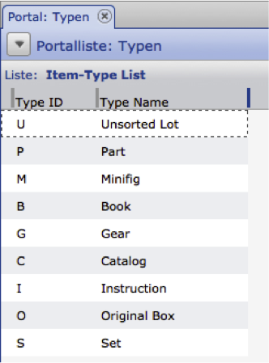

Allgemeine Funktionen
---------------------

In den allgemeinen Funktionen stehen globale Methoden zur Verfügung, die nicht an CortexUniplex-Funktionen gekoppelt sind. Diese können daher ohne Benutzerkontext aufgerufen werden und liefern beispielsweise Server- oder Schnittstellen-Angaben zurück.

Hierzu gehören:

- getVersion
- getLogin
- getLogout
- getInfo
- clearCache

Das Rückgabe-Objekt liefert grundsätzlich einen Fehlercode (0=ok) und den eigentlichen Rückgabewert (im "data"-Feld).

``` 
{
    "rc": int RetCode,
    "error": string ShortErrorDesc,
    "data": 
    {
      .....
    }
}
```

### getVersion

Liefert die aktuelle Versionskennung der CortexUniplexAPI und benötigt keinen Login.

**Anfrageobjekt**

``` 
{
  "method": "getVersion",
  "requestid": int RequestId,
  "param": 
}
```

**Rückgabeobjekt (result-object)**

``` 
{
  'requesterror': int RequestStatus,
  'requestmethod': string MethodName,
  'requestid': int RequestId,
  'requestduration': float Duration,
  'result': {
    -result-data-
  }
}
```

**data**

::: 
``` 
{
    "rc": int RetCode,
    "error": string ShortErrorDesc,
    "data": {
        "version": int Version,
        "versionstr": strin VersionStr,
        "versionmain": int MainVersion,
        "versionsub": int SubVersion,
        "releasedate": string Date
    }
} 
```

- version - Versionskennung (ohne Unterteilung; z.B.: 21001)
- versionstr - Versionskennung (mit Unterteilung z.B.: "2.1.001")
- versionmain - Versionskennung (Hauptversion und Release; z.B.: 21)
- versionsub - Versionskennung (Release/Subversion; z.B.: 1)
- releasedate - letzte Aktualisierung (z.B.: "03.06.2014")

### getLogin

Führt einen Login in der CortexDB durch und liefert bei Erfolg ein
Login-Handle (`UpdJsrHdl`).

**Anfrageobjekt**

``` 
{
  "method": "getLogin",
  "requestid": int RequestId,
  "param": {
    "user": string Username,
    "pass": string Password,
    "app": string AppName
  }
}
```

- user - Benutzername
- pass - Benutzerpasswort
- app - App mit der der Login erfolgen soll → immer "UniplexDataservice" !

**Rückgabe  (result)**

``` 
{
  'requesterror': int RequestStatus,
  'requestmethod': string MethodName,
  'requestid': int RequestId,
  'requestduration': float Duration,
  'result': {
    -result-data-
  }
}
```

**data**

``` 
{
    "rc": int RetCode,
    "error": string ShortErrorDesc,
    "data": {
        "UpdJsrHdl": string Login-Handle,
        "UserName": string UserName,
        "UserDisplayName": string UserDisplayName,
        "UserID": int UserId,
        "lic": string Licensee,
        "licnr": string LicenseNumber
    }
}
```

- UpdJsrHdl - bei erfolgreichem Login der Login-Handle (z.B. "267361e2a8e94be6b611c8f0b3a54f52)
- UserName - Benutzername des Logins
- UserDisplayName - angezeigter Benutzername (Konfiguration im CortexUniplex)
- UserID - Id des Benutzers (Konfiguration über RemoteAdmin)
- lic - Lizenznehmer der Datenbank
- licnr - Lizenznummer der Datenbank

### getLogout

Nur nach vorherigem Login möglich! Führt einen Logout des Benutzers mit dem übergebenen Login-Handle durch.

**Anfrageobjekt**

    {
      "method": "getLogout",
      "requestid": int RequestId,
      "param": {
        "UpdJsrHdl": string LoginHandle
      }
    }

-   UpdJsrHdl - Login-Handle, der über getLogin zurückgeliefert wurde (z.B. "267361e2a8e94be6b611c8f0b3a54f52")

**Rückgabeobjekt**

Es werden nur die generellen Angaben zurückgegeben, das "data"-Objekt
bleibt leer.

Beispiel:

    {
      "requesterror": 0,
      "requestid": 18,
      "requestmethod": "getLogout",
      "requestduration": 0.0009,
      "result": {
        "rc": 0,
        "error": "",
        "data": []
      }
    }

### getInfo

Nur nach vorherigem Login möglich! Liefert erweiterte Angaben.

**Anfrageobjekt**

    {
      "method": "getInfo",
      "requestid": int RequestId,
      "param": {
        "UpdJsrHdl": string LoginHandle
      }
    }

-   UpdJsrHdl - Login-Handle, das über *getLogin* zurückgeliefert wurde

**Rückgabeobjekt (result-object)** 

``` 
{
  'requesterror': int RequestStatus,
  'requestmethod': string MethodName,
  'requestid': int RequestId,
  'requestduration': float Duration,
  'result': {
    -result-data-
  }
}
```

**data**

``` 
{
  "rc": int RetCode,
  "error": string ShortErrorDesc,
  "data": {
    "lic_nam": string Licensee,
    "lic_nr": string LicenseNumber,
    "ctx_interfaceversion": int ServerInterfaceVersion,
    "ctx_serverversion": int ServerVersion,
    "UserName": string UserName,
    "UserDisplayName": string UserDisplayName,
    "UserID": string UserId,
    "UserAdmin": int UserIsWebAdmin,
    "upd_version": int DataServiceVersion,
    "upd_versionstr": string DataServiceVersion,
    "upd_versionmain": int DataServiceVersionMainRelease,
    "upd_versionsub": int DataServiceVersionSub,
    "upd_releasedate": string DataServiceReleaseDate
  }
}
```

- lic_nam - Name des Lizenznehmers,
- lic_nr - Lizenznummer,
- ctx_interfaceversion - CortexDB Schnittstellen-Version,
- ctx_serverversion - CortexDB Server-Version,
- UserName - eingelogger Benutzername,
- UserDisplayName - angezeigter Benutzername,
- UserID - ID des Benutzers,
- UserAdmin - wenn Benutzer Webadmin ist, dann 1, sonst 0,
- upd_version - Versionsangabe des DataService,
- upd_versionstr - Versionsangabe des DataService,
- upd_versionmain - Hauptversion und Release,
- upd_versionsub - Unterversion,
- upd_releasedate - Release-Datum

### clearCache

Löscht den internen Puffer/Cache.

**Anfrageobjekt**

``` 
{
  "method": "clearCache",
  "requestid": int RequestID,
  "param": {
    "UpdJsrHdl": "string LoginHandle"
  }
}
```

**Rückgabeobjekt**

``` 
{
    "rc": int RetCode,
    "error": string ShortErrorDesc,
    "data": [ ]
}
```

Bei dieser Funktion werden keine Daten zurückgegeben.


In den nachfolgenden Beschreibungen wird nur das "data"-Objekt erläutert. Etwaige Fehlercodes können Sie aus der Liste der Fehlercodes ablesen.

Datensätze erstellen
--------------------

Um Datensätze zu erstellen, muss zuvor geprüft werden, ob innerhalb des
Benutzerkontextes Datensätze erstellt werden dürfen und welche Felder
dabei im Zugriff stehen. Hierfür ist es ausreichend, wenn vor dem
Schreiben des neuen Datensatzes ein "Lesen" auf den Datensatztyp mit
einer leeren IID ausgeführt wird.

**Anfrageobjekt**

``` 
{
  "method": "UpxLoadData",
  "requestid": 1,
  "param": {
    "UpdJsrHdl": "12345abcde67890fghij123abc",
    "dst": "DsTp",
    "iid": ""
  }
}
```

Das entsprechende Rückgabeobjekt liefert in diesem Fall in dem Schlüssel `result -> data -> iid` eine neue IID, die für das Erzeugen eines neuen Datensatzes herangezogen wird. Das eigentliche Erzeugen wird dann analog zu den bereits oben beschriebenen Methoden ausgeführt.

Datensatz ändern
----------------

Die Änderung eines Datensatzes erfolgt über eine Datensatz-Id und die zu
ändernden Feldinhalte. Hierbei sind die verschiedenen Möglichkeiten der
einzelnen Feldinhalte zu beachten. Üblicherweise werden nur die
aktuellen Feldinhalte aktualisiert. Darüber hinaus besteht die
Möglichkeit, dass Inhalte mit einer Gültigkeit versehen werden (ein Wert
ist gültig ab oder gültig bis).

Ergänzend dazu können Felder optional durch eine administrative
Konfiguration beliebig häufig in einem Datensatz genutzt werden (sog.
"Wiederholfelder"). Eine Kombination solcher Felder ist zudem möglich,
so dass sog. "Wiederholfeldgruppen" entstehen (bspw. für
Bankverbindungen). Auch diese können aktualisiert werden.

### aktuelle Werte

Die einfachste Form der Änderung von Inhalten benötigt nur ein gültiges
User-Handle, die Datensatz-Id und die zu ändernden Feldinhalte.

**Anfrageobjekte**

``` 
{
  "method":"UpxStoreData",
  "requestid":1,
  "param":{
    "UpdJsrHdl":"12345abcde67890fghij123abc",
    'iid':'123456789012345678901234',  // 24-stellige IID des Datensatzes
    'fields': {
      'testNum': {
        'v':'42'
      },
      'testTxt': {
        'v':'myText'
      }
    }
  }
}
```

-   UpdJsrHdl - Gültiges UpdJsrHdl
-   iid - 24-stellige Datensatz-ID
-   fields - Liste mit einem Eintrag je Feld

**Rückgabeobjekt**

``` 
{
  'rc' => '0'
  'error' => ''
  'data' => {
    'iid' => '20705efca120202020212025'
    'lupd' => '207060b93720202020212020'
    'dst' => 'test'
    'error' => '0'
  }
}
```

### mit Gültigkeitszeitpunkt

Um Inhalte eines Datensatzes mit einem Gültigkeitszeitpunkt zu versehen
ist es notwendig, dass ein Zeitpunkt und der Parameter für die Nutzung
("gültig ab" oder "gültig bis") des Zeitpunktes festgelegt werden.
Diese gelten für alle Felder des Anfrageobjektes.

***Anfrageobjekt***

``` 
{
  "method":"UpxStoreData",
  "requestid":1,
  "param":{
    "UpdJsrHdl":"12345abcde67890fghij123abc",
    'iid':'123456789012345678901234',  // 24-stellige IID des Datensatzes
    'fields': {
      'testNum': {
        'v':'42'
      },
      'testTxt': {
        'v':'myText'
      }
    },
    'time':'201512010000', // Timestamp für die zu schreibenden Inhalte
    'savemode':'b'         // Nutzung des Zeitstempels; Standard: "gültig ab", "b": "gültig bis"
  }
}
```

Das Rückgabeobjekt wird wie oben beschrieben zurückgegeben.

### mit Wiederholfeld-Gruppen

**Anfrageobjekt**

``` 
{
  "method":"UpxStoreData",
  "requestid":1,
  "param":{
    "UpdJsrHdl":"12345abcde67890fghij123abc",
    'iid':'123456789012345678901234',  // 24-stellige IID des Datensatzes
    'fields': {
      'testNum': {
        'v':'42'
      },
      'testTxt': {
        'v':'myText'
      }
      },
      'groups': {
        'ACCOUNTS': [
          null,
          {
            'bName': {
              'v':'my Bank'
            },
            'bIBAN': {
              'v':'xy123456789012345678'
            }
          }
        ]
      }
  }
}
```

Datensatz lesen
---------------

Anhand einer Datensatz-Id können alle Informationen eines Datensatzes
gelesen werden.

**Anfrageobjekt**

``` 
{
  "method":"UpxLoadData",
  "requestid":1,
  "param":{
    "UpdJsrHdl":"12345abcde67890fghij123abc",

    'iid':'123456789012345678901234', // 24-stellige IID des Datensatzes

    // optionale Angaben:

    'time':'201512010000',  // Timestamp für die zu lesende Verlaufsinformation
    'dst':'shrt',           // Synonym für die Satzart (4-stellig)
    'flags':'f'             // Flags: f = AddMissingFields, g = AddMissingGroups
  }
}
```

-   UpdJsrHdl - Gültiges UpdJsrHdl
-   iid - 24-stellige Datensatz-ID
-   time - Zeitstempel in der Form yyyymmddhhmm
-   dst - 4-stelliges Datensatz-Synonym
-   flags - zur Übergabe leerer Felder und Feld-Gruppierungen

**Rückgabeobjekt**

``` 
{
  "requesterror":0,
  "requestid":1,
  "requestmethod":"UpxLoadData",
  "requestduration":0.0144,
  "result":{
    "rc":0,
    "error":"",
    "data":{
      "iid":"12345abcd6789efghi123abc",
      "lupd":"20705f43b820202020212025",
      "fieldlist":{
        "tstCont":{
          "Name":"Test-Content",
          "BTyp":0,
          "WFlag":0,
          "Len":220,
          "Group":"",
          "IsSys":false,
          "Typ":"C",
          "Desc":"",
          "STyp":0,
          "IsHid":false,
          "IsRO":false,
          "IsEvt":false
        }
      }
    },
    "dst":"test",
    "groups":[],
    "fields":{
      "tstCont":{
        "v":"test45",
        "a":false,
        "t":"201503200000"
      },
      "tstID":{
        "v":"4",
        "a":true
      }
    },
    "timestamps":[
      "201503200000",
      "201503220000"
    ],
    "error":0
    }
  }
}
```

- iid - IId des Datensatzes
- lupd - letzer Bearbeitungszeitpunkt
- dst - Synonym des Datensatztyps
- FieldList - Objektliste mit den Definitionen der zugriffsberechtigten Felder
- fields - Liste mit Feld-Objekten
	- "v": enthält den Wert,
    - "a": true/false (aktuelle gültiger Wert = true)
    - "l": liefert den aufgelösten Verweis bei internen Verweisfeldern,
    - "t": enthält optional den Zeitstempel der Verlaufsinformation
- groups - Liste mit Objekten von Wiederholgruppen. Jede Wiederholgruppe ist ein Array von Objekten
- timestamps - Array mit einer Aufzählung aller möglicher Gütigkeitszeitpunkte, die in der Verlaufsinformationen der Felder vorkommen
- error - 0, wenn erfolgreich

**Hinweis:**

Bleibt bei dem Anfrageobjekt die IID leer und wird das Synonym des
Datensatztyps im Schlüssel "dst" übergeben, liefert das Rückgabeobjekt
eine neue IID, die zum Erzeugen eines neuen Datensatzes herangezogen
wird (siehe auch den [Abschnitt "Datensatz erstellen/ändern" in dieser
Dokumentation).

Listenaufbau für Portalergebnisse
---------------------------------

Die Ausgabe der Selektionsergebnisse einer Portalzeile erfolgen über
Listen oder darin befindliche Pivot-Tabellen. Diese Ausgabe beinhaltet
ein json-Objekt mit einem fest definierten Aufbau, das für die weitere
Verarbeitung genutzt werden kann.

Innerhalb des "data" -> "c"-Schlüssels sind die Feldbeschreibungen
aufgeführt. Hieraus sind je Feld die einzelnen Attribute ersichtlich.
Nachfolgende Struktur wird hier ausgegeben:

    data              Hauptknoten für die Datenrückgabe 
      c               Schlüssel für die Feldbeschreibungen    
        l0d0          1. Feld in der 1. Listenzeile (Zeile=l; Daten=d)    
        l0d1          2. Feld in der 1. Listenzeile    
        l1d0          1. Feld in der 2. Listenzeile    
        l1d1          2. Feld in der 2. Listenzeile    
        0.0.l0d0      1. Feld der 1. Zeile in der 1. Subliste    
        0.0.l0d1      2. Feld der 1. Zeile in der 1. Subliste    
        0.0.l1d0      1. Feld der 2. Zeile in der 1. Subliste    
        0.0.l1d1      2. Feld der 2. Zeile in der 1. Subliste    
        0.1.l0d0      1. Feld der 1. Zeile in der 2. Subliste    
        0.1.l1d0      1. Feld der 2. Zeile in der 2. Subliste [...]    

        0.[x1].l[x2]d[x3]  0=Hauptkonten; x1=Subliste; x2=Zeile; x3=Feld

Die möglichen Inhalte zu einer Feldbeschreibung sind der vorhergehenden
Beschreibung zu entnehmen. Bei der
eigentlichen Datenrückgabe wird auf die Schlüssel der einzelnen Felder
verwiesen. Dadurch ist zu einem Wert diese Beschreibung ersichtlich.

### Datenbeschreibung von einfachen Listen 

Wenn innerhalb eines Portals eine Zeile angeklickt wird, erfolgt die
Ergebnisausgabe in einer Liste, die dem Portal zugewiesen wurde. Bei
einer Portalzeile handelt es sich somit um eine Vorselektion von Daten,
deren Ergebnis ausgegeben wird.



Um das Ergebnis einer Portalzeile als JSON-Objekt zu erhalten, stellt
die CortexUniplexAPI folgende Methode bereit:

    getPortalRowListData

Ähnlich wie das erste Beispiel zum Auslesen einer Portalkonfiguration
sind auch hierbei mehrere Parameter zu übergeben. Dabei wird der
Teilbereich "param" um die Gruppen- und Zeilenangabe erweitert:

``` 
$jRequest = array('method'   => 'getPortalRows',
                  'requestid' => 1,
                  'param'     => array(
                             array('portal' => 'Schulung-einfach',
                                   'group' => 'Teile',
                                   'row'   => 'Typen')
                       ));
```

Alle weiteren Angaben aus dem ersten PHP-Beispiel bleiben gleich, so dass nunmehr die json-Struktur der Listeninhalte zurückgegeben wird.

``` 
{"requesterror":0,
"requestid":1,
"requestmethod":"getPortalRowListData",
"requestduration":0.0125,
"result":{
  "rc":0,
  "error":"",
  "data":{
    "c":{
      "l0d0":{
        "b":"0",
        "h":"Type ID",
        "l":1,
        "s":"TypeID",
        "t":"C",
        "w":"0",
        "x":8
      },
      "l0d1":{
        "b":"0",
        "h":"Type Name",
        "l":20,
        "s":"TypeNam",
        "t":"C",
        "w":"0",
        "x":85
      },
      "l0d2":{
        "x":223
      }
    },
    "d":[{
      "!IId":"2066f650a820202020212023",
      "!l":"0",
      "!t":"LITp",
      "l0d0":"S",
      "l0d1":"Set"},
      [. . . .],
      {"!IId":"2066f650a820203020212023",
      "!l":"8",
      "!t":"LITp",
      "l0d0":"U",
      "l0d1":"Unsorted Lot"}
    ],
    "error":0,
    "i":{
      "countget":9,
      "counttotal":9,
      "nextpos":9,
      "startpos":0,
      "timefilter":0,
      "timeget":0},
      "typ":"list"
    }
  }
} 
```

Innerhalb des Schlüssels `data`, im Unterschlüssel `c` befinden sich
die Konfigurationsangaben zu jeder Spalte. Dabei gelten folgende
Bedeutungen je Schlüssel:

    "b": Basisfeldtyp – irrelevant für die weitere Nutzung 
    "h": Bezeichner des Feldes in der Liste (header) 
    "l": Feldlänge
    "s": Synonym des Datenbankfeldes 
    "t": Feldtyp (C=Char)
    "x": x-Position des Feldes in der Liste (Pixel)
    "w": Wiederholfeld (1 oder 0) 
    "vt": Vortext 
    "nt": Nachtext 
    "textAlign": Ausrichtung des Inhaltes in der Liste 
    "textDecoration": z.B. „underline“, ... 
    "color": Textfarbe für den Inhalt

Dabei ist jeder Eintrag unter einem eigenen Schlüssel abgelegt, über den
die Position der Felder ersichtlich ist. Beispiel: `l0d0`. Hierbei
handelt es sich um das erste Feld in der ersten Liste. Bei weiteren
Feldern wird die Ziffer hinter "d" hochgezählt; bei Zeilen die Ziffer
hinter "l".

Die Daten der einzelnen Datensätze sind über den Schlüssel "d"
ersichtlich.

    "!IId":"2066f650a820202020212023",      
    "!l":"0",      
    "!t":"LITp",      
    "l0d0":"S",      
    "l0d1":"Set"

Zu dem hier gezeigten Datensatz erfolgt die Ausgabe der
Metainformationen über die ID (`!IID`), die Zeilennummer (`!l`) und
den Datensatztyp (`!t`). Weitere Felder werden nach dem oben
erläuterten Muster je Feld ausgegeben. So handelt es sich bei `l0d0` um
die `Type ID` und bei `l0d1` um den `Type Name`.

Nähere Informationen zu den Daten im Schlüssel "d" sind somit nur über
den Schlüssel "data" ersichtlich.

### Datenbeschreibung von Sublisten

Analog zu der Feldbeschreibung erfolgt die Ausgabe der eigentlichen
Daten in einer ähnlich unterstrukturierten Form. Hierbei gilt der
grundsätzliche Aufbau, wie er für die einfache Rückgabe beschrieben
wurde:

    "!IId":...,
    "!l":...,
    "!t":...,
    "l0d0":...,
    "l0d1":...

Diese Struktur wird bei der Nutzung von Sublisten um den Schlüssel "!c"
erweitert. Dieser beinhaltet immer die Unterstruktur für Sublisten.
Dieses gilt auch, wenn Sublisten erneut Sublisten beinhalten; und so
fort.

### Sublistenstruktur

Die nachfolgende Struktur gilt bei der Nutzung von Sublisten:

    !c                Hauptschlüssel für Sublisten 
      0.0             erste Subliste    
        0             erster Datensatz      
          !IId        ID des Datensatzes      
          !l          Zeile des Datensatzes (hier z.B. „0.0“)      
          !t          Datensatztyp      
          0.0.l0d0    erstes Feld der ersten Zeile in der Subliste      
          0.0.l0d1    zweites Feld der ersten Zeile in der Subliste    
        1             zweite Subliste
          !IId      [...]

Die Angaben "0.0.l0d0" und "0.0.l0d1" beziehen sich hierbei auf die
zuvor erläuterten Feldbeschreibungen.


Portal-Funktionen
-----------------

Mit Hilfe dieser Methoden ist es möglich, die Konfigurationen der
Bereiche und Zeilen eines Portals auszulesen. Auch diese Informationen
sind abhängig von den Benutzerrechten und können daher auch für weitere
Anwendungen weiterverarbeitet werden.

Zu den Portal-Funktionen gehören:

- getPortalList - Liefert eine Liste der verfügbaren Portale
- getPortalRows - Liefert die Definition (Gruppen und Zeilen) eines Portals.
- getPortalResult - Liefert eine Portaldefinition und die Ergebnisse

### getPortalList

Liefert eine Liste der verfügbaren Portale für den angemeldeten Benutzer.

**Anfrageobjekt**

``` 
{
  "method": "getPortalList",
  "requestid": int RequestId,
  "param": {
    "UpdJsrHdl": string LoginHandle
  }
}
```

- UpdJsrHdl - Login-Handle, der über `getLogin` (Allg. Funktionen) zurückgeliefert wurde (z.B. "267361e2a8e94be6b611c8f0b3a54f52")

**Rückgabeobjekt**

``` 
{
    "rc": int RetCode,
    "error": string ShortErrorDesc,
    "data": [ {
        "i": string PortalId,
        "n": string PortalName
    },
    ... ]
}
```

**data**

Es wird ein Array mit Objekten zurückgegeben.\
Dabei steht im Feld "i" die interne ID des Portals; "n" liefert den
Bezeichner des Portals.

Beispiel:

``` 
[
  {
    "i": "2068ddbc7a20202020212027",
    "n": "Kontakte"
  }
]
```

### getPortalRows

Liefert die Definition (Gruppen und Zeilen) einer Portalkonfiguration. Auch hier gelten die Berechtigungen des Benutzers, so dass nur zugewiesene Portale abgefragt werden können.

**Anfrageobjekt**

``` 
{
  "method": "getPortalRows",
  "requestid": int RequestId,
  "param": {
    "portaliid": string PortalId,
    "UpdJsrHdl": string LoginHandle,
 
    //optional
    "pivotlist": string GetPivotInfo
  }
}
```

oder

``` 
{
  "method": "getPortalRows",
  "requestid": int RequestId,
  "param": {
    "portal": string PortalName,
    "UpdJsrHdl": string LoginHandle,

    //optional
    "pivotlist": string GetPivotInfo
  }
}
```

- UpdJsrHdl - Gültiges Login-Handle aus `GetLogin`.
    
- portaliid - Die interne ID des betreffenden Portals
    
- portal - Name der Portal-Definition
    
- pivotlist - Mit der optionalen Angabe `"pivotlist":"1"` wird die Information der in der Liste konfigurierten Pivottabellengeliefert.
    
 

**Rückgabeobjekt**

``` 
{
    "rc": int RetCode,
    "error": string ShortErrorDesc,
    "data": {
      "i": string PortalId,
      "n": string PortalName,
      "LastBearbId": string IntHandlingId,
      "r": string ReloadSeconds,
      "g": [
        {
          "n": string GroupName,
          "id": "",
          "groupnr": string GroupNumber,
          "z": [
            {
              "n": string RowName,
              "b": string RowInfoText,
              "id": "",
              "rownr": string RowNumber,
              "list": string ResultList,
              "listiid": string IntListId,

              //optional
              "pivot": string PivotNameToStart,

              //if request "pivotlist":"1"
              "listpivot": 
              [
                string PivotName,
                string PivotName,
                ...
              ],
              //if reference date in row
              "listreldate": string RefDate
            }
          ]
        }
      ]
    }
}
```

**data**

- i - interne ID des Portals
    
- n - Name des Portals
    
- LastBearbId - interne ID zum letzten Bearbeitungsstand
    
- r - Automatische Reloadzeit des Portals (in Sek.)
    
- g - Ein Array mit Objekten, die die einzelnen Gruppendefinitionen des Portals enthalten
    
    - n - Name der Portalgruppe
        
    - id - derzeitig ungenutzt; in Folgeversionen genutzt
        
    - groupnr - Nummer der Gruppe (beginnend mit 0)
        
    - z - Ein Array mit Objekten, das die einzelnen Zeilendefinitionen der Gruppe enthält
        
        - n - Name der Zeile
            
        - b - Infotext der Zeile
            
        - id - derzeitig ungenutzt; in Folgeversionen genutzt
            
        - rownr - Nummer der Zeile → Nummerierung ist fortlaufend und gruppenübergreifend, also eine fortlaufende Nummerierung aller Zeilen unabhängig von der Gruppenzugehörigkeit
            
        - list - Name der aufzurufenden Liste
            
        - listiid - interne ID der aufzurufenden Liste
            
        - pivot - optional Name der Pivottabelle die beim Aufruf der Liste automatisch geöffnet werden soll
            
        - listpivot - wenn der optionale Parameter "pivotlist":"1" bei der Anfrage gesetzt wurde, dann erfolgt die Ausgabe der in der Liste konfigurierten Pivottabellen als Array
            
        - listreldate - optional, wenn für die Portalzeile ein Bezugsdatum gesetzt wurde

### getPortalResult

Liefert die Ergebnisse eines Portals. Es wird nur die Selektion
ausgeführt, ohne die Ergebnisse in eine Liste zu überführen.

**Anfrageobjekt**

``` 
{
  "method": "getPortalResult",
  "requestid": 3,
  "param": {
    "UpdJsrHdl": string LoginHandle,
 
    //Angabe Portal über ID
    "portaliid": string PortalId,

    //oder: über name
    "portal": string PortalName,
 

    /*
    Aternativ zum Abruf des gesamten Portals besteht
    die Möglichkeit, nur Teile des Portals abzurufen
    */
 
    //Variante 1: Gruppen-Nummern als Array (beliebig viele)
    //Abruf bestimmter Gruppen z.B. Abruf der 1. und 2. Gruppe
    "groupnr": ["0", "1"],
 
    //Variante 2: Zeilen-Nummern als Array (beliebig viele)
    //Abruf bestimmter Portalzeilen z.B. Abruf der 3. und 5. Zeile
    "rownr": ["2", "4"],
 
    //Variante 3: genau eine Zeile einer Gruppe
    //Abruf einer Portalzeile über Gruppen- und Zeilenname
    "group": "Projekte",
    "row": "Projekte mit PD",
 
    //Variante 4: Kreuzmatrix mehrerer Gruppen (beliebig viele)
    //siehe Beispiel zu dieser Variante
    "groupmatrix": ["0", "1"],
  }
}
```

- UpdJsrHdl - Gültiges UpdJsrHdl
- portaliid - Die interene Cortex-ID der betreffenden Portdefinition
- portal - Name der Portdefinition
- Variante 1
	- groupnr - Array mit den Gruppennummern (als String)
- Variante 2
	 - rownr - Array mit den Zeilennummern (als String)
- Variante 3
	- group - Name der Gruppe
	- row - Name der Zeile
- Variante 4
    - groupmatrix - Array mit den Gruppennummern (als String) die als Matrix verschachtelt werden sollen. Beispiel: In einer Portalgruppe werden Produkte selektiert; in einer anderen Gruppe Altersgruppen. Über eine Gruppenmatrix werden nun die Schnittmengen der Produkte zu Altergruppen ermittelt.

**Rückgabeobjekt**

``` 
{ 
  "n": "Projekte mit PD",
  "b": "Projekte die eine PD hinterlegt haben.",
  "id": "",
  "rownr": "2",
  "list": "Projekt",
  "listiid": "2066b15bf520202020212022",
  "pivot": "",
  "result": 23,
  "dur": 0.0005
}
``` 

Das Rückgabe-Objekt besitzt den identischen Aufbau wie die Funktion `getPortalRow`. Zusätzlich zur Rückgabe wurden zwei Angaben ergänzt.

- result - Anzahl der Fundstellen

- dur - Zeit (in Sekunden) die zum Ermitteln der Fundstellen benötigt wurde

Sollen nur bestimmte Gruppen oder Zeilen abgefragt werden, so werden
auch nur die Definitionen dieser angefragten Teile zurückgegeben.

Portal Listen-Funktionen
------------------------

Die Listen- oder Pivot-Ausgabe einer Portal-Konfiguration liefert die
selektierten Datensätze mit den Feldern zurück, die in der Liste
konfiguriert wurden. Generell kann die allgemeine Konfiguration
übernommen werden, so dass die Ergebnisse in der konfigurierten Liste
oder Pivot-Tabelle zurückgegeben werden. Optional kann auch der Name
einer beliebigen Pivot-Konfiguration und das Rückgabe-Format angegeben
werden.

Das Anfrage- und Rückgabeobjekt aller Portal Liste-Funktionen ähnelt
sich erheblich, so dass die folgenden drei Funktionen insgesamt
erläutert werden:

**Hinweis:**

Alle in der Liste konfigurierten JavaScripte (siehe JavaScript in Listen / Funktionen) werden auch bei der
Nutzung über die API zuvor ausgeführt. Jegliche Berechnung für die Liste
können Sie daher sehr einfach innerhalb der Datenbank ablegen und die
Ergebnisse verarbeiten.

- getPortalRowData 

Ermittelt zu einer Portalzeile die Fundstellen und gibt die Listendaten
oder Pivotdaten aus. Die Funktion gibt dabei automatisch entweder die
Listendaten oder Pivotdaten zurück, entsprechend der Definition der
Portalzeile.

- getPortalRowDataList 

Ermittelt zu einer Portalzeile die Fundstellen und gibt die Listendaten
aus. Die Funktion gibt immer die Listendaten zurück, unabhängig davon,
ob in der Portalzeile eine Pivottabelle definiert ist.

- getPortalRowDataPivot 

Ermittelt zu einer Portalzeile die Fundstellen, Listendaten und
Pivottabelle. Die Funktion gibt dabei immer eine Pivottabelle zurück,
unabhängig davon, ob in der Portalzeile eine Pivottabelle definiert ist.

**Anfrageobjekt**

``` 
{
  "method": string MethodName,
  "requestid": int RequestId,
  "param": {
    "UpdJsrHdl": string Login-Handle,
 
    //Angabe Portal über ID
    "portaliid": string PortalId,

    //ODER über name
    "portal": string PortalName
 
    //Portalzeile Variante 1
    //Abruf der Zeile über die Nummer
    "rownr": string RowNr,
 
    //Portalzeile Variante 2
    //Abruf der Zeile über Gruppenname und Zeilenname
    "group": string GroupName,
    "row": string RowName,
 
    //if getPortalRowDataPivot -> Name of pivot
    "pivot": string PivotName,
 
 
    // --> optional parameter
 
    //Optionales Rückgabeformat der Pivot
    "pivotformat": "d3",
 
  }
}
``` 

-  UpdJsrHdl - Gültiges UpdJsrHdl
-  portaliid - Die interene Cortex-ID der betreffenden Portdefinition
-  portal - Name der Portdefinition
-  Variante 1 Portalzeile
	- rownr - Zeilennummern (als String)
-  Variante 2 Portalzeile
	- group - Name der Gruppe
    - row - Name der Zeile
-  pivot - *optional*, wenn getPortalRowDataPivot → Name der Pivottabelle
-  pivotformat - *optional*, Angabe des Rückgabeformats der Pivottabelle, sofern in der Portalzeilendefinition eine Pivottabelle hinterlegt ist (d3, pivot oder list)

**Rückgabeobjekt**

``` 
{
    "rc": int RetCode,
    "error": string ShortErrorDesc,
    "data": {
      "t": "list",
      "c": {
      //******
      //Objekt mit Konfigurationsangaben
      //******
      },
      "d": [
 
      //******
      //Array mit den Datensätzen
      //******
 
      ],
      "i": {
        "countget": 606, //Anzahl abgerufener Datensätze
        "counttotal": 606, //Anzahl Datensätze gesamt
        "nextpos": 606,
        "startpos": 0,
        "timefilter": 0, //Benötigte Zeit um Sublistenfilter zu initialisieren
        "timeget": 0.61, //Benötigte Gesamtzeit zum Abruf der Listendaten
        "list": "Projekt", //verwendete Liste
        "list_iid": "2066b15bf520202020212022", //ID der verwendeten Liste
 
        //falls Portalzeile zunächst über eine Expansionsliste aufgelöst wird, folgen Infos zur Expansion
        "expand_countget": 497,
        "expand_counttotal": 497,
        "expand_timeget": 0.9, //Benötigte Gesamtzeit zur Ausführung der Expansion
        "expand_timefilter": 0,
        "expand_list": "Firma -> Projekte",
        "expand_list_iid": "20696c417b20202020212027",
 
        //falls eine Pivottabelle zurückgegeben wird
        "pivot": "Komplettmatrix", //Name der Pivottabelle
        "pivot_format": "d3", //Ausgabeformat der Pivottabelle
        "timepivot": 0.0695 //Gesamtzeit zur Berechnung der Pivot aus den Listendaten
      },
      "v": {
        "dSummeProjektwerte": 3299922.59,
        "lCountLowBudgetProjects": 164,
        "zgb_sGlobalRelDate": "20131001"
      },
      "rvi": "20131001"
    }
}
``` 

**data**

-  t - Typ der Daten. 'list' = Liste, 'pivot' = Pivottabelle

-  c - Ein Objekt, welches Konfigurationsangaben zu den Listendaten
    oder Pivotdaten enthät.

-  d - Ein Array, welches die einzelnen Datensätze enthät.

-  i - Infoobjekt mit informellen Angaben. Ein Großteil der Angaben
    sind *optional*, d.h. nicht zwangsläufig vorhanden.

-  v - *Optionales* Objekt, in dem die durch das Spalten-Script global
    gesetzten Variablen zurückgegeben werden.

-  rvi - *Optional* Wenn die Liste mind. eine Spalte hat, die
    Verlaufsinformationen relativ zu einem globalen Bezugsdatum abruft,
    dann wird das Bezugsdatum im rvi zurückgegeben. I.d.R. das Datum von
    heute oder das in der Portalzeilendefinition gesetzte Bezugsdatum.

**Hinweis:**

Die Funktionen arbeiten standardmäßig mit einem Caching-Mechanismus.
Dieser Cache ist innerhalb einer eingeloggten Sitzung gültig und wird
beim Logout/ Login automatisch gelöscht. Dieser Cache bewirkt, dass
Fundstellen zu einer Portalzeile und/ oder Listendaten zu einer
Portalzeile nicht erneut aus der Datenbank abgefragt werden müssen
sondern aus dem Puffer geladen werden. Sollen zu einer Portalzeile
verschiedene Pivottabellen ermittelt werden, so ist es daher nicht
notwendig die Daten erneut aus der Datenbank abzufragen. Es wird
lediglich die Pivottabelle berechnet. Diese Vorgehensweise kann z.B. in
Dashboards o.ä. enorme Performanceverbesserungen bewirken.

Es ist zu beachten, dass Änderungen an Konfigurationen und/ oder
Datensätzen im Puffer keine Berücksichtigung finden. Der Cache kann
daher über die entsprechende
[clearCache-Funktion](javascript:jsPopup('206e852ed620202020212024');)
geleert werden.

Pivotserver-Funktionen
----------------------

Bei dem Pivotserver handelt es sich um eine Erweiterung des
Datenbankservers. Für die Anwendungen im "Big Data" Bereich werden
Transaktionsdaten in einem separaten CortexDB-Server aggregiert und
können über die CortexUniplexAPI abgefragt werden. Dieses Verfahren wird
genutzt, wenn Live-Abfrage nicht mehr sinnvoll nutzbar sind.
Beispielsweise können über mehrere Milliarden Datensätzen
Durchschnittswerte je spezifischer Zeitspanne errechnet und nach
beliebigen Kriterien gefiltert werden.

Die Konfiguration eines Pivotservers kann über die CortexUniplexAPI abgefragt
werden. Hierfür ist ein Login über die CortexUniplexAPI notwendig, um ein
"Userhandle" zu erhalten. Danach können die weiteren Funktionen mit
den entsprechenden Parametern genutzt werden. Alle Funktionen können
auch unabhängig voneinander genutzt werden, wenn die entsprechenden
Paramter (z.B. IDs) bekannt sind.

Folgende Funktionen des Pivotservers stehen zur Verfügung:

-   **getPivotSrvConfig** - liefert die Pivot-Konfigurationen des
    Servers
-   **getPivotSrvFilter** - liefert die Filtermöglichkeiten zu einer
    Konfiguration
-   **getPivotSrvData** - liefert das Pivotergebnis zu einem Filter
    einer Konfiguration
-   **insertPivotSrvUserFilter** - Speichert die Filterkombination zu
    dem Benutzer
-   **getPivotSrvUserFilterList** - Liefert eine Liste aller
    gespeicherten Filter des Benutzers
-   **getPivotSrvUserFilter** - Lädt eine spezifische Filterkombination
    des Benutzers

### getPivotSrvConfig

Diese Funktion liest die Konfiguration des Pivotservers aus. Zu den
Namen und IDs der einzelnen Konfigurationsabschnitte werden die zur
Verfügung stehenden Pivotkonfigurationen zurückgeliefert. Mit der
eindeutigen ID können im weiteren Verlauf die Filtermöglichkeiten
abgefragt werden.

**Anfrageobjekt**

``` 
{
  "method": "getPivotSrvConfig",
  "requestid": ___id___,
  "param": {
    "UpdJsrHdl": "___userhandle___"
  }
}
```

**Rückgabeobjekt**

``` 
{
  "requesterror": 0,
  "requestid": ___id___,
  "requestmethod": "getPivotSrvConfig",
  "requestduration": 0.1272,
  "result": {
    "rc": 0,
    "error": "",
    "data": {
      "parts": [
        {
          "n": "__name first part__",  // name of part
          "pid": 90,                   // i.e. used as param in getPivotSrvFilter
          "pivot": [
            {
              "id": 1,                 // id of pivot in this part
              "n": "__pivotname__"     // name of pivot
            }
          ]
        },
        {
          "n": "__name second part__",
          "pid": 10,
          "pivot": [
            {
              "id": 1,
              "n": "__pivotname__"
            },
            
          ]
        },
        
      ],
      "userconfig": ,             // saved user config from application as object
      "DataStatusDate": "20170316",
      "DataStatusUpdate": 1
    }
  }
}
```

### getPivotSrvFilter

Um die Ausgabe einzuschränken, werden Anwendern Filtermöglichkeiten
vorgegeben. Diese Funktion liest die entsprechenden Konfigurationen zu
der eindeutigen ID der o.g. Rückgabe aus.

!!! note "HINWEIS"
    Der "Filter" im "data"-Teil des Rückgabeobjektes liefert möglicherweise das Element "strictcount" aus. Dieser definiert die genaue Anzahl der zu setzenden Optionen. Beim Setzen des Filters ist es also notwendig, diese Angabe zu beachten, da ansonsten eine entsprechende Hinweismeldung erfolgt ("pivotserver filter strictcount mismatch"). Dieses kann beispielsweise der Fall sein, wenn ein Vergleich von zwei oder mehr Jahren ermöglicht werden soll. Die Auswahl von nur einem Jahr würde kein oder ein sinnloses Ergebnis liefern.

**Anfrageobjekt**

``` 
{
  "method": "getPivotSrvFilter",
  "requestid": ___id___,
  "param": {
    "part": "90",                     // pid of getPivotSrvConfig
    "UpdJsrHdl": "___userhandle___"
  }
}
```

**Rückgabeobjekt**

Innerhalb des Rückgabeobjektes können "child" und "parent" Elemente
zurückgeliefert werden. Über diese Verkettung werden hierarchisch
zusammengehörende Strukturen abgebildet. Beispielsweise gehören zu
"Regionen" einzelne "Bezirke" zu denen einzelne "Händler" gehören.

Die zurückgelieferten Elemente unterhalb eines Filters werden im
späteren Verlauf mit der Funktion "getPivotSrvData" genutzt (siehe
dort).

``` 
{
  "requesterror": 0,
  "requestid": 15,
  "requestmethod": "getPivotSrvFilter",
  "requestduration": 0.1018,
  "result": {
    "rc": 0,
    "error": "",
    "data": {
      "part_id": 90,
      "filter": [
        {
          "title": "Year",
          "id": "f90z0",
          "strictcount": 2,          // exact number of options to be set
          "elem": [
            {
              "e": "2013"
            },
            {
              "e": "2014"
            },
            {
              "e": "2015"
            },
            {
              "e": "2016"
            }
          ],
          "struct": 
        },
        {
          "title": "Month",
          "id": "f90z1",
          "strictcount": 1,
          "elem": [
            {
              "e": "01",
              "l": "Januar",
              "h": "Jan"
            },
            {
              "e": "02",
              "l": "Februar",
              "h": "Feb"
            },
            
          ]
        },
        {
          "title": "Region",
          "id": "f90z3",
          "struct_child": "f90z4",   // child of this element
          "elem": [...],
          "struct": 
        },
        {
          "title": "County",
          "id": "f90z4",
          "struct_parent": "f90z3",  // parent of this element
          "struct_child": "f90z5",
          "elem": [...],
          "struct": 
        },
        {
          "title": "Retailer",
          "id": "f90z5",
          "struct_parent": "f90z4",
          "elem": [...]
        }
      ],
      "time_filter": 0.06
    }
  }
}
```

### getPivotSrvData

Um einen Filter auszuführen, muss die entsprechende ID des Filters mit
einem oder mehreren der zur Verfügung stehenden Element übergeben
werden.

**Anfrageobjekt**

In dem hier gezeigten Beispiel werden die Filter mit der ID "f90z0"
und "f90z1" genutzt und mit den entsprechenden Elementen abgefragt
(Jahre und Monate). Diese wurden durch die o.g. Funktion
"getPivotSrvFilter" zurückgeliefert.

``` 
{
  "method": "getPivotSrvData",
  "requestid": ___id___,
  "param": {
    "part": "90",
    "pivot": "1",
    "filter": {
      "f90z0": [  // id of filter from getPivotSrvFilter
        "2016",   // element of filter
        "2015"
      ],
      "f90z1": [
        "01"
      ]
    },
    "UpdJsrHdl": "___userhandle___"
  }
}
```

**Rückgabeobjekt**

Die Rückgabe liefert neben einer Vielzahl von Metainformationen (Angaben
zur Dauer der Abfragegeschwindigkeit und Rücklieferung) die genauen
Filterdefinitionen ("select") und die kompelette Ausgabe des
Pivotergebnisses.

``` 
{
  "requesterror": 0,
  "requestid": 26,
  "requestmethod": "getPivotSrvData",
  "requestduration": 1.1801,
  "result": {
    "rc": 0,
    "error": "",
    "data": {
      "part_id": 90,
      "pivot_id": 1,
      "i": [
        {
          "filter_grid": "p35",
          "filter_time": 0.023,
          "select_time": 0.061,
          "select_count": 11837,
          "data_grid": "p35",
          "listdatasrv_time": 0.41,
          "listdata_time": 0.653,
          "pivotcalc_time": 0.131,
          "pivot_time": 0.784,
          "total_time": 0.868,
          "select": [
            {
              "m": "+",
              "t": "l",
              "w": "!",
              "f": "35z1",
              "v": [
                "201501",
                "201601"
              ],
              "_f_": "z1",
              "_vk_": 21153,
              "_ec_": 2,
              "_vkcount_": 21153,
              "_ecount_": 2,
              "_ivkcount_": 416007,
              "_iecount_": 43
            },
            {
              "m": "-",
              "t": "l",
              "w": "!",
              "f": "35z12",
              "v": [
                " ( leer )"
              ],
              "_f_": "z12",
              "_vk_": 2015,
              "_ec_": 1,
              "_vkcount_": 435145,
              "_ecount_": 559,
              "_ivkcount_": 2015,
              "_iecount_": 1
            },
            {
              "m": "-",
              "t": "l",
              "w": "!",
              "f": "35z17",
              "v": [
                "1"
              ],
              "_f_": "z17",
              "_vk_": 191813,
              "_ec_": 1,
              "_vkcount_": 245347,
              "_ecount_": 1,
              "_ivkcount_": 191813,
              "_iecount_": 1
            }
          ]
        }
      ],
      "pivot": [
        {
          "c": {
            "fields": [
              {
                "f": "Sales channel",
                "h": "Sales channel",
                "did": "zf0",
                "typ": "zf",
                "ldef": {
                  "b": "0",
                  "h": "Sales channel",
                  "l": 220,
                  "s": "35z2",
                  "t": "C",
                  "w": "0",
                  "x": 0,
                  "did": "l0d1"
                },
                "g": ""
              },
              
            ],
            "dfields": [
              {
                "f": "UPE in €",
                "h": "UPE in €",
                "a": "sum",
                "did": "df0",                 // see "d" -> "!c" -> "df0"
                "typ": "df",
                "ldef": {
                  "b": "0",
                  "h": "UPE in €",
                  "l": 2,
                  "s": "35d0r",
                  "t": "F",
                  "w": "0",
                  "x": 0,
                  "did": "l0d3"
                },
                "g": ""
              }
            ]
          },
          "d": [
            {
              "zf0": "my company",
              "!c": [
                {
                  "zf1": "2015",
                  "df0": 55792857.890000045,  // type and name of this fields
                  "df1": 37731644.26481257,   // in "dfields" -> "did"
                  "df2": 55211054.62852001,
                  "df3": 56838429.46399998,
                  "zf0": "Eigene Werkstatt",
                  "sortpos": 0
                },
                {
                  "zf1": "2016",
                  "df0": 53099444.99,
                  "df1": 35185217.651030675,
                  "df2": 52896010.793290004,
                  "df3": 54657159.06900002,
                  "zf0": "Eigene Werkstatt",
                  "sortpos": 0
                }
              ]
            }
          ]
        }
      ]
    }
  }
}
```

### insertPivotSrvUserFilter

Die gesetzte Filterkombination kann für eine erneute Verwendung unter
dem Kontext des Benutzers gespeichert werden. Hierfür ist die Vergabe
eines Titels notwendig, die dem Benutzer für eine spätere Anzeige
angezeigt wird (wie der Name für Dateien).

**Anfrageobjekt**

Das Anfrageobjekt erfodert folgende Parameter:

-   die Angabe der ID für eine Konfiguration (wird mit
    "getPivotSrvConfig" geliefert)
-   die Angabe der ID für die Pivot innerhalb der Konfiguration
-   die Angabe des Fitlers, der gespeichert werden soll
-   den Titel für den Filter zum erneuten Laden
-   (optional) eine Beschreibung
-   (optional) ob es sich um den Standard-(default-) Filter handelt

``` 
{
  "method": "insertPivotSrvUserFilter",
  "requestid": ___id___,
  "param": {
    "part": "90",                     // id of part from getPivotSrvConfig
    "pivot": "1",                     // id of pivot in part
    "filter": {                       // filter
      "f90z0": [
        "2013",
        "2014"
      ],
      "f90z1": [
        "01"
      ]
    },
    "title": "myTitleForMyFilter",     // Title for the filter
    "descr": "myDescription",          // description for the filter
    "default": 0,
    "UpdJsrHdl": "___userhandle___"
  }
}
```

**Rückgabeobjekt**

Die Rückgabe liefert die eindeutige IID des gespeicherten Filters mit
den zuvor übergebenen Parametern. Mit Hilfe dieser IID kann der Filter
geladen werden.

``` 
 {
  "requesterror": 0,
  "requestid": 4,
  "requestmethod": "insertPivotSrvUserFilter",
  "requestduration": 0.0837,
  "result": {
    "rc": 0,
    "error": "",
    "data": {
      "userfilter": {
        "iid": "20762a85bb20202020212024",
        "title": "myTitleForMyFilter",
        "descr": "myDescription",
        "default": 0,
        "part_id": 90,
        "pivot_id": 1,
        "filter": {
          "f90z0": [
            "2013",
            "2014"
          ],
          "f90z1": [
            "01"
          ]
        }
      },
      "part_id": 90
    }
  }
}
```

### getPivotSrvUserFilterList

Zu dem Benutzer kann eine Liste der gespeicherten Filter geladen werden,
um diese bspw. dem Anwender in einer Selectbox anzuzeigen. Hierfür ist
nur der Aufruf der Funktion ohne weitere Parameter notwendig.

**Anfrageobjekt**

``` 
{
  "method": "getPivotSrvUserFilterList",
  "requestid": 5,
  "param": {
    "UpdJsrHdl": "___userhandle___"
  }
}
```

**Rückgabeobjekt**

Das Rückgabeobjekt liefert im Ergebnis ("result") eine Liste der
gespeicherten Filter. Hat der Benutzer bisher keine Filter gespeichert,
bleibt die Liste (das Array) leer.

``` 
{
  "requesterror": 0,
  "requestid": 5,
  "requestmethod": "getPivotSrvUserFilterList",
  "requestduration": 0.0547,
  "result": {
    "rc": 0,
    "error": "",
    "data": {
      "userfilterlist": []
    }
  }
}
```

Existieren zu dem Benutzer gespeicherte Filter, werden diese als Objekte
im Array "userfilterlist" zurückgeliefert. Mit der zurückgelieferten
IID eines Filters kann dieser geladen werden
("getPivotSrvUserFilter").

``` 
{
  "requesterror": 0,
  "requestid": 5,
  "requestmethod": "getPivotSrvUserFilterList",
  "requestduration": 0.0537,
  "result": {
    "rc": 0,
    "error": "",
    "data": {
      "userfilterlist": [
        {
          "iid": "20762a85bb20202020212024",
          "title": "myTitleForMyFilter",
          "descr": "myDescription",
          "default": 0,
          "part_id": 90,
          "pivot_id": 1
        }
      ]
    }
  }
}
```

### getPivotSrvUserFilter

Ist die eindeutige IID eines Filters bekannt, wird diese als Parameter
übergeben. Die Rückgabe liefert dann die Filterkonfiguration, die für
"getPivotSrvData" genutzt werden kann.

**Anfrageobjekt**

``` 
{
  "method": "getPivotSrvUserFilter",
  "requestid": 6,
  "param": {
    "iid": "20762a85bb20202020212024",
    "UpdJsrHdl": "___userhandle___"
  }
}
```

**Rückgabeobjekt**

``` 
{
  "requesterror": 0,
  "requestid": 6,
  "requestmethod": "getPivotSrvUserFilter",
  "requestduration": 0.0462,
  "result": {
    "rc": 0,
    "error": "",
    "data": {
      "part_id": 90,
      "userfilter": {
        "iid": "20762a85bb20202020212024",
        "title": "myTitleForMyFilter",
        "descr": "myDescription",
        "default": 0,
        "part_id": 90,
        "pivot_id": 1,
        "filter": {
          "f90z0": [
            "2013",
            "2014"
          ],
          "f90z1": [
            "01"
          ]
        }
      }
    }
  }
}
```
