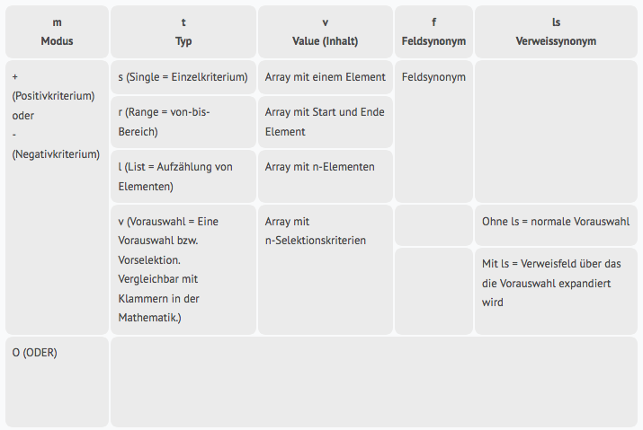

Select-Funktionen
=================

Selektieren von beliebigen Datensätzen in der Datenbank und Rückgabe der Fundstellen als Listenergebnis.

**Anfrageobjekt**

``` 
{
  "method": "Select",
  "requestid": 9,
  "param": {
    "UpdJsrHdl": "12345abcde67890fghij123abc",
 
    //Objekt mit Selektionskriterien
    "select" : {
 
               },
 
    //Liste mit der die Fundstellen dargestellt werden sollen
    'list_name' : 'Testliste', //Listenname einer gespeicherten Liste
    //oder
    'list_iid' : '123456789012345678901234', //24-stellige Listen-IId einer Liste
    //oder
    //Objekt mit einer eigenen definierten Simple-List
    'list' : {
 
             },
    //Anzahl Sekunden, die die Listenfunktion maximal Daten sammelt         
    'maxtime' : 2,
 
 
  }
}
```

- UpdJsrHdl - Gültiges UpdJsrHdl
- select - Objekt mit Selektionskriterien
- list_name - Listenname einer in der Datenbank gespeicherten Liste
- ist_iid - 24-stellige Listen-IId einer in der Datenbank gespeicherten Liste
- list - Objekt mit einer eigenen definierten Simple-List
-  maxtime - Anzahl Sekunden, die die Listenfunktion maximal Daten sammelt (0 = keine Einschränkung)

**Hinweis:**

Die Fundstellen werden immer komplett ermittelt, unabhängig von `maxtime`. Die Angabe von `maxtime` ist lediglich eine zeitliche Begrenzung der Funktion, die die Anzeigedaten ermittelt.

**select-Objekt**

JSON-Objekt mit Selektionskriterien.

- Key = Feldsynonym
- Value = Suchkriterien
- Felder über Verweise werden mit einem Punkt verbunden

**Hinweis:** Es ist zu beachten, dass es
mindestens ein einschließendes Suchkriterium geben muss. Die
einschließenden Suchkriterien bestimmen die Grundmenge, von der die
ausschließenden Kriterien abgezogen werden. In SQL  werden
beispielsweise über die Selektion einer Tabelle als Grundmenge alle
Einträge dieser Tabelle verwendet; dieses ist in der CortexDB nicht der
Fall. Die Selektion erfolgt feldbasiert; unabhängig von "Tabellen" und
Datensatztypen. Über das Feld *\#T* (Datensatztyp) können alle
Datensätze eines bestimmten Datensatztypes selektiert werden. Dieses ist
allerding mit Vorsicht einzusetzen, da die Selektion über dieses Feld
bei vielen Datensätzen länger dauern kann. Am besten sind immer
dedizierte Felder je Datensatztyp, die nur dort vorkommen können.

**Kurzschreibweise - Suchkriterien als String** 

Der Bindestrich (Minus), das Komma, die Klammern ( ) und der \*
(*"Asterisk*") am Ende haben eine besondere Bedeutung. Falls eines
dieser Zeichen im Suchstring vorkommt, dann ist ggf. die erweiterte
Schreibweise zu verwenden.

-   Aufzählung mit Komma trennen
-   von-/bis-Bereich mit Bindestrich trennen, der DAVOR und DAHINTER von
    einem Leerzeichen eingeschlossen wird
-   \* am Ende = Wildcard (unscharfe Suche)
-   Minus (Bindestrich) am Anfang ist ein Negativkriterium
-   sollen zu einem Feld mehrere Kriterien festgelegt werden, so sind
    die Suchkriterien als Array anzugeben

### Regelwerk

**Bindestriche / Minus**

Ein Bindestrich zur Angabe einer Range (von-bis-Bereich) muss von je
einem Leerzeichen vor und hinter dem Bindestrich umschlossen werden.
Erfolgt die Angabe eines Bindestrich ohne Leerzeichen, so wird dieser
als zu suchender Feldinhalt interpretiert.\
(Vgl. bspw. auch die [CSS-Syntax für "cal"](https://developer.mozilla.org/de/docs/Web/CSS/calc))

```
	Status A bis J									A - J
	
	Status "A-J" (also "A-J" als Feldinhalt)		A-J
	
	Projektwert von 5000 bis 10000					5000 - 10000
	
	Stadt Groß-Gerau								Groß-Gerau
	(kein Bereich, da der Bindestrich nicht von Leerzeichen eingeschlossen ist)   
```

Ein Minus (Bindestrich) zu Beginn des Statements bedeutet, dass dies ein
Negativkriterium ist.

```
	OHNE Status A					-A
	
	OHNE Projekte mit Wert 5000		-5000
```

Ein Negativkriterium kann auch eine Range beinhalten.

```
  OHNE Projekte im Wertebereich von 5000 bis 10000	-5000 - 10000
  
  OHNE Projekte mit Status J bis P					-J - P
  
  OHNE Ort Groß-Gerau								-Groß-Gerau
  
  (keine Range da 2. Bindestrich ohne Leerzeichen, funktioniert also)
```

Gibt es innerhalb eines Kriteriums negative Werte, so ist das
eigentliche Kriterium in Klammern einzuschließen.


```
	OHNE Projekte mit Projektwert -5000						-(-5000)
	
	OHNE Projekte mit Projektwert -5000 (doppeltes Minus)	--5000
	
	MIT Projekten mit Projektwert -5000						(-5000)
	
	OHNE Projekten mit Projektwert von -15000 bis -10000	--15000 - -10000
	(doppeltes Minus)
	
	OHNE Projekten mit Projektwert von -15000 bis -10000	-(-15000 - -10000)
	
	MIT Projekten mit Projektwert von -15000 bis -10000		(-15000 - -10000)
  
```

Vorgehensweise des Parsers

1.  Überprüfung ob das 1. Zeichen ein Minus ist, dann Negativkriterium (sonst Positivkriterium) und 1. Zeichen wird entfernt
2.  Überprüfung ob jetzt eine Klammer angegeben wurde. Dann Inhalt aus der Klammer als Kriterium
3.  Kriterium wird an den Kommata aufgesplitet, wenn mehrere Einträge vorhanden sind, werde diese als Aufzählung angenommen und die Werte werden ohne weitere Behandlung übernommen
4.  wenn nach Aufsplittung nur ein Kriterium vorhanden ist, dann wird dieses auf Range überprüft, das Kriterium wird mit Leerzeichen-Bindestrich-Leerzeichen gesplitet, wenn danach 2 Werte vorliegen werden diese als Range übernommen und die Behandlung ist zu Ende
5.  wenn keine Aufzählung und keine Range vorhanden sind, dann wird Wert als Einzelwert übernommen

``` 
//Beispiel: Aktionen von Eva Hilfreich, deren verwiesene Projekte den Status A haben
'select' : 
{
  'Wer' : 'Eva Hilfreich',
  'ProVerw.PrSt' : 'A'
}
 
//Beispiel: Alle Aktionen deren verwiesene Projekte den Status A, F oder H haben aber nicht die Aktionen von Eva Hilfreich
'select' : 
{
  'Wer' : '-Eva Hilfreich',
  'ProVerw.PrSt' : 'A,F,H'
}
 
//Beispiel: Aktionen von Eva Hilfreich und Harry Hurtig, deren verwiesene Projekte den Status A bis J haben
'select' : 
{
  'Wer' : 'Eva Hilfreich,Harry Hurtig',
  'ProVerw.PrSt' : 'A - J'
}
 
//Beispiel: Aktionen von Eva Hilfreich und Harry Hurtig, deren verwiesene Projekte NICHT den Status A bis J haben
'select' : 
{
  'Wer' : 'Eva Hilfreich,Harry Hurtig',
  'ProVerw.PrSt' : '-A - J'
}
 
//Beispiel: Aktionen deren verwiesene Projekte den Status K haben und deren verwiesene Personen einen Namen haben der mit M beginnt
'select' : 
{
  'ProVerw.PerVerw.Name' : 'M*',
  'ProVerw.PrSt' : 'K'
}
 
//Beispiel: Alle Aktionen von Eva Hilfreich und Harry Hurtig, aber ohne die, die Aktionsstatus E bis H haben
'select' : 
{
  'Wer' : 'Eva Hilfreich,Harry Hurtig',
  'AktSt' : '-E - H'
}
 
//Beispiel: Alle Aktionen deren verwiesene Projekte den Status A haben aber NICHT die Aktionen von Eva Hilfreich
'select' : 
{
  'Wer' : '-Eva Hilfreich',
  'ProVerw.PrSt' : 'A'
}
 
/* **************
Mehrere Kriterien in einem Feld
************** */
//Beispiel: Aktionen von Eva Hilfreich und Harry Hurtig, deren verwiesene Projekte den Status A bis J haben und Status K aber nicht Status F
'select' : 
{
  'Wer' : 'Eva Hilfreich,Harry Hurtig',
  'ProVerw.PrSt' : [ 
                    'A - J',
                    'K',
                    '-F'
                   ]
}
``` 

#### Erweiterte Suchkriterien 

``` 
/* 
Suchkriterien als JSON-Objekt = Erweiterte Suchkriterien
 - jedes Suchkriterium ist ein JSON-Objekt
 
 'm' : '+'  //bestimmt den Modus, + = positives Kriterium, - = negatives K. -> optional, wenn m fehlt dann m=+
 't' : 's'  //bestimmt den Typ, s=Single-Eintrag, r= Range (von-bis-Bereich), l=list (Auflistung) -> optional, wenn t fehlt dann t=s
 'v' : []   //Array mit Suchkriterien, bei Single= 1 Eintrag, bei range 2 Einträge, bei ist 1 bis n Einträge
 
*/
 
//Beispiel: Aktionen von Eva Hilfreich die NICHT den Status A haben
'select' : 
{
  'Wer' : ,
  'AktSt' : 
}
 
//da m (bei +) und t (bei s) optional sind wäre auch folgende Schreibweise möglich
'select' : 
{
  'Wer' : ,
  'AktSt' : 
}
 
//es sollen alle Personen gefunden werden, die in Groß-Gerau oder Neuenkirchen-Vörden wohnen
'select' : 
{
  'Ort' : 
}
 
//Beispiel es sollen alle Personen gefunden werden, die in Groß-Gerau oder Neuenkirchen-Vörden wohnen oder in einem Ort der mit Nau* anfängt
//deren verwiesene Firma soll im Postleitzahlenbreich 494* liegen oder im Bereich 64501–64521 aber NICHT die Plz 49434 haben
'select' : 
{
  'Ort' : [
            ,
            ,
          ]
  'FirVerw.Plz' : [
                    ,
                    ,
                    ,
                  ]
}
 
//es ist auch ein Mischen zwischen Kurzschreibweise und erweiterter Schreibweise möglich
//vorheriges Beispiel abgewandelt in minimaler Schreibweise
'select' : 
{
  'Ort' : [
            ,
            'Nau*',
          ]
  'FirVerw.Plz' : [
                    '494*',
                    '64501 - 64521',
                    '-49434',
                  ]
}
``` 

### Listenausgabe 

JSON-Objekt mit einer eigenen Simple-List.

- Key 'f' = Array mit Anzeigefeldern
- Key 's' = Array mit Anzeigefeldern nach denen sortiert werden soll (**es kann nur nach Felder sortiert werden, die auch als Anzeigefeld definiert sind**)
- Felder über Verweise werden mit einem Punkt concated

``` 
//Beispiel, es wurden Aktionen gesucht und sollen angezeigt werden

'list' : 
{
  'f' : [
          //Daten aus der Aktion
          'Aktion',
          'Wer',
          'AktSt',
 
          //Projektname
          'ProVerw.Projekt',
 
          //Daten aus der über das Projekt verwiesenen Person
          'ProVerw.PerVerw.Name',
          'ProVerw.PerVerw.VorNam',
 
          //Reihenfolge ist egal -> nochmal 2 Felder aus der Aktion
          'AktDatum',
          'WdvSt'
 
        ],
 
  's' : [
          //1. Sortierfeld Aufsteigend
          '<AktSt',
 
          //2. Sortierfeld Absteigend
          '>AktDatum'
 
        ]
 
}
``` 

**Hinweis:** Wenn die `maxtime` definiert
ist und die Listendaten nur teilweise ermittelt werden, dann greift die
Sortierung nur auf den ermittelten Ausschnitt zu! Es erfolgt keine
Sortierung der Fundstellen vorab. Sucht man also z.B. 1.000.000
Fundstellen und lädt 2 Sekunden Anzeigedaten, dann greift die Sortierung
über die bspw. ermittelten 20.000 Datensätze. Man hat dann aber NICHT
die laut Sortierung ersten 20.000 der Gesamtmenge.

 

**Rückgabeobjekt**

``` 
{
    "rc": 0,
    "error": "",
    "data": 
    {
      'i' : {
              //Anzahl der Fundstellen
              'counttotal' :  116,
 
              //Dauer Fundstellen ermitteln
              'timeselect' :  0.0093,
 
              //Dauer Listendaten ermitteln (optional)
              'timeget' :  0.05,
 
              //Anzahl der Fundstellen zu denen Listendaten ermittelt wurden (optional)
              'countget' :  116
            },
      'c' : ,
      'd' : [ ]
    }
}
``` 

- rc - Returncode der Methode. 0 → OK, sonst Fehler
- error - Falls ein Fehler aufgetreten ist, steht hier eine Kurzmeldung
- data - Objekt mit den ermittelten Daten, es wird ein Listenresult-Objekt zurückgegeben, sollte es keine Fundstellen geben, existiert nur der i-Key


erweitertes Selektieren
-----------------------

In manchen Fällen können die bisher beschriebenen
Selektionsmöglichkeiten nicht ausreichend sein bzw. beschränkend wirken.
Dafür gibt es die Möglichkeit die Selektionskriterien direkt im
Serverformat anzugeben.

Dabei sind einige Dinge zu beachten, die durch das einfache Select
optimiert werden:

- Aufbau von Verlinkungsketten
- Automatische Veroderung bei mehreren Positivkriterien in einem Feld
- Bedeutung der Reihenfolge zwischen Positiv- und Negativkriterien
- Automatisierter Moduswechsel bei Verlinkungen mit Negativkriterien

Um die erweiterte Selektion zu benutzen, übergibt man der
Select-Funktion kein Objekt sondern ein "Array" von Objekten, deren
Aufbau im Folgenden beschrieben wird:

``` 
//Beispiel: Einfaches Select -> siehe oben
'select' : 
{
  'Wer' : 'Eva Hilfreich',
  'ProVerw.PrSt' : 'A'
}
 
//Beispiel: Experten Select
'select' : 
[
  ,
  ,
  
]
```

### Aufbau - Expertenselektion 

Der komplette Aufbau ist ein JSON-Objekt. Wobei im select-Key ein Array
von Objekten vorliegt. Jedes Objekt stellt dabei ein Selektionkriterium
dar.

	//Beispiel: Experten Select
	'select' : 
	[
	  {
		'm' : '+',
		't' : 's',
		'f' : 'Wer',
		'v' : ['Eva Hilfreich']
	  },
	  {
		'm' : '+',
		't' : 'l',
		'f' : 'AktSt',
		'v' : ['A', 'K', 'N']
	  }
	]



#### Beispiel Expertenselektion - Reihenfolge der Kriterien 

	//Beispiel von oben:
	//Alle Aktionen deren verwiesene Projekte den Status A haben aber NICHT die Aktionen von Eva Hilfreich

	'select' : 
	{
	  'Wer' : '-Eva Hilfreich',
	  'ProVerw.PrSt' : 'A'
	}
 
	//Expertenselect
	'select' : 
	[
	  {
		'm' : '-',
		't' : 's',
		'f' : 'Wer',
		'v' : ['Eva Hilfreich']
	  },
	  {
		'm' : '+',
		't' : 'v',
		'ls' : 'ProVerw',
		'v' : [
				{
				  'm' : '+',
				  't' : 's',
				  'f' : 'PrSt',
				  'v' : ['A']
				}
			  ]
	  }
	]

***ACHTUNG***

Das Beispiel ist scheinbar richtig, wird aber kein Ergebnis liefern, da die Reihenfolge der Kriterien hier eine Rolle spielen.
 
Wir erinnern uns:  Dabei sind einige Dinge zu beachten, die durch das einfache Select optimiert werden:
-> Bedeutung der Reihenfolge zwischen Positiv- und Negativkriterien
 
Negativkriterien können nur von einer bereits selektierten Menge abgezogen werden. Also müssen in diesem Fall die Kriterien vertauscht werden.


	'select' : 
	[
	  {'m' : '+', 't' : 'v', 'ls' : 'ProVerw', 'v' : [{'m' : '+', 't' : 's', 'f' : 'PrSt', 'v' : ['A']}]},
	  {'m' : '-', 't' : 's', 'f' : 'Wer', 'v' : ['Eva Hilfreich']}
	]

**HINWEIS:**

Einfache Regel: Jeder Block (bzw. Vorauswahl) von Selektionskriterien muss mit einem Positivkriterium beginnen! ]

#### Beispiel Expertenselektion - Veroderung der Kriterien eines Feldes 

``` 
//Beispiel es sollen alle Firmen gefunden werden, die im Postleitzahlenbreich 494* liegen oder im Bereich 64501–64521 aber NICHT die Plz 49434 haben
'select' : 
{
  'Plz' : [
            ,
            ,
            ,
          ]
}
 
//Expertenselect
'select' : 
[
  {
    'm' : '+',
    't' : 'v',
    'v' : [
            {
              'm' : '+',
              't' : 's',
              'f' : 'Plz',
              'v' : ['494*']
            },
            {
              'm' : '|'
            },
            {
              'm' : '+',
              't' : 'r',
              'f' : 'Plz',
              'v' : ['64501', '64521']
            }
          ]
  },
  {
    'm' : '-',
    't' : 's',
    'f' : 'Plz',
    'v' : ['49434']
  }
]
/*
Die positiven Kriterien der Plz-Suche müssen zunächst verodert werden, da man die gesamte Menge finden möchte. Danach wird das Negativkriterium abgezogen.
*/
```

#### Beispiel mit Notwendigkeit Expertenselektion 

Die Beispiele bisher lassen sich über das normale Select viel eleganter
lösen. Deshalb hier ein paar Beispiele, die sich nur mit der
Expertenselektion lösen lassen.

``` 
/*
  Beispiel
  In einer Wiederholfeldgruppe sind zu Personen 1 bis n Bankverbindungen gespeichert.
  Es sollen nun alle Personen gefunden werden, die ein Konto bei der Postbank UND Sparkasse haben.
 
  Über das einfache Select könnte man nur Personen finden die zumindest bei einer der Banken ein Konto haben.
  Hier steht die automatische Veroderung der Positivkriterien eines Feldes im Weg, die im Expertenselect nicht greift.
*/
 
'select' : 
[
  {
    'm' : '+',
    't' : 's',
    'f' : 'Bank',
    'v' : ['Sparkasse']
  },
  {
    'm' : '+',
    't' : 's',
    'f' : 'Bank',
    'v' : ['Postbank']
  }
]
```

**Hinweis:** Bei einer Range ist das erste Element die Startposition und das zweite Element die Ende-Position. Eines der Beiden kann auch fehlen.]

``` 
/*
  Beispiel, Einsatz von Oder
 
  Männliche Personen die zwischen 1963 und einschl. April 1965 geboren sind
  oder
  Weibliche Personen die 2 oder mehr Kinder haben und mind. vor 1978 geboren sind
*/
 
'select' : 
[
  { 'm' : '+', 't' : 's', 'f' : 'Gesch', 'v' : ['M'] },
  { 'm' : '+', 't' : 'r', 'f' : 'GebDat', 'v' : ['1963*', '196504*'] },
  { 'm' : '|' },
  { 'm' : '+', 't' : 's', 'f' : 'Gesch', 'v' : ['W'] },
  { 'm' : '+', 't' : 'r', 'f' : 'GebDat', 'v' : ['', '1978'] },
  { 'm' : '+', 't' : 'r', 'f' : 'Kinder', 'v' : [2] },
]
```

**WICHTIG:** Aus Performancegründen Kriterien der selben Ebene in einem Block immer in EINER Vorauswahl zusammenfassen. Siehe folgendes Beispiel. ]

``` 
/*
  Beispiel
 
  Projekte mit Status A, deren Abschluß innerhalb des letzten Quartals erfolgte
  deren verwiesene Personen mit
  Namen Meier heißen und Männlich sind
 
*/
 
'select' : 
[
  { 'm' : '+', 't' : 's', 'f' : 'ProSt', 'v' : ['A'] },
  { 'm' : '+', 't' : 'r', 'f' : 'Abschl', 'v' : ['-1qa', '-1qe'] },
  { 'm' : '+', 't' : 'v', 'ls' : 'PersVer', 'v' : [
                                                    { 'm' : '+', 't' : 's', 'f' : 'Gesch', 'v' : ['M'] },
                                                    { 'm' : '+', 't' : 's', 'f' : 'Name', 'v' : ['Meier'] }
                                                  ] }
]
```

### Rückgabeobjekt 

``` 
{
    "rc": 0,
    "error": "",
    "data": 
    {
      'i' : {
              //Anzahl der Fundstellen
              'counttotal' :  116,
 
              //Dauer Fundstellen ermitteln
              'timeselect' :  0.0093,
 
              //Dauer Listendaten ermitteln (optional)
              'timeget' :  0.05,
 
              //Anzahl der Fundstellen zu denen Listendaten ermittelt wurden (optional)
              'countget' :  116
            },
      'c' : ,
      'd' : [ ]
    }
}
```

- **rc** - Returncode der Methode. 0 → OK, sonst Fehler
- **error** - Falls ein Fehler aufgetreten ist, steht hier eine Kurzmeldung
- **data** - Objekt mit den ermittelten Daten, es wird ein Listenresult-Objekt zurückgegeben, sollte es keine Fundstellen geben, existiert nur der i-Key

### Fehlercodes

``` 
//Fehlercodes Select
-5100 no selection criteria
-5101 unknown date format

-5111 unknown field or wrong basetype
-5112 field access denied
-5113 link field required
-5114 only negative criteria
-5115 first criteria negative
-5116 expansion doublette linksy
```
