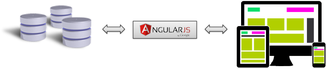

Beispiele mit AngularJS 
=======================

Bei AngularJS handelt es sich um eine Javascript-Bibliothek für die
Entwicklung von Anwenderoberflächen, die z.T. mit anderen Bibliotheken
kombiniert wird (z.B. Bootstrap, JQuery u.a.). Diese Bibliothek
vereinfacht und beschleunigt die Entwicklung erheblich. Im Regelfall ist
für Datenbankabfragen eine Zwischenschicht notwendig, über die bestimmte
Funktionen ausgeführt werden. Üblicherweise wird hierbei auf weitere
Bibliotheken und Programmiersprachen zurückgegriffen (z.B. Java, nodeJS,
u.a.).

Die CortexDB ermöglicht über die CortexUniplexWebAPI und einer konfigurierten
Datenbank die sofortige Nutzung von AngularJS. Im Idealfall kann somit
die Zwischenschicht entfallen.



Die hier aufgeführten Beispiele zeigen daher in möglichst einfacher
Form, wie auf eine CortexDB per CortexUniplexWebAPI zugegriffen werden kann.

Beachten Sie, dass die grundsätzlichen Parameter mit denen der anderen
Beispiele (php und python) übereinstimmen. Die JSON-Objekte sind daher
wie in der allgemeinen Erläuterung zu verarbeiten.

 

!!! note "Hinweis"
	Die Nutzung der CortexUniplexWebAPI erfolgt in einem Benutzerkontext. Die parallele Nutzung mehrerer Sitzungen im gleichen Benutzerkontext ist nicht möglich.

Im Regelfall werden Funktionen bei der Nutzung von AngularJS per
Services oder Direktiven bereitgestellt. Die hier gezeigten Beispiele
zeigen nur einen Ausschnitt aus einer Gesamtanwendung, so dass Sie diese
in Ihre eigenen Quelltexte möglichst einfach übernehmen können.

### getLogin

Dieses Code-Snippet führt einen Login zu dem angegebenen Benutzer durch.
Der Benutzername und das Passwort werden üblicherweise in Form einer
Loginmaske abgefragt. War der Login erfolgreich wird neben weiteren
Informationen auch ein User-Handle zurückgeliefert, mit dem alle
weiteren Anfragen über die CortexUniplexWebAPI durchgeführt werden. Dieses
User-Handle ist daher in einer globalen Variable (oder einem Objekt) zu
speichern.

``` 
this.login = function() {

    var sDsURI = "https://my-server.com/i/UniPlexDataservice/updjsr.php";

    var locObj = {
                  "method": "getLogin",
                  "requestid": 1,
                  "param": {
                      "user": "myUserName",
                      "pass": "myUserPass",
                      "app": "UniplexDatasservice"
                  }
    };

    $http.post(sDsURI,JSON.stringify(locObj)).success(function(response) {
        if(response['result']['rc']===0) {
            . . . 
        }
    });
};
```

 

### getLogout

Analog zu dem Login erfolgt der Logout mit dem User-Handle. Nach einem
erfolgreichen Logout kann mit dem User-Handle keine weitere Abfrage
stattfinden. Erst mit einem erneuten Login (und damit mit einem neuen
User-Handle) kann der Anwender weiterarbeiten.

``` 
this.logout = function() {

   var sDsURI = "https://my-server.com/i/UniPlexDataservice/updjsr.php";

   var locObj = {
                "method": "getLogout",
                "requestid": 2,
                "param": {
                    "UpdJsrHdl": this.userHdl //Variable for user handle
                }
    };

    $http.post(sDsURI,JSON.stringify(locObj)).success(function(response){
         if(response['result']['rc']===0) {
             . . . 
         }
    });
};
```

### getPortalListe

Dieses Code-Snippet liefert alle Portale des angemeldeten Benutzers
zurück.

``` 
this.getPortals = function() {

    var sDsURI = "https://my-server.com/i/UniPlexDataservice/updjsr.php";

    var locObj = {
        "method": "getPortalList",
        "requestid": 3,
        "param": {
            "UpdJsrHdl": this.userHdl // variable for user handle
        }
    };

    $http.post(sDsURI,JSON.stringify(locObj)).success(function(response) {
     if(response['result']['rc']===0) {
 		. . .
        }
    });
};
```
