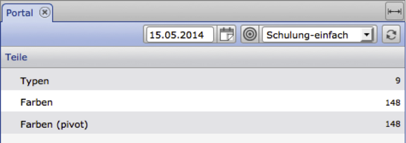

PHP-Beispiele
=============

notwendige PHP-Funktionen
-------------------------

Für die PHP-Beispiele werden die hier aufgeführten PHP-Funktionen
genutzt. Die entsprechende Erläuterung und notwendigen Parameter
entnehmen Sie bitte der PHP-Dokumentation.

    stream_context_create

    file_get_contents

    json_encode

    json_decode

Mit diesen Funktionen ist es möglich einen HTTP-Aufruf durchzuführen und
ein zuvor definiertes Array zu konvertieren, um es dann als
HTTP-Parameter zu übergeben.

Der generelle Ablauf gliedert sich in folgende Schritte:

1.  Zusammenstellen der Parameter für die CortexUniplexWebAPI
2.  Festlegen der Parameter für den HTTP-Aufruf
3.  Konvertierung aller Parameter für den HTTP-Aufruf
    ("stream\_context\_create")
4.  Aufruf der CortexUniplexWebAPI-URL mit Übergabe der Parameter
    ("file\_get\_contents")
5.  Die Auswertung der Rückgabewerte (ggf. mit "json\_decode").


Abfrage eines Portals
---------------------

Dieses Beispiel erläutert die Abfrage eines Portals und die
entsprechenden Rückgabewerte. Grundsätzlich erwartet die CortexUniplexWebAPI
Parameter als json-String. Dieser wird in PHP als Array definiert und
entsprechend konvertiert. Dadurch ist der Quelltext einfacher zu lesen
(und zu erläutern).

Innerhalb der Beispieldatenbank wurde das Portal "Schulung-einfach"
eingerichtet. Dieses beinhaltet in der Gruppe "Teile" die drei Zeilen
"Typen", "Farben" und "Farben (pivot)".



Um die Inhalte genau dieses Portals abzufragen, steht in der CortexUniplexWebAPI folgende Methode bereit:

    getPortalRows

Dieser Methodenname in Verbindung mit dem Namen des Portals liefert als
Ergebnis ein JSON-Objekt, dass die Zusammensetzung des hier angezeigten
Portals abbildet. Um den Namen und weitere Parameter übergeben zu
können, ist ein Array erforderlich, das für die HTTP-Übergabe mit Hilfe
von PHP-Funktionen in einen json-String konvertiert wird.

``` 
$jRequest = array('method'   => 'getPortalRows',
      'requestid' => 1,
      'param'     => array(
                        array('portal' => 'Schulung-einfach')
                     ));
```

Der Eintrag "method" definiert hier die aufzurufende Methode; die
Request-ID eine eindeutige ID, um bei asynchron ablaufenden Anfragen die
Rückgabedaten wieder eindeutig zuordnen zu können; und die Parameter
(über "param") definieren die Parameter für die aufzurufende CortexUniplexWebAPI-Methode.

Für den HTTP-Aufruf erfolgt die Definition weiterer Parameter und deren
Kombination mit den oben genannten:

``` 
$CONTEXT_OPT = array('http' => array(
       'method'    => 'POST',
       'content'   => json_encode($jRequest),
       'header'    => 'Content-Type: application/json\r\n'.
                      'Accept: application/json\r\n'));
```

Bei den Parametern "method" und "header" handelt es sich um
Standard-HTTP-Parameter. Zu beachten ist hierbei, dass der Parameter
"content" das zuvor definierte Array als JSON-Objekt beinhaltet.

Dieses Array wird nun per PHP-Funktion *"stream\_context\_create*"
konvertiert und mit Hilfe von "*file\_get\_contents*" an die URL der CortexUniplexWebAPI übergeben.

``` 
$context = stream_context_create( $CONTEXT_OPT );
$jRes = file_get_contents( $url, false, $context );
```

Wenn der Aufruf erfolgreich war, beinhaltet die Variable "*\$jRes*"
einen json-String, der das Portal "Schulung-einfach" beschreibt.

**Rückgabewert der Portalkonfiguration (json-String)**

``` 
{"requesterror":0,
"requestid":1,
"requestmethod":"getPortalRows",
"requestduration":0.0157,
"result":{
  "rc":0,
  "error":"",
  "data":{
    "g":[{
      "n":"Teile",
      "z":[{
         "n":"Typen",
         "b":"",
         "id":null,
         "rownr":"0",
         "list":"Item-Type List",
         "listiid":"2066f650fa20202020212023",
         "pivot":""
        },
        {
         "n":"Farben",
         "b":"",
         "id":null,
         "rownr":"1",
         "list":"Colour-List",
         "listiid":"2066f64ec520202020212023",
         "pivot":""
        },
        {
         "n":"Farben (pivot)",
         "b":"","id":null,
         "rownr":"2",
         "list":"Colour-List",
         "listiid":"2066f64ec520202020212023",
         "pivot":"Farbe je Jahr"
        }],
     "id":null,
     "groupnr":"0"
     }],
  "i":"206decae3820202020212023",
  "n":"Schulung-einfach",
  "LastBearbId":"206decae8820202020212023"
  }
 }
}
```

Die Rückgabewerte zu der eigentlichen Anfrage ("request") befinden sich
innerhalb dieses JSON-Objektes auf der obersten Ebene der Hierarchie. In
dem gezeigten Beispiel liefert der Wert *"requesterror*" den Wert null,
wenn die Anfrage korrekt beantwortet werden konnte. Die *"requestid*"
und *"requestmethod*" liefern dieselben Werte zurück, mit der die
Anfrage gestellt wurde. Über die *"requestduration*" ist ersichtlich,
wie schnell (in Sekunden) die Anfrage abgearbeitet wurde.

Das Ergebnis zu der abgefragten Methode befindet sich in der
Unterstruktur `result` -> `data`.

Innerhalb der Unterstruktur "data" befinden sich unter dem Bezeichner
"g" die Gruppen. Der Name des Portals ist innerhalb von "data" unter
dem Schlüssel "n" abzulesen.

``` 
"data":{
    "g":[{
      [.......]
    }],
    "i":"206decae3820202020212023",
    "n":"Schulung-einfach",
    "LastBearbId":"206decae8820202020212023" 
```

Innerhalb einer Gruppe befinden sich der Name der Gruppe unter dem
Schlüssel "n" und die einzelnen Zeilen unter dem Schlüssel "z".

``` 
"n":"Teile",
"z":[{
      "n":"Typen",
      "b":"",
      "id":null,
      "rownr":"0",
      "list":"Item-Type List",
      "listiid":"2066f650fa20202020212023",
      "pivot":""
      },
```

Je Zeile sind der Name ("n"), die Zeilennr, ("rownr"), die
aufzurufende Liste ("list") mit der dazugehörenden ID und ggf. die
aufzurufende Pivot-Tabelle ("pivot") der Liste ersichtlich.

Über die Inhalte dieses JSON-Objektes erfolgt nun die Abfrage weiterer
Informationen aus der Datenbank. Sind die Portal-Informationen bereits
bekannt, können Sie auf das Auslesen der Portalkonfiguration verzichten.

### Beispiel eine Portalabfrage

``` 
<?
//*** url to call the CortexUniplexWebAPI in the correct database ***// 
$url = 'http://localhost/i/UniPlexDataservice/updjsr.php';

//*** Request-ID to identitfy the correct returned json object ***// 
$iRequestID = 1;


//*** Begin: User-Handle ***//

//*** request user login for the CortexUniplexWebAPI ***// 
$jRequest = array('method'   => 'getLogin',
                  'requestid' => $iRequestID,
                  'param'     => array(
                        'user' => 'admin',
                        'pass' => 'admin',
                        'app' => 'UniplexDataservice'
                  )
            );
//*** parameter-array for php-function 'stream_context_create' ***// 
$CONTEXT_OPT = array(
  'http' => array( 'method' => 'POST',
                   'content' => json_encode($jRequest),
                   'header'=> 'Content-Type: application/json\r\n' .
                   'Accept: application/json\r\n')
                  );

//*** create context params for php-function 'file_get_contents' ***// 
$context = stream_context_create( $CONTEXT_OPT );

//*** get contents with params and decode json-object ***// 
$jRes = file_get_contents( $url, false, $context ); 
$aRes = json_decode($jRes, true);


$sUsrHdl = $aRes['result']['data']['UpdJsrHdl'];

//*** End: User-Handle ***//


//*** Begin: portal call ***//

//*** request definition for the CortexUniplexWebAPI ***// 
$jRequest = array('method'   => 'getPortalRows',
                  'requestid' => $iRequestID,
                  'param'     => array(
                       'portal' => 'Schulung-einfach',
                       'UpdJsrHdl' => $sUsrHdl
                  )
            );

//*** parameter-array for php-function 'stream_context_create' ***// 
$CONTEXT_OPT = array(
  'http' => array( 'method' => 'POST',
                   'content' => json_encode($jRequest),
                   'header'=> 'Content-Type: application/json\r\n' .
                   'Accept: application/json\r\n')
                  );

//*** create context params for php-function 'file_get_contents' ***// 
$context = stream_context_create( $CONTEXT_OPT );

//*** get contents with params and decode json-object ***// 
$jRes = file_get_contents( $url, false, $context ); 
$aRes = json_decode($jRes, true);

//*** End:portal call ***//


//*** print result ***// 
print_r($aRes);

?>
```

### Beispiel einer Portalliste

``` 
//*** url to call the CortexUniplexWebAPI in the right database ***// 
$url = 'http://localhost/i/UniPlexDataservice/updjsr.php';

//*** Request-ID to identitfy the right returned json object ***// 
$iRequestID   = 1;


//*** Don't forget to get the user handle ***//
/*
   . . . 
*/ 


//*** get specific row data ***// 
$jRequest   = array(
                 'method'   => 'getPortalRowListData',
                'requestid' => $iRequestID,
                'param'     => array(
                'portal'    => 'Schulung-einfach',
                'UpdJsrHdl' => '___abcdefghijklmn___', // <- set handle!!!
                'group'     => 'Teile',
                'row'       => 'Typen'
                 )
  );

//*** parameter-array for php-function 'stream_context_create' ***// 
$CONTEXT_OPT = array(
  'http' => array( 'method' => 'POST',
               'content' => json_encode($jRequest),
               'header'=> 'Content-Type: application/json\r\n' .
               'Accept: application/json\r\n')
            );

//*** create context params for php-function 'file_get_contents' ***// 
$context = stream_context_create( $CONTEXT_OPT );

//*** get contents with params and decode json-object ***// 
$jRes = file_get_contents( $url, false, $context ); 
$aRes = json_decode($jRes, true);

//*** print result ***// 
print_r($aRes);

?>
```

### PHP-Beispiel mit Funktion

``` 
<?php

    //*** url to call the CortexUniplexWebAPI in the right database ***//
    $url = 'http://localhost:81/i/UniPlexDataservice/updjsr.php';

    //*** Request-ID to identitfy the right returned json object ***//
    $iRequestID    = 1;
    
    function request($method, $param = array()) {
        global $iRequestID,$url;
        $REQUEST   = array("method"   => $method,
                          "requestid" => $iRequestID++,
                          "param"     => $param );

        $CONTEXT_OPT = array(
        'http' => array(
        'method' => 'POST',
        'content' => json_encode($REQUEST),
        'header'=> "Content-Type: application/json\r\n".
                   "Accept: application/json\r\n")
        );
                        
        $context = stream_context_create( $CONTEXT_OPT );
        $aRes = json_decode(file_get_contents( $url, false, $context ), true);
        return $aRes;
    }

    function prText($text) {
        print('<pre>');
        print($text."\r\n");
        print('</pre>');
    }
    
    function prArray($array) {
        print('<pre>');
        print_r($array);
        print('</pre>');
    }
    
    prText('********* getLogin *********');
    $jRequest = array(    'user' => 'admin',
                        'pass' => 'admin',
                        'app' => 'UniplexDataservice'    );
    $aRes = request('getLogin', $jRequest);  
    $sUsrLogin = $aRes['result']['data']['UpdJsrHdl'];
    prArray($aRes);


    prText('********* getPortalList *********');
    $jRequest = array('UpdJsrHdl' => $sUsrLogin);
    $aRes = request('getPortalList', $jRequest);
    prArray($aRes);


    prText('********* getPortalRows *********');
    foreach($aRes['result']['data'] as $key => $value) {
        $jRequest = array(    'portaliid' => $value['i'],
                            'UpdJsrHdl' => $sUsrLogin,
                            'pivotlist' => '1'
                            );
        $aRes = request('getPortalRows', $jRequest);
        prArray($aRes);
    }

    prText('********* getLogout *********');
    $jRequest    = array('UpdJsrHdl' => $sUsrLogin);
    $aRes = request('getLogout', $jRequest);
    prArray($aRes);

?>
```
