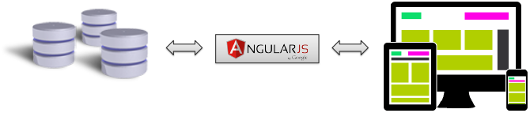

CortexUniplex WebAPI 
=====================

Die WebAPI des CortexUniplex basiert auf der Konfiguration
und dem Schema des CortexUniplex. Dieses hat zur Folge, dass alle
Einstellungen und Festlegungen, die innerhalb des CortexUniplex konfiguriert
wurden, über die API zur Verfügung stehen. Der CortexUniplex kann daher als
Administrationswerkzeug für die WebAPI dienen.

Viele Funktionen, die bei anderen Datenbanken üblicherweise über API's oder Abfragesprachen zur Verfügung stehen, werden damit in den HTTP-Server verlagert. Daher wird die Nutzung der API für Software-Entwickler vereinfacht und die Entwicklungszeit beschleunigt. 

Über verschiedene Parameter kann die Rückgabe ausgesuchter Informationen bestimmt werden. Die Rückgabe erfolgt dabei immer als JSON-Objekt. Eine Nutzung über unterschiedliche Programmiersprachen und Endgeräte ist daher möglich.



Eigenschaften der WebAPI
-------------------------

### Rechte und Rollen

Für die zurückgelieferten Ergebnisse werden die Rechte und Rollen, sowie
die Feld- und Benutzervorlagen des CortexUniplex beachtet. Der
Benutzerkontext, mit dem die HTTP-API genutzt wird, ist somit relevant.
Hier gilt also auch, dass es für Software-Entwickler einfacher ist,
Rechte und Rollen zu berücksichtigen.

### Portal-Selektionen, Listen und Pivot-Listen

Die konfigurierten (Pivot-) Listen und Portale werden über die
entsprechenden API-Funktionen als sog. "json-Objekte" zurückgeliefert.
Die weitere Nutzung in unterschiedlichen Programmiersprachen ist daher
sehr einfach und schnell möglich und Ihre individuellen Entwicklungen
können sehr flexibel umgesetzt werden.

### individuelle Abfragen, sowie Erstellen, Lesen und Aktualisieren von Datensätzen

Neben den o.g. Funktionen zur Nutzung der vorkonfigurierten
Portal-Selektionen, Listen und Pivot-Listen sind auch individuelle
Abfragen möglich. Ergänzend dazu auch das Erstellen, Lesen und
Aktualisieren von Datensätzen.

### Anfragen an den Server

Die CortexUniplex WebAPI ermöglicht ein JSON-Messaging über eine URL,
an die per "POST" JSON-Objekte als Parameter übergeben werden. Eine
zusätzliche Zwischenschicht auf der Serverseite ist im Regelfall nicht
mehr notwendig, da die definieren Konfigurationen des CortexUniplex
vollständig berücksichtigt werden. Dadurch entfällt für einen
Softwareentwickler die Notwendigkeit, eine Abfragesyntax programmatisch
(ggf. über eine Zwischenschicht) entwickeln zu müssen.

Durch die zu Grund liegenden Konfigurationen ergibt sich der Vorteil,
dass Fachbereiche eine Datenbank konfigurieren und einzelne
Arbeitsprozesse manuell testen können, um dann über die
Softwareentwicklung entsprechende Oberflächen (GUI) anzufordern. Für die
Softwareentwicklung bedeutet das in zweifacher Hinsicht eine erhebliche
Beschleunigung des Entwicklungsprozesses, weil nur grundlegende
Kenntnisse über die Datenbank notwendig sind und weil die CortexUniplexWebAPI
bereits alle Rechte und Rollen berücksichtigt.

Die hier gezeigten Beispiele nutzen u.a. die Programmiersprachen PHP
und Python. Hierbei handelt es sich um eine einfache Sprache, deren
Syntax ohne weiteres in andere Sprachen übersetzt werden kann. Des
Weiteren erhalten Sie auch einfache Beispiele für die Nutzung mit
AngularJS.

Voraussetzungen
---------------

Grundsätzlich müssen vor der Nutzung der WebAPI eine CortexDB
konfiguriert und Benutzer mit dem Recht "Dataservice" (zur Nutzung der CortexUniplexWebAPI) eingerichtet
sein. Hierbei ist zu beachten, dass die entsprechenden Benutzer
mindesten einmal den CortexUniplex aufgerufen haben, um den sog.
"Default-Datensatz" eines Benutzers zu generieren (in den Systemeinstellungen kann dieses auch druch einen ADministrator ausgeführt werden).

Alle Berechtigungen des CortexUniplex gelten daher auch für die Nutzung über
die WebAPI. Die Datensatzberechtigungen sowie die
Funktionsberechtigungen (z.B. Portale und Suchen), die ein Benutzer
innerhalb des CortexUniplex nutzen könnte, stehen per CortexUniplexWebAPI zur
Verfügung. Wurden entsprechende Rechte für einen Benutzer entfernt, sind
diese nicht per CortexUniplexWebAPI zu erreichen.

Wird einem Benutzer das Recht entfernt, den CortexUniplex zu nutzen, kann
dennoch das Recht für die WebAPI bestehen bleiben. Die gesetzten
Berechtigungen, die dieser Benutzer im CortexUniplex hätte, gelten weiterhin
auch für die WebAPI. Die Benutzerrechte sind daher weiterhin per
Remote-Admin zu verwalten.

Aufrufe der WebAPI
-------------------

Bei den hier gezeigten Erläuterungen wird davon ausgegangen, dass eine
CortexDB lokal auf dem Computer eingerichtet ist, auf dem auch die
Softwareentwicklung durchgeführt wird. In anderen Umgebungen sind die
hier dargestellten URL's entsprechend anzupassen.

Wurde die CortexUniplexWebAPI als Plugin über die entsprechende xjz-Datei in der
CortexDB eingebunden, kann mit folgendem Aufruf die Erreichbarkeit
geprüft werden:

``` 
http://localhost/i/UniPlexDataservice/updjsr.php
```

Findet die Verbindung statt, liefert die CortexUniplexWebAPI das folgende
JSON-Objekt ohne Ergebnis zurück:

Da hier keine Parameter übergeben wurden, wird als Rückgabefehler
(„requesterror") der Fehlercode „-1" zurückgeliefert. Alle weiteren
Felder bleiben leer.

Kann die CortexUniplexWebAPI generell nicht erreicht werden, wird ein
http-Fehler von Webserver zurückgegeben.

**HINWEIS:**

Innerhalb der ini-Dateien zur Konfiguration kann der Port zum Aufrufen von
Webseiten festgelegt werden. Wurde hier der Eintrag „80" auf einen
anderen Wert geändert, ist die URL entsprechend anzupassen. Das folgende
Beispiel zeigt den Aufruf, wenn statt Port 80 der Port 8080 genutzt wird:

``` 
http://localhost:8080/i/UniPlexDataservice/updjsr.php
```

Für den HTTPS-Zugriff gilt dieses genauso (z.B. wenn dieser von 443 auf 8443 geändert wurde).

Methoden und Parameter
----------------------

Der nachfolgende Abschnitt beschreibt die verschiedenen Methoden in
Kurzform für eine generelle Nutzung über beliebige Programmiersprachen.
Detaillierte Beispiele für unterschiedliche Sprachen finden Sie in den
gesonderen Abschnitten.

### Grundsätzlicher Aufruf

Die CortexUniplexWebAPI ist bei einer lokalen Standard-Installation (HTTP-Port ist 8080) mit folgendem Aufruf erreichbar:

``` 
http://localhost:8080/i/UniPlexDataservice/updjsr.php
```

Bei einer korrekten Verbindung ohne vorherigen Login wird ein leeres
Objekt zurückgeliefert.


### Anfrage-Objekt

Grundsätzlich besteht eine Anfrage an die CortexUniplexWebAPI mindestens aus drei Parametern:

``` 
{
  'method'    : string MethodName,
  'requestid' : int RequestId,
  'param'     : 
}
```

Bei dem Methoden-Namen handelt es sich um eine der zur Verfügung
stehenden Methoden, die in nachfolgender Auflistung erläutert werden;
die RequestID kann frei vergeben werden, um bei asynchronen Anfragen die
Antworten den Anfragen zuordnen zu können. Die Parameter zu der Methode
werden als Objekt angegeben (siehe bei der jeweiligen Methode).

### Antwort-Objekt

Das Ergebnis der Anfrage wird als sog. "Antwort-Objekt"
zurückgeliefert:

``` 
{
  'requesterror': int RequestStatus,
  'requestmethod': string MethodName,
  'requestid': int RequestId,
  'requestduration': float Duration,
  'result': 
}
``` 

### Rückgabewerte

- RequestStatus: 0=ok; -1=Fehler; Status über die Verarbeitung der Anfrage. Weitere Fehlercodes werden im "ResultObject" zurückgeliefert und sind in der Tabelle der Fehlercodes ersichtlich.

    - MethodName: Name der angefragten Methode
    - RequestId: angefragte RequestId
    - Duration: Anfragedauer in Sekunden
    - ResultObject: Ergebnisobjekt der aufgerufenen Methode

Fehlercodes
-----------

``` 
-5000 Unbekannter Loginfeher
-5001 Unbekannte App
-5002 Benutzername erforderlich
-5003 Benutzerpasswort erforderlich
-5004 unknown interface main version
-5005 interface version to old
-5006 unknown cortexserver main version
-5007 cortexserver version to old
-5008 Unknown Session Directory
-5009 Can not create Session Directory
-5010 Can not clean up Session Directory
-5011 Unknown Temp Directory
-5012 Cannot create main temp dir
-5013 user not found
-5014 user configuration not found
-5015 cannot init user configuration
-5016 unknown user configuration
-5017 main interface version to old (only use without role permission)
-5018 empty user role
-5019 Cannot create user temp dir
-5020 missing UpdJsrHdl
-5021 invalid or unknown UpdJsrHdl
 
-5030 unknown portal
-5031 denied or unknown portal
-5032 cannot load portal
-5033 unknown portal row
-5034 empty portal row list
-5035 cannot load listdef
-5036 cannot load expansion listdef
-5037 no ID column in expansion listdef
-5038 cannot load expansion listdata
-5039 no expansion listdata
-5040 cannot load listdata
-5041 cannot load listdata, error in column script
-5042 pivot error
-5043 unknown pivot table
```

### Fehlercodes für "select" 

``` 
-5100 no selection criteria
-5101 unknown date format
-5111 unknown field or wrong basetype
-5112 field access denied
-5113 link field required
``` 

WebAPI Hilfe-Werkzeug
---------------------

Die beschriebenen Methoden der CortexUniplexWebAPI können über ein Hilfswerkzeug
getestet werden. Hierbei handelt es sich um ein php-Plugin, dass über
den Remote-Admin importiert und per Browser aufgerufen werden kann.
Diese einfache Anwendung bietet den Funktions-Zugriff über einzelne
Buttons und liefert das Anfrage- und Antwort-Objekt. Eine eigene
Entwicklung kann daher überprüft und mit einer beliebigen Sprache
umgesetzt werden. Dieses Tool ist vergleichbar mit `Postman`, nur dass hier die Funktionen bereits bekannt sind und direkt angewendet werden können, ohne Code zu schreiben.


Der Aufruf erfolgt über die Adresse: http://localhost/i/DemoUPD/sample.php
