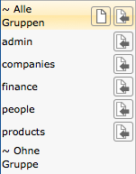
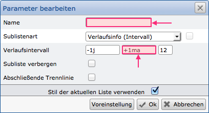
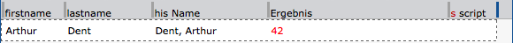

Practical Tips
===========

From the project experience and the questions from our partners and customers,
we found that there are topics and functions that are similar or identical across 
different industries and disciplines. Therefore, we gather here tips and hints
from practice, which you can take over and adapt for your own purposes. 
You are also welcome to send us your own tips; We will update them in this place.

Field Synonyms
------------

Due to the schemaless storage of the datasets, each dataset also includes the field
synonyms of each used field. Especially in the case of extensive databases, the 
database size can therefore be reduced by using the shortest possible synonyms.
 

General
---------

Use the grouping of configurations in list management (but also in other areas). 
Similar configurations are summarized about this and these can be presented to 
the user in a simplified way.

For the assignment to a group, individual configurations (e.g., lists) are simply 
clicked upon and assigned to the group via the "Assign" button.




Moving Columns
-----------------------

If you move the mouse pointer over a column separator (gray, vertical line in
front of a field), you can rearrange the fields.

For multi-line lists and sublists, it may be desirable for fields to be always
exactly one below the other. So that not all fields have to be moved one after
the other, you can move a column separator with the pressed `shift` key. 
All below / above columns are then moved simultaneously.

In addition, you can also use the `ctrl` key. This ensures that the width of all
fields in the row is changed at the same time (as a percentage of the clicked column).
If you use the `shift` key at the same time , the changes will be
applied to all fields in the list.

Sublists
---------

**Set a title**

Always set a name when creating a sublist. This name is immensely helpful when working
with the pivot tables and the dashboard. Furthermore, certain notes also include this name. 
Any possible errors can be found faster.


**Set the correct interval for history information**

If you want to use a sublist to output history information, to select the "Interval History" option,
and output values at the end of the month, always use the suffix "a" or "e" after the dimension 
for the modifier (middle field). Otherwise, you will only receive the 30th, 29th or 28th of a month, 
depending on which months have passed.



Example (starting from the 30.05.2014):
```
    -1y  +1m  5         -1y  +1me  5

     30.01.2013          31.01.2013
     28.02.2013          28.02.2013
     28.03.2013          31.03.2013
     28.04.2013          30.04.2013
     28.05.2013          31.05.2013

``` 

JavaScript in Lists
--------------------

**Use a separate column for scripts**

If you use a separate column for the scripts, you only have one place
per list/sublist where you have to check the scripts. The columns in which 
scripts are available also receive a "S" prefix. If you use several columns 
in which scripts are available, the debugging and adaptation takes longer.



If you also use scripts that run before and after sorting, you could, for example,
designate the columns as "Script before" and "Script behind".

**Changing field contents**

Using the functions "* getListField*" and "*setListField* field contents
can be read and changed. For example, the transfer of field contents of a 
sublist to the main list ("root list") is possible. If there are multiple 
sublists or many fields setting "*setListField" can considerably delay the
processing of the list. By using the global variable "* ctx *" a fast processing
is possible. In order to achieve this, the read field contents from the sublists are
written to the object variable "* ctx *" and only written to the target fields
via a script in the root list, which is executed after sorting.

!!! example "Example"
	From the sublists, the Name, Invoice total and City fields are read and should be transferred to the root list. For this, the variable object "*ctx*" is structured accordingly:
``` 
ctx['Name'] = getlistfield('sublistName');
ctx['ReSum'] = getlistfield('sublistSum');
ctx['City'] = getlistfield('sublistCity');
```

At the level of the root list, the script is set to "after sorting". Then, the writing of the target fields takes place:

``` 
setlistfield('Name',ctx['Name']);
setlistfield('Sum',ctx['ReSum']);
setlistfield('City',ctx['City']);
```
