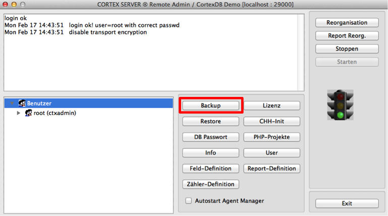
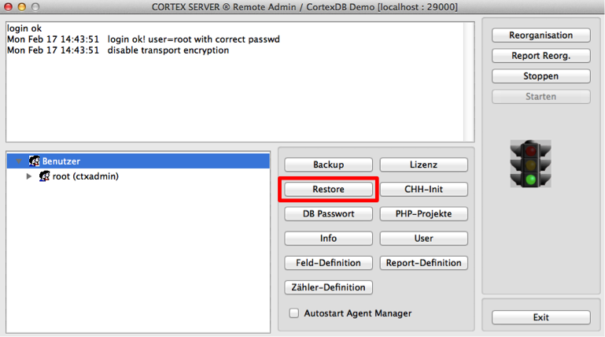

Data Backup 
==============

The data backup is used for secure archiving of a database. This is usually
done fully automatically by installed and activated security procedures. 
These copy the entire data stock (full backup) to a backup medium, only the
changed data since the last full backup (differential backup) or the changed
data since the last backup (incremental backup).

For the use in the database environment, various manufacturers provide extensions
to secure different databases. These access the database as part of a user context
to create an image of the database. When using a CortexDB this is not necessary.
Separate licensing and use of a backup account is therefore no longer necessary.

Integrated CortexDB backup process
--------------------------------------

A backup function is already integrated in the CortexDB and can be configured 
via the corresponding parameters in the configuration file of the server 
("ctxserver.ini").

The backup mechanisms should therefore only back up the backup directory of
the CortexDB. All other directories are to be excluded from the backup. 
In the event of a failure, it is sufficient if the corresponding backup file 
is restored in a new environment.

The backup function of the CortexDB ensures a complete database status at the
specified times. During backup, the database and all applications running on it
can be used further.

The set number of retained backup files is within the backup directory.
The filename shows the date and time of creation.

Example:

    131201020100.cbz
    131202020100.cbz
    131203020100.cbz

The associated configuration has been set to save only three files ("MaxBackupCount")

    [BACKUP]
    backuppath=.\backup
    MaxBackupCount=3

and that every day the backup is done at two o'clock at night
(0 = Sunday, 1 = Monday; \ [.. \]; 6 = Saturday).

    0=02:00
    1=02:00
    2=02:00
    3=02:00
    4=02:00
    5=02:00
    6=02:00

!!! note "Note"
	If the entire database directory is to be backed up, the database should be stopped during this. While the database is running and user access is active, if a backup of the overall directory is made using products from other manufacturers, error-free recovery cannot be guaranteed.

If continuous data backup is required during operation, it is recommended to use the CortexDB online backup server.

### Perform a manual backup

In addition to the automatic data backup, there is the additional option 
of creating a manual backup. The corresponding backup file as well as all
automatically created backups are stored in the configured directory.

It should be noted that the maximum number of saved backup files is taken
into account. A manual backup may therefore delete an older backup file.

To start the manual backup, it is necessary to use the Remote Admin. 
For this is the function "Backup" available.

Before the data backup is carried out, a query is made about the type
of data backup. Here it is possible to create a license-free backup that
can be read in with any other license. Usually, a regular backup should 
be done here that is used exclusively with the same license.

CortexDB Online-Backup-Server
-----------------------------

An optional extension is the possibility of one (or more) online 
backup servers. Such an instance can be operated in constant 
synchronization with the productive server and therefore essentially
corresponds to a mirrored CortexDB database. This is synchronized via
TCP / IP connections and can thus be placed in geographically different
locations (eg in other fire compartments).

In the event of a fault, the online backup server can take over productive
operation and thus it to be upgraded to the primary system. This process is 
a manual operation to deliberately intervene to control any automatisms of premature 
system changes (e.g., in the event of a momentary line failure, unscheduled 
and irregular changes for the parties, other systems, etc.).

The synchronization between the productive server and the backup server is a one-way
synchronization. Changes to the database are therefore only permitted on the production
system, but not on the backup server. Within the framework of the failure safety and/or
distributed applications, the so-called matching server can be made available for this purpose.

CortexDB synchronization server
------------------------

For distributed database operations is the so-called."Match server"
functionality available. With their help, a large number of synchronized
servers can be operated. Optionally, the activation of a rights management
system is possible, so that only selected databases are transferred to dedicated
databases. The central database server thus retains control and the entire database;
The synchronized servers receive only selected information.

An adjustment server can be operated independently and without constant
connection to the main server ("master"). Only after establishing an online
connection will new information be transmitted and synchronized between the two servers.

Recovery of a database (Recovery)
--------------------------------------------

The Cortex database server has several automatic backup methods to ensure stability.
However, irregular states of the operating system or hardware can cause errors that affect
a database. Due to the different functions, it is therefore possible to make corrections
and only during critical need to restore a complete backup.

Change History
-----------------

In addition to the defined backup configuration, the database server 
internally stores all datasets in contiguous blocks on the storage medium.
Changes to the datasets are stored in a so-called "chd" file, whereby all 
changes of a single day are coded in a file ("Transaction Log"). These files
are located in the "ctxchh" subdirectory  ("cortexdb change history") of the 
configured data directory from the server (see the parameter "basepath" in
the configuration block\[SETTINGS \]).

This change information is processed in such a way that for each changed 
field content the previous and the new content are stored and every dataset
change receives its own "hash". This allows you to read these files in addition
to restoring a backup, to restore the state of the database at any point in time
(database before system failure) (differential backup).

Reorganization
--------------

Hardware failures or other failures may cause inconsistent states within
a database. In this case, the function of "reorganization" was integrated 
within the CortexDB.

In a reorganization, all management information is regenerated from the
stored datasets. As long as the datasets themselves are consistent, recovery
is guaranteed. If partial areas are destroyed, however, all remaining datasets
in which no errors were found can be correctly restored.

Manual restore ("Restore") of a database
------------------------------------------------------

The recovery of a backup file is done using the remote admin. This offers through
the  "Restore" function the possibility to read in a backup file completely.
All settings, users and extensions contained in it ("php projects") are restored.

This backup file must be located in the configured backup directory of the server
(see configuration block \ [BACKUP \] the "backuppath" parameter).

!!! note "NOTE"
	BRestoration overwrites all information, configurations, licenses, user settings, and other settings. For license-free backup files it is necessary to re-import the license (lic file).
