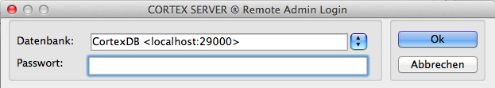
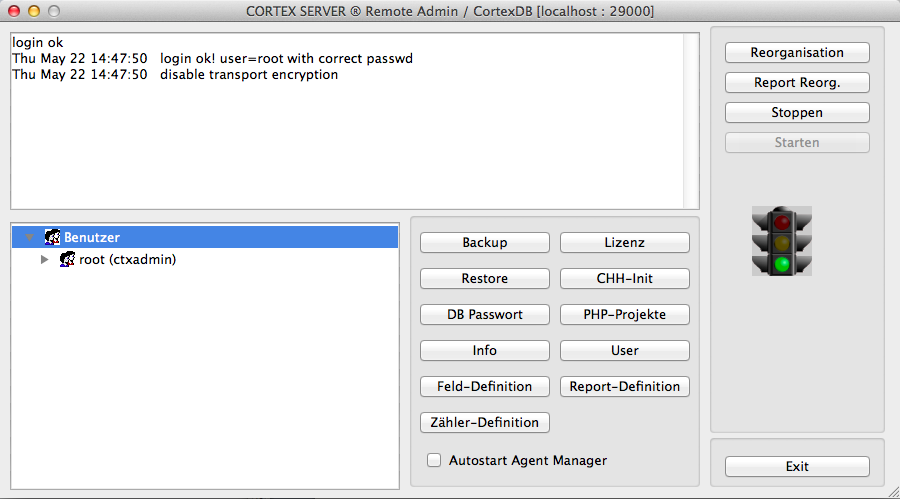
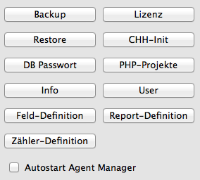

Remote-Admin
============

Introduction
----------

The administration of a CortexDB instance takes place via the so-called 
*Remote-Admin*. This allows the administration of basic database settings and 
provides corresponding functions. Among other things, this tool makes it possible
to create the configuration from remote workstations (or directly at the server 
location itself), to set up users, to carry out updates or to carry out a manual 
backup and/or a restore.

After starting the Remote Admin, the login is done at the database
to be managed. To do this, enter the server name (or IP address)
followed by the database port.

**For example:**

```
    demoserver:29000
```

*or:*

```
    127.0.0.1:29001
```

The login will then be completed by entering the corresponding
server password and confirmed with "*OK*" (or the Enter key).



After login, functions for further administration are available.
These are called via the respective buttons:


General View
------------------

The Remote Admin window is divided into several sections:

In the upper white area, the current log entries are output.
These are also written in the  *ctxserver.log* file.
Usually, the meaning of the messages listed here is very easy to read.



The second text window shows the logged-in instances on this server.
Usually, only the accesses via the remote admin and the php accesses
are listed here. If a replication was started by another server, this
access is also visible.

The graphic output in traffic light form displays the runtime status of
the database server. As a rule, this traffic light should be on * green * - 
the database is running. In the case of maintenance tasks or errors, the traffic
light will jump to yellow or red. Any errors can therefore be read in the log file
(or in the log window).


Functions of the Remote-Admin
---------------------------

The administration of a CortexDB instance takes place via functions that can be
accessed via individual buttons. If an administrator has the access data to a server,
the administration can be carried out remotely (*remote*).

The functions shown here are explained below in detail:



### Backup/Restore

The Backup and Restore functions perform a manual backup or restore a backup file.

When performing the backup, a query is created whether the backup should be created
with or without serial number. A backup file with serial number can only be used with
the corresponding license and can not be read on any other server with a different license. 
A backup without a license is generally readable and can therefore be restored to other servers.

Only after confirming the query will the corresponding backup file 
be created in the configured backup directory (see configuration in 
the ini file). Depending on the size of the database and the changes logged,
it will take a few minutes to complete.

While a backup is being created, it is possible to continue working
with the database. The backup contains only the database information that 
was available up to the moment the backup started. If additional data is 
recorded in the database during the backup creation, it will not be available
until the next backup.

To restore a database, it is necessary that the appropriate backup file
is available in the configured backup directory. When the "*Restore*" 
function is called, the respective file is selected, which is then read in
immediately.

On restores all database contents and change information (if any) will be 
restored. If a backup file is imported without a license, it is necessary 
that the second license file (the so-called "*lic file*") to be integrated
after the restoration via the "*license*" button.

As a rule, the backup files have complete configurations and license entries,
so that the database can be used immediately after the restoration.

### DB-Password

For increased security of the database contents, these can be completely
encrypted with a password. Both the database files within the directory structure,
as well as the backup files can then only be read out via the database server.

**NOTE**:

Without a password recovery of the data is not possible and a database with a
forgotten password cannot be reconstructed!

### Info

This feature displays the version information and the license information in
a detail area. As a rule, this information can also be viewed directly via
the server files (possibly also via user programs).

### Field-Definition

The field definition allows fields to be configured, imported or exported to use
 the *CortexUniplex* application. Since this function has meanwhile been
implemented in the CortexUniplex, the field maintenance should be omitted here.

### Counter-Definition

During the use of the CortexUniplex by users, so-called "*counter fields*" 
can be used. These offer the possibility of using unique counter readings, 
for example to generate specific, unique values (for example ticket numbers,
invoice numbers, \ ...). Within the = CortexUniplex configuration, these fields
are therefore controlled separately. A response of the counters via the API or 
during the automatic import is not possible.

Variables are available for these fields in order to be able to reset
the counters after a certain time or to supplement them with further information.

    %j    Jahr zweistellig, z.B. für '96'
    %J    Jahr vierstellig, z.B. für '1996'
    %m    Monat einstellig von 1-9,
          sowie A,B,C für Oktober, November, Dezember
    %M    Monat zweistellig, z.B. '06' für 'Juni'
    %z    Fortlaufende Nummer ohne autom. Rücksetzung
    %Z    Fortlaufende Nummer mit autom. Rücksetzung
          nach Ablauf eines Monats bzw. Jahres

For leading zeroes in the consecutive numbers, the number of digits behind can be
specified. For example, it is possible to configure the following counter:

     %j%M%Z3 -> 1401001, 1401002, 1401003, ... , 1402001, ... 

The use of these meter fields is only possible in an interactive user
environment. It is not possible to access and set the counters via API 
or other mechanisms.

### License

To activate a new database or to extend functions, it is necessary to 
include the second part of the database license (the so-called "*lic file*").
This is possible via the "*license*" function of the remote admin. After 
selecting the appropriate license file, the integration is acknowledged accordingly.
If the lic file does not match the stored par file in the server directory, a 
corresponding error message is output and logged in the log file of the server
(error code-1010, DSV\_LICENSE\ _ERROR).

### CHH-Init

The database server logs all changes in the so-called "*change history*" (chh).
This "*change history*" is also kept in the backup files and is also available 
after a restore. If the change information is irrelevant and the backup file is 
to be reduced, this history can be completely emptied with a chh-init.


### PHP-Projects

These projects are functional extensions that are stored inside the server.
For example, the application CortexUniplex is a plugin within the server. 
Other functions (including extensions for the CortexUniplex) can be integrated here
as well. So it is also possible to create your own extensions to use individual programs
or program functions.

As a rule, the entry for each extension is one
application identifier required within the license (lic file).
So every extension can be individually and securely unlocked and licensed 
separately. The corresponding rights must then be set for the user accounts.

The file format is so-called "*xjz files*". These may include, for example,
html, php, JavaScript, image files and other formats.

### User

The user administration allows the definition of application rights for 
selected users and password assignment.

!!! note "NOTE"
    To change the default password for the administrative user of the remote admin, change the password for the user "*root*" (Id: 1).

Please note that the  "*Password*" and "*Web password*" fields can be
set for each user. The web password refers to all applications that are 
executed with the help of a browser (usually all extensions that use IP port 80).
 The password is for all "*native*" applications and should still be set on
 default per user to minimize potential security vulnerabilities.


The *Web Admin* privilege defines a user account as an administrator
within the *CortexUniplex* application. Thus is the access
to the administrative area possible.

If a user is to be granted usage rights for an application and this 
application is licensed, the corresponding option is available in the
"*=Options / Applications*" area. The different application names indicating 
the used and available licenses are listed there and can be activated/deactivated.

### Report-Definition

The reporter is a database function that can be used to determine specific key
figures for a dataset via direct references. For example, the sum of all invoice 
items could be aggregated into a billing record. Using definable filters, the operations
sum, minimum, maximum, average and number can be determined and written into a dataset.

Note that the target fields are a separate field type (so-called "*Reporter Fields*"),
which must be defined separately (via the field management). These fields, like all other
fields, are also available for further evaluations and selections.

### Reorganization

The database server transforms every scanned and changed dataset into
its individual components (fields and contents) and writes them into the 
database index. Each content is therefore available for quick selection.
For the ongoing changes during operation, the server maintains a temporary,
dynamic working index, which, in contrast to the fixed database index, is
constantly organized.

Therefore, many changes over a longer period of time can lead to considerable
speed advantages if the dynamic index is transferred into the fixed index using
the reorganization and thus will be reduced in size. Similarly, a reorganization 
is once necessary if a data import was initially performed via import mode and the 
database index must be established for the first time.

### Report-Reorg.

Because the reporter fields are managed separately, they must be included in the
database index. When changing the reporter rules, reorganize the reporter accordingly. 
Only then will the rules be executed correctly.

### Start, Stop, Exit

The database server can be started and stopped via "*Start*" and "*Stop*".
The displayed traffic light then jumps to the corresponding color.

Leave the remote admin using Exit.
