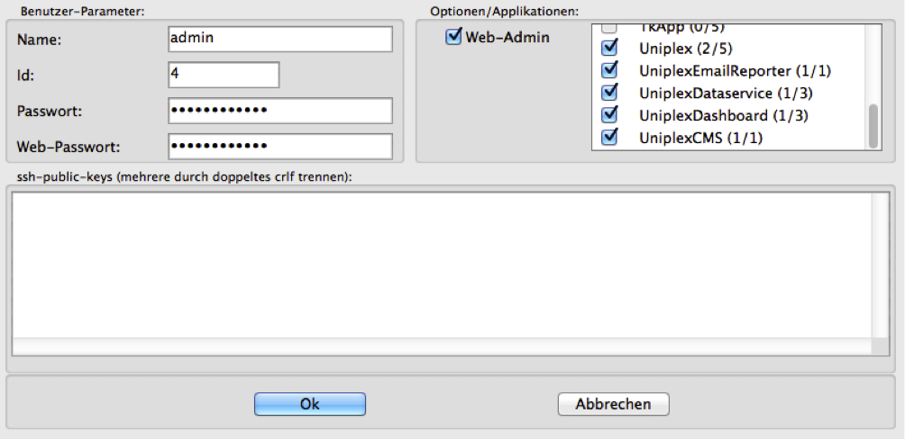
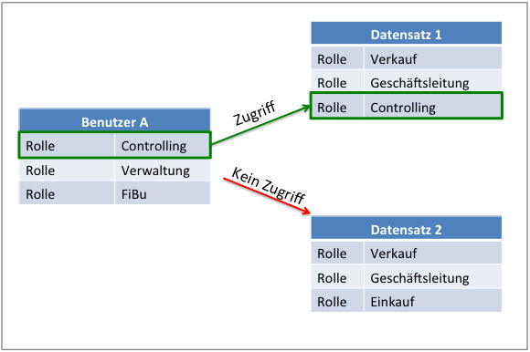

Data Security
===============

Introduction
----------

As with data security and reliability, data security is an extremely
important topic within the framework of IT operations. Different methods
should counteract intentional and unwanted attack scenarios. Such scenarios
include, for example, the goal of system abuse, sabotage, espionage or fraud
and theft of sensitive information.

Examples of tools used to achieve the aforementioned goals are programs such 
as computer viruses, Trojans and worms (i.a. "*malware*"); active processes 
such as spoofing, phishing, pharming, vishing or so-called denial-of-service 
attacks (DoS) or man-in-the-middle attacks and social engineering.

In addition to the aforementioned deliberate attack procedures,
users can also gain unwanted insight into protected and confidential
information if they have access and are not protected by 
administrative measures.

In the context of database usage and access by end users, different 
functions and procedures are available for data security. 
Depending on the scope and sensitivity of the information, the use of
these functions and procedures must be configured accordingly. If
necessary, therefore, the implementation of individual procedures possibly
by specialized staff would make sense.

This documentation deals only with the integrated procedures and functions 
of the database server and the application. A selection of further procedures
will be referred to accordingly; However, these cannot be explained to the
necessary extent. Corresponding third-party literature is available from various
sources and should be used by experienced security experts.

In particular, see for this field the [IT Baseline Protection Catalogs of BSI]
(https://www.bsi.bund.de/DE/Themen/ITGrundschutz/ITGrundschutzKataloge/Inhalt/_content/kataloge.html)
(Federal Office for Security in Information Technology).

The management of the Cortex database server is divided into three basic
administrative areas. On one hand, in the server installation and
maintenance at the operating system level, on the other hand in the server
administration under the help of the remote admin and further in the configuration
of the database application about the administrative functions within the
CortexUniplex application.

Each of these three levels are assigned different administration tasks.
As part of data security, these levels build on each other so that, for example,
an administrator with Level II privileges can also gain access to Level III;
he is denied changes in level I, however.

Management of the Cortex database server (CortexDB)
-------------------------------------------------

| **Level I Operating system level Installation and maintenance** | **Level II** **Remote-Admin Server-Administration** |  **Level III** **Administrative functions for the applications** |
| -------------------------------------------------------------------- |  -------------------------------------------------------------------- | -------------------------------------------------------------------- |
| Directories Backup Database-Server HTTP-Server Database-Raw data File System 1st part of the licensing | 2nd part of the licensing PHP-Projects User access rights Counter fields Manual Backup Restore Reporter Reorganization | Dataset-rights Field-Rights Function rights Plugin-use Other application settings |

 
Connection security through encrypted data transmission
-----------------------------------------------------------

The use of the contents of a cortex database occurs in the context 
of interactive access, usually with the help of browser-based applications
(the so-called "Web applications"). Here and in the use of interfaces on 
technologies of the Internet and the World Wide Web ("WWW") is used. 
To secure such connections, these can be encrypted using the "TLS" method 
(old name: "SSL").

During use via a browser, a secure connection can be recognized on the
address bar. If the address is preceded by an "https", it is an encrypted
connection. For this, a certificate is issued for the websites and
applications to be secured, which is checked and signed by a certification
authority (subject to charge). Within the common browsers, the certification 
authorities are stored so that signed certificates can be recognized and
processed. If a web page is called with an unsigned or faulty certificate,
a warning will be issued.

The CortexDB application CortexUniplex can be used via the connections 
described above. This requires the integration of a server certificate in the
HTTP server. Via the configuration block `HTTPSRV` parameter" *SslCertPem*
"the name of the certificate file has to be integrated (usually a so-called"*pem*"file).

**[NOTE]**:

The basic technology of the signed certificates allows the integration of own 
certification authorities in the browsers. Especially for larger environments
with centralized management of browser settings for each workstation, it may be
useful to create such a certification authority for your own company and use it internally.

User access rights (Level II)
----------------------------------

Remote Admin sets the basic permissions for user accounts. This is used to
configure which application a user is allowed to use. If the authorization for
one of the listed applications is missing, no login with the user account is possible.
An attempt is logged within the server log with a corresponding entry
(error code -922, *DSV_LOGIN_APPNOPERM*).

If a user is to be blocked for one or a selection of specific applications,
deactivating the corresponding application(s) is sufficient. Similarly,
the change of the password and / or the user name further access can be denied.

!!! note "NOTE"
    The user ID is stored permanently for edited datasets. This shows which changes a user has made. If a user account is removed and a new account is created with the same user ID, it will appear as if the new user had made the changes. To avoid this, user accounts should only be disabled and renamed instead of deleting them.

Rights within the application (level III)
------------------------------------------

The application CortexUniplex and all functions based on it, e.g. a dashboard,
allow the interactive use of the database content for reporting or manual changes.
These options require user authorizations for the individual subareas. These are 
subdivided into function, record and field authorizations.
In addition, rights of use for extensions ("*Plugins*") may be granted or revoked.

The allocation of the various authorizations takes place via so-called
"*templates*". A user account uses its assigned templates to check what rights
a user has. When a template is changed, it has an immediate impact on all 
participating user accounts.

### Function rights

The assignment of the basic function rights takes place via user templates. 
Here, the appropriate permissions are set for the following functions.

| Function                    | Option                                                                                                       | Meaning                                                                                          |
|---------------------------- | ------------------------------------------------------------------------------------------------------------ | -------------------------------------------------------------------------------------------------- |
| Deletion of datasets     | no deletion authorization; for own datasets; general cancellation right                                        | Defines which datasets can be deleted by a user with this template.         |
| Archiving of datasets | no archiving rights; for own datasets; general archiving law                              | Defines which datasets can be archived by a user with this template.       |
| Selections                 | no access; reading permissions; edit your own selections; edit all selections                 | Selections are a saved selection of specific datasets. The extent to which they can be read/edited determines this right.                 |
| Document templates            | loading templates; edit your own templates; edit all templates                                     | Templates are Word or PDF document templates that can be filled out from the application.               |
| Selection                | active/inactive                                                                                              | This feature allows cross-database content selection via configured lists and linked datasets.           |
| Multiple Assignment          | active/inactive                                                                                              | With manual data entry, datasets can be linked together. This can be done several times in one step, if this right was set. |
| Editing lists       | No access rights; only use of preset lists; Loading any lists to display data; Editing own lists; Editing all lists | Lists are used to display datasets. Here, individual field contents are accessed. If a user receives the right to load any lists, the same datasets with more information can be output. |
| Actions in lists          | Export/import list definition; Print data; Export data                                   | List definitions can be passed to other databases or imported from others. Furthermore it is possible to export the data to an external file (csv/xml); In addition, a printout of a complete list as a pdf file. |
| Search options           | Universal search (with and without wildcards); predefined searches                                                |Using the universal search options, searches are made in all fields of all datasets of the entire database. This should usually be disabled for a user. Predefined searches can be used to specify exactly which fields and datasets a user is allowed to search. Each search receives a name and can therefore be assigned to a template. |
| Portals                     | All; no; a selection of pre-configured portals                                                          | Portals are predefined searches based on specific search criteria. These can be provided to a user, so that he always receives a current result. |
| Object viewer                | All; no; a selection | Object viewers are a cross-selection of all links based on a displayed dataset. |
| Creation of datasets   | All; none; a selection of dataset types                                                                 | Datasets can be created manually by users. This possibility is to be restricted via this assignment of rights |
| Editing datasets  | All; none; a selection of dataset types                                                                 | The general editing right of datasets of the same kind can be limited here. |

Dataset Rights
----------------

The authorization system for the datasets within a database is based
on the contents of a dataset field (role, internally referred to as
"*# R*") and on the definition in a user account. If one or more field 
contents coincide with the definition at the user, the dataset can be
selected and displayed.

The example shown shows the access (or prevented access) of a user to two
datasets with different role definitions. Only the dataset whose role matches
one or more of the user's access is allowed.

!!! note "NOTE"
    If the authorization system has been activated, this only applies to datasets to which one (or more) roles have been assigned. Datasets without a role cannot be selected, displayed or edited.

Data Field Rights
----------------

Within the field templates, it is possible to specify for individual fields
whether a field is visible and can be edited. In addition to the dataset rights,
a user can thus be deprived of the right to see or edit individual fields, even
though a dataset processing right exists.

This makes it possible to have the same datasets edited by different users
without the changes affecting the contents of other users.

Plugins (Extensions)
-----------------------

Within the CortexDB application plugins can be integrated for a functional 
extension. The plugin templates therefore define which extensions a user may
use with this template.
