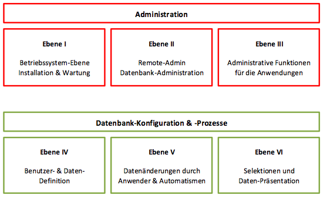

CortexDB
========

The CortexDB is available for different operating systems in different license models. Unlike the licensed version (chargeable for commercial use), the free version is subject to a few limitations.

CortexDB (free version)
------------------------

The free version of the CortexPlatform (and thus also the CortexDB) corresponds functionally to the licensed version. The following table shows the differences between the different versions:

| Function                | Free Version                            | Licensed Version  |      public Cloud Version                   |
| ------------------------ |:----------------------------------------:|:--------------------:|:--------------------------------------:|
| User number         | 2                                        | depending on license       | depending on license                         |
| User properties        | not changeable                          | changeable             | changeable                              |
| User passwords      | not changeable                          | changeable             | changeable                             |
| Operating life            | must be updated each year | depending on license       | depending on license                        |
| Operating systems         | Mac OS, Windows (scheduled Debian Linux) | diverse              | is operated in a Linux environment |

### Quick Start

The implementation of the CortexDBfree requires a program packet of all associated (and in the same version) program files and libraries. These are currently available for Windows systems and Mac OS for download.

1. Download the packets that are relevant to you (for example, an empty database and/or a sample database)
2. Unpack the packets in the directories where you want to run the database server
3. Start the  `ctxdbfree` program (on Windows as exe-file, on Mac OS as app-file)
4. Start a browser (Firefox, Safari, Chrome or similar in the latest version)
5. Go to the URL [http: // localhost: 8080] (http: // localhost: 8080)
6. Enter the user name `admin` or `user` in the login. The password is also `admin` or `user`

After completing the above steps, you should be in the main screen of the CortexUniplex application.

!!! danger "Note for Mac OS"
	Through various security settings in Mac OS files are downloaded from the Internet by default with the attribute `Quarantine`.This prevents an immediate execution of the application and that this application's ability to launch other applications (thus the ctxdbfree.app can not start the ctxserver64 and the ctxhttpd64). In this case, you must remove the ctxdbfree.app from the quarantine.
    
    Change to the directory with the ctxdbfree.app application and execute the following command:

    xattr -d com.apple.quarantine ctxdbfree.app/

CortexDB (licensed version)
------------------------------

The general administration and configuration is divided into several different levels, which are designed for the permissions and information of administrators and users. Especially the topics data security and configuration will be discussed in detail. The following schematic diagram shows the different configuration options in the different levels.

In each level you can define the authorizations for the corresponding persons and automatisms. The authorizations build on each other in such a way that the following levels can be administered via the rights of a low level. A user with the right for the remote admin can therefore gain access from level II to VI, but not for level I (operating system).

### Quick Start

For the commissioning of a CortexDB, a program packet of all related - and in the same version available - program files and libraries are necessary. These are available for different systems (in some cases for the various system versions).

1.  Start the database server or create a new database
2.  Login via remote admin
3.  Import of the license file
4.  Creating the "php" system user (with the "ctxphp" right)
5.  Create additional users
6.  Import of php plugins (eg CortexUniplex, CortexUniplexAPI, \ ...)

### Windows

The server files for a CortexDB are executable within their own directory
structure and do not require program reference structures in the operating system 
(such as registry entries). This allows an installation on Windows by copying
(or transferring the server instance by moving) the program files.

In Windows, the server can either run in the user context of a logged in user or
through a service launcher in the system context (install/remove through the "ctxservice32"
or "ctxservice64"). The server is also started as a service automatically at system startup
and stopped when on its termination. If the system is put into standby or suspend mode, the server
automatically shuts down before that. However, automatic service startup can only be guaranteed at system startup.

The Windows installation usually uses a compressed file that is unpacked
in the desired directory path. In the created server directory it is imperative
that the first part of the license (the so-called "par-file") is deposited.
This is called "ctxserver.par".

The initial administration password is stored within the "ctxserver.par" 
in encrypted form. Therefore, this file should be managed separately and 
made available only to selected people. If the password has been lost, 
the original par file can be restored (reboot of the server is required) 
and a new password can be assigned using the "Remote Admin" program.

#### Necessary files of a CortexDB Windows installation

The following list shows the necessary files of a Windows environment.

    ctxserver64.exe 
    ctxserver.ini
    ctxadmin64.exe
    php.exe
    php.ini
    ctxcljni64.dll
    ctxlib64.dll
    ctxv8.dll
    php5cortex.dll
    php5fileinfo.dll
    php5gd2.dll
    php5loader.dll
    php5sapi.dll
    php5templates.dll
    php5ts.dll
    vcomp100.dll
    Implex.jar

In addition to these files, additional log files can be listed in this directory if it is a running database environment. Optionally, the following two files are also listed in this directory:

    ctxwizard.exe 
    ctxservice32.exe

The "Wizard" is a client application that allows users to log in using 
the public / private key method. Executing the "ctxservice" leads to the
(un)installation of the system service for the CortexDB, which has been configured
in the respective directory. To remove the service, run this file again.

### Linux 

On Linux, the database server can only be set up as a service. This will start
automatically at system startup and will shut itself down automatically before 
shutting down the Linux server (the so-called Linux "init scripts").

The instance of the database server requires its own user and a group. These 
are named "ctxserver" and are created automatically. The corresponding server files 
are available through the Packet Manager (usually "apt-get" in Debian systems).

!!! hint "repository for Linux packages"
    The repositories for Linux are only available with a licensed version of the CortexDB.

Update
-----------------------

Software in general is subject to constant development and troubleshooting.
This requires that installed software be updated to reduce potential errors
and attack points. There are several common procedures available that differ
depending on the operating system.

### Windows

For Windows environments, compressed download packets are offered,
each containing the updated files. To install such an update,
it is necessary that the database server is stopped and then the server
directory is completely backed up.

After the backup, the updated files can be copied to the server directory
(old files will be overwritten). The database server can then be restarted.

### Linux (Debian)

In Linux the update is done with the help of the "apt-get" command. 
This will download and install the current version of the program files offered.
Previously, it makes sense to create backups and exit the database(s).

1.  Create backup 
2.  Stop the server service
3.  apt-get remove --purge ctxserver***12***-squeeze
4.  apt-get update
5.  apt-get install ctxserver***13***-squeeze
6.  Start server service
7.  if necessary, import updated php projects via remote admin

In steps 3 and 5, note that the respective server version is specified correctly.

!!! Info "NOTE"
	On Linux, you can see the version of the installed CortexDB packet using the "dpkg" command. To do this, enter the following command and confirm with Enter:

    `dpkg -l |grep ctx`

This will give you the output of the installed package with the version identifier.
