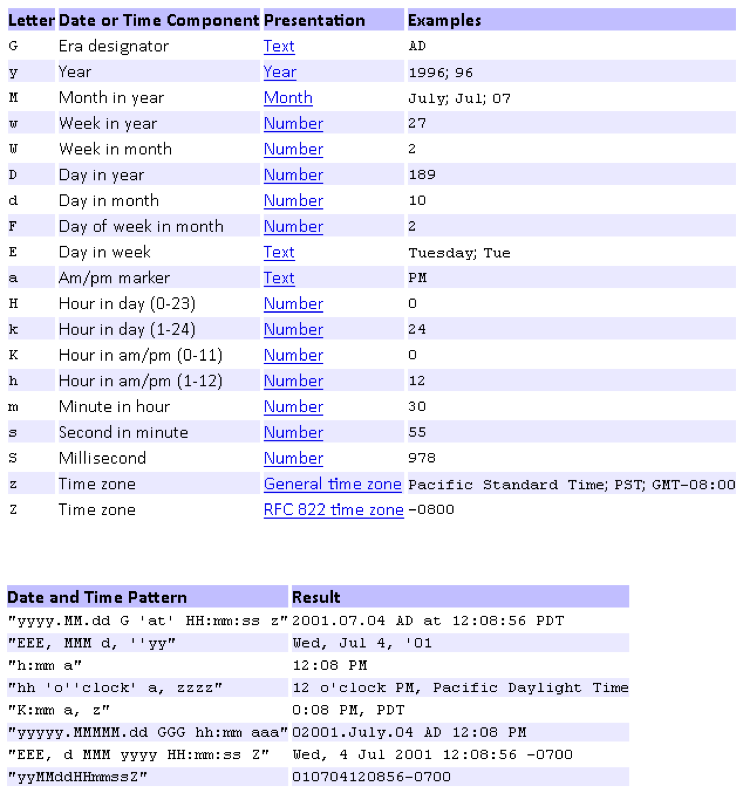

Data import (ImPlex)
====================

The data import from external files or databases takes place via the additional import function, the so-called "ImPlex". This is a console-based Java application that can be used through a configuration plug-in within the CortexUniplex application. Manual imports can be done with the help of the plugin; Automatic imports are performed via timed procedures within the console.

By default, ImPlex allows you to import comma-separated data (csv files), xml files, and import from another (or the same) CortexDB (Cortex-to-Cortex-Import). This allows data to be integrated and processed via various formats. The cortex-to-cortex import also allows the flexible adaptation of information within the database and also the database structure itself.

A prerequisite for the operation of the ImPlex is a current Java version on the system that is to carry out the data imports. Therefore, a Java installation on the database server is not absolutely necessary if another server carries out the import.

Introduction
----------

The basic function of the ImPlex is to import data via an import file. You can use a user interface to easily assign the datasets and fields to be imported to the CortexDB structure. In a further step, you form the links (relations) between the datasets within the database.

For recurring imports (for example, for so-called "delta updates"), you save the defined configuration and have the import process scheduled by the server. This minimizes the access via the developer interface and optimizes the data flow over the time factor (eg for a nightly data exchange via Internet lines).

The import of datasets is basically done via files in the formats csv and xml. Because the ImPlex is an extensible Java development, you can also implement your own Java class to read other formats or interfaces. Access to other databases (such as SQL or NoSQL databases) is thus just as possible as reading system-specific file formats.

In addition to the functions already mentioned, the ImPlex also offers you the option of specifying a CortexDB as the data source. In addition to the import from another database, it is also possible that you use the same database as the source and target database. This gives you the ability to automatically search, review and, if necessary, replace, supplement or delete content in your database.

The ImPlex is a universal data tool that allows you to make major changes to your datasets as well as your entire database structure.

**Note**:

Data import via the ImPlex writes only those fields that have been explicitly configured. System fields, such as creation and processing time, are not filled automatically.

Method
--------------

Typically, you get data from other sources that you import into a CortexDB. For example, the sources that the ImPlex processes can be simple csv (comma-separated value) files, xml files, or any other CortexDB.

If other sources are available (for example SQL databases), an individual extension of the ImPlex is possible. It provides an abstract Java class for software developers to import data from other data sources.

The general procedure for importing from other sources is structured according to the following pattern:

1. Providing the data
2. Viewing the data and analyzing the data format
3. Configuration of necessary fields and dataset types in the CortexDB
4. Structure of the data model within the CortexDB
5. Creation of the import configuration
6. If necessary Export of the import configuration for possible automatisms
7. Implementation of the import (manual or automated)
8. Resolution of non-set reference structures (executing the linker)
9. Check the imported content

This documentation exclusively describes the creation and use of the import configuration and the actual execution of the data import. In the following it is therefore assumed that the data formats to be imported are known and the necessary fields and dataset types have been created. Based on the basic documentation on the CortexDB you can read the required information again.

**Note**:

Note that the ImPlex is controlled by license management. By default, the license is restricted to one user account, so that the actual import process can only be executed from one user account.

Conversion of content
--------------------------

In some cases, the source data supplied must be converted to other formats. This applies, for example, numerical values (integer or decimal values) and date fields. For this purpose, corresponding import functions are available. The example below explains the basic procedure. 

### Date Fields

Because different source systems provide different date formats, it is necessary to import date fields in the format that the server stores. With the help of the corresponding function, it is thus possible that any date and time formats can be imported. Consequently, the source format must be known in advance.

Examples of dates from various sources:

    111012 
    12-10-11
    11-10-12
    2012-10-11
    2012-10

In the examples shown, in the first three cases it is not clear which number is the day, the month or the year. Therefore, dates must always be converted.

In the first case, the two-digit figures for year, month and day were displayed in succession. In order to convert this information into the internal format and import it, the following information should be used:

    date('yyMMdd',getChar('Quelldatum')); 

The specification of the pattern 'yyMMdd' defines the format of the source. The following table shows the possible patterns that you can convert from a source:

Based on the examples it can be seen that also extensive dates can be transferred into the internal format.

Very helpful is also the online test (external link):

[http://www.fileformat.info/tip/java/simpledateformat.htm](http://www.fileformat.info/tip/java/simpledateformat.htm)
