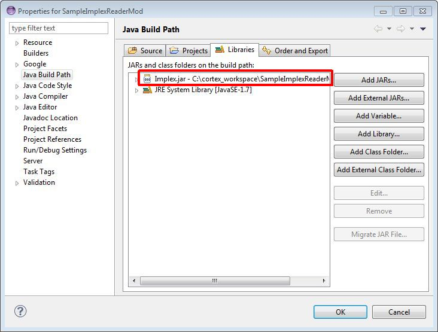
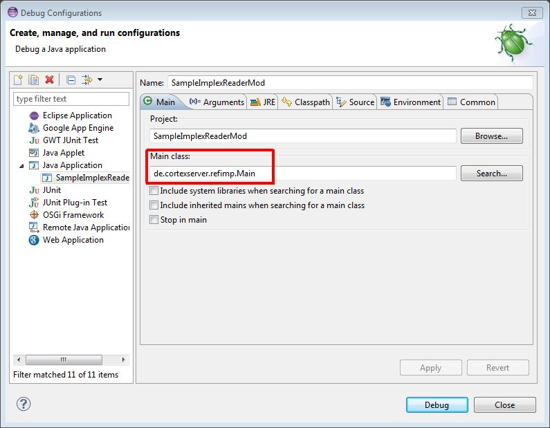
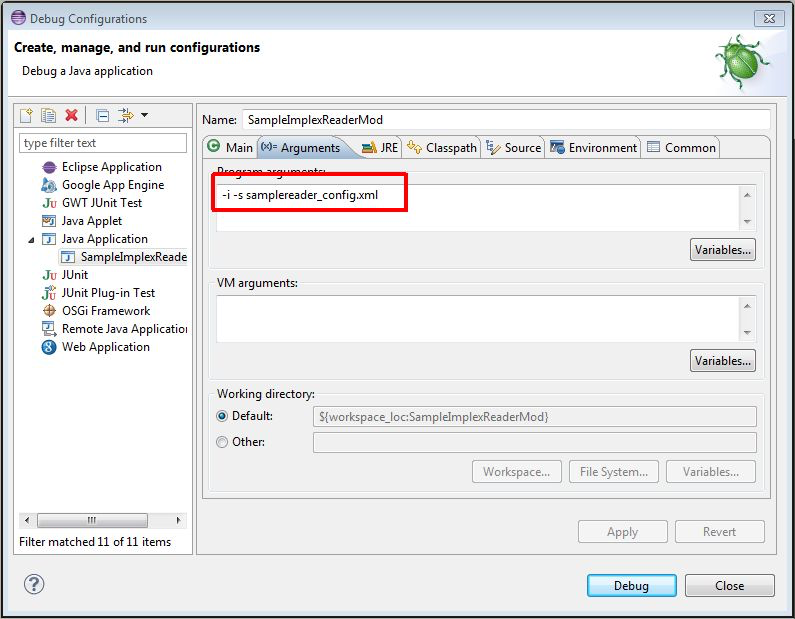

Java extension of the Implex 
===========================

In addition to the standard formats csv and xml, as well as the import of
CortexDB to CortexDB, the import via other data sources is possible.
For this purpose, the ImPlex import tool offers the possibility of defining
your own sources in the form of a so-called "reader class". This is integrated
in the "ReaderModul" area of the import configuration.

``` 
<ReaderModul typ="user" class="com.example.MyReaderModuleClass">
    <myQuery>...<myQuery>
</ReaderModul>
```
To incorporate this reader class, the Implex provides an abstract JAVA class that must be implied.

This abstract JAVA class offers the considerable advantage in the context
of data integration that no API knowledge of the CortexDB is necessary. 
Thus, JAVA knowledge is sufficient to apply the formal import syntax and the
abstract classes. Software developers can thus create a "standard configuration" 
and connect proprietary interfaces, as well as SQL sources.

The class has the following basic structure:

```java
package de.cortexserver.refimp.reader;

[...]

public abstract class ReaderModul
{
 [...]

 abstract public void SetInternValue(String sType, String sValue) throws HREModuleException;
 abstract public void Init() throws HREModuleException;
 abstract public boolean first() throws HREModuleException;
 abstract public boolean next() throws HREModuleException;

 // Spezial
 abstract public boolean jump(int iPos) throws HREModuleException;
 abstract public void handleUnwrittenSet() throws HREModuleException;
 abstract public String getRawLine();
 abstract public long getInputDate();
 abstract public int getProgress();
 
 [...]
}
```

The above abstract methods must be implied; however, only the first four
are essential. The last five are mainly for debugging purposes and are not
needed for pure data import.

Here is a brief description of how the required methods work:

	void SetInternValue(String sType, String sValue)

Using this method, the Implex transfers the control parameters from the "ReaderModul" block of the XML configuration file. This allows you to provide your module with any necessary working parameters, such as Pass IP address and port of a database or file name of a source file.

In this case, the identifier of the XML node is passed as the type (String sType) and the text content of the node as the value (String sValue).

	void Init()

After the Implex has transferred all parameters from the "ReaderModul" configuration to the SetInternValue method, this Init method is called once. Here it is possible to make one-time necessary initializations, e.g. create a database login or open a source file.

	boolean first()]

Once the initialization has been performed, the Implex requests a dataset
through this method only once. It is often sufficient for this method to 
call only the next() method, as it is seldom necessary to distinguish between
the first dataset and the subsequent source datasets.

Therefore, you will find the details for transferring a source dataset 
under the method next ().

	boolean next()

Each additional dataset is requested by the reader via this method. 
As long as this method returns "true" as the value, there are more datasets
to be read. If no datasets can be loaded anymore, "false" must be returned here.

To prepare a source dataset for the Implex, the data must be loaded into a 
Dataset object. The required instance that needs to be populated is already
available ][ under the "DATASET" identifier in the abstract class.

In this object, a nested structure similar to XML can be mapped. In this,
a "node" as in XML can have attributes and subnodes.

For details on how to fill this object, see the example below or the description
of the "Example Module" implementation.

To illustrate the filling of the DATASET object, see the example below. 
A personal dataset consisting of the name, first name and address data
will be loaded into the object. To do this, the following is implied in 
the next() method.

```java
@Override
public boolean next() throws HREModuleException
{
  // first insert the name
  // -> accessible in the import definition: getChar('NAME')
  DatasetNode node = DATASET.addSubElement();
  node.setName("NAME");
  node.setValue("sample name", false);

  // we add an attribute to the node
  // -> accessible in the import definition: getChar('NAME#id')
  node.addAttribute("Id", "0815");
 
  // Now another node for the first name
  node = DATASET.addSubElement();
  node.setName("FirstName");
  node.setValue("Max", false);

  // The address we want summarized here under one
  // pick up extra knots
  // -> addressable in the import definition e.g.: getChar('Address.City')
  node = DATASET.addSubElement();
  node.setName("Address");
  DatasetNode subNode = node.addSubElement();
  subNode.setName("Street");
  subNode.setValue("Tischlerstr.", false);
  subNode = node.addSubElement();
  subNode.setName("PostCode");
  subNode.setValue("30916", false);
  subNode = node.addSubElement();
  subNode.setName("HouseNr");
  subNode.setValue("1a", false);

  return true;
}
```

Of course, it does not make sense to always populate the dataset object 
with the same fixed content. At this point, it depends on the data source
to dynamically load the loaded values into this object.
 
Reader development with Eclipse
------------------------------

In this article we anticipate knowledge in JAVA and the use of the IDE 
[Eclipse (http://www.eclipse.org). In addition, the following download
provides only the DLLs for developing on Windows.

To make it easier to start development, here's a complete Eclipse workspace to download:

[Download: Eclipse
Workspace](dl.php?i=206e2d492a20202020212023&s=File&ea=cd118d75d3976223558460dc774ba2564acfa50d)

This workspace contains only one JAVA project
(SampleImplexReaderMod). 

If you extract the ZIP file directly into your C: / drive on Windows 
and you already have an Eclipse installed, Eclipse will open the workspace 
correctly. If the file is unpacked to a different location or another
operating system is used, customization in the build path of the project
is required. For other operating systems, you will also need the corresponding
libraries that are not included with the download.



Important for the execution and debugging of the project are on the one hand
the correct Main Class and on the other hand the use of a suitable Implex 
configuration file.

In the delivery state, an example configuration for the reader module
(samplereader\_config.xml) is located directly in the project directory.
The Main Class must be the Main Class of the intrinsic Implex:



Debugging requires additional call parameters:



The environment is now ready to test the sample implementation. \
This is a small example of a single, static data set. This is sufficient
to explain the basic functionality and thus offers a quick and easy introduction.


Use in "live" mode
------------------------------

If you have implemented and tested your ReaderModule, you must create
a JAR archive from the program code and assign it the fixed name `usermodule.jar`.
For the Implex.jar to access, this file is copied to the Implex-jar folder.
Within an import configuration, this reader can be specified as a parameter.

 
