Import via plugin
=================

The plugin is used to easily create an import configuration and to perform it manually. For further adjustments and the installation of an automatism an export of the configuration and its further processing is necessary. In order to avoid fundamental errors, you should therefore carry out the general configuration with the help of the plug-in and, if necessary, only process the exported configuration file in a further step.

The actual data import can be done manually with the help of the plugin, by a manual start via the command line or by a timed system service. In general, a distinction is made here between the data import and the execution of the so-called "linker".

After an import has been performed, the linker is responsible for the correct production of reference structures ("link triggering"). The reference structures can therefore be executed independently of the data import at any time and also make references (links), which possibly took place via manual data entries.

**Note:**

Please note that only one import / linker can be executed at a time. If an automation has been configured and the manual import is started during this runtime, you will receive an error message. Accordingly, you may be able to block an automatic start by performing a manual operation.

Via the plugin of the ImPlex both data import and link resolution are possible and are offered via separate buttons.

Plugin-Installation
-------------------

If the file "Implex.jar" has been copied to the server directory (CortexDB and web server), you can integrate the corresponding plugin. To do this, import the file "Uniplex-plugin-implex \ ..." using the "Remote-Admin" administration program.

Then log in as an administrator (or as another authorized person) within the CortexUniplex. Within the administration area, you can then assign the plugin to a user template.

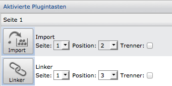

To link datasets after a successful import, the so-called "linker" is required. For this too, you can include the appropriate CortexUniplex plugin in a template and execute it within the CortexUniplex.

After you have integrated the plugin and activated it in a user template, you have the two quick-start buttons "Import" and "Linker" at your disposal. Both functions can be used independently. It makes sense, however, that the references (relations) between the data sets should only be produced with the "linker" if the data structure is largely available.

The import button takes you to the configuration and execution of an import. Here, a distinction is made between the csv and cortex modules. For the import of xml files, only a manual configuration of the import is possible.

To adapt a configuration to other interfaces (odbc etc.), the manual adaptation or programmatic extension of the import module is necessary. This is an abstract Java class that you can customize to your own needs.

Import of csv files
----------------------

Csv files ("comma separated values") are unformatted text files in which a dataset is mapped per line. The column structure of each line is identical and the contents are separated by separators. Optionally, the contents are enclosed in delimiters (e.g., quotation marks).

    Name;First name;City
    Meier;Max;Hamburg
    Müller;Peter;Berlin

The plugin of the import tool "ImPlex" allows the easy assignment of source fields to target fields within the database. With the help of the plugin a manual import can be started or the configuration can be exported for a regular import.

### Execution of the configuration

After calling the plugin and selecting "csv module" an existing csv file can be selected or uploaded. It should be noted that the maximum size of the csv file is administratively limited by the web server. Each file can therefore also be stored manually in the corresponding subdirectory. Starting from the root directory of the Cortex database under "*www / Implex*". If necessary, pay attention to the directory/file rights of the operating system, as otherwise the plugin can not read the source file.

The files stored there or manually uploaded are then available in the selection list "csv file".

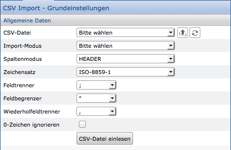

### Import-Mode

The import mode of the ImPlex distinguishes between three basic import procedures. You can choose\...

- whether the data to be imported has been newly created
- only existing data updated ("Update")
- or whether new data should be created if no matching data for updating was found.

Please note that so-called "reference values" are necessary when updating and when creating, if necessary. Reference values are unique database contents that are searched for. If the ImPlex finds a single dataset based on the reference values, that dataset can be updated. If the ImPlex finds several data datasets, no update is possible. If no data dataset can be found based on the reference values, the ImPlex may create a new data dataset.

Only select the fields with the reference values in the following mask if all import parameters have been specified.

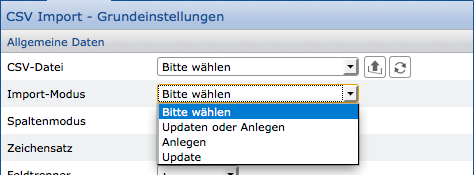

### Column Mode

Usually csv files in the first line contain the so-called "header information". In the example shown above, the name, first name, and city. This information is necessary for the import, because it can be used to assign import data to target fields. Since not all csv files contain such header information, a separate, "virtual" header can be used for the import. Instead of a field name, it is possible here to select numerical values (1,2,3, \ ...) or letters (A, B, C, D, \ ...).

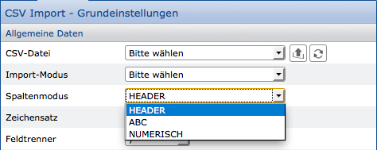

### Charset

Each generated file consists of individual characters. Depending on the language, a file may contain special characters (such as umlauts). To correctly represent special characters, a system must determine which character set (the so-called "encoding") has been used. Therefore, to correctly import the characters of a source file, this character set must be known and set for import.

Usually, files are exchanged with the UTF-8 character set because all special characters of all languages can be managed here. Still, different applications export files in other fonts. Therefore, ISO 8859-1 and windows-1252 are also available.

To check the character set of a file, you need a program that can provide you with this information and, if necessary, convert the character set (for example, "Notepad ++").

!!! note "Note"
    The standard Windows programs "Notepad", "Wordpad", "Word" or "Excel" are not suitable for this.

### Field separator and field delimiter

In order to be able to clearly separate the contents within csv files, so-called "field separators" and "field delimiters" are necessary. A delimiter separates two values from each other and a delimiter is placed directly in front of and behind a value to limit the value.

Both characters can be seen from the source file or should already be known beforehand. This is illustrated in the examples below.

Example without field delimiter with the field separator semicolon:

    Name;First name; City 
    Meier;Max;Hamburg 
    Müller;Silvia;Berlin

Example with the field delimiter quotes and the field separator semicolon:

    "Name";"First name";"City" 
    "Meier";"Max";"Hamburg" 
    "Müller";"Silvia";"Berlin" 

### Repeating field separator

The fields you define within a CortexDB can be used multiple times (repetitively) in one data set. Within the source data, several values can then be output for a field, separated by another delimiter. This separator is the so-called "repeating field separator". Each value between the field delimiters is thus imported into the new data set as a separate value of a field.

    "Name";"First name";"City";"Hobbies" 
    "Meier";"Max";"Hamburg";"Football,Hockey" 

### Ignore "0" characters

If you want to import numeric values, it may be that the number zero represents a "real" value and should be evaluated if necessary. It may also be just an indication without further benefit. In this case, you can ignore the zero if you check the option.

Cortex to Cortex 
----------------

The ImPlex Cortex module gives you the ability to make any changes within your database (or even between two Cortex databases). This allows you to correct or supplement certain content and also to change the entire data model.

It is important to fully respect the dataset permissions. It is therefore absolutely necessary for the user account with the import rights to have a so-called "default dataset". This is created after the first login in the CortexUniplex or by copying an existing user account. Only through this "default dataset" of a user account can the ImPlex determine the access permissions and allow the modification of data dataset.

In general, the source consists of a list definition and the datasets of a selection or dataset type. As in the CortexUniplex, the preparation of the datasets is based on the configuration of a list. This also allows you to use calculated list contents for changing the datasets.

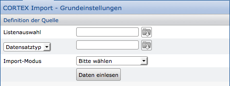

The list selection in combination with the source data datasets (dataset types or a selection of datasets) produced in the source, as it is also used for the import of csv files. Therefore, no information about character set, field separator and the like are needed.

After calling the ImPlex plugin and selecting the Cortex module, select the corresponding list, dataset type or selection, and the import mode. Then click on "Read data" to enter the login data and thus get into the mask of the field assignment.

Source / destination assignment
---------------------

After leaving the first dialog to select the source, it is necessary to select a target dataset type. In addition, the fields of this type are assigned the source fields.

To assign the data from the source file to its destination, the assignment window consists of two sections. The left pane displays the column headers of the source (or numeric/alphabet if this option is enabled in the csv module). The right pane displays the target fields of the dataset type selected in the call.

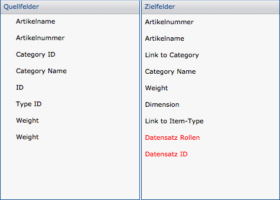

To make an assignment, click on a source field in the left area and select the appropriate destination field in the right area. Immediately after the click, the assignment will appear in the list below the two columns.

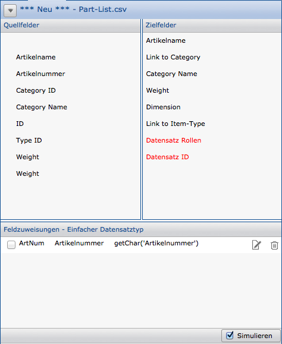

The lower area shows the synonym and the name of the database field, the assigned source field, and a button for editing the assignment and deleting each.

Typically, each assigned source field is wrapped with the getChar function. This is necessary, as there may be other types of sources; For example, date fields. These and others can be converted to the appropriate target format using import functions. The functions can therefore be adapted and changed via the Edit button.
It is also possible to combine second fields into a target field.

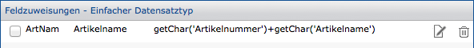

Further options for adapting and converting the sources can be found in the Import functions.

### Reference fields

In the field assignment, there is a checkbox to set the reference in the first place.

The reference fields are used to search for unique database content. If the ImPlex finds exactly one single dataset based on the reference fields, this dataset can be updated. If the ImPlex finds several datasets, no update is possible. If no dataset is found from the reference fields, the ImPlex may create a new dataset (depending on the import mode).

Use the checkbox on the left side to mark fields as "Reference". There is a possibility that you use multiple fields as a common reference. Since the combination of the marked reference fields within the database must be searched, the selection leads to a slower import process.

### Set the role for the datasets to be imported

Within the database, user accounts and datasets can receive roles. If at least one role of the user and the dataset match, the user can see the dataset and edit it if necessary.

The list of target fields contains the entry "dataset roles". Usually there is no corresponding source field for this. Therefore, manual processing is necessary, which in the simplest case assigns the same role(-es) to each imported dataset. This requires the selection of the field and a click on the edit button. The role is then simply entered as text, for example: 'admin'

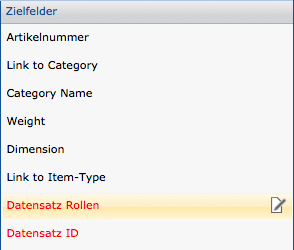

**Note**:

If several roles are to be assigned to the datasets, it is necessary to add the field several times since this is a repeating field.

Carrying out the import
------------------------

For the import, the corresponding rights have to be set in the user administration of the remote admin. It is therefore advisable to set up a separate user account with which data imports can be carried out. The username and password of this account are required in the exported configuration files and also when using the plugin.

After the field assignment ("Mapping") has been carried out, the import or a simulation can be carried out. The simulation only checks syntactically if errors can occur during the import. A logical check of the data cannot take place.

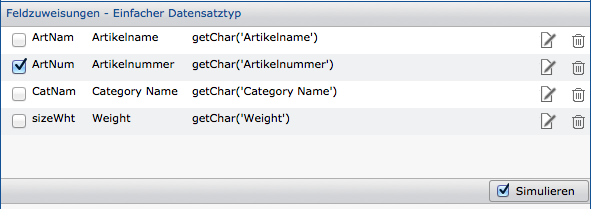

By default, the button is set to the simulation mode at the lower right edge.
After a click, the simulation is started by reading and traversing all datasets
to be imported. This is followed by an output for the status of the simulation.

By removing the hook the button can be set to "Import". This switchover causes the data to be imported correctly, so it takes longer to complete because the datasets are now written to the database. From a simulation, therefore, the full time for the import can by no means be deducted.

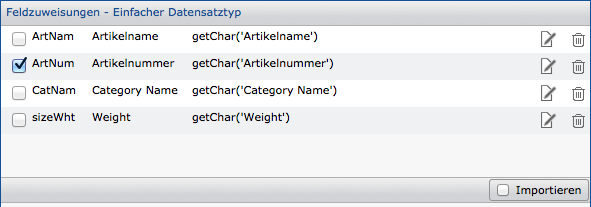

During the import and also during the simulation, a progress bar is displayed.

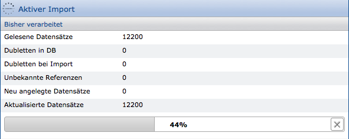

The progress bar is displayed via a dataset counter, which is permanently displayed. After the end of the simulation / import, you will receive a status display of the results. In this view, you can click on the "Created DS" and "Dataset Updates" lines and get to the list view of the affected datasets (only after import).

Note that multiple dataset types can be created from the data source. Therefore, the sum of the created datasets may differ from the number of sources.

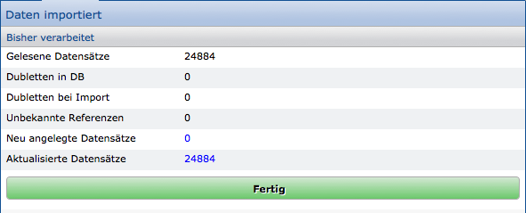

Set references with the linker
------------------------------

Within the database, it is possible that relations are established via so-called "reference fields" between datasets. For example, a person might refer to an employer. These references are usually manually set while working with the CortexUniplex and stored in the datasets. This process can also be performed automatically by the ImPlex and the Linker function.

The linker is a component of the ImPlex and serves exclusively to unambiguously unlink unknown (ie not set) references and to write the reference in the corresponding datasets. To do this, he uses the search configuration defined in the dataset editor within the reference field.

Via the import function of the ImPlex (or manually by user input) contents are written to the reference field, which are marked as invalid references. The linker uses this invalid content to create the link. It therefore works independently of the imported or acquired data and can therefore also be used as a correction tool that automatically corrects all invalid references.

You can manually run the linker as well as create a configuration file that will run automatically.

The linker also requires the name and password of a user account that has been assigned the import right through Remote Admin.

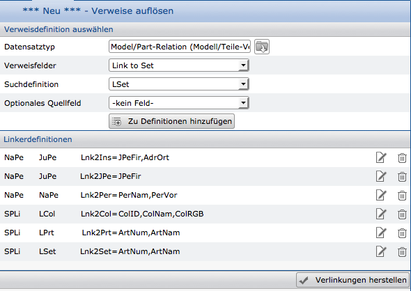

In the upper part of the plugin, the dataset type, the referenced field and the assigned search definition are selected. If a reference from the content of another field is to be generated, this can be specified as an optional source field.

Each linker configuration is added to the overall definition so that multiple references from different dataset types can be processed in one run.

Clicking on "Create links" starts the linker and displays a progress bar.
