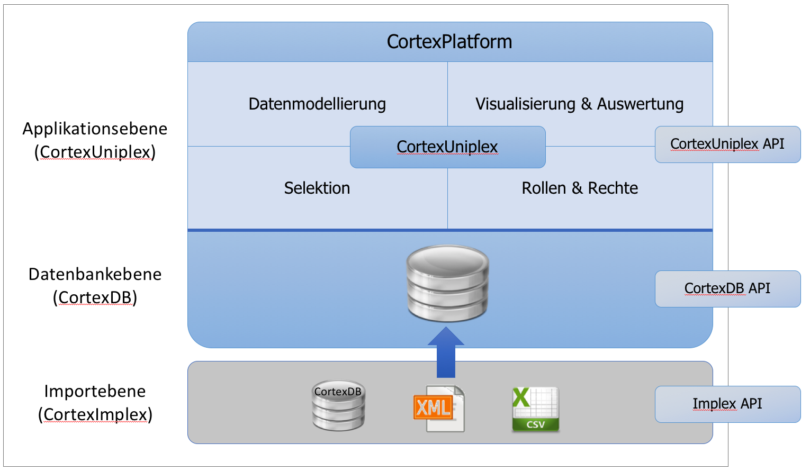
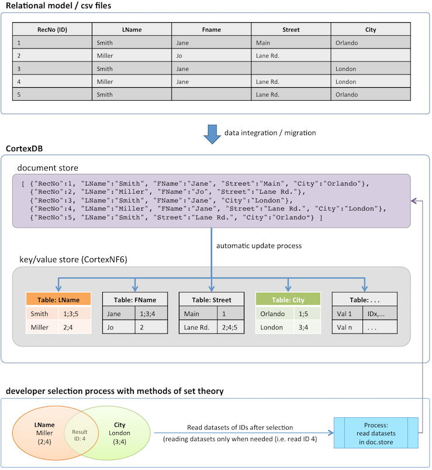
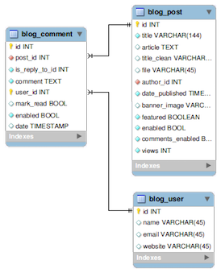
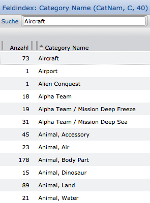
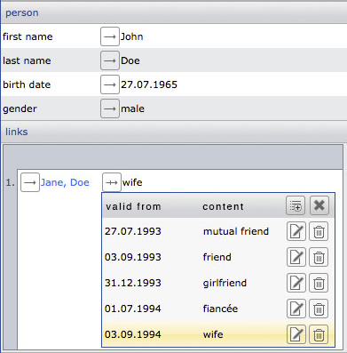
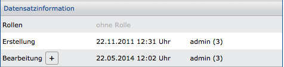
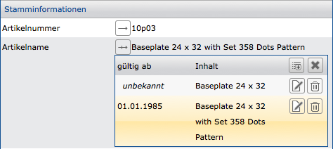

The CortexPlattform
===================

The Cortex platform consists of a multi-model NoSQL database (CortexDB), a universal application ([CortexUniplex](../CortexUniplex/CortexUniplex-Basics)), data import tools ([CortexImplex](../CortexImplex/CortexImplex-Basics) and CortexJSAutoimport) and a collection of tools - eg [CortexUniplexAPI](../CortexUniplexAPI/CortexUniplexAPI) (JSON HTTP API) enables developers and users to quickly and easily implement new applications, data analytics, and other requirements. This applies both to the department as well as to developers who require fast and easy database access without having to deal with the actual database technology.



In addition to the database server, the overall concept also includes tools based on it for immediate deployment in order to

-   easily configure data models for the prefered application
-   ensure data imports from other systems
-   grant via developer interface ([CortexUniplexAPI](../CortexUniplexAPI/CortexUniplexAPI)) a simple a database access.

It is irrelevant for the realization phase whether you want to create an individual application for a few thousand datasets or whether you need a database for large and/or complex structures (for example, *big data*).

For general information, please visit our website: <http://www.cortex-ag.com>

You can choose the option of an independent test with a blank and a demo database via our cloud solution at: <http://cloud.cortex ag.com>

The *CortexDB* Database
------------------------

The CortexDB is the centerpiece of the Cortex platform. This is a multi-model database that uses the concept of a document store to store datasets, transfers all fields and field contents redundantly into a multi-dimensional key/value store (6th normal form/6NF), as well as the transaction time and validity date of information that can be saved bitemporally. In addition, the one-to-one connection between datasets as a reference structure is possible ("GraphDB").

By combining the various database concepts, the CortexDB stores datasets as a container (document store) and simultaneously converts them to the 6th normal form (key/value-store). This represents the entire database and the original data sets are thus retained. Selections are performed exclusively in the redundancy-free 6th normal form and only the result is read from the containers of the document store, if the user rights allow this. As a result, in addition to reading rights and writing access to datasets, also the selection right is available.

In contrast to NoSQL and SQL databases, the CortexDB is the only database that combines the use of a schemaless data storage with simultaneous and complete normalization of all content in the highest normal form.

The following diagram illustrates the overall process of integrating from a relational model (or csv files) to store it into the CortexDB as a document store and its simultaneous storage in the key/value-store, up until to the selection and final reading of the results.

##### Scheme for the 6th normal form (transmission and query)



### 6. Normal form (index)

The 6th normal form (i.e., the index structure) of the CortexDB differs significantly from the structures and capabilities of all previously available databases. This not only gives a higher speed and easier queries, but also completely new approaches for the solution of tasks.

It should be noted that the index maintenance is taken over fully automatically by the database and no adjustments are necessary.

### General Database Structures and Index

Databases differ primarily by their database schema. Relational 
databases organize data in tables and columns, using the same column contents
to link tables together (via so-called *foreign keys*). This is often documented
in the form of *entity relationship* diagrams (*ERD*).



In general, all databases currently in use (SQL and also NoSQL) differ by 
this database scheme, no matter if Key / Value, Document Store, GraphDB 
and others. Only the applications organize data based on the underlying database
schema. The database index (http://en.wikipedia.org/wiki/Database_index) is a
data-separated structure for accelerating and searching database content.

All databases use flat index structures with references to datasets to allow
data access in sorted order. Differences form special indexes in which the databases
differ, they are flat indexes in all cases (for example, bitmap index).

### CortexDB index in particular

The CortexDB is a schemaless database (similar to *Document Stores*)
that works with a content-based, multi-level index structure. This means that
each content *knows* in which datasets and fields it occurs and each field
*knows* what different contents exist.

!!! success ""
    The CortexDB is therefore the first and so far only database, which offers the 6th normal form (6NF) a uniform index over all information contained in any database schema.

This index structure therefore maps the entire database across all fields and their contents, so that all queries in the index structure are handled and the schemaless stored data is used only for output. The small size enables very fast queries in arbitrary query combinations. Administrators and developers can therefore work with this index immediately and therefore do not need to make any adjustments or optimizations (even if the data model changes).

### Field index in the application

Within the application CortexUniplex the index for each field can be 
displayed via the so-called *field index*. This shows the used content
of the field (about all dataset types) and the frequency (number) of contents
in the database. Behind every number, therefore, is the above mentioned list
of contents (ID list).



For each entry in this field index, the result can be displayed in a separate
list. This allows direct access to datasets with the corresponding content. 
For further selections for combining the various contents via the field index,
additional functions are available in the application.

Due to the quantity combination of different field indexes, the queries within
the database are made in this way. Through the average, difference, symmetric
difference and total amount only the occurrences are combined with each other,
and only when the output occurs, the datasets are being read.

 

!!! note "Note"
	The field index to a field consists of a list of dataset ID's. Each ID is managed internally with 12 bytes. If an index with the number *1* is displayed in an index, the ID list is 12 bytes long. With a number of *10* that is 120 bytes, etc. A factor for the memory requirement of the index thus results from the number of different contents per field and the number of different fields.

!!! warning "Memory required for selections"
    Combining multiple indexes to find content across the intersection, union, difference, or symmetric difference, the ID lists (that is, n * 12 bytes) are combined. The appropriate amount of memory must be available for this.

### Queries

Because the CortexDB tracks every content and field in an index list, queries are made using simple set combinations.

Example of the combination of names and locations:

```
    Meyer: ID1; ID2; ID3; ID5; ID8; ID13

    Hamburg: ID2; ID4; ID6; ID8; ID10

    Average = [Meyer] ∩ [Hamburg] = ID2; ID8
```

The intersection of the IDs of the fields Name for *Meyer* and Place for
*Hamburg* results in a new ID list with two contents. Only after this combination
has been performed does the display or further processing of the contents of affected
datasets take place. Before this time, it is not necessary to read the datasets,
only to read the ID lists (ie the index).

The configuration of such and further selections takes place in the standard application
and can be used via the corresponding API (CortexUniplexAPI).

Multi Model 
-----------

The CortexDB offers the possibility to use different database functions
as part of the schemaless structure.

It is thus possible, for example, to construct structures via reference fields, 
as can be found in graph databases. Furthermore, individual fields (optional) may 
be used as often as desired in a data set (e.g., for bank details or e-mail addresses);
Similarly, past, current and future values can be stored per field of a data set 
(bitemporal database). In addition, the 6th normal form is stored internally similar to key/
value stores (multi-dimensional key/value store).

The example shows the dataset of a person with a reference to another person and its
description over time.



Each of these options can also be combined with the others (for example, for the
temporal change of multiple references).

### Bitemporal

For a dataset, the CortexDB stores the [transaction time
(http://en.wikipedia.org/wiki/Transaction_time) of changes. In addition, 
each content of all fields can be individually provided with a validity period
within a data dataset ([attribute time stamping (http://en.wikipedia.org/wiki/Valid_time)).
Therefore, for each dataset not only the state of a dataset in the last transaction is visible, 
but also the complete "life cycle" (historization), in which case we speak of [bitemporal 
database] (http://en.wikipedia.org/wiki/Temporal_database).

In this case, the transaction time is automatically (implicitly) maintained by the server
and the validity of a value is maintained by the user (explicitly) or by automatic mechanisms 
such as data import or interfaces. If no validity has been maintained, then "unknown" applies
to this value until it is overwritten with a new value (a transaction overwrites this value)
or another value is added with a validity.

!!! example "Example"
	Information about transactions can be displayed within a dataset.
	
	 
	
	In contrast, the history information (or * history processing *) shows the validity of a value in a field. These can be displayed for each field and maintained explicitly. If the validity is unknown for a value, the value is permanently valid until it is overwritten by a new value. The standard view of a dataset always shows only the currently valid value.
	
	

Memory requirements
--------------

In order to use the right hardware, an estimate of the expected storage 
requirements is often required before using a new database. In addition to memory,
other resources are also relevant to ensure the lifetime of a database. The frame
parameters for hard disks (HDD or SSD), processors (CPU) and main memory (RAM) must
therefore be set as a whole.

!!! note "Use of hard disks (HDD or SSD)"
    Ideally, you should use SSD hard drives to leverage the index during the database runtime. When using an HDD, the index can only be used meaningfully in the main memory, so that it is interpreted accordingly.

The memory requirement depends considerably on several parameters that
can only be read partially or not at all from the available data. Examples include:

- Number of datasets
- Length of field contents
- Length of field synonyms used in the CortexDB
- Number of different contents per field
- Number and size of binary data
- Number of fields per dataset type
- Frequency of repeating fields per dataset
-   . . .

!!! note "Note"
	It should be noted here that the memory requirements can not be compared with relational systems, because the CortexDB indexes all contents and thus ensures almost any query universally. In relational systems, the administration sets selected indexes that affect only a few columns. Any combinable ad hoc query by the end user is only possible sequentially without an index.
