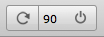
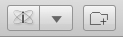
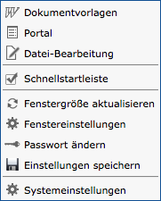
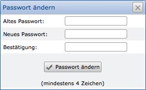
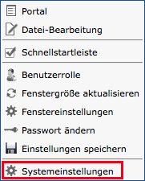
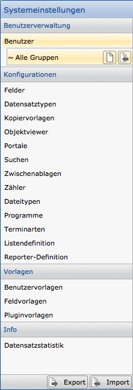

CortexUniplex
=======

The  CortexUniplex application is ready for the interactive use by users, as well
 as for the basis of the software development. Simple configurations 
of the data model (fields, dataset types, \ ...) to the permissions of individual 
functions can be used to configure an application. This can be used for queries, 
selections and graphic evaluations, as well as for interactive use by users and developers.
Individual work processes in departments can use this application as well as
software developers for their own, individual applications.

Within the CortexUniplex, several general functions are available for which a user
can be authorized by assigning the user templates. In particular, the list function
is used before all other functions as a display of results.

CortexUniplex Basics
------------------

The CortexUniplex application is divided into several areas that can be 
used by a user. Depending on the permissions, the buttons for certain 
functions are displayed or not displayed.

Basically, the application consists of a main bar, which is always displayed
at the top. This includes appropriate access to the usable functions. Below this,
the contents of the application are displayed, which may vary for each application.
The use of the portals, database editing, lists and other functions are therefore
explained in the corresponding sections of this documentation.

 

### Update and Logout

After logging in, the buttons for updating the window and logging out the user are located on the top right.

 

### System information and other functions

At the top left there are at least two buttons for displaying information 
about the application and for calling the main menu. Possibly, additional
buttons are displayed there (depending on the authorization of the user). 
In the illustration shown here, for example, the function for creating a
new dataset. Likewise, functions for selecting or for the document input
can be displayed here.

### Main Menu

The info button provides the basic information about the application,
the server and the user rights. An administrator can do an initial diagnosis 
if users have questions about the functions provided.

The button with the triangle takes you to the main menu for further functions.
Here are, among other things, the call of the main portal available, the display
of the quick-start buttons, as well as the window adjustments. Furthermore, 
the password can be changed. Administrators also get access to the system settings.

### Change Password

Via the entry "Change password" in the main menu a user can independently adjust
the password. For security reasons, the old password must be entered again.

 

CortexUniplex Configuration
---------------------

The configuration of the CortexUniplex application allows the complete definition
of the data model, the user roles and rights, as well as other functions. 
Via the *System Settings* area all configuration options for the so-called
*Web-Admin* can be reached. The right for this area must therefore first be assigned
to a user account via the *Remote Admin* (see User Rights).

If you log in to the CortexUniplex with a user account and with the corresponding function
right, the *System Settings* menu item can be accessed via the global toolbar within
the system menu (triangle at top left).

Other users usually have only the other menu items for their own settings
available (window settings, password change, etc.). In the same way, the quick launch
bar and the portal can be shown again if they have been hidden by the user.

The configurations of the fields, dataset types, lists and pivots, as well as 
the portals and role authorizations are available to every user after a new login 
(or update of the application). In addition, the configurations mentioned also apply
through the use of the CortexUniplexAPI, as this takes account of the user context.
The configurations you define therefore have far-reaching implications.

### General configuration process

The application is configured in several steps, each of which can be executed
independently of the other steps. In order to create a quick and correct
configuration, it is recommended to follow a standard procedure at the beginning.
After the basic configuration can then be done for any changes.

1. Definition and establishing user templates
2. Definition of fields
3. Definition of dataset types (link fields only from step 11)
4. Optional: Configure one or more repeating field groups per dataset type
5. Define search configuration for dataset types
6. Assign the search configurations to the dataset types
7. Re-login or update the application
8. Testing the searches (empty lists are displayed)
9. Configure and save a list for each search performed
10. Assign a list in the system settings for each search configuration
11. Continue to set a list as standard list for each dataset type
12. Add link fields to dataset types (dataset types must
     previously defined).

When all these steps have been performed correctly, you have configured 
the complete data model and created the basis for data import, manual use, 
reporting, and access through the HTTP API.

The following functions are available in detail:

### Lists

- Simple lists
- Sublists
- Pivot lists
- JavaScript in lists

### Search

- Universal Search & Universal Wildcard Search
- Combinatorial search
- Wildcard search

### Selecting using lists

Configured lists can be used to make selections in the database. For this 
purpose, the function Selection via Lists is available, its configuration
being made via the search configurations of the system settings. This allows 
any combination of all fields in a list as search fields to find datasets.

### Portals

Portals are predefined selections in which the user can not change any criteria
on the search. Only the output of the result list in turn allows a reduction using
the list functions. This function is therefore used for recurring selections in order,
for example, also to represent simple work processes (resubmissions, hotline messages,
postprocessing, \ ...).

### Objektviewer 

In order to be able to gather information from different linked datasets
and display them within a window, the so-called *object viewer* is necessary.
Starting from a dataset, all references (direct and parent references) are tracked
and specific information is presented from other datasets. One or more lists allow
a user-friendly overview of relevant information.

For example, thus the presentation of simple customer master data sheets, product information,
histories and many other possibilities takes place.

System Settings
-------------------

When the system settings are called, the configuration area for the CortexUniplex 
is displayed. All the menu items listed can be used to manage various system settings
and user rights. A user with the right to access the system settings is therefore
able to configure and completely change the entire database and all users.

Basically, the initial configuration is divided into several necessary basic
settings before data can be integrated into the database. The following configurations
are therefore to be carried out first:

- User templates
- Field templates
- Plugin templates

Even if there are no fields and plugins in the initial setup, it will 
be helpful for the later administration if at least one template is set
up (for example with the name "admin").

After that you can start setting up the user. To do this, select any 
user account in the "Users" area and assign the corresponding templates to it.
Only then can you configure further settings in the following order:

1. Fields
2. Dataset types
3. Portals and/or searches

All other settings are made as soon as data is available in the database.

Note that the complete configuration (or extracts thereof) can be exported
and imported into another database. This makes it possible to completely set up
a database model with all the settings in a developer or test environment in order
to transfer it then into a productive environment.

 

