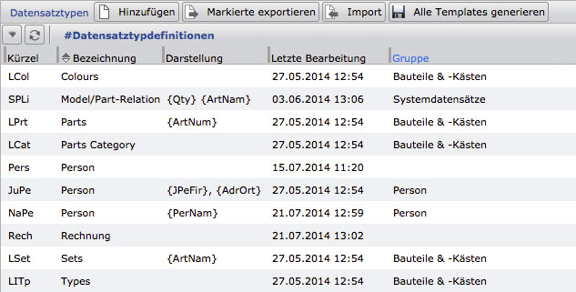

Database scheme: field and dataset types
===========================================

Basically, the CortexDB works schemeless. It is therefore not mandatory
to add new fields to new datasets.

Nevertheless, this is necessary when working with the application CortexUniplex and the import tool `CortexImplex`. Because with these two tools, the formation of a basic structure for specific applications is created. Furthermore, the use of these structures is done with the help of the standard functions and the CortexUniplexAPI, so that the development is simplified and accelerated for software developers (for example concept for dataset rights).

Procedure for fields
--------------------------

The datasets within the database contain fields. The use of these fields results
in the so-called "dataset types" in which any field can be used. The available
fields are to be defined in advance for the cortex application. This includes 
creating the fields and defining the field type. You can choose between different
field types (eg text, date, ...). As a result, the Cortex application distinguishes 
the type of display and editing of individual fields.

After the field definition, the fields are assigned to one or more dataset types.
It may make sense to outline these in advance and thus decide to use the fields.
Among other things, you can also specify the references between the datasets.

Note that you can use a field in different dataset types. This is the same field.
If, for example, the application is searched within this field or an index is called up,
the display shows all dataset types involved. For some fields, this may make sense
(e.g., postal code, account details, etc. for individuals and businesses); For other fields,
it makes more sense to create separate fields for the different dataset types. In particular
when importing data, the multiple use of the fields must be taken into account.

Creating fields
--------------

Within the menu for the system settings the "Fields" item is available. Here you can access the list of all previously created database fields. Double-clicking on an entry leads to the editing of the field (also for deletion). The "Add" button is used to create the new structure.

It should be noted that the field configurations are first entered in 
the list of pending changes and all changes are transferred to the database
first via the Save button (top right). This allows you to configure and
customize multiple fields without constantly changing the database.

### Field names and field synonyms

The field name is used to display the user and should be chosen as
meaningfully as possible. The field synonym is the internal name of the field
the server is working with. This synonym is necessary for importing new information. 
If a content is imported for which no field already exists, it is mandatory to always use synonyms.

!!! Note "Note"
	Since the application CortexUniplex, as well as other applications, are integrated within the database as so-called "php plugins", a range of synonyms is reserved for them. Therefore it is necessary that own field synonyms to be comprised of min. 3 characters (up to 7 characters), and do not start with numbers or special characters.

### Field type and field length

The field type is used to define the basic use of the field. Certain 
contents may therefore require a conversion of the contents during import. 
In particular, the contents for date fields must be adapted when importing data.
(See: [Import of Date Fields (/DE/CortexImplex/CortexImplexBasics/#datefields)).

| Field type                       | Description                                  | Length                 |
|------------------------------- | ---------------------------------------------- | ---------------------- |
| Character                        | one-line text field; automatically indexed   | max. 220 byte          |
| multi-line text field         | Plain text without index, e.g. for json strings, simple texts, HTML, etc. | max. 4 GB |
| Date                          | for dates (to be noted for the import) | 8 byte (yyyymmdd)       |
| time                     | for times with date and hour: minute   | 12 byte (yyyymmddhhmm) |
| Positive integer              | numbers without decimal places                   | Integer                |
| numerically with decimal places | Numbers with decimal places; the field length is used as a definition of the decimal places | Float |
| internal reference              | These fields are used to establish the references (relations) between two datasets. The field stores internally either a valid reference or an invalid reference in the form of the data entered (or imported). | | 
| File                          | Binary field for files of any kind. The usage must be configured in detail within the CortexUniplex (e.g., max size, file type) | |

### Subtype

The subtype is used to display (and possibly check) the content.
For example, this e-mail and web address can be output as a link.

### Index for history information

A special feature of the Cortex database is the possibility of date-dependent
storage of field contents, the so-called "history information" of a field.

You can change, view or record past, present or future values. The currently
valid value is always in the index and can be found via portals or the various
search functions. Past and future values can not be found through the search mechanisms.
If these values are to be found, they can be indexed via the "Index for historical information" option.

!!! note "Note"
	Indexing historical information means that storage requirements increase significantly, and that end users may see search results that appear to be ineligible to search because only the most recent values are output

### Repeating field

Basically, each field within a dataset can only be used once to store unique 
values. The Repeating Field option, however, allows multiple use of the same 
field in a dataset. For example, for telephone numbers, bank details, hobbies, \....

In addition, within the dataset types, the CortexUniplex allows the grouping
of several repeating fields to form a common group, the so-called "repeating fields
groups". As a result, several fields are always grouped together. For example,
for bank details, consisting of the bank name, the account number, BLZ, IBAN, \ ....

!!! note "Note"
	These fields must be taken into account when importing data.

### Field description

With the help of the field description the definition of the field can be explained
in more detail. Especially with extensive databases with several hundred fields,
which are maintained by different people, it is very helpful if the meaning of the field can be read.

### Backwards index

A valid reference field always contains only the ID of a target dataset (preceded by @). Unresolved references consist of the original text preceded by an exclamation mark. These contents are therefore also in the "index" (the 6th normal form) visible.

If selections are to be made via the reference structure ("graphs"), it is possible to trace the direct references from a start to a target (S -> T). In this case, the database selects the ID of the target dataset. To find out which datasets refer to a dataset (parent reference), the index must search for its own ID. However, this is only available if the field was previously provided with the "backward index" attribute. 

!!! info "Information"
    Basically, it is recommended to provide all reference fields with the "backward index" attribute. Only with the use of large amounts of data ("big data" with billions of datasets) should the approach of assigning this attribute be selectively used.

### Subsequent processing of a field

If a field definition has been entered in the list of pending changes,
it can also be subsequently changed (as long as the final saving did not
take place). By double-clicking on the corresponding line, the parameters
can be adjusted again.

Data Set Types
--------------

The datasets within the database contain fields. The use of these fields
is defined by so-called "dataset types", each type of which can use any fields
and thus differs from other types of datasets. A dataset type therefore describes
how datasets of the same type are constructed. Users of the CortexUniplex therefore
only have the option of seeing and/or changing the fields defined in such a dataset type.
Please note that the authorizations from the field templates are taken into account.

!!! note "Note"
	The dataset types are used to pre-structure the otherwise schemeless storage of datasets. Data integration via ImPlex nevertheless allows the import of previously unconfigured fields.

The available fields are to be defined in advance for the CortexUniplex. 
This includes creating the fields and defining the field type. You can choose
between different field types. These are necessary for the display and processing
within the CortexUniplex in order to represent the different contents accordingly
(date, numbers, text, \ ...) ..

After the field definition, the fields are assigned to one or more
dataset types. It may make sense to outline these in advance and thus 
decide to use the fields. Among other things, you can also specify the 
references between the datasets.

Examples of the dataset types and fields sketched beforehand would be:
*"People*" mapped to *"Companies*" and *"Banks*" that can occur in 
both types of datasets. Likewise, *"addresses*" are to be evaluated or assigned.
Since the possibilities of references between datasets, also called "internal references"
are almost unlimited, you should design a data model before you capture it to detect
the optimal reference structure, thereby minimizing errors and redundancies in capture.

The list of already configured dataset types shows the abbreviation 
for the internal administration, the name with which synonyms the dataset type
is displayed in certain places, the last edit and, if applicable, the group
to which the dataset type was assigned.

### General configuration process

To define a dataset type, some basic configurations are necessary.
This is where you encounter a chicken-and-egg problem in the configuration
because many settings for the dataset types are not possible until dataset types
have been configured. A multiple call of the dataset type configuration is necessary.

Within the "Core data" tab, you specify the basic information for the
dataset type. Among other things, the description of how the dataset type 
is displayed to a user and an internal shortcut (exactly 4 characters). 
All other information can only be set after saving the dataset type and 
the previous configuration of Find, List, and Object Viewer.

The default search definition determines how datasets of this type can
generally be found. The search is always based on field contents. This definition
of the default search configuration can therefore only be defined after assigning 
fields to this dataset type and after defining the search configuration under "Search".
However, it should be noted that this search definition is used in particular for 
reference fields. Without a default search definition, a valid reference to a dataset cannot be made.

The visualization is similar. Only after fields have been assigned to this
dataset type can it be determined which fields should be used to represent a
dataset of this type (for example, for parent references).

The same is true with the Objectviewers. Again, these cannot be assigned until they have been configured.

### Basic Setup

Each dataset description consists of the *"core data*" and *"field definitions*".
The description of a dataset type is first defined by the core data and later completed.
The core data of a dataset description are therefore processed at different times and,
together with the assigned fields, form the input mask and dataset representation.

The so-called "template" is generated and results in the dataset view (so-called
"recordview"). The generation must take place after each change to the field definition
and can take place within the dataset type or across all dataset types (in the overall list display).

!!! note "Note"
	After importing dataset types from other databases or a backup, the template must be generated. Only then are the adjustments in the application available (after a new login or an update).

### Basic Procedure

In the first step, the basic values (designation, abbreviation)
are used to uniquely define the dataset type in the system. Then you
have to select and specify the corresponding fields in the *"Field definition*" tab. 
That is, the fields are, for example, assigned to a display type, grouped, 
or put into a meaningful order.

In the third step, the other fields of the core data are completed.
These include the assignment of the so-called "Object Viewer" (if any),
the specification of the dataset type usage and the visualization of fields 
for the display of *"parent-links*". PHP functions can also be stored for the field check.

### Core Data

When adding a new dataset type, the * "dataset type editor" * opens with 
the tab *"core data"*, in which you enter a name (freely selectable, 
as meaningful as possible). These can be found again after saving in the
list of dataset types. In the Shortcut field, enter a 4-digit, unique abbreviation.
This abbreviation is required by the dataset type identification system.

Then save this data with the corresponding button; A basic template is 
generated and you get access to all other core data that you edit again after
editing in the field definition.

### Field Definition

Within the field definition, you configure the basic structure of the
dataset type, just as a dataset of this type should be displayed to the user.
This definition is divided into categories and fields and possibly repeating groups.
It should be noted that only fields that have been assigned to categories 
can be rearranged. Fields that have been assigned to the "default category"
are not to be re-allocated.

The example shown here shows an already defined dataset type with fields in
categories and several repeating fields, some of which were also grouped.

To add a field or category to this dataset type, click Add Item in the top
toolbar. You will then receive a selection from which you can select 
"*field*" or "*cat.*". If you want to assign fields to an already existing 
category, simply click on the symbol to the left of the category (blank sheet).

From the field selection, you can accept individual fields with a double-click 
or select several fields one after the other while holding down the `CTRL`-key and
then accept them. Note that the fields are assigned in exactly the same order as the 
category you clicked on. The first clicked field is therefore always on top;
the last clicked is down always.

For subsequent resorting, you can use the two arrows (up / down) per field or 
the small "Checkbox". If you use the checkbox, the click order is also used here 
to specify the subsequent sorting. After you have selected several fields via the checkbox,
click on the field below or above which you would like to sort the other fields.

### Additional parameters per field

You can use the triangle in front of each field to display and change
additional configuration settings per field (if desired). This is especially
necessary if reference fields are used.

In addition, you can specify whether it is a text field in which the user 
can manually enter any text, whether it is a checkbox (0 or 1 is then saved)
or whether it is a selectbox from the the user can only select predefined contents.
In the case of a selectbox, the possible contents are to be defined here.

For reference fields, define how the target can be found in the database and what
information is returned for the display. For this you simply add a so-called 
"target reference".

In the Dataset Editor, select the appropriate field, and then in the properties (right pane), click the field for the destination field to select the destination dataset type. If you have defined how a dataset is to be found in the target dataset type (default search definition), this search setting is automatically used to set a new reference. If you have not set a default search definition, or if you want to use a different search definition, you can specify it in the extended fields for this reference field.

Note that the target reference is also used for the data import Corteximplex tool
to convert imported information into valid references. If, for example, "Meier, Hamburg" 
was read in via the implex, then the search definition must consist of "name, location".

!!! note "Note"
	As long as the content of a reference field has not been "resolved", the field contains the entered (or imported) field content preceded by an exclamation mark (eg: "*!Meier, Hamburg*"). If the linker was executed, the field contains the reference to another dataset in the form of an @ -character followed by the ID of the target dataset. Only through the dataset view display are the the information from the target dataset shown, that have been configured as described above.

Layout per dataset type
----------------------

You can then define one or more layouts for each dataset type. Each
layout consists of individual sections with fields. The following 
figure shows an existing configuration with associated fields. To the 
left of the fields is the bar for the "field selection", on the right 
side the "properties of an element". Both bars can be opened and closed 
via the arrow above.

When the field selection is open, all fields, all unused fields, system
fields, reporter fields, and repeating field groups are available in the 
respective tabs. By simply clicking on a field in the field selection,
the clicked field is taken over into the layout. It is classified under
the currently marked field.

Each ordered field can be assigned optional parameters via the right 
sidebar (Element Properties). For example, it is possible to use pre-text
and post-text or a defined width.

When you have made all the settings, save the layout via the corresponding icon in the upper right corner.

!!! note "Note"
	With the "Advanced sorting" button you can quickly and easily sort the fields. After enabling the advanced sorting, each field before the label gets a selection that you can click. In the click order (represented by 1,2, \ ... in the respective box) you can rearrange the fields. Simply select the appropriate fields in the correct order and then click on the box below (or above) the fields you want to place.