CortexUniplex-Dashboard 
=================

The CortexUniplex Dashboard is an additional plugin that can be used 
to graph Pivot content. The call can be made via a separate URL so that only
the dashboard without the CortexUniplex is used. Likewise, individual dashboard
configurations can also be made available to users within the CortexUniplex
using the "Start Tab" function.

In general, each dashboard consists of a configuration of tabs, data sources
(a combination of portals, lists, and pivots) and labels (a graphic or a filter).
In each tab several graphics (sometimes from different sources) can be integrated.
If dashboards are used within the CortexUniplex, individual tabs can be assigned 
to a call via the so-called "start tab templates".

For the graphical representation, the following diagram types are available
for this function: Line, circle/ring, column diagrams and tachographs. 
The processing of the graphics is based on the ["D3js"
(https://github.com/mbostock/d3/wiki/Gallery) library and is therefore expandable for 
future developments. In addition, the CortexUniplexAPI provides an already
optimized format for using D3js, so that even other developers can use this
library for their own applications.

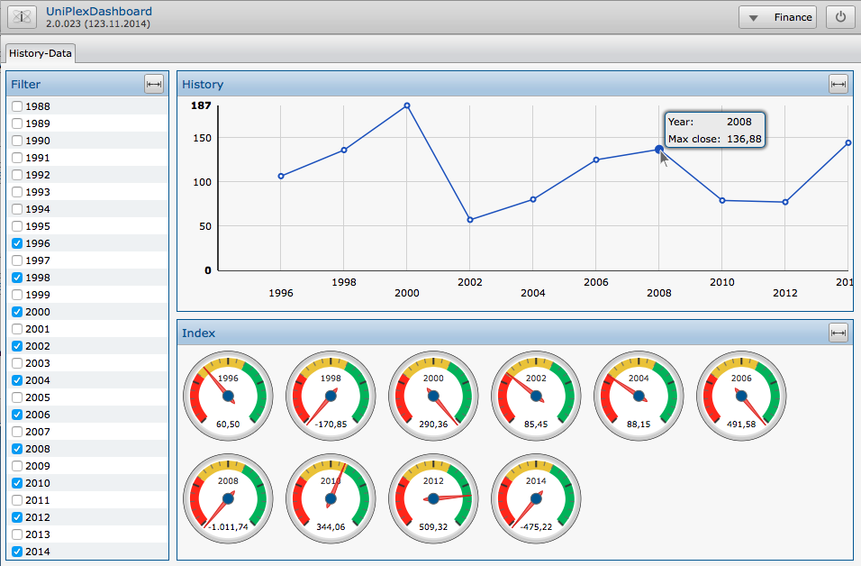

### Requirements

- Configured portal with groups and lines
- Lists that are called from the portals mentioned above
- Pivot configuration(-s) in lists

### Method

- Call the dashboard-admin via plugin-button and create/edit a configuration
- Establish source: Select portal, area and line
- Select Pivot
- select filter fields (list fields)
- Define areas
- Define labels

### Notes

A dashboard can come from multiple lists/pivots; the filters only ever
refer to a list. If graphics from several lists are used, several different 
filters might have to be defined

### Outline of a dashboard

As already described in the introduction, a dashboard configuration consists of
the name for the configuration ("Name configuration" in the screenshot on the top right),
one or more tabs ("Tab1 name", \ ...) and several labels (Label1 to 3 in the Screenshot),
each of which may include a filter or graphic.

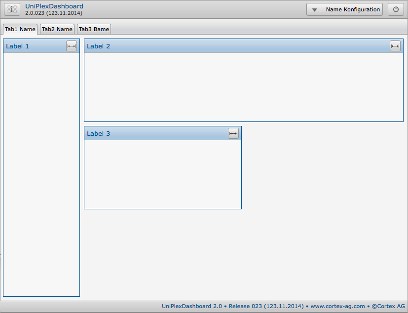

To arrange the various labels, the total area of a tab is divided into 
a (virtual) grid consisting of rows and columns (to be freely defined). 
The rows are numbered, the columns are lettered (analogous to spreadsheets
or the "sinking ships" game). For each label, the dimension must then be set
manually during configuration. For example, the total area can be divided 
into 5 columns of 3 lines, in the "Label 1" from A1 to A3; "Label 2" from B1 to E1
and "Label 3" from B2 be set to C2.

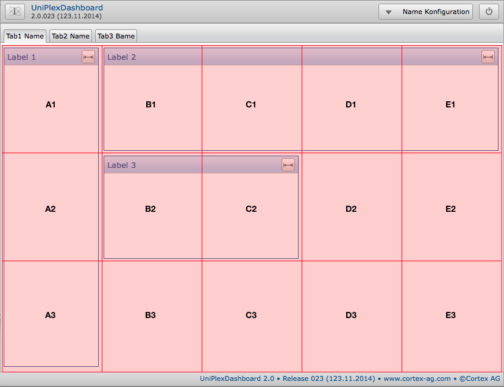

### Configuration Procedure

The configuration of dashboards is done via the "Dashboard-Administrator" plugin.
If this is activated in a plugin template and assigned to a user account, 
the corresponding button is available in the quick start bar on the left edge.

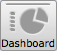

At the first call, there is only the possibility to create or import a new 
configuration. When creating a new configuration, set a name for the dashboard. 
This name is also used to assign user templates so that only certain dashboards
are shared with selected users.

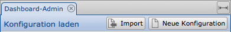

After the name has been set, new tabs can be created ("New Tab" button):

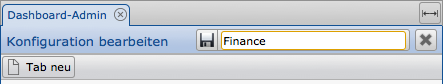

Each tab also gets a name that describes the content, for example.
In addition, the portal from which the selection results for the dashboard 
should originate is selected under "Choose Portal \ ...".

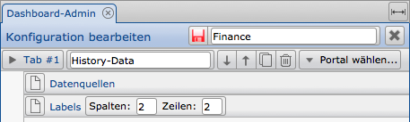

From the selected portal, one or more entries can then be selected as the
data source. Please note that a data source can also contain a filter.
Multiple data sources in one configuration cannot use the same filter.

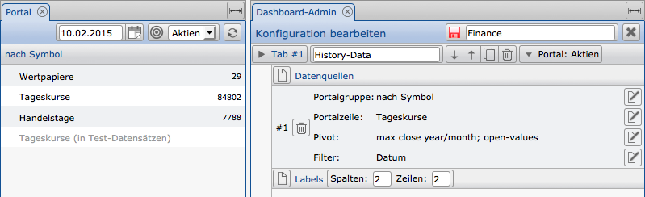

The following screenshot shows what the individual specifications within
a portal refer to. You can select a group and a line from a portal, 
as well as one or more pivots for the selected line. (The filter may contain
multiple fields from the list.)

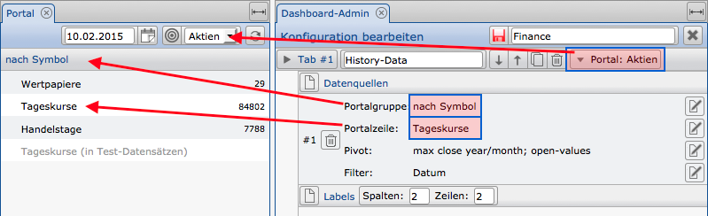

Once the data source(-s) has been set, the scope for each label 
(graphics or filter) is configured. Here you define first the (virtual)
grid (columns, rows) on which the individual labels are distributed.

Each label receives a name, the position in the grid (from/to),
a display type (graphic or filter), the reference to the data source
and further information on the display ("display options")..

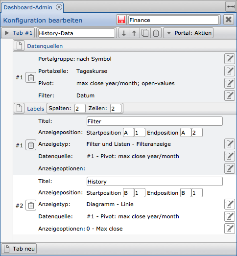

The following display types are available:

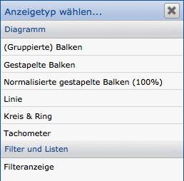

The following screenshot shows an example configuration of a dashboard:

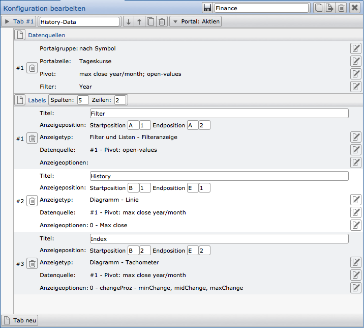 

Based on the screenshot shown above, the following dashboard is generated:

Display Options
---------------

Basically, the display options depend on the selected display type (type of graphic). Some parameters can be used for all display types. Depending on the type used, only those options are available that can be used wisely. Some display types (e.g., columns and lines) also allow the display of two ranges of values so that a second value axis can be used.

In general, the heading axis is the horizontal baseline (x axis, or also the abscissa axis). Therefore, at this point - along with other options - the label rotation and scaling are available (only single and not usable in combination).

In the case of the value axes are the vertical values that are displayed on the left (and / or possibly right) of line charts and bar charts (y axis or ordinate axis).

By specifying the value of both axes, you specify the distance between the axis and the edge of the label; with the gridlines, the insertion of vertical or horizontal guides; By activating the min./max. values, you determine whether these values are to be markedly displayed on the respective axis.

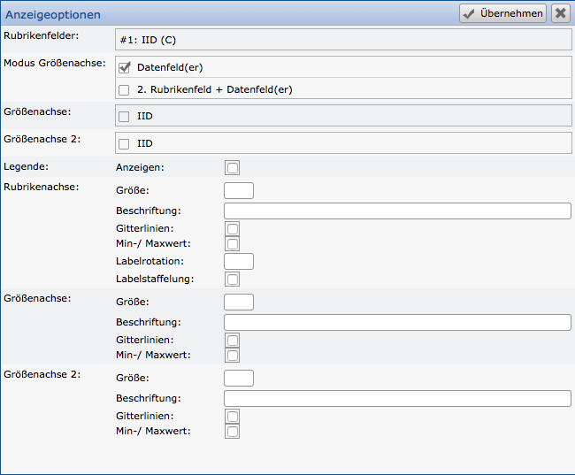

Compared to line or bar charts, pie charts/ring charts and tachographs have far fewer options because no axes are defined here.

For the circular/ring diagrams, only the activation of the field is necessary, which should be used for the "value axis", if necessary, the activation of the legend and, if necessary, the specification of a percentage, if a ring is desired instead of a circle.

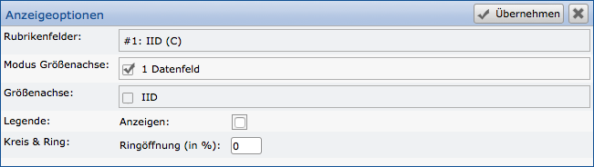

A tacho is the representation of a value (indicator) against a scale (from minimum to maximum). The scale can also be subdivided into several (possibly color-coded) sections. The individual sections of a tacho must be available as columns, just like the actual value within the pivot list, in order to activate them in this configuration. If the individual sections are to be subdivided by color, it is necessary to configure the text color of a column in the pivot list. The colors specified there are used for the scale.

