Lists
======

Within the CortexUniplex application, lists are one of the main features of
the application. Each output of results and content uses the standard list function.
Therefore, it is often not only the presentation of simple lists with rows and columns
as a result list for searches and portals, but also substructured issues (sublists) with
calculated content (JavaScript in lists), which may additionally be evaluated as a pivot output.

In addition, list results provide the foundation for presenting data in a dashboard
and provide the foundation for the CortexUniplexAPI so that information can be
shared with other applications.

The lists are therefore one of the most important functions, because their configuration 
depends not only on simple representations, but also on further functions.

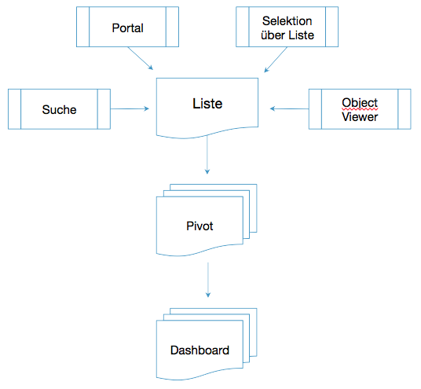

In addition, simple, flat lists (with direct reference fields) can be 
used as the basis for the function of "lists selection". This makes it possible 
to search within the database by using the fields in the list as search fields.
Reference fields are also used to select linked contents. For a more detailed
description, see the article Selection with Lists.

### Column functions in lists

Note that similar functions are available within the lists as they are
available in Excel. In addition to sorting, you can also display a summary
(for text fields) or summation (for numeric fields). Likewise, filter options
per column are possible (analogous to Excel).

Simple Lists
---------------

Lists are about displaying search results, portal selections, or displaying
other function calls. In the simplest form, lists consist of one line per
dataset whose information is displayed column-oriented. By clicking on a line,
the corresponding dataset in the other half of the screen is displayed.

If no lists have yet been defined in a new system, the selected results can 
simply be displayed in a new, empty list.

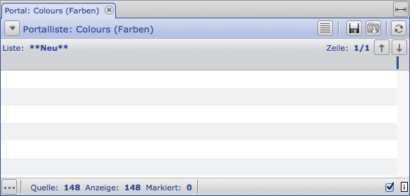

As can be seen in the blue header of the list, the empty list was displayed
by calling a portal line. When calling via other functions, the corresponding 
text is displayed in the tab and the blue line.

Depending on the authorization of the user account (to be defined via the 
user templates), a user has access to various functions. The toolbar of a list 
therefore shows  on the right edge the buttons for displaying the list configuration (with dashes),
for saving (floppy disk), for loading (folder) and for reloading (rotating arrows).

Furthermore, additional functions are available via the triangle on the left side.
In particular, a user receives further functions that can be restricted via the 
user templates. Thus, it is possible to create new lists, overwrite existing ones,
export datasets (csv and xml), save and load selections, and output (print) the list as a pdf file.

### Configuration of a list

If, as in the example above, it is a new, empty list, new fields can be added
very easily. To do this, click on a dataset to get it into the dataset display.
By double-clicking on the name of the field to be displayed, this field will be added
to the list. Each additional field to be displayed in the list is also double-clicked.

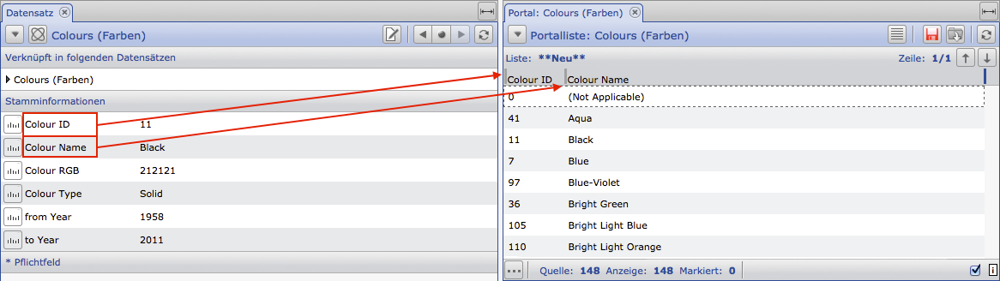

If the required fields have been added, the dataset view can be closed again
(via the small cross in the tab). The list can then be saved via the floppy disk
in the toolbar. This will turn red when an unsaved change has been made to the list.
If the list is saved for the first time, the query is made for a name that must be 
assigned for the new list. Each time you save, the list is overwritten without prompting.

After completing the list configuration, the datasets are displayed in the simple list as shown in the following example:

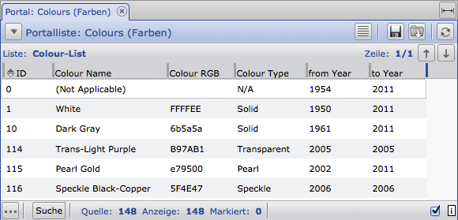

### Adding fields manually

Individual fields can also be added manually within the list header. To do this,
double-click in the header area of the list (marked in red) to call up column editing.

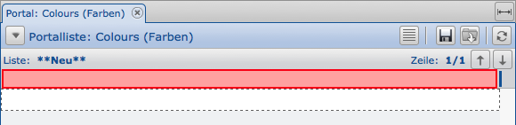

This will take you to the parameter setting for editing a single column 
and you can add a single field. To do this, click on the button for the field
selection (marked in red) and select the required field.

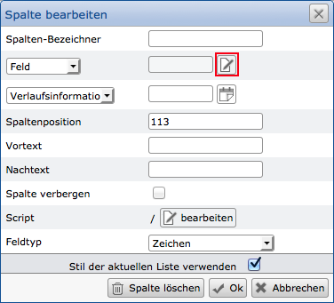

Der Spalten-Bezeichner wird hierbei aus dem Feldnamen übernommen und
kann bei Bedarf nachträglich geändert werden.

### Process Information 

If it is a field that contains history information, a fixed or relative date
can be set via the "Historical information" parameter. Relative dates always refer 
to the current date; Therefore the "History information (relative date)" entry 
can be selected in the selectbox. This provides the user in the list header with
a date field for entering their own reference date.

Relative dates can be entered using simple abbreviations. The first character is + or -, 
followed by a value and then the dimension in the form of days (d), weeks (w), months (m),
quarters (q) or years (y).

Examples:

``` 
+1d  tomorrow
-1d  yesterday
-2w  two weeks ago
-3q  three quarters ago
+9d  in nine days

03.05.  third of May of the year on the given date
        (of today's date; or the reference date)
```

This relative information is possible in every date field. Both in the lists, as well as for the configuration of portals or other functions.

!!! note "NOTE"
    Note that the combination of relative dates with fixed dates is not possible (for example, 3rd May of last year).

In addition, it is possible to define the beginning or the end of a period of time
(for example, end of month, quarterly start, ..). This is done simply by adding "s" (start)
or "e" (end) after the dimension:

``` 
-2ws  Week start from two weeks ago
-3qe  Quarter end of three quarters ago
-1ys  Year beginning of last year
```

### Column position, pre- and posttext, hiding

The column position allows the exact positioning of the left column border in pixels. 
Especially with multi-line lists, columns can be arranged exactly one below the other.

Pre and post texts are displayed before or after the actual content in
every row in which a value is displayed in the column. For example,
with pure numeric values, the corresponding dimensions can be output 
(for example, cm, ° C, €, \ ...).

The Hide option can be used to hide a row. Especially if the content is not
displayed but should be used for further processing via pivot or JavaScript,
this function is helpful.

### Field type 

By specifying the field type, an alternative type of the field to be displayed 
can optionally be specified. For example, if only numbers were stored in a text
field, this information can not be counted and the sorting is done alphabetically
rather than numerically. If the field type in the list is adjusted accordingly,
this circumstance can be bypassed.

Furthermore, the definition of a field type is required if it is a column whose
contents are calculated by script.

### Reference Fields

If a reference field is added to the list, it is necessary to select a field 
from the target dataset type. The field content of the target dataset
is then used for the display in this list.

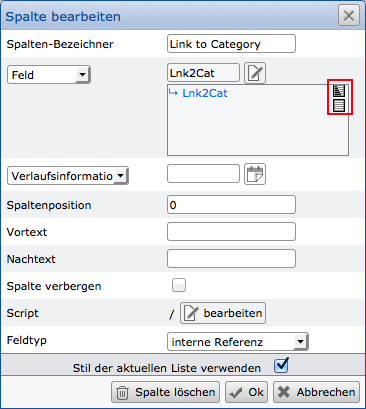

You can also choose a reference field from the target dataset type,
which will refer to another dataset again. In this case too, a field from the target
dataset is to be selected again, the contents of which are to be adopted. Thus,
you can also use multi-level link chains in a list and follow the chains to the end and display content.

### Script 

The "edit" button takes care of a script (JavaScript) for this list. 
It does not matter in which column the script is stored. Results can be output 
via the column identifier directly in other columns. For a detailed explanation,
see the "JavaScript in Lists" section.

Sublists 
---------

Subdivisions can be used for the subdivision of further information that
originates from a dataset or from linked datasets. In this case,
the line of a dataset is supplemented by additional lines whose contents can
come from the same dataset or from other datasets. This makes the simple 
representation of networked structures possible, as they are also output in other systems.

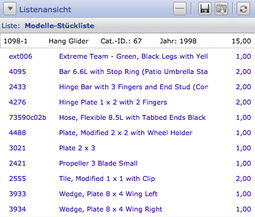

Each sub-list may contain other sub-lists. During use, you can access 
both the simple link (where this dataset refers to) and the so-called parent link 
(which links to this dataset). In the adjacent example, this function displays 
individual components for a construction kit. If the components in turn refer
to a substructure, this could be displayed via another sub-list.

### Configuration of sublists

To configure sublists, open the row overview with the corresponding
button in the header of the list. This gives you access to the other
functions per line.

Note that the button for opening the row overview is displayed differently
and therefore depends on the editing mode of the list.

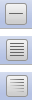

A dash is displayed when the line summary is closed, multiple dashes
when the column headings are displayed, and "halved dashes" when the complete row
configuration is displayed. You can therefore toggle between the entire ad, 
the column headings, and the ad without column headings.

!!! note "Note"
	The respective mode of the list is saved when the list is saved.

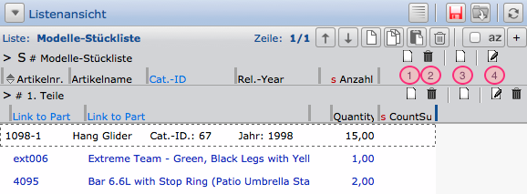

If you have opened the line overview, different functions are available for
each list and sub-list. You can add or remove a new line per dataset ("1" and "2")
and add new sub-lists ("3") and set their parameters ("4"). You can delete
each sub-list with the respective sub-lists below using the Delete button
on the right-hand side ("Recycle Bin").

### Sublists-Parameter

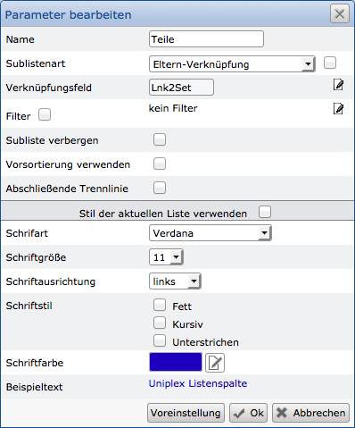

Use the parameters of a sub-list to assign the name ("Title") and then
select the link type. You can choose between Parent and Simple link, 
but you can also create a sublist based on repeating field groups.
In addition to this, datasets in sublists can also be displayed in which
a certain field content matches the content of the same field from the
current dataset (so-called "field content link.").

The last two options (Repeat fields and Field contents) may display additional configuration items.

You can also set a filter to display only certain datasets within
the sub-list. Hereby any field combinations can be selected.

Of course, the format (the "style") of the displayed content
is also configurable here.

### Representation of recursive structures

Within a database, datasets reference each other to other datasets.
For example, components can refer to a kit. If such references are placed
between the same types of sentences (for example, person to person on 
person \ ....) one speaks of "recursion".

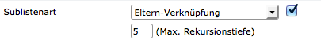

To represent recursions within sublists an option is needed, otherwise
a sublist would have to be created for each reference. For this purpose,
the corresponding checkbox for the sub-list type is available for you to check.
This activation minimizes this step and automatically performs it.

!!! note "Note"
	To add fields in a sub-list or other line by double-clicking from a dataset view, you must select the respective line as the "active line". This is done by clicking on the circle symbol in front of the line. After the click, it is filled.

Pivot Tables 
--------------

Pivot tables are representations that evaluate information based on a list.
Each list can also have multiple pivot tables to toggle between. If a list is saved,
the pivot representations will be saved as well.

For the pivot representation, a so-called cross-table is used, which groups 
the information over rows and columns and can perform calculations at the 
crossing point (the result field) (for example, number, sum, average, ...).

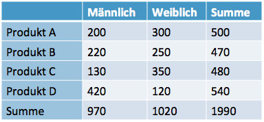

The table shown here shows the number of sales grouped by product and gender.
The fields are thus subdivided according to row, column and result fields.
The number is then determined in the result fields.

Such (and more detailed) evaluation is possible using the pivot tables within 
the CortexUniplex. This makes it possible to directly access the current data within
the database and minimize the export to other systems.

The basis for such a pivot evaluation is a simple, one-line list.
All the information you want to use in the pivot table must therefore be in
one line of the list. Here you can use information from the datasets as
well as calculated fields.

### Method

The list menu (triangle button in the upper left corner of the list view)
will take you to the Pivot list (or Edit) with the "Open Pivot view" entry.
Basically, the table will be opened empty so that you can always do the
calculation If you open the pivot view from a list for the first time,
you must also configure the column, row, and result fields.

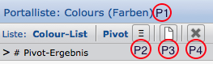

P1: Called function (below list name)

P2: Show settings

P3: Create new list

P4: Close the pivot and go back to the starting list

When you open the Pivot view, you always see the saved view. If no pivot 
view has been configured for the list view, the pivot headings are blank.
From there, you can use the functions shown to create a new configuration.

Click the "P2" button to show the headlines and then "P3" to create a new
configuration. Here you will see three lines to which you can assign the
required fields. As with the simple lists and sublists, you can double-click 
to add new fields to a row. You select the source column here and, if necessary,
assign a new title.

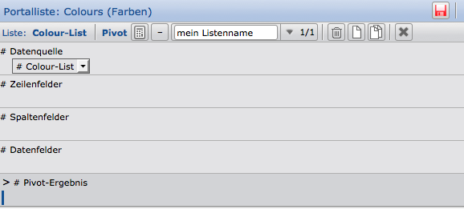

If you have defined the required fields and functions, these are displayed 
in the headings. By clicking on the symbol of the calculator in the toolbar,
the results are calculated and displayed. Please note that the data fields have 
different functions for results analysis. You can use this to calculate the number
and number of different contents, the sum, the minimum and maximum, and the mean value.

The following figure shows with colored markings where the information from the headings
(configuration) is displayed:

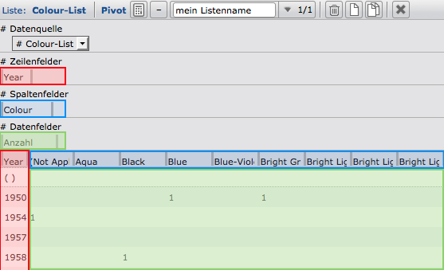

The icon with the dash (to the left of the pivot name "my list name") 
allows you to hide the configuration so that only the actual pivot table is displayed.

As with the output list, the entire list with the configured pivot tables
can also be saved here via the Save button.

!!! note "Note"
	You can configure multiple pivot tables for each list. Therefore, a meaningful name should be used.

**Saving the pivot:**

To save the Pivot configurations, exit the Pivot view using the cross
in the toolbar to get back to the list view. There, save the list again using
the Save icon in the toolbar or the "Save List" entry in the menu. This saves
the associated pivot configurations.

### Field editing

When you create a new or double-click on an existing field name (row fields, 
column fields and data fields), you go to the field editing. This makes it possible,
as with list boxes, to adapt the properties of the field contents. If you uncheck
"use style of current list", you can change various options.

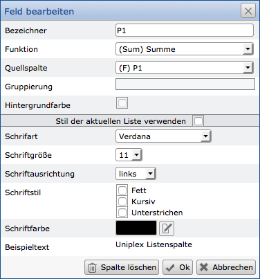

### Tabular View

If you have displayed the row overview for the configuration (the upper, gray area),
you can switch between the "Table" and "Outline" views. The tabular view shows the row
fields per row next to each other. This is followed by the data fields per column.

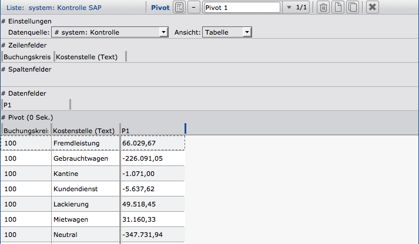

!!! note "Note"
	Dashboards can only be configured based on the tabular view.

### structured view

The "Outline" view groups the values per row field. For each group then the 
total results are displayed. You can also configure multiple subdivisions.

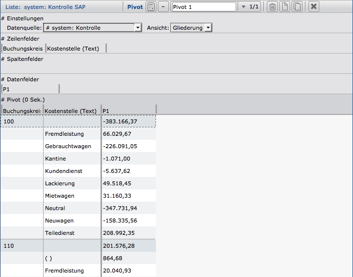

### outlined view with column fields

Even in the structured view, it is possible for you to specify column fields.
The output will then show the broken results in the respective columns and will
also output the total results per line and (at the bottom) also per column 
(not visible in the image shown).

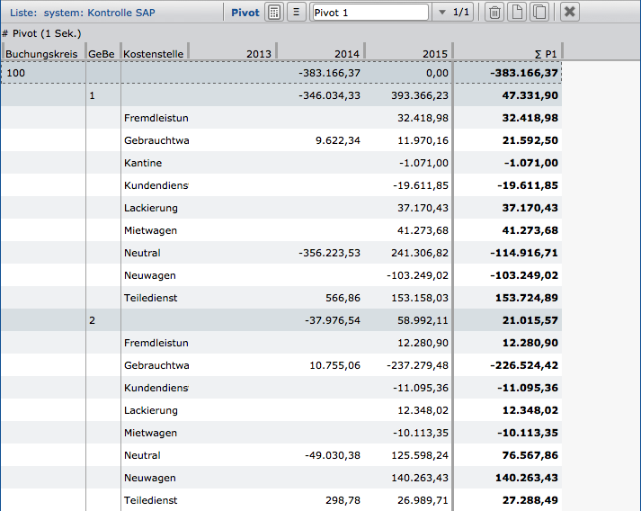

The different views are stored and can therefore also be called directly (for example via a portal call).

JavaScript in lists
--------------------

With the help of the CortexUniplex application based on the CortexDB, you are able to carry out any selections within your dataset and output them in the form of lists. The list functions also allow you to display so-called sublists so that recursive structures can also be displayed. In addition, further pivotal evaluations and associated graphical representations are possible.

As a supplement and for dynamic calculations at runtime, calculated contents serve as a list. The result is generated when the list is displayed and is only available there. Therefore, no datasets are changed and the calculated results can not be found via a search or any other selection type. The advanced list functions, such as the pivot display and the graphical evaluation, are still possible with these calculated fields. As a result, dynamic calculations based on list contents can be performed and displayed using various methods.

It is also possible with the import tool ImPlex that (certain) calculated contents are written to the database. Existing information is thus supplemented or changed and can then be selected and evaluated via the standard mechanisms.

!!! note "Note"
	The JavaScript content determination functionality is server-side, so only the result is returned. For this the Google library "V8" was implemented in the HTTP interface. This must therefore be available as a file in the server directory (and possibly in the HTTP server directory). Under Windows the "ctxv8.dll" file is necessary and under Linux systems "ctxv8.so".

### Requirements

In addition to the above-mentioned library "V8", check whether the lists automatically execute the stored scripts. This is to be activated in the `ctxserver.ini` in a separate block:

    [UNIPLEX]
    EnableApiList=1

If the server is started with this parameter and the V8 library is stored in the server directory, it can be seen in the CortexUniplex application in each list whether JavaScripts are executed on the server side. On the right side of the footer of a list, JavaScript server-side execution is enabled / disabled. If the above entry is contained in the ini file, the checkmark is always set.

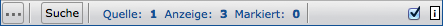 

### Method

The general procedure for the first and basic setup of a computed list is divided into three steps:

1. List definition
2. Configuration of the calculated fields
3. Save and deploy the list

Note that a user only sees the column headings within the list and may not be aware of the calculated contents. Therefore, on the one hand you should save the functions that you use for the calculation separately as a backup in a text file. On the other hand, users with list-editing permissions should be informed that if the list changes, it may be possible to influence functions for calculating content.

As a general rule, it does not appear within the list view which field is dataset fields or calculated fields. Formatting the columns allows you to choose a different text format for displaying the results (for example, a different color). This simplifies the interpretation of the display for the users.

### JavaScript editing

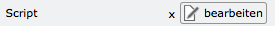

For each column of a list, a JavaScript can be stored in the Columns configuration. The "edit" button is available in the "Script" line for this.

This opens the edit window for JavaScript, in which a script can be stored. By way of example, the following figure shows the processing:

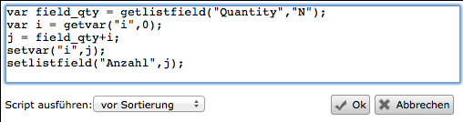

The "Execute script" option can be used to specify the time at which the contained script should be executed. You can choose between "before sorting" and "after sorting". Depending on the task, the execution time is thus relevant.

JavaScript-Introduction 
---------------------

Comprehensive literature and other websites make learning JavaScript very easy.
 Nevertheless, some hints are given here to help. For a quick start is also the
Online Help for [Selfhtml](http://en.selfhtml.org/javascript/language/index.htm).


### Comments in JavaScript

Within a script, you can create comments to describe your script in a readable and understandable way

``` 
// two slashes comment on the entire line

/*
  A slash and a star introduce a comment over several lines.
  To cancel the comment,
is a star and slash necessary.
*/
```

### Numbers in JavaScript

If you work with numbers, you have to use them as a decimal separator.

``` 
var pi = 3.1415;
```

Note that in divisions, so-called float values (floating-point numbers) 
can occur and the result of the decimal break can be very small. A check as to 
whether a particular calculation yields zero is therefore only sensibly possible 
if the result has been previously rounded.


### Variables

Values can be cached in so-called "variables" in order to use them for further processing.
Especially with calculated results, these can be reused without having to go through the
calculation again. To use a variable, you have to give a meaningful name and assign a value to it.
Variables are also declared with the prefix "var", "let" or "const" (for more detailed descriptions
please refer to the common JavaScript literature).

!!! example "Example"
```
	let iNumber = 42;  
	let iSqrRoot = number * number;
```

### Comparison operators

To be able to compare values with one another, the following operators are available.

    a == b    a is equal to b
    a != b    a is not equal to b
    a >= b    a is greater or equal to b
    a > b     a is greater than b
    a < b     a is less than b
    a <= b    a is less or equal to b

    (a > 0) || (b < 0)    a is greater than 0 OR b is less than 0
    (a > 0) && (b < 0)    a is greater than 0 and b is less than 0

### Calculation operators

To compute values with each other, the usual mathematical methods are available 
(the rule "point before line" is also to be observed here).

    a + b    a plus b (Addition)
    a - b    a minus b (Subtraction)
    a * b    a times b (Multiplication)
    a / b    a divided by b (Division)
    a % b    a modulo b (Remaining value calculation;
                        e.g. 2012 % 4 = 0 -> 2012 was a leap year)

!!! note "Note"
	If you "add" several texts with +, the texts are simply hung one behind the other. Especially if within the application CortexUniplex in lists certain columns are read, which were formatted as text and not as a number, you get corresponding results.

!!! example "Example"
```
	let sLastName = 'Dent';  
	let sFirstname = 'Arthur';  
	let sName = sFirstname + sLastName; // => ArthurDent
```

### Conditional Statements

Depending on certain values, results can be determined differently or
the script executed differently. For this, the so-called "if-then" conditions 
or the case distinctions are appropriate with "switch".

 

!!! example "Example 1"
```
	let sUserStatus = 'poor';  
	if (iBalance > 1000) {  
	    sUserStatus = 'wealthy;  
	}
```

!!! example "Example 2 - if-else-condition"
```
	let sUserStatus = 'poor';
	if (iBalance > 1000) {
	    userStatus = "wealthy";  
	} else {  
	    userStatus = "still poor";  
	}
```

!!! example "Example 3 - switch-case analysis"
```
	let iGrade = 3;
	switch (iGrade) {
		case "1":
			status = "A";
			break;
		case "2":
			status = "B";
			break;
		case "3":
			status = "C";
			break;
		case "4":
			status = "D";
			break;
		case "5":
			status = "E";
			break;
		case "6":
			status = "F";
			break;
		default:
			status = "unkown";
			break;
	}
```

### Loops

Using loops, instructions can be repeated until a certain condition is met.

!!! note "Note":
	If a condition never occurs, it is called an infinite loop. This must be avoided. As a result, abort conditions are often built in to prevent this from happening (for example, using if-else and the break statement, which suspends execution).

#### Loops using "while"

The while loop repeats the included statements until the previously determined abort condition occurs. If the condition has already been fulfilled, the loop will not go through.

!!! example "Example - while-loops"
``` 
status = "poor";
let myMoney = 0;
while(myMoney < 1000000) {
	myMoney += 1;  // add 1 to myMoney
}
status = "Your are millionaire";
``` 

#### Loops using "do-while"

Another form of the while loop is the "do-while" loop. This loop is run 
at least once, because the condition is checked only at the end.

!!! example "Example - do-Loops"
``` 
status = "poor";
let myMoney = 0;
do {
	myMoney += 1;
} while (myMoney < 1000000);
status = "Your are millionaire";
```

#### Loops using "for"

With for loops, counters are traversed to a defined level. The following 
example increments a variable by one until it reaches a certain level:

!!! example "Example - for-Loops"
``` 
for (var myMoney = 0; myMoney < 1000000; myMoney++) {
  status = "poor";
}
status = "Your are millionaire";
```
