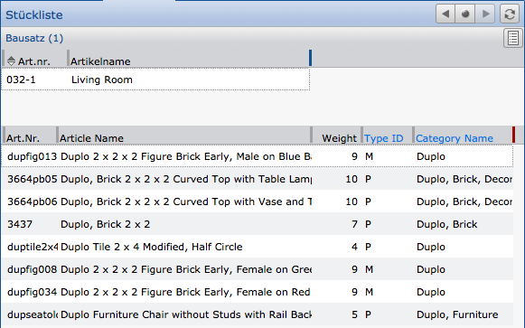
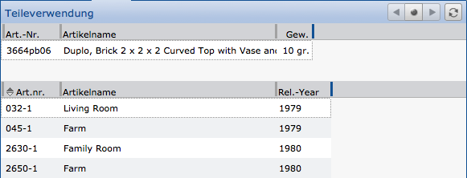
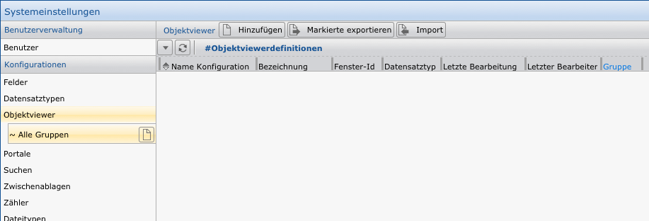
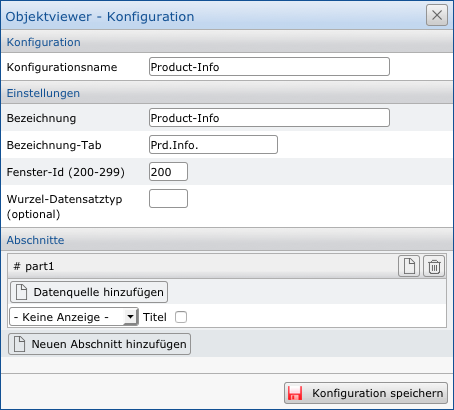
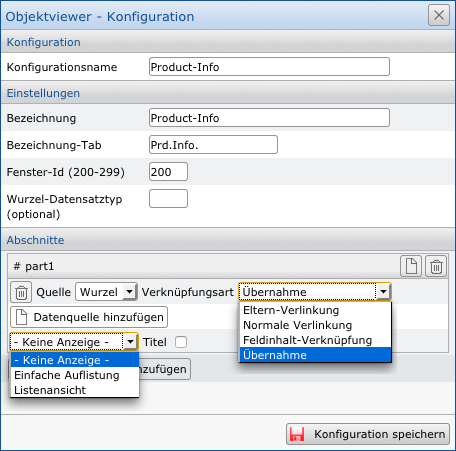
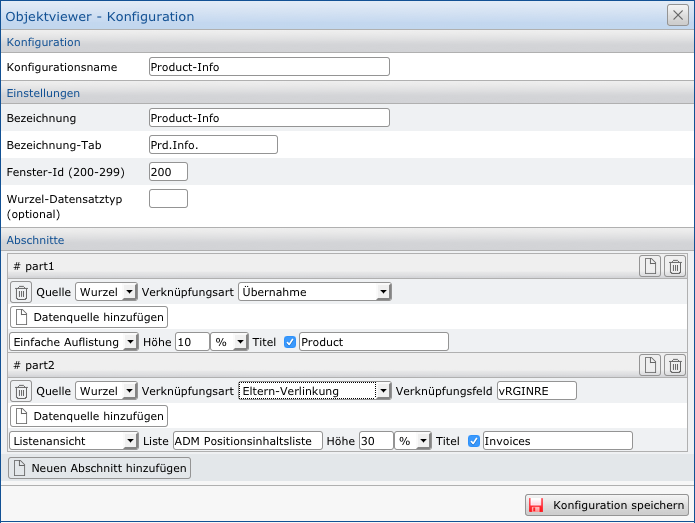

 Objectviewer
============================

An underestimated, but also very simple and powerful function of the 
application CortexUniplex is the so-called "object view". Based on a dataset, 
this feature allows compact display of networked information about the selected
dataset. Type, scope and selection depth are defined by the configuration of the
object view and the used lists. Here all set user authorizations and the function
authorizations apply, so that not every user can see and use all data fields and/
or all object views.

### Examples:

With the aid of these functions, it is possible, for example, to list
all used individual parts starting from an assembly, a kit or a complete 
finished article. Therefore, a parts list is generated.

It is also possible to use this object view as a new "navigation"
to view the displayed datasets (e.g., kit or item).

If an item is selected, the call of the corresponding object view 
is possible again. In this case, it is about, for example, the so-called
parts use. Starting from an individual part, it is obvious where this part is used.

Further use cases would be, for example, customer information (customer journal)
or the representation of social networks.

Wherever networked structures can be represented, it may be useful to use an object view.

This function is called up within a dataset via the corresponding
button (see adjacent screenshot). If multiple object views have been defined
for a dataset type, they are displayed one below the other. Note that the
permissions in the user templates must be set accordingly for the configured object views.

Object View - Configuration
-----------------------------

Like all other configurations, you can also configure object views (objectviewer) in the system settings. Simply click on "*Objectviewer*" in the menu to get to the selection of existing configurations or to create new ones. In this listing you can add, export or import new configurations.

To create a new Object Viewer, click on `Add`. This opens the dialog for carrying out the configuration.

Here you assign a name for the configuration that is used in the list of all Objectviewer listed above.

Furthermore, a description is required and a label for the tab when the Object Viewer is displayed.

Use the window ID to assign a type of "priority" to the tab of the Object Viewer. Tabs with the same ID replace each other, different tab IDs can be opened in parallel.

Objectviewer can also start from other types of datasets than those currently selected.

Example:

The following data model exists: People <- Projects <- Activities (activities can refer to projects, which in turn can refer to persons). If an object viewer is now called based on an activity, the parent project can be used as the root. Therefore, it may be useful (in rare cases) to set an optional root dataset type. This is selected via the corresponding field.

Once the basic settings have been defined, the configuration of individual sections follows. Each section may contain a list (a simple system list or previously defined list) to display information of the selected datasets.

In order to reach a result, the selection of the so-called "data source" is necessary beforehand. In the illustration shown here, the first section uses the root (in this case, always the selected dataset).

The link type defines how the information is selected. With "Acceptance" information from the selected dataset is selected. "Parent Link" selects the datasets that refer to the source; via the "normal linking" the source points to other datasets; The "field content link" is an implicit reference based on the same field contents in different (rarely even the same) fields.

You can then choose whether to display the results (via a simple listing or view of lots) or if they are not displayed. In this case, the selected datasets will only serve as another source for a subsequent section.

Optionally, you can assign a title and size to each section. The size specification serves only as a guideline in percent. The Objectviewer uses your information as the key to distribute the place. For example, if you define two sections and assign 10% to one and 5% to the other, the available space is split 2:1.

By way of example, an object viewer can be configured as shown below. Note that each section can use any source. This can be other sections as well as the original root.

!!! note "Note"
	Depending on the complexity of the data model and the previously configured lists, objectviewers can also be very complex. Please note the available space and limit yourself to the necessary information and list configurations.

After you have configured an Objectviewer. In the system settings, select the dataset type to which you want to assign the Object Viewer. In the main information about the dataset type, you can then assign one or more Objectviewers.
