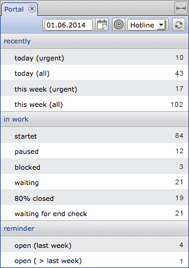
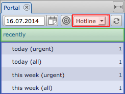
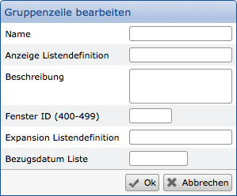
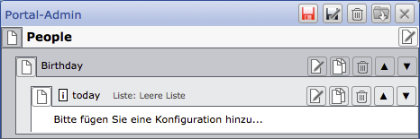
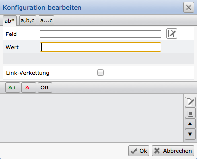
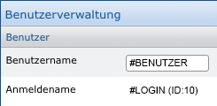

Portals
=======

In a CortexDB, any information is available for various work processes.
For selections and evaluations these are accessible via different methods. 
One of these possibilities is the so-called "portal". This provides users 
with predefined selections, which are subdivided into groups and subgroups.



Among other things, this function is used for regularly recurring selections,
but it can also be used for mapping work processes ("workflows"). Since datasets
change over time and can assume different states, they also pass through the various
selections in a portal. For example, tasks are managed and assigned to different employees.

The example shown here shows the simple selection for processing in a
hotline. Accrued messages are selected accordingly and displayed in a list 
by clicking on the line. If a message is edited and thus receives a new status,
the values displayed here in the portal change.

Based on the authorization system, only the permitted portals are accessible. 
In practice, this has an effect, for example, in a sales hierarchy: the managing director 
has all the portals unlocked, while the sales managers see the evaluations in their area.
The individual sales employees see their numbers / customers, but not their colleagues.

Portal configuration
-------------------

You can configure portals by predefining selections and assigning them an
output list. At the beginning, a portal can be provided with an "empty list".
At the first call, a list can then be configured and later assigned to the portal.

The list content is not limited to data of the selected dataset, but can also
integrate related information from other (so-called "linked") datasets. If lists
already exist, you can use them, change them and save them under a new name.

You can configure as many portals as you like. Therefore, you should
aim for meaningful divisions and names of the portals, for example
adapted to the operational processes.

In order to be able to define portals, you need appropriate authorizations 
for the system settings or the plugin for the portal configuration. This allows
you to configure and maintain different portals.


### Portal division



Basically, a portal is divided into three levels. The adjacent illustration  
shows these using the colored markings. At the top level is the portal, which is
described by a name (marked in red), followed by a group (green), in which individual
lines are added (blue).

**Portal name**

When creating a new portal, first define a name and define whether the
portal should be automatically reloaded after a certain time (minutes).
Setting "0" does not automatically update. With "ok" the input is confirmed
and you can define groups and lines.

**Group**

Groups form a summary of related lines of the same topic. These groups 
receive only a name, further settings are not necessary.

**Lines**



A group can have multiple selections. These are given a name, the assignment
of a list for the output of the result set, if necessary a description as an aid
to the users, a window ID (windows with the same ID replace each other), if necessary
another list for an "expansion" and possibly a reference date that is set immediately 
after the output list is called.

In the simplest case, set a name and choose an output list (if available). 
All other fields are left blank.

**Window-ID:**

If you want to use the results of different portal (rows) in parallel, 
different window IDs must be defined. Basically, the portal results always
use the same place (ie the same tab) and thus replace each other.

**Expansion list:**

Certain selections may display the same dataset several times in the result list.
To avoid this, an expansion list can reduce the results to unique values. For example,
all customers who received an invoice last year could be selected in a database.
Since a customer may have received more than one invoice, this would be issued 
multiple times. The expansion list then uses the customer's dataset ID to reduce the
result list to unique values.

!!! example "Example"
	The example shows the configuration with the basic settings. The portal name was "People"; This is followed by a group for "Birthday" and within the group a line called "Today".
	

Up to this point, only the basic structure has been defined and no selection has been configured. This is done with the help of the selection parameters.

Selection parameters
-------------------

Within a row, the parameters for the selection are defined.

Here you can access any field within the database and have it selected in combination with other fields.
There are three basic selection options available:

- Simple selection (fixed values or variable search with so-called "wildcard characters")
- Selected terms (for example "Meier", "Müller", \ ..., possibly with so-called "wildcard")
- Selection ranges with from/to information 

### Field selection

After entering the group line, a configuration is necessary. It selects 
the data field (data fields) that forms the basis for the evaluation. Any 
existing field in the database can be used for this, ie both the system fields
you have defined and those that exist. The content of the field can then be 
compared with given values, whereby the validity of the field content is determined.
You can also link to an Internal Reference field. You select the fields and can also
use certain dataset types for the limitation.



### Rider "from*"

Search for fixed values and with wildcard characters

After you have selected a field, enter a selection criterion. For example,
the value "1". This restricts the selection to all datasets that contain a 
"1" in this field.

[**Note:** ]The field selection also provides the option of using system fields.
Please note at this point that the use of the field "Dataset type" (synonym: "\ #T")
is only suitable for a small amount of data to carry out a selection. 
Ideally, you should refrain from using this field.

 

### Rider "a, b, c"

Search by enumeration

The second tab allows the selection of several values. It is therefore an "or" 
link that selects the datasets that contain one of the values in the selected field.
 

### Rider "a ... c"

Search via value ranges

Via the third tab "a \ ... c" the selection is possible over
from/to areas. For example, for dates with start and end dates.

Note here that decimal values (floating-point numbers) are handled 
separately in databases. These can therefore only be found via from/to\
areas and not via a simple selection.

!!! note "Note"
	When selecting dates, you can use variable information that applies based on the current or specified date. For example, such a selection would be possible via "*-2ws*" for the start of the week from two weeks ago. The following list shows the available variables for date values:

    y     year
    m     month
    ms    month start
    me    month end
    w     week
    ws    week start
    we    week end
    d     day
    q     quarter
    qs    quarter start
    qe    quarter end
    js    year start
    je    year end


### Comparison operators

You can combine several fields with their value ranges. This is done with
the comparison operators "& +", "& -", "OR". Values added with "& +" are combined.
Criteria collected with the "& -" operator are excluded. Both possibilities
can be carried out with an "OR" condition (ie "or").

!!! note "Note"
	Note that even a single criterion must be added with "& +" and that it is not possible to use only one exclusion criterion. If you want to exclude datasets, min. a &-criterion must exist.

### Link chaining

A link chaining must be selected if there are selection criteria in
linked datasets in other datasets.

Example: All persons of a postal code area who work in companies of
a different, specific area should be selected.

Then use the options then displayed to select the link field and
the contents of the "target dataset".

### User variables

Within portal selections, it is often necessary and useful to use
certain fields of a user. There are three variables that make it 
possible to design user-specific queries. Using the link chaining, 
it is thus possible to select exactly those datasets that affect 
an user (depending on the user's own information). The variables return 
to specified system fields of the user dataset.

!!! example "user variables"
``` 
#LOGINIID -> is the id of the user dataset

#LOGIN -> #Unam

#USER -> #UsrNam
``` 


Within the user management of the system settings,
the user data can be removed (except for the \ # LOGINIID).



!!! note Note
	The username can be changed arbitrarily and at any time. If, for example, portal configurations are based on this variable and these are stored in various datasets (for example, for employee administration), care should be taken to adapt them accordingly.

