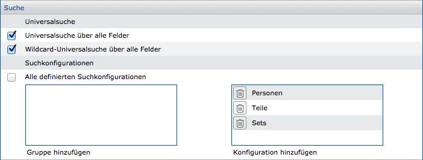
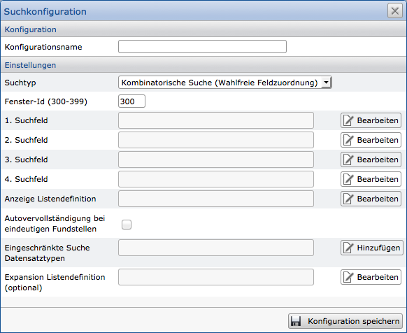
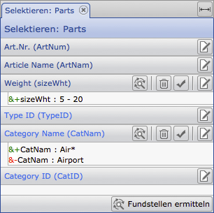
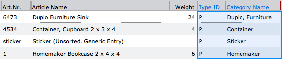
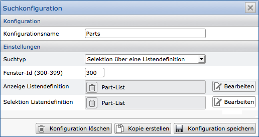
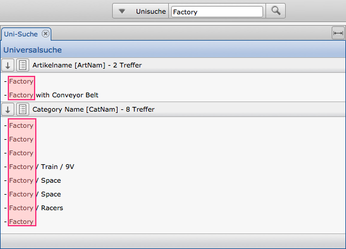
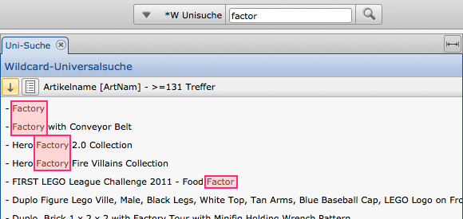

Search options
=================

Within the CortexUniplex application certain search options can be configured
for users. This makes it possible to limit the user already in his search options,
so that only allowed content can be found.

The correct use of a search depends largely on the values that may
be searched. The CortexUniplex distinguishes here between a wildcard search,
a combinatorial search and the universal searches. The latter are often
reserved for the administrators, since these two search options search all fields
of all datasets.

The assignment of configured search options is done via the system settings for
each user template. Here individual or grouped configurations can be defined.



The search options are configured via the search configuration (menu item
"Search" in the system settings). Such a configuration receives a name that 
you use in the above assignment. You also select the corresponding search type
(combinatorial or wildcard search), the permitted fields and the list for the
result output. After you have saved this configuration, you can make the
assignment in the user template.



Selection with the help of lists
------------------------------

In addition to the configurable searches and portals, a user can be
provided with the function "Selection via lists". This function allows
the combination of search parameters in the fields specified by a list.
In addition to the dataset fields, the fields that are used via direct
references from other dataset types. This makes it possible to query 
cross-linked structures (analogous to "*Join*" in SQL databases).

!!! note "Note"
	For referencing queries, parent referrals are only possible if the reference fields have been configured with the "backward index" attribute.

### Use



If a user has been assigned one or more selection options via lists,
the function is displayed as a button in the toolbar. The desired entry
is then selected and the selection window displays the fields of the underlying list.

In each field, the user can then define search criteria that are defined
by AND (&) or NOT (-) per field. The criteria of the different fields are
combined in the implementation.

The example opposite shows the criteria for two fields, where the second 
field was specified with AND and NOT.

The underlying list shows that fields have been linked via a reference
structure (marked in blue). The selection therefore contains all datasets
which have a specific content in the first criterion and are additionally
linked by direct references to datasets which correspond to the second search criterion.



The results of the selection are displayed in the list defined by the
configuration for the output after clicking on the "Find occurrences" button.

### Configuration

The configuration is done via the system settings in the "Search" area. 
Here, a name for the search configuration is defined and the entry
"Selection via a list definition" is selected as the search type.

The window ID specifies the ID of the tab in which this function is called.
Functions with the same ID use the same tab and therefore overwrite themselves;
Functions with different ID's use different tabs.

Then only the lists to be used for the search and output are to be selected.



!!! note "Note"
	Every change to the list configuration has an immediate effect on the selection options. Newly added fields can therefore be used immediately. Ideally, search lists should therefore be appropriately labeled and used only for this purpose.

Universal and wildcard universal search
---------------------------------------

These search functions are activated within the user templates and should only be enabled for administrative users.

If a query is made via the universal searches, the return is in the form of a system list, which in the first step represents the occurrences and only with a second, manual step shows the results in a list.

In this case, the universal search finds exactly the terms as they were entered. The wildcard universal search also returns results that contain the term entered anywhere.

The term "wildcard" is used here because the search term may be a fractional value; the input of \ * or? is not necessary.

!!! note "Note"
	The return shows in which fields and how often the search term was found. To output the results in the form of a list, a corresponding list must be loaded manually via the "List view" button (next to the hit display).

!!! example "Universal-Suche"


!!! example "Wildcard-Universal-Search Example"


Wildcard Search
-------------

A wildcard search allows the partial search of terms. In contrast to the combinatorial search, the field order must be observed. 

A wildcard (so-called "joker character") replaces one or more characters within a term.
This is indicated by the characters \* and ? at disposal. The question mark (?)
stands for exactly one character; the asterisk (\*) for multiple characters.

!!! example "Examples for wildcard searches"
```
    *qu*n*  delivers the Queen, as does Steve Mcqueen and Quentin Tarantino
    *qu?n*  delivers Quentin Tarantino
    *qu??n* delivers the Queen and Steve Mcqueen
```

Combinatorial search
---------------------

Combinatorial search allows you to search for content using any combination 
of search fields. It should be noted that the correct spelling of the search terms 
should be used (for example, upper/lower case).

!!! example "Example"

	Three fields were defined for the search: name, first name, city

	Within these fields, the search is performed within the database. 
	The user can enter search terms in any combination. It follows that the 
	entered search terms are queried in every combination in all three fields.

	Therefore, if you enter: "Windsor, London, Elisabeth", all these values
	will be searched for in the  Name, First Name and City fields.

	The result could therefore consist of the following persons:
	"Elisabeth Windsor from London" or "Elisabeth London from Windsor"

Especially for search fields that search for different objects using the same terms,
ambiguous outputs are returned (for example, the term "kiwi", bird or fruit?).
Therefore, it may be useful to restrict the search configuration to a specific dataset type.

 
