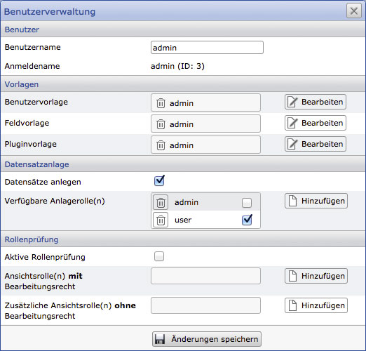
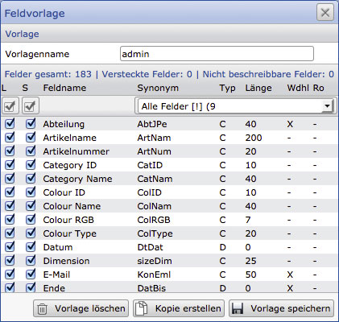
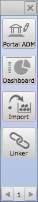
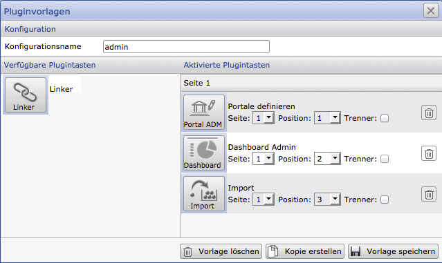
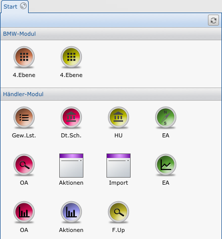
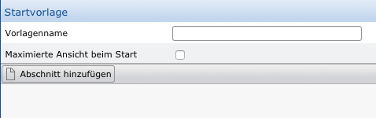
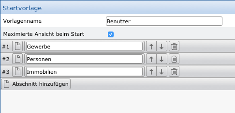
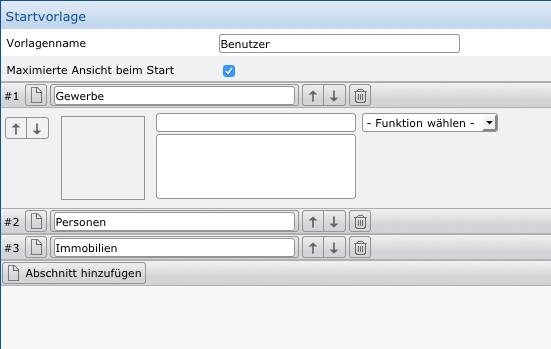
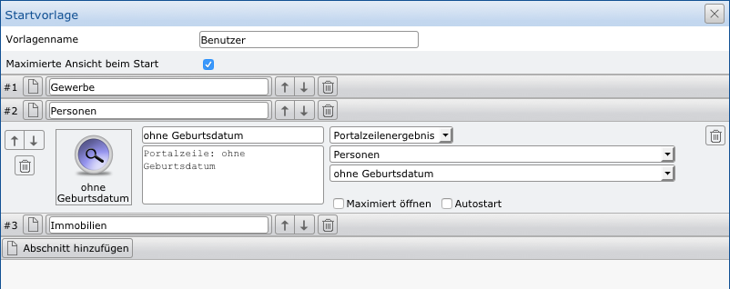
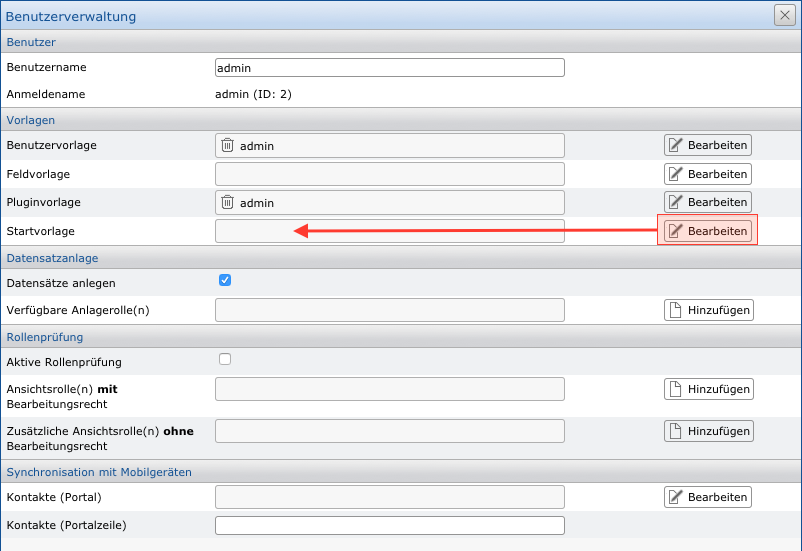

Templates
========

Templates enable the basic settings of functions and permissions for user accounts to which these templates have been assigned. If a template has been assigned to multiple users, all customizations to this template automatically apply to all users involved.

User administration
------------------

The user management within the system settings of the CortexUniplex allows the administration of the user accounts defined via the remote admin.

The window shown here is divided into four sections: Users, Templates, Dataset Creation and Role Check.

In the "User" section, only the specification of a "real" name is possible.

The Templates pane is used to assign the previously configured user, field, and plug-in templates.

The "dataset creation" defines whether a user can generally create datasets and which roles can be used to provide the new datasets. The checked role is automatically set when a dataset is created and can be changed by the user as an option.

In the "Role check" area, you must define whether the role system is active for this user (if not, he has access to all datasets) and which roles are used to access the datasets for editing and reading.

User Templates
-----------------

The user templates define the functional permissions that a user receives 
within the CortexUniplex. These include, but are not limited to, the ability
to create and modify lists, export data, specific selections, and more
(see User Templates).

Within the CortexUniplex application, certain functions can be made available
or denied to a user. Depending on the function, there is a detailed possibility
to restrict the complete availability or to restrict this to subfunctions. Each 
template can be used by multiple user accounts. A change to a template thus has a
direct impact on all participating user accounts.

The user templates were subdivided into several subgroups and functions contained therein

- Function rights
- Lists
- Search
- Portals
- Object viewer
- Creation of datasets
- Editing datasets
- Inbox list
- List for open file processing
- Template-based presentation
- Additional options

If certain functions are not to be used, these are to be deactivated. 
For example, existing calendar programs are frequently used so that this
function can be deactivated.

Function rights
---------------

### Delete datasets

Deletion is the irrevocable removal of datasets from the dataset. This is
therefore only possible if the dataset to be deleted is no longer used as the
target of a link. A distinction is made here between the options "General 
deletion authorization", "Deletion authorization for own datasets" and
"No deletion authorization".

### Archiving datasets

Similar to deleting, the archiving of datasets is actually a "hiding" of
datasets. These are no longer included in the search or selections, but the
linked structure of references is retained so that the datasets can be accessed;
editing is not possible. Just like when deleting, a distinction is made between 
the three options mentioned here.

### Selections

Selections are stored results from previously viewed datasets in a list.
These can be saved for later processing. Again, all, own or no selections
can be created/edited/loaded.

### Document templates

Within the CortexUniplex there is the possibility to create documents based 
on datasets (eg reports or form letters). For this it is necessary that document 
templates are stored within the database. The authorizations control the access rights
for this function and the document templates analogously to the above-mentioned functions.

### Select

Select is a function that allows it to be selected based on list configurations 
within the database. Each field of the selected list can be used as a criterion.
This field can also be used from datasets of direct reference datasets (parent 
references are currently not possible). Compared to other databases, the function of
the so-called "joins" is sometimes used here.

If this function is activated, the user receives access via an additional button in
the main toolbar (top left).

### Multiple Assignment

This is an interactive feature for users editing datasets within the CortexUniplex.
Multiple assignment allows multiple selected datasets in a list to refer to
a dataset in the other half of the screen. For example, you can assign multiple 
items to a project.

Lists
------

### Editing lists

Lists are one of the main functions of the CortexUniplex. On the one hand, 
they are used for the simple display of datasets, but on the other hand 
they can take on large proportions, for example if recursive structures or structured
sublists are displayed with automatic ad hoc calculations. Lists also form the basis 
for pivot evaluations and thus also the basis for the further functionality Dashboard.
In addition, lists of selected content can be used via the API for own applications or 
interfaces (see CortexUniplexAPI).

Authorization to edit and modify lists can therefore have significant
undesirable effects when changing lists that need to be used for other 
functions. In order to avoid this, four authorization levels are available 
via which users can be administrated accordingly.

### Export and import of list definitions

The definitions (configuration) of lists can be exported to other databases
or imported from other databases. In this case, lists with the same name
are overwritten and updated. The user therefore has to pay attention to 
existing lists as well as to manual editing.

### Print and export data

All or only selected contents of a list can be exported in the form of csv 
or xml files. Since exported data can not control any subsequent file 
transfers (copies, accesses, etc.), exporting and printing can be prevented
accordingly.

!!! note "Note"
    In the subsequent settings Search, Portals, Object Viewer, as well as the creation and editing of datasets, restrictions on individual configurations are possible. This can be dedicated to a user group, which configurations can be used for a particular function.

Search
-----

Using the two search options Universal Search and Wildcard Universal
Search, the search term entered is searched for in all database fields in all
datasets. The output is in the form of a system list, which delivers the
corresponding results by database field and dataset type. The universal search
finds here exactly the entered term; the wildcard universal search allows the use
of * (for any characters) and ? (for exactly one character).

Using search configurations, it is possible to offer users predefined search 
options that allow a search only in selected fields. Here a variety of different 
search options can be activated, which may be relevant depending on the user group.
The actual search configurations are configured in the "Search" administration area.

Portals, object viewers, editing rights
-----------------------------------------

### Portals

Portals are predefined selections that execute ad hoc queries in the 
database based on stored search criteria. For each configuration, the call
can be assigned to a list or pivot display, so that the user always receives 
up-to-date results without having to perform a search manually. Depending on
the user area, individual portals or portal groups can be assigned to the template.

### Object viewer 

Within networked structures, information about reference strings - 
starting from a dataset - can be displayed very compactly using multiple
lists and formatting. Such an object viewer is based on a specific dataset type
and can only be used by it. Since a wide variety of information from a wide
variety of dataset types is displayed in one place, a restriction to certain object
viewers may be useful.

### Creating and editing datasets

The extent to which datasets of a particular dataset type can be manually
created and edited must be regulated by these two points. These are associated
with the field rights for viewing and changing the field contents (see field templates).

template-based presentation and additional options
-----------------------------------------------------

### Templates

Individual datasets store only the fields for which there is content. Empty
fields are not saved. Accordingly, only a filled field of a datasets is displayed 
to a user. The template display allows a user to see all other fields that can be filled.
The authorizations of the field template are taken into account.

### Additional options

For a login by private / public key method and for file transfer to the database,
the so-called "Wizard" can be used. For this purpose, the public part of a key (dsa)
is stored in the user account and the private part on the system of the user.
The stored password can then be stored unusually complex, since the user, on the start
of the "wizard" must only enter the login name  without knowing the password. 
The complete authentication through the application then takes over the "Wizard".

### Automatic session end

This defines after how many minutes an automatic logout takes place if
the user does not carry out any activity in the application.

Field templates
-------------

Like user templates, the field templates are assigned to one (or more) 
user accounts. These templates define the fields that a user may view and/or
modify. If a field is used in different dataset types, the definition applies
to all dataset types in which the field is used.

This will allow different users to edit the same datasets, but each will only
have access to the fields defined by the field template.

When you call up the field templates, you see a list of all already configured 
templates and can therefore change existing ones or add new ones. Therefore, 
a template will have a name that you can select in User Management (each user 
can only receive one template at a time, that is, a user template, a field
template, and a plugin template).

Furthermore, the fields are defined in the field template, which should be
"readable" (L) and / or "writable" (S) for the user. For the corresponding fields,
simply place the check marks in the respective column.

All other columns are for information purposes and the list can be sorted 
by clicking on the column heading.

The field templates are used to define the authorizations per field. This 
determines whether a field is visible and / or changeable. This right is 
independent of the role of a dataset. If a user can see a particular dataset,
he sees exactly the fields assigned to him via the field template; If the user
is allowed to make changes to the dataset, he or she can precisely edit 
the fields that have been activated via the field template.

The two check boxes in the columns "L" and "S" define whether a field is
readable (R) and/or writable (W). All other information is for further
information (field synonym, type, length, repeating field). Via the selection
box the fields can be filtered by dataset type.

For administrative purposes and more in-depth control of the data, it is
helpful to create a template for administrative users (for example, "admin").

Plugin templates
---------------

Within the CortexUniplex, it is possible that "buttons" for functional 
extensions are displayed on the left edge of the screen (for so-called "plugins").
These may be general functions that are standard features (such as implex,
dashboard configuration, and others) or custom extensions for specific
departments or use cases. It does not matter whether these plug-ins work 
with the data of the CortexDB and call CortexUniplex functions or whether external
systems are addressed (data import / export, execution of functions, etc.).

Within a plugin template, therefore, only defines which buttons should be
displayed. On the actual functionality of the plugin, the template has no influence.

Plugins within the CortexUniplex are used for the use of extended
program parts, with which certain tasks can be processed. These can
be subject-specific tools for simplifying the work processes, but also 
configuration options for CortexUniplex / database functions.

By default, plugins are provided for the administration of the portals 
and the dashboard, as well as for the import and linker configuration. 
These can be extended by own, individual Plugins, which use for example 
the CortexUniplexAPI.

Each plugin is displayed as an icon on the left edge of the window in the 
so-called "Quick Launch bar" and can be executed with a mouse click. 
The icons displayed here are easy to configure via the plugin templates.

### Configuration of the plugin templates

Within the system settings of the CortexUniplex the templates can be configured
via the corresponding menu item. Here you will also find a list of all previously
configured templates that you can add or change accordingly.

Similar to the user and field templates, a plugin template consists of a 
unique name, which is used for assignment within a user account. Beneath 
the name, the available plugins are listed in the left pane; the already 
used templates in the right area. Each assigned plugin can be set to a specific
position. Here are also several "pages" available, through which the user can 
change in the quick launch bar (see there at the bottom of the arrows for back and forth).

To remove a plug-in from the template, the symbol of a wastepaper basket on
the right edge is used; the "separator" specification indicates whether
a horizontal line should be shown below the symbol for delimitation.

Via the user administration in the system settings of the CortexUniplex the
individual templates have to be assigned to a user account.

Start templates
--------------

After a user has logged in, he or she can see a selection of buttons, 
each of which can call a function or a list / pivot. This makes navigation 
easier and faster for the end user. The permissions are fully observed and
the "manual" use is still possible.

Within the CortexUniplex it is possible to put certain functions on a button
for the end users, so that these functions are very easy and quick to reach.
These single buttons are located in the so-called "Start-Tab", which can be
displayed immediately on startup and can not be closed. This is the starting
point for previously configured functions.

Within the Start tab, several sections can be added that receive individual
buttons. For each button an individual graphic is possible (PNG format, max 48x48 px).

For each button, one of the following functions can be selected:

- Portal
- Portal group
- Single portal
- Portal row result
- Dashboard
- Selection via a list

To put one of the functions on a button, it must first be configured.

Functions
----------

!!! note "NOTE"
    Note that the permissions of each feature also affect the display in the Start tab. If a user does not have permission to run a particular configuration, this feature will not appear in the Start tab.

### Portal

The complete portal configuration (considering all user rights) can be
made available to the user via a button. The user therefore also has the
option of choosing between the different portal names within the portal.

### Portal group

In the system settings, it is possible to create groups for the management
of portals (and also for other functions) and to classify them into portal 
configurations. These groups can be placed on a start tab button for a user
so that the user can only select between the associated portals.

### Single portal

A single portal is exactly one configuration that was created in the 
system settings under "Portals" or with the help of the "Portal Admin"
plugin. The user can therefore only use this one portal; a selection of
other portals is not possible.

### Portal lines result

This is the exact ad defined for a single portal row. So it can display 
a list or a pivot table.

### Dashboard

If dashboards have been configured, a configuration can be called up via a button.

### Selection via a list

This function is a selection function based on list columns. This must be
defined beforehand via the "Search" configuration.

Method
--------------

After the necessary functions have been configured beforehand, you can add 
a new template (or edit an existing one with a double-click) in the system 
settings under "Start Template".

Each template needs a name for internal administration so that you can later
assign it to the user accounts. As a supplement, you can specify whether
the start tab should be displayed after login over the entire area of the 
CortexUniplex (maximized view).

After the basic settings have been made, one or more sections can be added.
These are the headlines that divide the buttons into related areas. These are
gray bars that contain a title (visible to the user).

When creating a new section, it automatically receives an internal number
(always with \ # at the beginning) and a name that is assigned individually.
Once multiple sections have been created, they can be changed in sequence or deleted.

You can change and create individual sections at any time. An adaptation
to the needs of the user is therefore possible.

For each section, it is then necessary to create a configuration for each
function that a user is allowed to execute. For this the button is available
in front of the name of the section. Here you define the position of the button,
an icon, the name and a description as well as the actual function to be executed.

The name of the button is the text that appears below the button.
Only a limited number of characters are available here, which are
displayed in the preview of the button (empty square). If you click
in the square, you can also select a graphic as an icon (max 48x48 pixels
as png file and with a maximum of 32kb file size). If no personal graphic
is selected, the button uses a standard graphic.

After you have defined all the information, you can also define whether
the function should be opened maximally (that is, over the entire screen area)
and whether the function should be executed automatically after login (Autostart).

 

The illustration shown here shows a fully configured button with an individual icon.

!!! note "NOTE"
    If this is a new configuration, it is necessary to assign this configuration to the user accounts that should use this startup template. To do this, select the appropriate user in the "User" section in the system settings and assign the created srt template to it.

