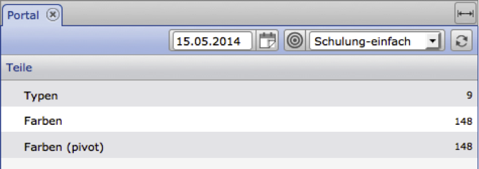

PHP-Examples
=============

Necessary PHP functions
-------------------------

The PHP examples use the PHP functions listed here. The corresponding
explanation and necessary parameters can be found in the PHP documentation.

    stream_context_create

    file_get_contents

    json_encode

    json_decode

With these functions it is possible to make an HTTP call and convert 
a previously defined array to pass it as an HTTP parameter.

The general procedure is divided into the following steps:

1. Compiling the parameters for the CortexUniplexAPI
2. Setting the parameters for the HTTP call
3. Conversion of all parameters for the HTTP call
     ("Stream\ _context\_CREATE")
4. Calling the CortexUniplexAPI URL with passing the parameters
     ("File\ _get\_contents")
5. The evaluation of the return values (if necessary with "json\_decode").

Query of a portal
---------------------

This example explains how to query a portal and the corresponding return values.
Basically, the CortexUniplexAPI expects parameters as a json string.
This is defined in PHP as an array and converted accordingly. This makes the
source code easier to read (and explain).

Within the sample database, the "training-easy" portal has been set up. 
This contains in the "parts" group the three lines "types", "colors" 
and "colors (pivot)".



To query the contents of exactly this portal, the following method is available in the CortexUniplexAPI:

    getPortalRows

This method name, in conjunction with the name of the portal, results in a JSON
object that maps the composition of the portal displayed here. To pass the name
and other parameters, an array is needed, which is converted into a json string
for HTTP passing using PHP functions.

``` 
$jRequest = array('method'   => 'getPortalRows',
      'requestid' => 1,
      'param'     => array(
                        array('portal' => 'training-simple')
                     ));
```

The "method" entry defines here the method to be called; the request ID has a 
unique ID in order to be able to uniquely assign the return data for asynchronously
executed requests; and the parameters (via "param") define the parameters for the
CortexUniplexAPI method to call.

For the HTTP call, the definition of further parameters and their combination with the above:

``` 
$CONTEXT_OPT = array('http' => array(
       'method'    => 'POST',
       'content'   => json_encode($jRequest),
       'header'    => 'Content-Type: application/json\r\n'.
                      'Accept: application/json\r\n'));
```

The parameters "method" and "header" are standard HTTP parameters. It should be 
noted that the parameter "content" contains the previously defined array as a JSON object.

This array is now converted via PHP function *"stream \ _context \ _create*" and passed 
to the URL of the CortexUniplexAPI with the help of "*file \ _get \ _contents*".

``` 
$context = stream_context_create( $CONTEXT_OPT );
$jRes = file_get_contents( $url, false, $context );
```

If the call was successful, the "*\$ jRes*" variable contains a json string
describing the portal "training-simple".

**Return value of the portal configuration (json-String)**

``` 
{"requesterror":0,
"requestid":1,
"requestmethod":"getPortalRows",
"requestduration":0.0157,
"result":{
  "rc":0,
  "error":"",
  "data":{
    "g":[{
      "n":"Parts",
      "z":[{
         "n":"Types",
         "b":"",
         "id":null,
         "rownr":"0",
         "list":"Item-Type List",
         "listiid":"2066f650fa20202020212023",
         "pivot":""
        },
        {
         "n":"Farben",
         "b":"",
         "id":null,
         "rownr":"1",
         "list":"Colour-List",
         "listiid":"2066f64ec520202020212023",
         "pivot":""
        },
        {
         "n":"Colors (pivot)",
         "b":"","id":nill,
         "rownr":"2",
         "list":"Colour-List",
         "listiid":"2066f64ec520202020212023",
         "pivot":"Color per year"
        }],
     "id":nill,
     "groupnr":"0"
     }],
  "i":"206decae3820202020212023",
  "n":"Training-simple",
  "LastBearbId":"206decae8820202020212023"
  }
 }
}
```

The return values for the actual request are located within this JSON object
at the top level of the hierarchy. In the example shown, the value
*"requesterror*" returns the value zero if the request could be answered correctly.
The *"requestid*" and *"requestmethod*" return the same values with which
the request was made. The *"requestduration*" shows how quickly (in seconds) 
the request was processed.

The result for the queried method is in the substructure `result` ->`data`.

Within the "data" substructure, the groups are located under the identifier "g".
The name of the portal can be read within "data" under the key "n".

``` 
"data":{
    "g":[{
      [.......]
    }],
    "i":"206decae3820202020212023",
    "n":"Training-simple",
    "LastEditId":"206decae8820202020212023" 
```

Within a group, the name of the group is under the key "n" and the individual
lines are under the key "z".

``` 
"n":"Parts",
"z":[{
      "n":"Types",
      "b":"",
      "id":nill,
      "rownr":"0",
      "list":"Item-Type List",
      "listiid":"2066f650fa20202020212023",
      "pivot":""
      },
```

For each line, the name ("n"), the line number ("rownr"), the list to be
called ("list") with the associated ID and possibly the pivot table to
be called are shown in the list.

The contents of this JSON object are now queried for further information 
from the database. If the portal information is already known, you can do
without reading the portal configuration.

### Example of a portal query

``` 
<?
//*** url to call the CortexUniplexAPI in the correct database ***// 
$url = 'http://localhost/i/UniPlexDataservice/updjsr.php';

//*** Request-ID to identitfy the correct returned json object ***// 
$iRequestID = 1;


//*** Begin: User-Handle ***//

//*** request user login for the CortexUniplexAPI ***// 
$jRequest = array('method'   => 'getLogin',
                  'requestid' => $iRequestID,
                  'param'     => array(
                        'user' => 'admin',
                        'pass' => 'admin',
                        'app' => 'UniplexDataservice'
                  )
            );
//*** parameter-array for php-function 'stream_context_create' ***// 
$CONTEXT_OPT = array(
  'http' => array( 'method' => 'POST',
                   'content' => json_encode($jRequest),
                   'header'=> 'Content-Type: application/json\r\n' .
                   'Accept: application/json\r\n')
                  );

//*** create context params for php-function 'file_get_contents' ***// 
$context = stream_context_create( $CONTEXT_OPT );

//*** get contents with params and decode json-object ***// 
$jRes = file_get_contents( $url, false, $context ); 
$aRes = json_decode($jRes, true);


$sUsrHdl = $aRes['result']['data']['UpdJsrHdl'];

//*** End: User-Handle ***//


//*** Begin: portal call ***//

//*** request definition for the CortexUniplexAPI ***// 
$jRequest = array('method'   => 'getPortalRows',
                  'requestid' => $iRequestID,
                  'param'     => array(
                       'portal' => 'Training-simple',
                       'UpdJsrHdl' => $sUsrHdl
                  )
            );

//*** parameter-array for php-function 'stream_context_create' ***// 
$CONTEXT_OPT = array(
  'http' => array( 'method' => 'POST',
                   'content' => json_encode($jRequest),
                   'header'=> 'Content-Type: application/json\r\n' .
                   'Accept: application/json\r\n')
                  );

//*** create context params for php-function 'file_get_contents' ***// 
$context = stream_context_create( $CONTEXT_OPT );

//*** get contents with params and decode json-object ***// 
$jRes = file_get_contents( $url, false, $context ); 
$aRes = json_decode($jRes, true);

//*** End:portal call ***//


//*** print result ***// 
print_r($aRes);

?>
```

### Example of a portal list

``` 
//*** url to call the CortexUniplexAPI in the right database ***// 
$url = 'http://localhost/i/UniPlexDataservice/updjsr.php';

//*** Request-ID to identitfy the right returned json object ***// 
$iRequestID   = 1;


//*** Don't forget to get the user handle ***//
/*
   . . . 
*/ 


//*** get specific row data ***// 
$jRequest   = array(
                 'method'   => 'getPortalRowListData',
                'requestid' => $iRequestID,
                'param'     => array(
                'portal'    => 'Training-simple',
                'UpdJsrHdl' => '___abcdefghijklmn___', // <- set handle!!!
                'group'     => 'Parts',
                'row'       => 'Types'
                 )
  );

//*** parameter-array for php-function 'stream_context_create' ***// 
$CONTEXT_OPT = array(
  'http' => array( 'method' => 'POST',
               'content' => json_encode($jRequest),
               'header'=> 'Content-Type: application/json\r\n' .
               'Accept: application/json\r\n')
            );

//*** create context params for php-function 'file_get_contents' ***// 
$context = stream_context_create( $CONTEXT_OPT );

//*** get contents with params and decode json-object ***// 
$jRes = file_get_contents( $url, false, $context ); 
$aRes = json_decode($jRes, true);

//*** print result ***// 
print_r($aRes);

?>
```

### PHP example with function

``` 
<?php

    //*** url to call the CortexUniplexAPI in the right database ***//
    $url = 'http://localhost:81/i/UniPlexDataservice/updjsr.php';

    //*** Request-ID to identitfy the right returned json object ***//
    $iRequestID    = 1;
    
    function request($method, $param = array()) {
        global $iRequestID,$url;
        $REQUEST   = array("method"   => $method,
                          "requestid" => $iRequestID++,
                          "param"     => $param );

        $CONTEXT_OPT = array(
        'http' => array(
        'method' => 'POST',
        'content' => json_encode($REQUEST),
        'header'=> "Content-Type: application/json\r\n".
                   "Accept: application/json\r\n")
        );
                        
        $context = stream_context_create( $CONTEXT_OPT );
        $aRes = json_decode(file_get_contents( $url, false, $context ), true);
        return $aRes;
    }

    function prText($text) {
        print('<pre>');
        print($text."\r\n");
        print('</pre>');
    }
    
    function prArray($array) {
        print('<pre>');
        print_r($array);
        print('</pre>');
    }
    
    prText('********* getLogin *********');
    $jRequest = array(    'user' => 'admin',
                        'pass' => 'admin',
                        'app' => 'UniplexDataservice'    );
    $aRes = request('getLogin', $jRequest);  
    $sUsrLogin = $aRes['result']['data']['UpdJsrHdl'];
    prArray($aRes);


    prText('********* getPortalList *********');
    $jRequest = array('UpdJsrHdl' => $sUsrLogin);
    $aRes = request('getPortalList', $jRequest);
    prArray($aRes);


    prText('********* getPortalRows *********');
    foreach($aRes['result']['data'] as $key => $value) {
        $jRequest = array(    'portaliid' => $value['i'],
                            'UpdJsrHdl' => $sUsrLogin,
                            'pivotlist' => '1'
                            );
        $aRes = request('getPortalRows', $jRequest);
        prArray($aRes);
    }

    prText('********* getLogout *********');
    $jRequest    = array('UpdJsrHdl' => $sUsrLogin);
    $aRes = request('getLogout', $jRequest);
    prArray($aRes);

?>
```
