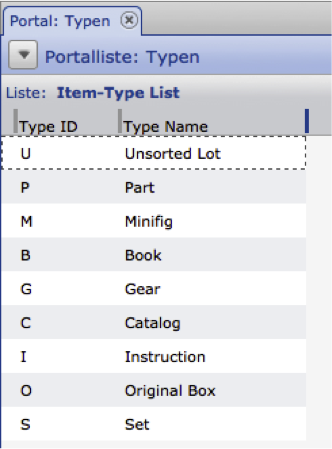

General Features
---------------------

The general functions provide global methods that are not coupled to CortexUniplex functions. These can therefore be called without a user context and, for example, return server or interface information.
These include:

- getVersion
- getLogin
- getLogout
- getInfo
- clearCache

The return object always returns an error code (0 = ok) and the actual return value (in the "data" field).

``` 
{
    "rc": int RetCode,
    "error": string ShortErrorDesc,
    "data": 
    {
      .....
    }
}
```

### getVersion

Returns the current version identifier of the CortexUniplexAPI and does not require a login.

**Request object**

``` 
{
  "method": "getVersion",
  "requestid": int RequestId,
  "param": 
}
```

**Result object**

``` 
{
  'requesterror': int RequestStatus,
  'requestmethod': string MethodName,
  'requestid': int RequestId,
  'requestduration': float Duration,
  'result': {
    -result-data-
  }
}
```

**data**

::: 
``` 
{
    "rc": int RetCode,
    "error": string ShortErrorDesc,
    "data": {
        "version": int Version,
        "versionstr": strin VersionStr,
        "versionmain": int MainVersion,
        "versionsub": int SubVersion,
        "releasedate": string Date
    }
} 
```

- version - version identifier (without subdivision, for example: 21001)
- versionstr - version identifier (with subdivision eg: "2.1.001")
- versionmain - version identifier (main version and release, for example: 21)
- versionub - version identifier (release / subversion, for example: 1)
- releasedate - last update (eg: "03.06.2014")

### getLogin

Performs a login in the CortexDB and returns a login handle if successful (`UpdJsrHdl`).

**RequestObject**

``` 
{
  "method": "getLogin",
  "requestid": int RequestId,
  "param": {
    "user": string Username,
    "pass": string Password,
    "app": string AppName
  }
}
```

- user - username
- pass - user password
- App - App to log in → always "UniplexDataservice"!

**Result**

``` 
{
  'requesterror': int RequestStatus,
  'requestmethod': string MethodName,
  'requestid': int RequestId,
  'requestduration': float Duration,
  'result': {
    -result-data-
  }
}
```

**data**

``` 
{
    "rc": int RetCode,
    "error": string ShortErrorDesc,
    "data": {
        "UpdJsrHdl": string Login-Handle,
        "UserName": string UserName,
        "UserDisplayName": string UserDisplayName,
        "UserID": int UserId,
        "lic": string Licensee,
        "licnr": string LicenseNumber
    }
}
```

- UpdJsrHdl - if login is successful, the login handle (for example, "267361e2a8e94be6b611c8f0b3a54f52)
- UserName - Username of the login
- UserDisplayName - displayed user name (configuration in the CortexUniplex)
- UserID - Id of the user (configuration via RemoteAdmin)
- lic - licensee of the database
- licnr - license number of the database

### getLogout

Only possible after previous login! Logout the user with the given login handle.

**RequestObject**

    {
      "method": "getLogout",
      "requestid": int RequestId,
      "param": {
        "UpdJsrHdl": string LoginHandle
      }
    }

UpdJsrHdl - login handle returned via getLogin (e.g., "267361e2a8e94be6b611c8f0b3a54f52")

**ResultObject**

Only the general information is returned, the "data" object remains empty.

Example:

    {
      "requesterror": 0,
      "requestid": 18,
      "requestmethod": "getLogout",
      "requestduration": 0.0009,
      "result": {
        "rc": 0,
        "error": "",
        "data": []
      }
    }

### getInfo

Only possible after previous login! Supplies extended information.

**RequestObject**

    {
      "method": "getInfo",
      "requestid": int RequestId,
      "param": {
        "UpdJsrHdl": string LoginHandle
      }
    }

- UpdJsrHdl - login handle that was returned via *getLogin*

**ResultObject** 

``` 
{
  'requesterror': int RequestStatus,
  'requestmethod': string MethodName,
  'requestid': int RequestId,
  'requestduration': float Duration,
  'result': {
    -result-data-
  }
}
```

**data**

``` 
{
  "rc": int RetCode,
  "error": string ShortErrorDesc,
  "data": {
    "lic_nam": string Licensee,
    "lic_nr": string LicenseNumber,
    "ctx_interfaceversion": int ServerInterfaceVersion,
    "ctx_serverversion": int ServerVersion,
    "UserName": string UserName,
    "UserDisplayName": string UserDisplayName,
    "UserID": string UserId,
    "UserAdmin": int UserIsWebAdmin,
    "upd_version": int DataServiceVersion,
    "upd_versionstr": string DataServiceVersion,
    "upd_versionmain": int DataServiceVersionMainRelease,
    "upd_versionsub": int DataServiceVersionSub,
    "upd_releasedate": string DataServiceReleaseDate
  }
}
```

- lic_nam - name of the licensee,
- lic_nr - license number,
- ctx_interfaceversion - CortexDB interface version,
- ctx_serverversion - CortexDB Server version,
- UserName - logged in user name,
- UserDisplayName - displayed user name,
- UserID - ID of the user,
- UserAdmin - if user is webadmin, then 1, otherwise 0,
- upd_version - version of the DataService,
- upd_versionstr - version of the DataService,
- upd_versionmain - major version and release,
- upd_versionsub - subversion,
- upd_releasedate - release date

### clearCache

Clears the internal buffer/cache

**ResultObject**

``` 
{
  "method": "clearCache",
  "requestid": int RequestID,
  "param": {
    "UpdJsrHdl": "string LoginHandle"
  }
}
```

**ResultObject**

``` 
{
    "rc": int RetCode,
    "error": string ShortErrorDesc,
    "data": [ ]
}
```

This function returns no data.


In the following descriptions, only the "data" object is explained. Any error codes can be read from the list of error codes.

Creating datasets
--------------------

In order to create datasets, it must first be checked whether datasets can be created 
within the user context and which fields are accessible. For this it is sufficient if 
a "reading" on the dataset type with an empty IID is executed before writing the new dataset.

**RequestObject**

``` 
{
  "method": "UpxLoadData",
  "requestid": 1,
  "param": {
    "UpdJsrHdl": "12345abcde67890fghij123abc",
    "dst": "DsTp",
    "iid": ""
  }
}
```

In this case, the corresponding return object provides a new IID in the key `result -> data -> iid`, which is used to generate a new dataset. The actual generation is then carried out analogously to the methods already described above.

Change dataset
----------------

The change of a dataset is made via a dataset ID and the field
contents to be changed. Here, the various possibilities of the individual
field contents are to be considered. Usually, only the current field contents
are updated. In addition, there is a possibility that content will be validated 
(a value is valid from or valid until).

In addition, fields can optionally be used as often as required in an 
information set by an administrative configuration (so-called "repeating fields").
A combination of such fields is also possible, so that so-called "Repeating
field groups" arise (for example, for bank details). These can also be updated.

### Current Values

The simplest form of content modification requires only a valid user handle, 
the dataset ID, and the field contents to be changed.

**RequestObjects**

``` 
{
  "method":"UpxStoreData",
  "requestid":1,
  "param":{
    "UpdJsrHdl":"12345abcde67890fghij123abc",
    'iid':'123456789012345678901234',  // 24-digit IID of the dataset
    'fields': {
      'testNum': {
        'v':'42'
      },
      'testTxt': {
        'v':'myText'
      }
    }
  }
}
```

- UpdJsrHdl - Valid UpdJsrHdl
- iid - 24-digit dataset ID
- fields - list with one entry per field

**ResultObject**

``` 
{
  'rc' => '0'
  'error' => ''
  'data' => {
    'iid' => '20705efca120202020212025'
    'lupd' => '207060b93720202020212020'
    'dst' => 'test'
    'error' => '0'
  }
}
```

### with validity date

In order to provide contents of a dataset with a validity date,
it is necessary to set a time and the parameter for the usage ("valid from"
or "valid to") of the time. These apply to all fields of the request object.

***RequestObject***

``` 
{
  "method":"UpxStoreData",
  "requestid":1,
  "param":{
    "UpdJsrHdl":"12345abcde67890fghij123abc",
    'iid':'123456789012345678901234',  // 24-digit IID of the dataset
    'fields': {
      'testNum': {
        'v':'42'
      },
      'testTxt': {
        'v':'myText'
      }
    },
    'time':'201512010000', // Timestamp for the contents to be written
    'savemode':'b'         // Use of the time stamp; Standard: "valid from", "b": "valid to"
  }
}
```

The return object will be returned as described above.

### with repeating field groups

**RequestObject**

``` 
{
  "method":"UpxStoreData",
  "requestid":1,
  "param":{
    "UpdJsrHdl":"12345abcde67890fghij123abc",
    'iid':'123456789012345678901234',  // 24-digit IID of the dataset
    'fields': {
      'testNum': {
        'v':'42'
      },
      'testTxt': {
        'v':'myText'
      }
      },
      'groups': {
        'ACCOUNTS': [
          null,
          {
            'bName': {
              'v':'my Bank'
            },
            'bIBAN': {
              'v':'xy123456789012345678'
            }
          }
        ]
      }
  }
}
```

Reading datasets
---------------

Using a dataset ID, all information of a dataset can be read.

**RequestObject**

``` 
{
  "method":"UpxLoadData",
  "requestid":1,
  "param":{
    "UpdJsrHdl":"12345abcde67890fghij123abc",

    'iid':'123456789012345678901234', // 24-digit IID of the dataset

    // optionale Angaben:

    'time':'201512010000',  // Timestamp for the history information to be read
    'dst':'shrt',           // Synonym for the sentence type (4 digits)
    'flags':'f'             // Flags: f = AddMissingFields, g = AddMissingGroups
  }
}
```

- UpdJsrHdl - Valid UpdJsrHdl
- iid - 24-digit dataset ID
- time - timestamp in the form yyyymmddhhmm
- dst - 4-digit dataset synonym
- flags - to transfer empty fields and field groupings

**ResultObject**

``` 
{
  "requesterror":0,
  "requestid":1,
  "requestmethod":"UpxLoadData",
  "requestduration":0.0144,
  "result":{
    "rc":0,
    "error":"",
    "data":{
      "iid":"12345abcd6789efghi123abc",
      "lupd":"20705f43b820202020212025",
      "fieldlist":{
        "tstCont":{
          "Name":"Test-Content",
          "BTyp":0,
          "WFlag":0,
          "Len":220,
          "Group":"",
          "IsSys":false,
          "Typ":"C",
          "Desc":"",
          "STyp":0,
          "IsHid":false,
          "IsRO":false,
          "IsEvt":false
        }
      }
    },
    "dst":"test",
    "groups":[],
    "fields":{
      "tstCont":{
        "v":"test45",
        "a":false,
        "t":"201503200000"
      },
      "tstID":{
        "v":"4",
        "a":true
      }
    },
    "timestamps":[
      "201503200000",
      "201503220000"
    ],
    "error":0
    }
  }
}
```

- iid - IId of the data set
- lupd - last processing time
- dst - Synonym of dataset type
- FieldList - Object list with the definitions of the access-authorized fields
- fields - list of field objects
- "v": contains the value
- "a": true / false (current valid value = true)
- "l": returns the resolved reference to internal reference fields,
- "t": optionally contains the timestamp of the history information
- groups - List of repeating group objects. Each repeating group is an array of objects
- timestamps - An array containing a list of all possible validity dates that occur in the history information of the fields
- error - 0, if successful

**Note:**

If the IID remains empty for the request object and the synonym of 
the dataset type is transferred in the "dst" key, the return object returns
a new IID, which is used to create a new dataset (see also the section
"Creating/changing a dataset" in this documentation).

List structure for portal results
---------------------------------

The output of the selection results of a portal row are made via lists or pivot
tables contained therein. This output contains a json object with a predefined 
structure that can be used for further processing.

Within the "data" -> "c" -key the field descriptions are listed. From this
the individual attributes are visible per field. The following structure
is displayed here:

    data              Main node for data return
      c               Key for the field descriptions  
        l0d0          1. Field in the first list line (line = 1, data = d)   
        l0d1          2. Field in the 1st list line   
        l1d0          1. Field in the 2nd list line    
        l1d1          2. Field in the 2nd list line  
        0.0.l0d0      1. Field of the first line in the first sub-list   
        0.0.l0d1      2. Field of the first line in the first sub-list  
        0.0.l1d0      1. Field of the first line in the first sub-list    
        0.0.l1d1      2. Field of the first line in the first sub-list   
        0.1.l0d0      1. Field of the 1st line in the 2nd sub-liste    
        0.1.l1d0      1. Field of the 2nd line in the 2nd sub-list [...]    

        0.[x1].l[x2]d[x3]  0=MainAccounts; x1=Sublist; x2=Lines; x3=Field

The possible contents for a field description can be found in the previous 
description. The actual data return refers to the keys of the individual
fields. As a result, this description can be seen by a value.

### Data description of simple lists 

If a row is clicked within a portal, the result output is in a list that
has been assigned to the portal. A portal line is thus a preselection of 
data whose result is output.



To get the result of a portal row as a JSON object, the CortexUniplexAPI provides the following method:

    getPortalRowListData

Similar to the first example for reading out a portal configuration,
several parameters have to be transferred here as well. The subarea "param" 
is extended by the group and line specification:

``` 
$jRequest = array('method'   => 'getPortalRows',
                  'requestid' => 1,
                  'param'     => array(
                             array('portal' => 'Training-simple',
                                   'group' => 'Parts',
                                   'row'   => 'Types')
                       ));
```

All further information from the first PHP example remains the same, so that now the json structure of the list contents is returned.

``` 
{"requesterror":0,
"requestid":1,
"requestmethod":"getPortalRowListData",
"requestduration":0.0125,
"result":{
  "rc":0,
  "error":"",
  "data":{
    "c":{
      "l0d0":{
        "b":"0",
        "h":"Type ID",
        "l":1,
        "s":"TypeID",
        "t":"C",
        "w":"0",
        "x":8
      },
      "l0d1":{
        "b":"0",
        "h":"Type Name",
        "l":20,
        "s":"TypeNam",
        "t":"C",
        "w":"0",
        "x":85
      },
      "l0d2":{
        "x":223
      }
    },
    "d":[{
      "!IId":"2066f650a820202020212023",
      "!l":"0",
      "!t":"LITp",
      "l0d0":"S",
      "l0d1":"Set"},
      [. . . .],
      {"!IId":"2066f650a820203020212023",
      "!l":"8",
      "!t":"LITp",
      "l0d0":"U",
      "l0d1":"Unsorted Lot"}
    ],
    "error":0,
    "i":{
      "countget":9,
      "counttotal":9,
      "nextpos":9,
      "startpos":0,
      "timefilter":0,
      "timeget":0},
      "typ":"list"
    }
  }
} 
```

Within the key `data`, in the `c` subkey are the configuration details
for each column. The following meanings apply per key:

     "b": basic field type - irrelevant for further use
     "h": Identifier of the field in the list (header)
     "l": field length
     "s": Synonym of the database field
     "t": field type (C = Char)
     "x": x position of the field in the list (pixels)
     "w": Repeat field (1 or 0)
     "vt": Pre-text
     "nt": text
     "textAlign": Alignment of the content in the list
     "textDecoration": e.g. "Underline", ...
     "color": text color for the content

Each entry is stored under a separate key, over which the position 
of the fields can be seen. Example: `l0d0`. This is the first field in
the first list. For other fields, the number is incremented after "d";
with lines the number behind "l".

The data of the individual data sets can be seen through the "d" key.

    "!IId":"2066f650a820202020212023",      
    "!l":"0",      
    "!t":"LITp",      
    "l0d0":"S",      
    "l0d1":"Set"

For the datasetshown here, the output of the metadata is via the
ID (`!IID`), the line number (`!L`) and the dataset type (`!T`). 
Additional fields are output per field according to the pattern explained above.
For example, `l0d0` is the`Type ID` and `l0d1` is the`Type Name`.

More detailed information on the data in the key "d" can therefore only be found using the "data" key.

### Data description of sublists

Analogous to the field description, the actual data is output in a similarly
substructured form. Here is the basic structure, as described for the simple return:

    "!IId":...,
    "!l":...,
    "!t":...,
    "l0d0":...,
    "l0d1":...

This structure is extended by the use of sublists with the"!C" key.
This always contains the substructure for sublists. This also applies 
if sublists contain sublists again; and so on.

### Sublist Structure

The following structure applies when using sublists:

    !c                Master key for sublists
      0.0             First sublist   
        0             First dataset     
          !IId        ID of dataset    
          !l          Lines of the dataset (here e.g. „0.0“)      
          !t          Dataset type     
          0.0.l0d0    First field of the first line in the sublist    
          0.0.l0d1    Second field of the first line in the sub-list    
        1             Second sublist
          !IId      [...]

The specifications "0.0.l0d0" and "0.0.l0d1" refer to the previously described field descriptions.


Portal-Functions
-----------------

Using these methods, it is possible to read out the configurations of the areas 
and lines of a portal. This information also depends on the user rights and can 
therefore be further processed for other applications.

Portal features include:

- getPortalList - Returns a list of available portals
- getPortalRows - Returns the definition (groups and rows) of a portal.
- getPortalResult - Returns a portal definition and the results

### getPortalList

Provides a list of available portals for the logged in user.

**RequestObject**

``` 
{
  "method": "getPortalList",
  "requestid": int RequestId,
  "param": {
    "UpdJsrHdl": string LoginHandle
  }
}
```

- UpdJsrHdl - login handle returned via `getLogin` (e.g.,"267361e2a8e94be6b611c8f0b3a54f52")

**ResultObject**

``` 
{
    "rc": int RetCode,
    "error": string ShortErrorDesc,
    "data": [ {
        "i": string PortalId,
        "n": string PortalName
    },
    ... ]
}
```

**data**

An array of objects is returned. \ In the field "i" the internal ID
of the portal is displayed; "n" returns the identifier of the portal.

Example:

``` 
[
  {
    "i": "2068ddbc7a20202020212027",
    "n": "Contacts"
  }
]
```

### getPortalRows

Returns the definition (groups and lines) of a portal configuration. Again, the permissions of the user apply,
so that only assigned portals can be queried.

**RequestObject**

``` 
{
  "method": "getPortalRows",
  "requestid": int RequestId,
  "param": {
    "portaliid": string PortalId,
    "UpdJsrHdl": string LoginHandle,
 
    //optional
    "pivotlist": string GetPivotInfo
  }
}
```

or

``` 
{
  "method": "getPortalRows",
  "requestid": int RequestId,
  "param": {
    "portal": string PortalName,
    "UpdJsrHdl": string LoginHandle,

    //optional
    "pivotlist": string GetPivotInfo
  }
}
```

- UpdJsrHdl - valid login handle from `GetLogin`.
    
- portaliid - The internal ID of the portal concerned
    
- portal - name of the portal definition
    
- pivotlist - The optional statement `" pivotlist ":" 1 "` will provide the information of the pivot tables configured in the list.
    
 

**ResultObject**

``` 
{
    "rc": int RetCode,
    "error": string ShortErrorDesc,
    "data": {
      "i": string PortalId,
      "n": string PortalName,
      "LastBearbId": string IntHandlingId,
      "r": string ReloadSeconds,
      "g": [
        {
          "n": string GroupName,
          "id": "",
          "groupnr": string GroupNumber,
          "z": [
            {
              "n": string RowName,
              "b": string RowInfoText,
              "id": "",
              "rownr": string RowNumber,
              "list": string ResultList,
              "listiid": string IntListId,

              //optional
              "pivot": string PivotNameToStart,

              //if request "pivotlist":"1"
              "listpivot": 
              [
                string PivotName,
                string PivotName,
                ...
              ],
              //if reference date in row
              "listreldate": string RefDate
            }
          ]
        }
      ]
    }
}
```

**data**

- i - internal ID of the portal
    
- n - name of the portal
    
- LastEditId - internal ID for the last processing status
    
- r - automatic reload time of the portal (in sec.)
    
- g - An array of objects containing each portal's group definitions
    
     - n - name of the portal group
        
     - id - currently unused; used in subsequent versions
        
     - groupnr - number of the group (starting with 0)
        
     - z - An array of objects containing the individual row definitions of the group
        
         - n - name of the line
            
         - b - info text of the line
            
         - id - currently unused; used in subsequent versions
            
         - rownr - number of the line → Numbering is continuous and group-spanning, ie a consecutive numbering of all lines independent of the group affiliation
            
         - list - name of the list to call
            
         - listiid - internal ID of the list to be called
            
         - pivot - optional Name of the pivot table which should be opened automatically when the list is called
            
         - listpivot - if the optional parameter "pivotlist": "1" was set at the request, then the output of the pivot tables configured in the list will be done as an array
            
         - listreldate - optional, if a reference date has been set for the portal line

### getPortalResult

Returns the results of a portal. Only the selection 
is executed without converting the results into a list.

**RequestObject**

``` 
{
  "method": "getPortalResult",
  "requestid": 3,
  "param": {
    "UpdJsrHdl": string LoginHandle,
 
    //Specify portal via ID
    "portaliid": string PortalId,

    //or: via name
    "portal": string PortalName,
 

    /*
    As an alternative to retrieving the entire portal, 
    it is possible to retrieve only parts of the portal
    */
 
    //Variant 1: Group numbers as an array (any number)
    //Retrieval of certain groups e.g. Call of the 1st and 
    2nd group "groupnr": ["0", "1"],
 
    //Variant 2: Line numbers as an array (any number)
    //Retrieval of certain portal lines e.g. Retrieving the
     3rd and 5th line "rownr": ["2", "4"],
 
    //Variant 3: exactly one line of a group
    //Retrieval of a portal line via group and line name
    "group": "Projects",
    "row": "Projects with PD",
 
    //Variant 4: Cross matrix of several groups (any number)
    //see example for this variant
    "groupmatrix": ["0", "1"],
  }
}
```

- UpdJsrHdl - Valid UpdJsrHdl
- portaliid - The internal cortex ID of the relevant port definition
- portal - name of the port definition
- Version 1
- groupnr - array with group numbers (as string)
- Variant 2
- rownr - array with the line numbers (as string)
- Variant 3
- group - name of the group
- row - name of the line
- Variant 4
    - groupmatrix - Array with group numbers (as string) to be nested as a matrix. Example: Products are selected in a portal group; in another group, age groups. A group matrix is used to determine the intersection of the products with age groups.

**ResultObject**

``` 
{ 
  "n": "Projects with PD",
  "b": "Projects that have created a PD.",
  "id": "",
  "rownr": "2",
  "list": "Projekt",
  "listiid": "2066b15bf520202020212022",
  "pivot": "",
  "result": 23,
  "dur": 0.0005
}
``` 

The return object has the same structure as the `getPortalRow` function. In addition to the return, two details were added.

- result - number of references

- dur - time (in seconds) needed to find the references

If only certain groups or rows are to be queried, then only the definitions
of these requested parts are returned.

Portal list functions
------------------------

The list or pivot output of a portal configuration returns the selected datasets
with the fields configured in the list. In general, the general configuration can
be applied so that the results are returned in the configured list or pivot table. 
Optionally, the name of any Pivot configuration and the return format can also be specified.

The request and return object of all the Portal List features are similar to one another,
explaining the following three features in total:

**Note:**

All JavaScripts configured in the list (see JavaScript in lists / functions) are also executed
in advance when used via the API. Any calculation for the list can therefore be stored
very easily in the database and process the results.

- getPortalRowData 

Determines the occurrences for a portal row and outputs the list data or
pivot data. The function automatically returns either the list data or pivot data 
according to the definition of the portal line.

- getPortalRowDataList 

Determines the hits for a portal line and outputs the list data. The function always
returns the list data, regardless of whether a pivot table is defined in the portal row.

- getPortalRowDataPivot 

Determines the hits, list data, and pivot table for a portal row. The function always 
returns a pivot table, regardless of whether a pivot table is defined in the portal row.

**RequestObject**

``` 
{
  "method": string MethodName,
  "requestid": int RequestId,
  "param": {
    "UpdJsrHdl": string Login-Handle,
 
    //Specify portal via ID
    "portaliid": string PortalId,

    //OR over name
    "portal": string PortalName
 
    //Portal line variant 1
    //Retrieve the line via the number
    "rownr": string RowNr,
 
    //Portal line variant 2
    //Retrieve the line via group name and line name
    "group": string GroupName,
    "row": string RowName,
 
    //if getPortalRowDataPivot -> Name of pivot
    "pivot": string PivotName,
 
 
    // --> optional parameter
 
    //Optional return format of the pivot
    "pivotformat": "d3",
 
  }
}
``` 

- UpdJsrHdl - Valid UpdJsrHdl
- portaliid - The internal cortex ID of the relevant port definition
- portal - name of the port definition
- Variant 1 portal line
- rownr - line numbers (as a string)
- Variant 2 Portal line
- group - name of the group
- row - name of the line
- pivot - *optional*, if getPortalRowDataPivot → name of the pivot table
- pivotformat - *optional*, specifying the return format of the pivot table, if a pivot table is defined in the portal row definition (d3, pivot or list)

**ReturnObject**

``` 
{
    "rc": int RetCode,
    "error": string ShortErrorDesc,
    "data": {
      "t": "list",
      "c": {
      //******
      //Object with configuration information
      //******
      },
      "d": [
 
      //******
      //Array with the datasets
      //******
 
      ],
      "i": {
        "countget": 606, //Number of retrieved datasets
        "counttotal": 606, //Total number of datasets
        "nextpos": 606,
        "startpos": 0,
        "timefilter": 0, //Time required to initialize sublist filter
        "timeget": 0.61, //Total time required to retrieve the list data
        "list": "Project", //Used list
        "list_iid": "2066b15bf520202020212022", //ID of the list used
 
        //if portal line is first resolved via an expansion list, information about expansion follows
        "expand_countget": 497,
        "expand_counttotal": 497,
        "expand_timeget": 0.9, //Total time required to perform the expansion
        "expand_timefilter": 0,
        "expand_list": "Company -> Projects",
        "expand_list_iid": "20696c417b20202020212027",
 
        //if a pivotal table is returned
        "pivot": "CompleteMatrix", //Name of the pivot table
        "pivot_format": "d3", //Output format of the pivot table
        "timepivot": 0.0695 //Total time to calculate the pivot from the list data
      },
      "v": {
        "dSummeProjectValues": 3299922.59,
        "lCountLowBudgetProjects": 164,
        "zgb_sGlobalRelDate": "20131001"
      },
      "rvi": "20131001"
    }
}
``` 

**data**

- t - type of data. 'list' = list, 'pivot' = pivot table

- c - An object that contains configuration information about the list data or pivot data.

- d - An array that contains the individual datasets.

- i - Info object with informal information. Much of the information is *optional*, i. not necessarily available.

- v - * Optional * object that returns the variables set globally by the column script.

- rvi - * Optional * If the list has at least one column that retrieves history information relative to a global reference date, then the reference date is returned in rvi. I.d.R. the date of today or the reference date set in the portal line definition.

**Note:**

The functions work by default with a caching mechanism. This cache is valid
within a logged-in session and is automatically deleted at logout/login. 
This cache means that references to a portal row and/or list data for a portal row 
need not be retrieved from the database but are loaded from the buffer. If different
pivot tables are to be determined for a portal row, it is therefore not necessary
to retrieve the data from the database again. Only the pivot table is calculated. 
This procedure can e.g. in dashboards or similar bring about enormous performance improvements.

It should be noted that changes to configurations and/or datasets in the buffer 
are disregarded. The cache can therefore be emptied via the appropriate [clearCache function]
(javascript: jsPopup ('206e852ed620202020212024');).

Pivotserver-Functions
----------------------

The Pivotserver is an extension of the database server. For big data applications,
transaction data is aggregated into a separate CortexDB server and can be queried
through the CortexUniplexAPI. This method is used when live query can no longer
reasonably be used. For example, over several billion data sets average values per
specific time span can be calculated and filtered according to any criteria.

The configuration of a Pivot server can be queried via the CortexUniplexAPI.
For this purpose, a login via the CortexUniplexAPI is necessary to obtain a "user handle".
Thereafter, the other functions can be used with the corresponding parameters.
All functions can also be used independently if the corresponding parameters (e.g., IDs) are known.

The following features of the Pivot Server are available:

- ** getPivotSrvConfig ** - returns the server's pivot configurations
- ** getPivotSrvFilter ** - provides the filter options for a configuration
- ** getPivotSrvData ** - returns the pivot result to a filter of a configuration
- ** insertPivotSrvUserFilter ** - Saves the filter combination to the user
- ** getPivotSrvUserFilterList ** - Returns a list of all saved filters of the user
- ** getPivotSrvUserFilter ** - Loads a specific filter combination of the user

### getPivotSrvConfig

This feature reads out the configuration of the pivot server. The available pivot
configurations are returned for the names and IDs of the individual configuration 
sections. With the unique ID, the filter options can be queried in the further process.

**RequestObject**

``` 
{
  "method": "getPivotSrvConfig",
  "requestid": ___id___,
  "param": {
    "UpdJsrHdl": "___userhandle___"
  }
}
```

**ResultObject**

``` 
{
  "requesterror": 0,
  "requestid": ___id___,
  "requestmethod": "getPivotSrvConfig",
  "requestduration": 0.1272,
  "result": {
    "rc": 0,
    "error": "",
    "data": {
      "parts": [
        {
          "n": "__name first part__",  // name of part
          "pid": 90,                   // i.e. used as param in getPivotSrvFilter
          "pivot": [
            {
              "id": 1,                 // id of pivot in this part
              "n": "__pivotname__"     // name of pivot
            }
          ]
        },
        {
          "n": "__name second part__",
          "pid": 10,
          "pivot": [
            {
              "id": 1,
              "n": "__pivotname__"
            },
            
          ]
        },
        
      ],
      "userconfig": ,             // saved user config from application as object
      "DataStatusDate": "20170316",
      "DataStatusUpdate": 1
    }
  }
}
```

### getPivotSrvFilter

To restrict the output, users are given filter options. This function
reads out the corresponding configurations for the unique ID of the
above-mentioned return.

!!! note "NOTE"
   The "filter" in the "data" part of the return object may return the "strictcount" element. This defines the exact number of options to be set. When setting the filter, it is therefore necessary to pay attention to this information, as otherwise a corresponding message is displayed ("pivotserver filter strictcount mismatch"). This can be the case, for example, if a comparison of two or more years is to be made possible. The choice of only one year would yield no or a meaningless result.

**RequestObject**

``` 
{
  "method": "getPivotSrvFilter",
  "requestid": ___id___,
  "param": {
    "part": "90",                     // pid of getPivotSrvConfig
    "UpdJsrHdl": "___userhandle___"
  }
}
```

**ResultObject**

Within the return object, "child" and "parent" elements can be returned. 
Hierarchically related structures are mapped via this linkage. For example, 
"regions" include individual "districts" to which individual "dealers" belong.

The returned elements below a filter will be used later in the 
"getPivotSrvData" function (see there).

``` 
{
  "requesterror": 0,
  "requestid": 15,
  "requestmethod": "getPivotSrvFilter",
  "requestduration": 0.1018,
  "result": {
    "rc": 0,
    "error": "",
    "data": {
      "part_id": 90,
      "filter": [
        {
          "title": "Year",
          "id": "f90z0",
          "strictcount": 2,          // exact number of options to be set
          "elem": [
            {
              "e": "2013"
            },
            {
              "e": "2014"
            },
            {
              "e": "2015"
            },
            {
              "e": "2016"
            }
          ],
          "struct": 
        },
        {
          "title": "Month",
          "id": "f90z1",
          "strictcount": 1,
          "elem": [
            {
              "e": "01",
              "l": "Januar",
              "h": "Jan"
            },
            {
              "e": "02",
              "l": "Februar",
              "h": "Feb"
            },
            
          ]
        },
        {
          "title": "Region",
          "id": "f90z3",
          "struct_child": "f90z4",   // child of this element
          "elem": [...],
          "struct": 
        },
        {
          "title": "County",
          "id": "f90z4",
          "struct_parent": "f90z3",  // parent of this element
          "struct_child": "f90z5",
          "elem": [...],
          "struct": 
        },
        {
          "title": "Retailer",
          "id": "f90z5",
          "struct_parent": "f90z4",
          "elem": [...]
        }
      ],
      "time_filter": 0.06
    }
  }
}
```

### getPivotSrvData

To execute a filter, the corresponding ID of the filter must be passed
with one or more of the available elements.

**RequestObject**

In the example shown here, the filters with the ID "f90z0" and "f90z1"
are used and queried with the corresponding elements (years and months).
These were returned by the above mentioned function, "getPivotSrvFilter".

``` 
{
  "method": "getPivotSrvData",
  "requestid": ___id___,
  "param": {
    "part": "90",
    "pivot": "1",
    "filter": {
      "f90z0": [  // id of filter from getPivotSrvFilter
        "2016",   // element of filter
        "2015"
      ],
      "f90z1": [
        "01"
      ]
    },
    "UpdJsrHdl": "___userhandle___"
  }
}
```

**ResultObject**

In addition to a large number of meta-information (information on the
duration of the query speed and return delivery), the return provides 
the exact filter definitions ("select") and the complete output of 
the pivot result.

``` 
{
  "requesterror": 0,
  "requestid": 26,
  "requestmethod": "getPivotSrvData",
  "requestduration": 1.1801,
  "result": {
    "rc": 0,
    "error": "",
    "data": {
      "part_id": 90,
      "pivot_id": 1,
      "i": [
        {
          "filter_grid": "p35",
          "filter_time": 0.023,
          "select_time": 0.061,
          "select_count": 11837,
          "data_grid": "p35",
          "listdatasrv_time": 0.41,
          "listdata_time": 0.653,
          "pivotcalc_time": 0.131,
          "pivot_time": 0.784,
          "total_time": 0.868,
          "select": [
            {
              "m": "+",
              "t": "l",
              "w": "!",
              "f": "35z1",
              "v": [
                "201501",
                "201601"
              ],
              "_f_": "z1",
              "_vk_": 21153,
              "_ec_": 2,
              "_vkcount_": 21153,
              "_ecount_": 2,
              "_ivkcount_": 416007,
              "_iecount_": 43
            },
            {
              "m": "-",
              "t": "l",
              "w": "!",
              "f": "35z12",
              "v": [
                " ( leer )"
              ],
              "_f_": "z12",
              "_vk_": 2015,
              "_ec_": 1,
              "_vkcount_": 435145,
              "_ecount_": 559,
              "_ivkcount_": 2015,
              "_iecount_": 1
            },
            {
              "m": "-",
              "t": "l",
              "w": "!",
              "f": "35z17",
              "v": [
                "1"
              ],
              "_f_": "z17",
              "_vk_": 191813,
              "_ec_": 1,
              "_vkcount_": 245347,
              "_ecount_": 1,
              "_ivkcount_": 191813,
              "_iecount_": 1
            }
          ]
        }
      ],
      "pivot": [
        {
          "c": {
            "fields": [
              {
                "f": "Sales channel",
                "h": "Sales channel",
                "did": "zf0",
                "typ": "zf",
                "ldef": {
                  "b": "0",
                  "h": "Sales channel",
                  "l": 220,
                  "s": "35z2",
                  "t": "C",
                  "w": "0",
                  "x": 0,
                  "did": "l0d1"
                },
                "g": ""
              },
              
            ],
            "dfields": [
              {
                "f": "UPE in €",
                "h": "UPE in €",
                "a": "sum",
                "did": "df0",                 // see "d" -> "!c" -> "df0"
                "typ": "df",
                "ldef": {
                  "b": "0",
                  "h": "UPE in €",
                  "l": 2,
                  "s": "35d0r",
                  "t": "F",
                  "w": "0",
                  "x": 0,
                  "did": "l0d3"
                },
                "g": ""
              }
            ]
          },
          "d": [
            {
              "zf0": "my company",
              "!c": [
                {
                  "zf1": "2015",
                  "df0": 55792857.890000045,  // type and name of this fields
                  "df1": 37731644.26481257,   // in "dfields" -> "did"
                  "df2": 55211054.62852001,
                  "df3": 56838429.46399998,
                  "zf0": "Own workshop",
                  "sortpos": 0
                },
                {
                  "zf1": "2016",
                  "df0": 53099444.99,
                  "df1": 35185217.651030675,
                  "df2": 52896010.793290004,
                  "df3": 54657159.06900002,
                  "zf0": "Own workshop",
                  "sortpos": 0
                }
              ]
            }
          ]
        }
      ]
    }
  }
}
```

### insertPivotSrvUserFilter

The set filter combination can be stored for reuse under the context of
the user. This requires the assignment of a title that will be displayed
to the user for later viewing (like the name for files).

**RequestObject**

The request object requires the following parameters:

- the specification of the ID for a configuration (is supplied with
      "getPivotSrvConfig")
- Specifying the ID for the pivot within the configuration
- the specification of the filters to be saved
- the title for the filter to be reloaded
- (optional) a description
- (optional) if it is the default (default) filter

``` 
{
  "method": "insertPivotSrvUserFilter",
  "requestid": ___id___,
  "param": {
    "part": "90",                     // id of part from getPivotSrvConfig
    "pivot": "1",                     // id of pivot in part
    "filter": {                       // filter
      "f90z0": [
        "2013",
        "2014"
      ],
      "f90z1": [
        "01"
      ]
    },
    "title": "myTitleForMyFilter",     // Title for the filter
    "descr": "myDescription",          // description for the filter
    "default": 0,
    "UpdJsrHdl": "___userhandle___"
  }
}
```

**ResultObject**

The return provides the unique IID of the stored filter with the previously
passed parameters. With the help of this IID the filter can be loaded.

``` 
 {
  "requesterror": 0,
  "requestid": 4,
  "requestmethod": "insertPivotSrvUserFilter",
  "requestduration": 0.0837,
  "result": {
    "rc": 0,
    "error": "",
    "data": {
      "userfilter": {
        "iid": "20762a85bb20202020212024",
        "title": "myTitleForMyFilter",
        "descr": "myDescription",
        "default": 0,
        "part_id": 90,
        "pivot_id": 1,
        "filter": {
          "f90z0": [
            "2013",
            "2014"
          ],
          "f90z1": [
            "01"
          ]
        }
      },
      "part_id": 90
    }
  }
}
```

### getPivotSrvUserFilterList

A list of the stored filters can be loaded to the user in order to display
them, for example, to the user in a select box. For this only the call of
the function without further parameters is necessary.

**RequestObject**

``` 
{
  "method": "getPivotSrvUserFilterList",
  "requestid": 5,
  "param": {
    "UpdJsrHdl": "___userhandle___"
  }
}
```

**ResultObject**

The return object returns a list of the stored filters as a result.
If the user has not yet saved filters, the list (the array) remains empty.

``` 
{
  "requesterror": 0,
  "requestid": 5,
  "requestmethod": "getPivotSrvUserFilterList",
  "requestduration": 0.0547,
  "result": {
    "rc": 0,
    "error": "",
    "data": {
      "userfilterlist": []
    }
  }
}
```

If filters stored for the user exist, they are returned as objects in the 
"userfilterlist" array. With the returned IID of a filter it can be loaded 
("getPivotSrvUserFilter").

``` 
{
  "requesterror": 0,
  "requestid": 5,
  "requestmethod": "getPivotSrvUserFilterList",
  "requestduration": 0.0537,
  "result": {
    "rc": 0,
    "error": "",
    "data": {
      "userfilterlist": [
        {
          "iid": "20762a85bb20202020212024",
          "title": "myTitleForMyFilter",
          "descr": "myDescription",
          "default": 0,
          "part_id": 90,
          "pivot_id": 1
        }
      ]
    }
  }
}
```

### getPivotSrvUserFilter

If the unique IID of a filter is known, this is passed as a parameter. The result 
then returns the filter configuration that can be used for "getPivotSrvData".

**RequestObject**

``` 
{
  "method": "getPivotSrvUserFilter",
  "requestid": 6,
  "param": {
    "iid": "20762a85bb20202020212024",
    "UpdJsrHdl": "___userhandle___"
  }
}
```

**ResultObject**

``` 
{
  "requesterror": 0,
  "requestid": 6,
  "requestmethod": "getPivotSrvUserFilter",
  "requestduration": 0.0462,
  "result": {
    "rc": 0,
    "error": "",
    "data": {
      "part_id": 90,
      "userfilter": {
        "iid": "20762a85bb20202020212024",
        "title": "myTitleForMyFilter",
        "descr": "myDescription",
        "default": 0,
        "part_id": 90,
        "pivot_id": 1,
        "filter": {
          "f90z0": [
            "2013",
            "2014"
          ],
          "f90z1": [
            "01"
          ]
        }
      }
    }
  }
}
```
