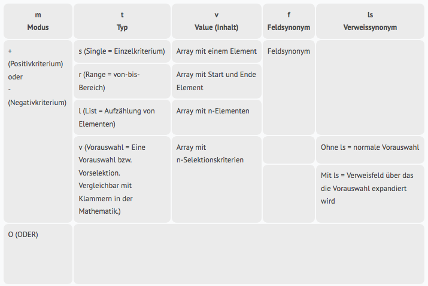

Select functions
=================

Select any datasets in the database and return the references as a list result.

**RequestObject**

``` 
{
  "method": "Select",
  "requestid": 9,
  "param": {
    "UpdJsrHdl": "12345abcde67890fghij123abc",
 
    //Object with selection criteria
    "select" : {
 
               },
 
    //List with which the references are to be displayed
    'list_name' : 'TestList', //List name of a saved list
    //oder
    'list_iid' : '123456789012345678901234', //24-digit list IId of a list
    //oder
    //Object with its own defined simple-list
    'list' : {
 
             },
    //Number of seconds the list function collects maximum data        
    'maxtime' : 2,
 
 
  }
}
```

- UpdJsrHdl - Valid UpdJsrHdl
- select - object with selection criteria
- list_name - List name of a list stored in the database
- ist_iid - 24-digit list IId of a list stored in the database
- list - object with its own defined simple-list
- maxtime - number of seconds the list function collects maximum data (0 = no restriction)

**Note:**

The sites are always determined completely, independent of `maxtime`. The specification of `maxtime` is only a time limit of the function that determines the display data.

**select-Object**

JSON object with selection criteria.

- Key = field synonym
- Value = search criteria
- Fields via links are linked to a point

**Note:** It should be noted that there must be at least one inclusive search
criterion. The inclusive search criteria determine the base amount from which
the negative criteria are subtracted. In SQL, for example, all entries in this
table are used as base set by selecting a table; this is not the case in the 
CortexDB. The selection is field-based; independent of "tables" and dataset types.
Via the field * \ # T * (dataset type) all datasets of a specific dataset type can 
be selected. However, this should be used with caution, since the selection over
this field may take longer with many datasets. The best are always dedicated
fields per dataset type, which can only occur there.

**Short notation - search criteria as string** 

The hyphen (minus), the comma, the parenthesis () and the \* (*"Asterisk*")
at the end have a special meaning. If one of these characters appears in the
search string, you may need to use the extended notation.

- Separate enumeration with a comma
- Separate hyphenated from/to area with BEFORE and AFTER enclosed by a space
- \ * at the end = wildcard (fuzzy search)
- Minus (hyphen) at the beginning is a negative criterion
- If several criteria are to be specified for a field, the search criteria must be specified as an array

### Rules

**Dashes / minus**

A hyphen for specifying a range (from-to-area) must be enclosed by a space in front of 
and behind the hyphen. If a hyphen is specified without a space, it will be interpreted as the field content to search for.
(See, for example, the [CSS syntax for "cal"](https://developer.mozilla.org/en/docs/Web/CSS/calc))

```
	Status A to J									A - J
	
	Status "A-J" (so "A-J" as field content)		A-J
	
	Project value from 5000 to 10000					5000 - 10000
	
	City Groß-Gerau								Groß-Gerau
	(no range because the hyphen is not enclosed in spaces)   
```

A minus (hyphen) at the beginning of the statement means that this is a negative criterion.
```
	OHNE Status A					-A
	
	OHNE Projects having value 5000		-5000
```

A negative criterion can also include a range.

```
  WITHOUT projects in the range of 5000 to 10000 -5000 - 10000
  
  WITHOUT projects with status J to P					-J - P
  
  WITHOUT City Groß-Gerau								-Groß-Gerau
  
  (no range since 2nd hyphen without spaces, thus it works)
```

If there are negative values within a criterion, the actual criterion
should be enclosed in brackets.

```
	WITHOUT projects with project value -5000						-(-5000)
	
	WITHOUT projects with project value -5000 (double minus)	--5000
	
	WITH projects with project value -5000						(-5000)
	
	WITHOUT projects with project value from -15000 to -10000	--15000 - -10000
	(double minus)
	
	WITHOUT projects with project value from -15000 to -10000	-(-15000 - -10000)
	
	WITHOUT projects with project value from -15000 to -10000		(-15000 - -10000)
  
```

Procedure of the parser

1. Check whether the first character is a minus, then a negative criterion (otherwise a positive criterion) and the first character is removed
2. Check if a bracket has been specified. Then content from the parenthesis as a criterion
3. Criterion is split at the comma, if there are several entries, this will be taken as enumeration and the values will be taken over without further treatment
4. If only one criterion exists after splitting, then this is checked for range, the criterion is split with space hyphen blanks, if there are 2 values after that they are taken over as a range and the treatment is over
5. If no enumeration and no range exist, then value is taken over as a single value

``` 
//Example: Actions of Eva Hilfreich, whose referenced projects have status A.
'select' : 
{
  'Who' : 'Eva Hilfreich',
  'ProVerw.PrSt' : 'A'
}
 
//Example: All actions whose referenced projects have the status A, F or H but not the actions of Eva Hilfreich
'select' : 
{
  'Who' : '-Eva Hilfreich',
  'ProVerw.PrSt' : 'A,F,H'
}
 
//Example: Actions by Eva Hilfreich and Harry Hurtig, whose referenced projects have the status A to J.
'select' : 
{
  'Who' : 'Eva Hilfreich,Harry Hurtig',
  'ProVerw.PrSt' : 'A - J'
}
 
//Example: Actions by Eva Hilfreich and Harry Hurtig, whose referenced projects DO NOT have status A to J.
'select' : 
{
  'Who' : 'Eva Hilfreich,Harry Hurtig',
  'ProVerw.PrSt' : '-A - J'
}
 
//Example: Actions whose referenced projects have the status K and whose referenced persons have a name beginning with M.
'select' : 
{
  'ProVerw.PerVerw.Name' : 'M*',
  'ProVerw.PrSt' : 'K'
}
 
//Example: All the actions of Eva Hilfreich and Harry Hurtig, but without those who have action status E to H
'select' : 
{
  'Who' : 'Eva Hilfreich,Harry Hurtig',
  'AktSt' : '-E - H'
}
 
//Example: All actions whose referenced projects have the status A but NOT the actions of Eva Hilfreich
'select' : 
{
  'Who' : '-Eva Hilfreich',
  'ProVerw.PrSt' : 'A'
}
 
/* **************
Multiple criteria in a field
************** */
//Example: Actions by Eva Hilfreich and Harry Hurtig, whose referenced projects have status A to J and status K but not status F.
'select' : 
{
  'Who' : 'Eva Hilfreich,Harry Hurtig',
  'ProVerw.PrSt' : [ 
                    'A - J',
                    'K',
                    '-F'
                   ]
}
``` 

#### Advanced search criteria 

``` 
/* 
Search criteria as JSON object = Advanced search criteria
 - each search criterion is a JSON object
 
 'm' : '+'  //determines the mode, + = positive criterion, - = negative K. -> optional, if m is missing then m = +
 't' : 's'  //determines the type, s = single entry, r = range (from-to-area), l = list (listing) -> optional, if t is missing then t = s
 'v' : []   //Array with search criteria, with single = 1 entry, with range 2 entries, with is 1 to n entries
 
*/
 
//Example: Actions by Eva Hilfreich who does NOT have the status A.
'select' : 
{
  'Who' : ,
  'ActSt' : 
}
 
//since m (at +) and t (at s) are optional, the following notation would also be possible
'select' : 
{
  'Who' : ,
  'ActSt' : 
}
 
//All persons living in Groß-Gerau or Neuenkirchen-Vörden should be found
'select' : 
{
  'City' : 
}
 
//For example, all persons who live in Groß-Gerau or Neuenkirchen-Vörden or in a place that begins with Nau* are to be found
//their referenced company should be located in the postal code area 494 * or in the area 64501-64521 but not in the postal code area 49434
'select' : 
{
  'City' : [
            ,
            ,
          ]
  'FirAdmin.PostCode' : [
                    ,
                    ,
                    ,
                  ]
}
 
//it is also possible to mix between shorthand and extended spelling
//previous example modified in minimal notation
'select' : 
{
  'City' : [
            ,
            'Nau*',
          ]
  'FirAdmin.PostCode' : [
                    '494*',
                    '64501 - 64521',
                    '-49434',
                  ]
}
``` 

### List output

JSON object with its own simple list.

- Key 'f' = Array with display fields
- Key 's' = Array of display fields to sort by (** it can only be sorted by fields that are also defined as a display field **)
- Fields over references are concated with a dot

``` 
//For example, actions were searched for and should be displayed

'list' : 
{
  'f' : [
          //Data from the action
          'Action',
          'Who',
          'ActSt',
 
          //ProjectName
          'ProAdmin.Project',
 
          //Data from the person referred to the project
          'ProAdmin.PerAdmin.Name',
          'ProAdmin.PerAdmin.FirName',
 
          //Order does not matter -> again 2 fields from the action
          'ActDate',
          'WdvSt'
 
        ],
 
  's' : [
          //1. Ascending sorting field
          '<ActSt',
 
          //2. Descending sorting field
          '>ActDate'
 
        ]
 
}
``` 

**Note:** If the `maxtime` is defined and the list data are only partially
determined, then the sorting only applies to the determined section! There is no 
sorting of the sites in advance. So if you are looking for example 1,000,000 sites
and loads 2 seconds display data, then the sorting takes over, for example, the determined
20,000 datasets. But then you have NOT the respective sorting first 20,000 of the total amount.

 

**ResultObject**

``` 
{
    "rc": 0,
    "error": "",
    "data": 
    {
      'i' : {
              //Number of references
              'counttotal' :  116,
 
              //Determine duration of references
              'timeselect' :  0.0093,
 
              //Determine duration of list data (optional)
              'timeget' :  0.05,
 
              //Number of occurrences for which list data was determined (optional)
              'countget' :  116
            },
      'c' : ,
      'd' : [ ]
    }
}
``` 

- rc - return code of the method. 0 → OK, otherwise error
- error - If an error has occurred, here is a short message
- data - object with the determined data, a list result object is returned, if there are no occurrences, only the i-Key exists


extended selection
-----------------------

In some cases, the selection options described so far can not be sufficient
or restrictive. There is the possibility to specify the selection criteria
directly in the server format.

Here are some things to consider, which are optimized by the simple Select:

- Establishment of linking chains
- Automatic order with several positive criteria in one field
- Meaning of the sequence between positive and negative criteria
- Automated mode change for links with negative criteria

In order to use the advanced selection, you do not pass an object 
to the select function but an "array" of objects whose structure is 
described below:

``` 
//Example: Simple Select -> see above
'select' : 
{
  'Wer' : 'Eva Hilfreich',
  'ProAdmin.PrSt' : 'A'
}
 
//Example: Expert Select
'select' : 
[
  ,
  ,
  
]
```

### Structure - Expert Selection

The complete setup is a JSON object. Wherein in the select key an array 
of objects is present. Each object represents a selection criterion.

	//Example: Expert Select
	'select' : 
	[
	  {
		'm' : '+',
		't' : 's',
		'f' : 'Who',
		'v' : ['Eva Hilfreich']
	  },
	  {
		'm' : '+',
		't' : 'l',
		'f' : 'ActSt',
		'v' : ['A', 'K', 'N']
	  }
	]



#### Example Expert Selection - Order of Criteria

	//Example from above:
	//All actions whose referenced projects have the status A but NOT the actions of Eva Hilfreich

	'select' : 
	{
	  'Who' : '-Eva Hilfreich',
	  'ProAdmin.PrSt' : 'A'
	}
 
	//ExpertsSelect
	'select' : 
	[
	  {
		'm' : '-',
		't' : 's',
		'f' : 'Who',
		'v' : ['Eva Hilfreich']
	  },
	  {
		'm' : '+',
		't' : 'v',
		'ls' : 'ProAdmin',
		'v' : [
				{
				  'm' : '+',
				  't' : 's',
				  'f' : 'PrSt',
				  'v' : ['A']
				}
			  ]
	  }
	]

***ATTENTION***

The example seems to be correct, but will not yield a result, since the order of the criteria plays a role here.
 
We remember: Here are some things to keep in mind that are optimized by the simple Select:
-> Meaning of the order between positive and negative criterian
 
Negative criteria can only be subtracted from an already selected quantity. So in this case, the criteria must be reversed.


	'select' : 
	[
	  {'m' : '+', 't' : 'v', 'ls' : 'ProAdmin', 'v' : [{'m' : '+', 't' : 's', 'f' : 'PrSt', 'v' : ['A']}]},
	  {'m' : '-', 't' : 's', 'f' : 'Who', 'v' : ['Eva Hilfreich']}
	]

**NOTE:**

Simple rule: Each block (or preselection) of selection criteria must begin with a positive criterion! ]

#### Example of expert selection - ORDERing of the criteria of a field

``` 
//For example, all companies should be found that are in the postal code area 494 * or in the area 64501-64521 but NOT the postal code area 49434
'select' : 
{
  'Pcode' : [
            ,
            ,
            ,
          ]
}
 
//ExpertsSelect
'select' : 
[
  {
    'm' : '+',
    't' : 'v',
    'v' : [
            {
              'm' : '+',
              't' : 's',
              'f' : 'Pcode',
              'v' : ['494*']
            },
            {
              'm' : '|'
            },
            {
              'm' : '+',
              't' : 'r',
              'f' : 'Pcode',
              'v' : ['64501', '64521']
            }
          ]
  },
  {
    'm' : '-',
    't' : 's',
    'f' : 'Pcode',
    'v' : ['49434']
  }
]
/*
The positive criteria of the postal code search must first be ordered, because you want to find the entire amount. Thereafter, the negative criterion is subtracted.
*/
```

#### Example with necessity expert selection

The examples so far can be solved much more elegantly via the normal Select.
Therefore, here are a few examples that can only be solved with the expert selection.

``` 
/*
  Example
  In a repeating field group, 1 to n bank accounts are stored for persons.
  Now all persons are to be found who have an account with Postbank AND Sparkasse.
 
  The simple Select could only find people who have at least one of the banks an account.
  Here, the automatic derivation of the positive criteria of a field is in the way, which does not apply in the ExpertsSelect.
*/
 
'select' : 
[
  {
    'm' : '+',
    't' : 's',
    'f' : 'Bank',
    'v' : ['Sparkasse']
  },
  {
    'm' : '+',
    't' : 's',
    'f' : 'Bank',
    'v' : ['Postbank']
  }
]
```

**Note:** For a range, the first element is the start position and the second element is the end position. One of the two may also be missing.]

``` 
/*
  Example, use of Or
 
  Male persons born between 1963 and April 1965 inclusive
  or
  Females with 2 or more children and born at least before 1978
*/
 
'select' : 
[
  { 'm' : '+', 't' : 's', 'f' : 'Gender', 'v' : ['M'] },
  { 'm' : '+', 't' : 'r', 'f' : 'BirDate', 'v' : ['1963*', '196504*'] },
  { 'm' : '|' },
  { 'm' : '+', 't' : 's', 'f' : 'Gender', 'v' : ['W'] },
  { 'm' : '+', 't' : 'r', 'f' : 'BirDate', 'v' : ['', '1978'] },
  { 'm' : '+', 't' : 'r', 'f' : 'Children', 'v' : [2] },
]
```

**IMPORTANT:** For performance reasons, always combine criteria of the same level in a block into a preselection. See the following example. ]

``` 
/*
  Example
 
  Projects with status A, whose conclusion was made within
  the last quarter of their referrals named Meier and are maled
 
*/
 
'select' : 
[
  { 'm' : '+', 't' : 's', 'f' : 'ProSt', 'v' : ['A'] },
  { 'm' : '+', 't' : 'r', 'f' : 'Abschl', 'v' : ['-1qa', '-1qe'] },
  { 'm' : '+', 't' : 'v', 'ls' : 'PersVer', 'v' : [
                                                    { 'm' : '+', 't' : 's', 'f' : 'Gender', 'v' : ['M'] },
                                                    { 'm' : '+', 't' : 's', 'f' : 'Name', 'v' : ['Meier'] }
                                                  ] }
]
```

### ResultObject

``` 
{
    "rc": 0,
    "error": "",
    "data": 
    {
      'i' : {
              //Number of references
              'counttotal' :  116,
 
              //Determine duration of references
              'timeselect' :  0.0093,
 
              //Determine duration of list data (optional)
              'timeget' :  0.05,
 
              //Number of references for which list data was determined (optional)
              'countget' :  116
            },
      'c' : ,
      'd' : [ ]
    }
}
```

- ** rc ** - return code of the method. 0 → OK, otherwise error
- ** error ** - If an error has occurred, here is a short message
- ** data ** - Object with the determined data, a list result object is returned, if there are no references, only the i-Key exists

### Error codes

``` 
//Fehlercodes Select
-5100 no selection criteria
-5101 unknown date format

-5111 unknown field or wrong basetype
-5112 field access denied
-5113 link field required
-5114 only negative criteria
-5115 first criteria negative
-5116 expansion doublette linksy
```
