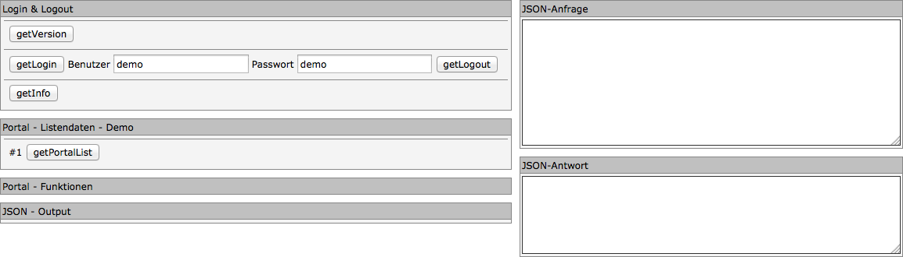

CortexUniplexAPI 
================

The UniplexAPI of the CortexUniplex is based on the configuration and scheme
of the CortexUniplex. As a result, all settings and definitions configured within
the CortexUniplex are available through the API. The CortexUniplex can therefore 
serve as an administration tool for the UniplexAPI.

Many functions that are usually available in other databases via APIs or query languages are thus transferred to the HTTP server. Therefore, the use of the API for software developers is simplified and the development time is accelerated. 

Various parameters can be used to determine the return of selected information. The return always takes place as a JSON object. A use of different programming languages and devices is therefore possible.


Properties of UniplexAPI
----------------------------

### Rights and roles

For the returned results, the rights and roles as well as the field and 
user templates of the CortexUniplex are considered. The user context that 
the HTTP API uses is thus relevant. It also applies here that it is easier 
for software developers to consider rights and roles.

### Portal selections, lists and pivot lists

The configured (pivot) lists and portals are returned as so-called
"json objects" via the corresponding API functions. The further use 
in different programming languages is therefore very easy and quickly possible
and your individual developments can be implemented very flexibly.

### individual queries, as well as creating, reading and updating datasets

In addition to the above-mentioned functions for using the preconfigured
portal selections, lists and pivot lists, individual queries are also possible.
In addition to this, the creation, reading and updating of datasets.

### Inquiries to the server

The CortexUniplex UniplexAPI enables JSON messaging via a URL to which 
"POST" JSON objects are passed as parameters. An additional intermediate layer
on the server side is usually no longer necessary because the defined configurations
of the CortexUniplex are fully taken into account. This eliminates the need for a
software developer to develop a query syntax programmatically (possibly via an
intermediate layer).

The underlying configurations have the advantage that departments can
configure a database and manually test individual work processes in order
to request corresponding user interfaces (GUI) via software development. 
For software development, this means a significant acceleration of the
development process in two ways, because only basic knowledge about the 
database is necessary and because the CortexUniplexAPI already takes into 
account all rights and roles.

The examples shown here include, among others, the programming languages PHP 
and Python. This is a simple language whose syntax can easily be translated into
other languages. You will also get simple examples of how to use it with AngularJS.

Requirements
---------------

Basically, before using the UniplexAPI, a CortexDB must be configured and
users must be set up with the "Dataservice" right (to use the CortexUniplexAPI).
It should be noted here that the corresponding users have called the CortexUniplex
at least once in order to generate the so-called "default dataset" of a user
(in the system settings, this can also be done by an administrator).

All permissions of the CortexUniplex therefore also apply to the use of the UniplexAPI.
The dataset permissions as well as the function permissions (e.g., portals and searches) 
that a user within the CortexUniplex might use are available via CortexUniplexAPI.
If such rights have been removed for a user, they can not be accessed via CortexUniplexAPI.

However, if a user is deprived of the right to use the CortexUniplex,
the right to use the UniplexAPI may persist. The permissions that this user 
would have in the CortexUniplex continue to apply to the UniplexAPI as well. 
The user rights can therefore still be managed via remote admin.

Calls of the UniplexAPI
----------------------

The explanations given here assume that a CortexDB is set up locally on the
computer where the software development is performed. In other environments,
the URLs shown here should be adapted accordingly.

If the CortexUniplexAPI has been plugged into the CortexDB as a plugin via the
corresponding xjz file, the accessibility can be checked with the following call:
``` 
http://localhost/i/UniPlexDataservice/updjsr.php
```

If the connection takes place, the CortexUniplexAPI returns the following 
JSON object without any result:

Since no parameters were passed here, the error code "-1" is returned as
the return error ("requesterror"). All other fields remain empty.

If the CortexUniplexAPI cannot be reached in general, an http error will
be returned by the web server.

**NOTE:**

Within the configuration ini files, the port for calling web pages can be set.
If the entry "80" has been changed to a different value here, the URL has to
be adjusted accordingly. The following example shows the call, if port 8080
is used instead of port 80:

``` 
http://localhost:8080/i/UniPlexDataservice/updjsr.php
```

This also applies to HTTPS access (for example, if it has been changed from 443 to 8443).

Methods and parameters
----------------------

The following section describes the various methods in short for a general
use of any programming languages. Detailed examples of different languages
can be found in the separate sections.

### Basic call

The CortexUniplexAPI can be reached with a local standard installation (HTTP port is 8080) with the following call:

``` 
http://localhost:8080/i/UniPlexDataservice/updjsr.php
```

If the connection is correct without a previous login, an empty object will be returned.

### Request object

Basically, a request to the CortexUniplexAPI consists of at least three parameters:

``` 
{
  'method'    : string MethodName,
  'requestid' : int RequestId,
  'param'     : 
}
```

The method name is one of the available methods, which are explained in the
following list; the RequestID can be freely assigned in order to be able to 
assign the answers to the queries for asynchronous queries. The parameters 
for the method are specified as objects (see the respective method).

### Response Object

The result of the request is returned as a so-called "response object":

``` 
{
  'requesterror': int RequestStatus,
  'requestmethod': string MethodName,
  'requestid': int RequestId,
  'requestduration': float Duration,
  'result': 
}
``` 

### Return values

- RequestStatus: 0 = ok; -1 = error; Status of the processing of the request. Further error codes are returned in the "ResultObject" and can be seen in the table of error codes.

     - MethodName: Name of the requested method
     - RequestId: requested RequestId
     - Duration: Inquiry time in seconds
     - ResultObject: Result object of the called method

Error codes
-----------

``` 
-5000 Unknown login alert
-5001 Unknown app
-5002 username required
-5003 User password required
-5004 unknown interface main version
-5005 interface version too old
-5006 unknown cortexserver main version
-5007 cortexserver version to old
-5008 Unknown Session Directory
-5009 Can not create Session Directory
-5010 Can not clean up Session Directory
-5011 Unknown Temp Directory
-5012 Cannot create main temp dir
-5013 user not found
-5014 user configuration not found
-5015 cannot init user configuration
-5016 unknown user configuration
-5017 main interface version to old (only use without role permission)
-5018 empty user role
-5019 Cannot create user temp dir
-5020 missing UpdJsrHdl
-5021 invalid or unknown UpdJsrHdl
 
-5030 unknown portal
-5031 denied or unknown portal
-5032 cannot load portal
-5033 unknown portal row
-5034 empty portal row list
-5035 cannot load listdef
-5036 cannot load expansion listdef
-5037 no ID column in expansion listdef
-5038 cannot load expansion listdata
-5039 no expansion listdata
-5040 cannot load listdata
-5041 cannot load listdata, error in column script
-5042 pivot error
-5043 unknown pivot table
```

### Error codes for "select" 

``` 
-5100 no selection criteria
-5101 unknown date format
-5111 unknown field or wrong basetype
-5112 field access denied
-5113 link field required
``` 

UniplexAPI Help Tool
-------------------------

The described methods of the CortexUniplexAPI can be tested via an 
auxiliary tool. This is a php plugin that can be imported via remote
admin and called up via browser. This simple application provides function
access via individual buttons and provides the request and response object.
An own development can therefore be checked and implemented with any language. 
This tool is similar to `Postman`, except that here the functions are already
known and can be applied directly without writing any code.



The call is made via the address: http://localhost/i/DemoUPD/sample.php
